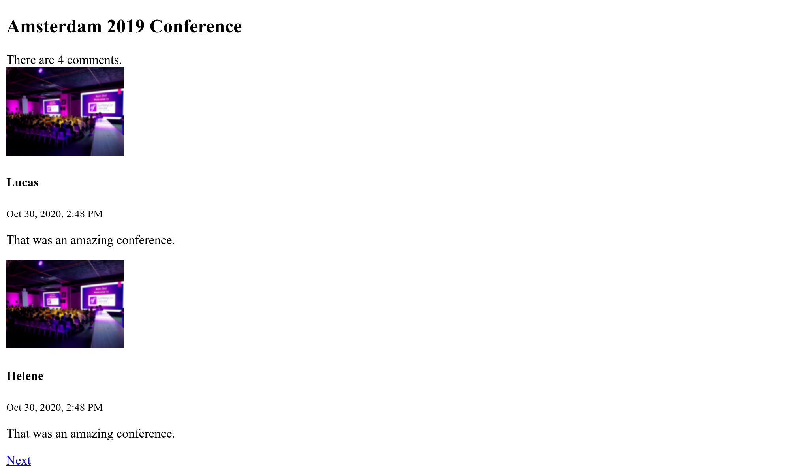

إنشاء واجهة المستخدم
======================================

.. index::
    single: Twig
    single: Templates

كل شيء الآن في مكانه لإنشاء الإصدار الأول من واجهة المستخدم للموقع. لن نجعلها جميلة. فقط شغالة الآن.

هل تتذكر ال escaping الذي قمنا به في وحدة التحكم من أجل بيضة عيد الفصح لتجنب المشاكل الأمنية؟ لن نستخدم PHP لقوالبنا لهذا السبب. بدلاً من ذلك ، سنستخدم Twig. بالإضافة إلى معالجة escaping المخرجات لنا ، فإن `Twig`_ يجلب الكثير من الميزات الرائعة التي سنستفيد منها ، مثل وراثة النماذج.

تثبيت Twig
---------------

لسنا بحاجة إلى إضافة Twig كتبعية لأنه تم تثبيته بالفعل كـ * تبعية متعدية * لـ EasyAdmin. ولكن ماذا لو قررت تغيير ال admin bundle لاحقًا؟ بملحقة تستخدم واجهة برمجة التطبيقات (API) وواجهة أمامية من نوع React  على سبيل المثال. ربما لن تعتمد على Twig بعد الآن ، وبالتالي ستتم إزالة Twig تلقائيًا عند إزالة EasyAdmin.

ولإجراء جيد ، دعنا نخبر Composer أن المشروع يعتمد حقًا على Twig ، بشكل مستقل عن EasyAdmin. إضافتها مثل أي تبعية أخرى كافية:

.. code-block:: bash

    $ symfony composer req twig

تعد Twig الآن جزءًا من تبعيات المشروع الرئيسية في ``composer.json``:

.. code-block:: diff
    :class: ignore

    --- a/composer.json
    +++ b/composer.json
    @@ -14,6 +14,7 @@
             "symfony/framework-bundle": "4.4.*",
             "symfony/maker-bundle": "^1.0@dev",
             "symfony/orm-pack": "dev-master",
    +        "symfony/twig-pack": "^1.0",
             "symfony/yaml": "4.4.*"
         },
         "require-dev": {

استعمال Twig للقوالب
----------------------------------

.. index::
    single: Twig;Layout
    single: Twig;block

جميع الصفحات في الموقع الإلكتروني ستشارك نفس *التصميم*. عند تثبيت Twig, المجلد ``templates/`` سيتم إنشاؤه تلقائيا و كذالك التصميم العينة في ``base.html.twig``.

.. code-block:: twig
    :caption: templates/base.html.twig
    :class: ignore

    <!DOCTYPE html>
    <html>
        <head>
            <meta charset="UTF-8">
            <title>Welcome!</title>
            
        </head>
        <body>
            
            
        </body>
    </html>

يمكن أن يحدد التصميم عناصر  من نوع ``block``، وهي الأماكن التي تضيف فيها *قوالب فرعية*  التي *تمد* التصميم محتوياتها.

.. index::
    single: Twig;extends
    single: Twig;for

لنقم بإنشاء قالب لصفحة المشروع الرئيسية في ``templates/conference/index.html.twig``:

.. code-block:: twig
    :caption: templates/conference/index.html.twig

    

    Conference Guestbook

    
        <h2>Give your feedback!</h2>

        
            <h4>{{ conference }}</h4>
        
    

القالب *يمتد* ``base.html.twig`` ويعيد تعريف كتل ``title`` و ``body``.

.. index::
    single: Twig;Syntax

تشير العلامة ```` في القالب إلى *التصرفات* و * البنية*.

يتم استخدام علامة ``{{}}`` *لعرض* شيء ما. يعرض ``{{Conference}}`` تمثيل المؤتمر (نتيجة استدعاء ``toString__`` على كائن ``Conference``).

إستخدام Twig في وحدة التحكم
----------------------------------------------

قم بتحديث وحدة التحكم لعرض قالب Twig:

.. code-block:: diff
    :caption: patch_file

    --- a/src/Controller/ConferenceController.php
    +++ b/src/Controller/ConferenceController.php
    @@ -2,24 +2,21 @@

     namespace App\Controller;

    +use App\Repository\ConferenceRepository;
     use Symfony\Bundle\FrameworkBundle\Controller\AbstractController;
     use Symfony\Component\HttpFoundation\Response;
     use Symfony\Component\Routing\Annotation\Route;
    +use Twig\Environment;

     class ConferenceController extends AbstractController
     {
         /**
          * @Route("/", name="homepage")
          */
    -    public function index(): Response
    +    public function index(Environment $twig, ConferenceRepository $conferenceRepository): Response
         {
    -        return new Response(<<<EOF
    -<html>
    -    <body>
    -        
    -    </body>
    -</html>
    -EOF
    -        );
    +        return new Response($twig->render('conference/index.html.twig', [
    +            'conferences' => $conferenceRepository->findAll(),
    +        ]));
         }
     }

هناك الكثير مما يجري هنا.

لكي نتمكن من رسم قالب، نحتاج الي كائن بيئة الـ Twig (نقطة الدخول الرئيسية بـ Twig). لاحظ اننا نطلب نموذج Twig من خلال الاشارة له (type-hinting) في منهجية وحدة التحكم. سيمفوني ذكي بما فيه الكفاية ليعلم كيف يقوم بحقن الكائن الصحيح.

نحتاج أيضًا إلى مستودع بيانات المؤتمر للحصول على جميع المؤتمرات من قاعدة البيانات.

في وحدة التحكم ، تعرض طريقة ``()render`` القالب وتمرر مجموعة من المتغيرات إلى القالب. نقوم بتمرير قائمة كائنات ``Conference`` كمتغير ``conferences``.

وحدة التحكم هي فئة PHP قياسية. لا نحتاج حتى إلى تمديد فئة `` AbstractController `` إذا أردنا أن نكون صريحين بشأن تبعياتنا. يمكنك إزالته (ولكن لا تفعل ذلك ، حيث سنستخدم الاختصارات الرائعة التي يوفرها في الخطوات المستقبلية).

إنشاء الصفحة لمؤتمر(Conference)
------------------------------------------------

يجب أن يكون لكل مؤتمر(Conference) صفحة مخصصة لسرد تعليقاته. إن إضافة صفحة جديدة هي مسألة إضافة وحدة تحكم ، وتحديد مسار (route) لها ، وإنشاء القالب المرتبط بها.

أضف ``()show`` الى ``src/Controller/ConferenceController.php``:

.. code-block:: diff
    :caption: patch_file

    --- a/src/Controller/ConferenceController.php
    +++ b/src/Controller/ConferenceController.php
    @@ -2,6 +2,8 @@

     namespace App\Controller;

    +use App\Entity\Conference;
    +use App\Repository\CommentRepository;
     use App\Repository\ConferenceRepository;
     use Symfony\Bundle\FrameworkBundle\Controller\AbstractController;
     use Symfony\Component\HttpFoundation\Response;
    @@ -19,4 +21,15 @@ class ConferenceController extends AbstractController
                 'conferences' => $conferenceRepository->findAll(),
             ]));
         }
    +
    +    /**
    +     * @Route("/conference/{id}", name="conference")
    +     */
    +    public function show(Environment $twig, Conference $conference, CommentRepository $commentRepository): Response
    +    {
    +        return new Response($twig->render('conference/show.html.twig', [
    +            'conference' => $conference,
    +            'comments' => $commentRepository->findBy(['conference' => $conference], ['createdAt' => 'DESC']),
    +        ]));
    +    }
     }

هذه الطريقة لها سلوك خاص لم نره بعد. نطلب أن يتم إدخال  نموذج `` Conference `` في الطريقة. ولكن قد يكون هناك العديد منها في قاعدة البيانات. Symfony قادر على تحديد أي واحد تريده بناءً على `` {id} `` الذي تم تمريره في مسار الطلب `` id `` هو المفتاح الأساسي لجدول `` conference  `` في قاعدة البيانات).

يمكن استرجاع التعليقات المتعلقة بالمؤتمر من خلال طريقة `` ()findBy  `` التي تأخذ المعايير كحجة أولى.

.. index::
    single: Twig;extends
    single: Twig;block
    single: Twig;for
    single: Twig;if
    single: Twig;else
    single: Twig;asset
    single: Twig;format_datetime
    single: Twig;length

الخطوة الأخيرة هي إنشاء ملف ``templates/conference/show.html.twig``:

.. code-block:: twig
    :caption: templates/conference/show.html.twig

    

    Conference Guestbook - {{ conference }}

    
        <h2>{{ conference }} Conference</h2>

        
            
                
                    
                

                <h4>{{ comment.author }}</h4>
                <small>
                    {{ comment.createdAt|format_datetime('medium', 'short') }}
                </small>

                
{{ comment.text }}

            
        
            
No comments have been posted yet for this conference.

        
    

في هذا النموذج ، نستخدم الترميز ``|`` لاستدعاء Twig *فلتر*. يقوم المرشح بتحويل القيمة. يُرجع ``comments | length`` عدد التعليقات و ``comment.createdAt|format_datetime('medium', 'short')`` لتنسيق التاريخ في تمثيل يمكن قراءته.

حاول الوصول إلى المؤتمر "الأول" عبر `` Conference/1/ `` ولاحظ الخطأ التالي:

.. figure:: screenshots/intl-twig-error.png
    :alt: /conference/1
    :align: center
    :figclass: with-browser

يأتي الخطأ من `` format_datetime `` فلتر لأنه ليس جزءًا من نواة Twig. تمنحك رسالة الخطأ تلميحًا حول ال package  الذي يجب تثبيته لإصلاح المشكلة:

.. code-block:: bash

    $ symfony composer req "twig/intl-extra:^3"

الآن الصفحة تعمل بشكل جيد.

ربط الصفحات معا
----------------------------

.. index::
    single: Twig;Link
    single: Link

الخطوة الأخيرة لإنهاء نسختنا الأولى من واجهة المستخدم هي ربط صفحات المؤتمر من الصفحة الرئيسية:

.. code-block:: diff
    :caption: patch_file

    --- a/templates/conference/index.html.twig
    +++ b/templates/conference/index.html.twig
    @@ -7,5 +7,8 @@

         
             <h4>{{ conference }}</h4>
    +        

    +            <a href="/conference/{{ conference.id }}">View</a>
    +        

         
     

لكن تحديد المسار الثابت فكرة سيئة لعدة أسباب. السبب الأكثر أهمية هو إذا قمت بتغيير المسار (من ``{conference/{id/`` إلى ``{conference/{id/`` على سبيل المثال) ، يجب تحديث جميع الروابط يدويًا.

.. index::
    single: Twig;path

بدلاً من ذلك ، استخدم  *وظيفة* ``path()``  ل Twig *واستخدم* اسم المسار*:

.. code-block:: diff
    :caption: patch_file

    --- a/templates/conference/index.html.twig
    +++ b/templates/conference/index.html.twig
    @@ -8,7 +8,7 @@
         
             <h4>{{ conference }}</h4>
             

    -            <a href="/conference/{{ conference.id }}">View</a>
    +            <a href="{{ path('conference', { id: conference.id }) }}">View</a>
             

         
     

تنشئ وظيفة `` path() `` المسار إلى الصفحة باستخدام اسم المسار الخاص بها. يتم تمرير قيم معلمات المسار (route parameters) كخريطة Twig.

ترقيم صفحات التعليقات
----------------------------------------

.. index::
    single: Doctrine;Paginator
    single: Paginator

بوجود الآلاف من الحاضرين ، يمكننا أن نتوقع بعض التعليقات. إذا عرضناها جميعًا على صفحة واحدة ، فسوف تنمو بسرعة كبيرة.

انشئ دالة ``getCommentPaginator()`` في مستودع التعليقات (Comment Repository) الذي يُرجع تعليق منسق صفحات استناداً الي مؤتمر ونقطة بداية (offset) (أين تبدأ):

.. code-block:: diff
    :caption: patch_file

    --- a/src/Repository/CommentRepository.php
    +++ b/src/Repository/CommentRepository.php
    @@ -3,8 +3,10 @@
     namespace App\Repository;

     use App\Entity\Comment;
    +use App\Entity\Conference;
     use Doctrine\Bundle\DoctrineBundle\Repository\ServiceEntityRepository;
     use Doctrine\Persistence\ManagerRegistry;
    +use Doctrine\ORM\Tools\Pagination\Paginator;

     /**
      * @method Comment|null find($id, $lockMode = null, $lockVersion = null)
    @@ -14,11 +16,27 @@ use Doctrine\Persistence\ManagerRegistry;
      */
     class CommentRepository extends ServiceEntityRepository
     {
    +    public const PAGINATOR_PER_PAGE = 2;
    +
         public function __construct(ManagerRegistry $registry)
         {
             parent::__construct($registry, Comment::class);
         }

    +    public function getCommentPaginator(Conference $conference, int $offset): Paginator
    +    {
    +        $query = $this->createQueryBuilder('c')
    +            ->andWhere('c.conference = :conference')
    +            ->setParameter('conference', $conference)
    +            ->orderBy('c.createdAt', 'DESC')
    +            ->setMaxResults(self::PAGINATOR_PER_PAGE)
    +            ->setFirstResult($offset)
    +            ->getQuery()
    +        ;
    +
    +        return new Paginator($query);
    +    }
    +
         // /**
         //  * @return Comment[] Returns an array of Comment objects
         //  */

لقد قمنا بتحديد الحد الأقصى لعدد التعليقات في الصفحة ل  2 لتسهيل الاختبار.

لإدارة ترقيم الصفحات في النموذج ، قم بتمرير Doctrine Paginator بدلاً من Doctrine Collection إلى Twig:

.. code-block:: diff
    :caption: patch_file

    --- a/src/Controller/ConferenceController.php
    +++ b/src/Controller/ConferenceController.php
    @@ -6,6 +6,7 @@ use App\Entity\Conference;
     use App\Repository\CommentRepository;
     use App\Repository\ConferenceRepository;
     use Symfony\Bundle\FrameworkBundle\Controller\AbstractController;
    +use Symfony\Component\HttpFoundation\Request;
     use Symfony\Component\HttpFoundation\Response;
     use Symfony\Component\Routing\Annotation\Route;
     use Twig\Environment;
    @@ -25,11 +26,16 @@ class ConferenceController extends AbstractController
         /**
          * @Route("/conference/{id}", name="conference")
          */
    -    public function show(Environment $twig, Conference $conference, CommentRepository $commentRepository): Response
    +    public function show(Request $request, Environment $twig, Conference $conference, CommentRepository $commentRepository): Response
         {
    +        $offset = max(0, $request->query->getInt('offset', 0));
    +        $paginator = $commentRepository->getCommentPaginator($conference, $offset);
    +
             return new Response($twig->render('conference/show.html.twig', [
                 'conference' => $conference,
    -            'comments' => $commentRepository->findBy(['conference' => $conference], ['createdAt' => 'DESC']),
    +            'comments' => $paginator,
    +            'previous' => $offset - CommentRepository::PAGINATOR_PER_PAGE,
    +            'next' => min(count($paginator), $offset + CommentRepository::PAGINATOR_PER_PAGE),
             ]));
         }
     }

عند إنشاء تعليق جديد ، سيكون من الرائع أن يتم تعيين تاريخ `` createAt `` تلقائيًا على التاريخ والوقت الحاليين.

يتم حساب الإزاحات `` previous  `` و `` next `` بناءً على جميع المعلومات التي لدينا من paginator.

.. index::
    single: Twig;if

أخيرًا ، قم بتحديث القالب لإضافة روابط إلى الصفحات التالية والسابقة:

.. code-block:: diff
    :caption: patch_file

    --- a/templates/conference/show.html.twig
    +++ b/templates/conference/show.html.twig
    @@ -6,6 +6,8 @@
         <h2>{{ conference }} Conference</h2>

         
    +        
There are {{ comments|length }} comments.

    +
             
                 
                     
    @@ -18,6 +20,13 @@

                 
{{ comment.text }}

             
    +
    +        
    +            <a href="{{ path('conference', { id: conference.id, offset: previous }) }}">Previous</a>
    +        
    +        
    +            <a href="{{ path('conference', { id: conference.id, offset: next }) }}">Next</a>
    +        
         
             
No comments have been posted yet for this conference.

         

يجب أن تكون قادرًا الآن على التنقل بين التعليقات عبر رابطي "Previous" و "Next":

.. figure:: screenshots/pagination-previous.png
    :alt: /conference/1?offset=2
    :align: center
    :figclass: with-browser

إعادة هيكلة وحدة التحكم
-------------------------------------------

ربما لاحظت أن كلا من الطريقتين في `` ConferenceController `` تأخذان بيئة Twig كخاصية. بدلاً من تمريرها في كل طريقة ، دعنا نستخدم بعض الإدخال عبر المُنشئ Constructor  بدلاً من ذلك (وهذا يجعل قائمة الخاصيات أقصر وأقل تكرارًا):

.. code-block:: diff
    :caption: patch_file

    --- a/src/Controller/ConferenceController.php
    +++ b/src/Controller/ConferenceController.php
    @@ -13,12 +13,19 @@ use Twig\Environment;

     class ConferenceController extends AbstractController
     {
    +    private $twig;
    +
    +    public function __construct(Environment $twig)
    +    {
    +        $this->twig = $twig;
    +    }
    +
         /**
          * @Route("/", name="homepage")
          */
    -    public function index(Environment $twig, ConferenceRepository $conferenceRepository): Response
    +    public function index(ConferenceRepository $conferenceRepository): Response
         {
    -        return new Response($twig->render('conference/index.html.twig', [
    +        return new Response($this->twig->render('conference/index.html.twig', [
                 'conferences' => $conferenceRepository->findAll(),
             ]));
         }
    @@ -26,12 +33,12 @@ class ConferenceController extends AbstractController
         /**
          * @Route("/conference/{id}", name="conference")
          */
    -    public function show(Request $request, Environment $twig, Conference $conference, CommentRepository $commentRepository): Response
    +    public function show(Request $request, Conference $conference, CommentRepository $commentRepository): Response
         {
             $offset = max(0, $request->query->getInt('offset', 0));
             $paginator = $commentRepository->getCommentPaginator($conference, $offset);

    -        return new Response($twig->render('conference/show.html.twig', [
    +        return new Response($this->twig->render('conference/show.html.twig', [
                 'conference' => $conference,
                 'comments' => $paginator,
                 'previous' => $offset - CommentRepository::PAGINATOR_PER_PAGE,

.. sidebar:: الذهاب أبعد من ذلك

    * `مستندات Twig <https://twig.symfony.com/doc/2.x/>`_؛

    * `إنشاء واستخدام قوالب <https://symfony.com/doc/current/templates.html>`_ في تطبيقات Symfony؛

    * `البرنامج التعليمي SymfonyCasts Twig  <https://symfonycasts.com/screencast/symfony/twig-recipe>`_؛

    * `وظائف ومرشحات Twig المتوفرة  فقط في Symfony  <https://symfony.com/doc/current/reference/twig_reference.html>`_؛

    * وحدة التحكم الأساسية `AbstractController <https://symfony.com/doc/current/controller.html#the-base-controller-classes-services>`_.

.. _`Twig`: https://twig.symfony.com/
