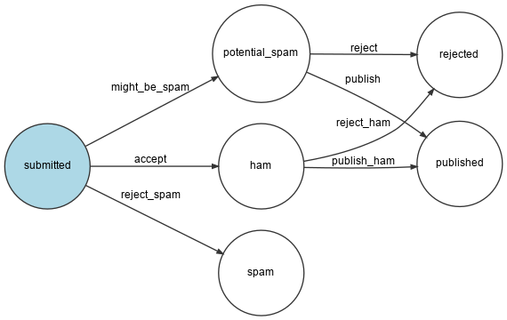

إتخاذ القرارات خلال سير العمل
======================================================

.. index::
    single: Components;Workflow
    single: Workflow

وجود حالة لنموذج أمر شائع إلي حد كبير. حالة التعليق يتم تحديدها عن طريق محقق البيانات الفضولية فقط. ماذا لو أضفنا المزيد من عوامل إتخاذ القرار؟

قد نسمح لمديد الموقع إدارة جميع التعليقات بعد محقق البيانات الفضولية. سوف تكون العملية شئ ما علي نحو:

* بداية مع حالة ال ``submitted`` عندما يقوم المستخدم بإرسال تعليق؛

* دع محقق البيانات الفضولية ان يقوم بتحليل التعليق ويغير الحالة الي اىً من ``potential_spam``، ``ham``، او ``rejected``؛

* إن لم يكن مرفوض، إنتظر حتي يقرر مدير الموقع اذا كان التعليق جيدا عن طريق تغير الحالة إلي ``published`` او ``rejected``.

تطبيق هذا المنطق ليس معقداً، لكن يمكنك تخيل ان إضافة المزيد من الشروط قد يزيد التعقيد الي حد كبير. بدلاَ من كتابة الرمز البرمجي بنفسنا، يمكننا ان نستخدم مكون سير العمل الخاص بسيمفوني (Symfony Workflow Component):

.. code-block:: bash

    $ symfony composer req workflow

وصف مسارات العمل
------------------------------

مسار عمل التعليق يمكن وصفه في ملف ``config/packages/workflow.yaml``:

.. code-block:: yaml
    :caption: config/packages/workflow.yaml
    :emphasize-lines: 3,4,9,11

    framework:
        workflows:
            comment:
                type: state_machine
                audit_trail:
                    enabled: "%kernel.debug%"
                marking_store:
                    type: 'method'
                    property: 'state'
                supports:
                    - App\Entity\Comment
                initial_marking: submitted
                places:
                    - submitted
                    - ham
                    - potential_spam
                    - spam
                    - rejected
                    - published
                transitions:
                    accept:
                        from: submitted
                        to:   ham
                    might_be_spam:
                        from: submitted
                        to:   potential_spam
                    reject_spam:
                        from: submitted
                        to:   spam
                    publish:
                        from: potential_spam
                        to:   published
                    reject:
                        from: potential_spam
                        to:   rejected
                    publish_ham:
                        from: ham
                        to:   published
                    reject_ham:
                        from: ham
                        to:   rejected

.. index::
    single: Command;workflow:dump

للتحقق من سير العمل، قم بإنشاء تقرير مرئي:

.. code-block:: bash
    :class: ignore

    $ symfony console workflow:dump comment | dot -Tpng -o workflow.png

.. note::

    يعتبر امر ال ``dot`` جزء من خدمة ال `Graphviz`_.

إستخدام مسار العمل
----------------------------------

استبدل المنطق الحالي في معالج الرسالة بمسار العمل:

.. code-block:: diff
    :caption: patch_file

    --- a/src/MessageHandler/CommentMessageHandler.php
    +++ b/src/MessageHandler/CommentMessageHandler.php
    @@ -6,19 +6,28 @@ use App\Message\CommentMessage;
     use App\Repository\CommentRepository;
     use App\SpamChecker;
     use Doctrine\ORM\EntityManagerInterface;
    +use Psr\Log\LoggerInterface;
     use Symfony\Component\Messenger\Handler\MessageHandlerInterface;
    +use Symfony\Component\Messenger\MessageBusInterface;
    +use Symfony\Component\Workflow\WorkflowInterface;

     class CommentMessageHandler implements MessageHandlerInterface
     {
         private $spamChecker;
         private $entityManager;
         private $commentRepository;
    +    private $bus;
    +    private $workflow;
    +    private $logger;

    -    public function __construct(EntityManagerInterface $entityManager, SpamChecker $spamChecker, CommentRepository $commentRepository)
    +    public function __construct(EntityManagerInterface $entityManager, SpamChecker $spamChecker, CommentRepository $commentRepository, MessageBusInterface $bus, WorkflowInterface $commentStateMachine, LoggerInterface $logger = null)
         {
             $this->entityManager = $entityManager;
             $this->spamChecker = $spamChecker;
             $this->commentRepository = $commentRepository;
    +        $this->bus = $bus;
    +        $this->workflow = $commentStateMachine;
    +        $this->logger = $logger;
         }

         public function __invoke(CommentMessage $message)
    @@ -28,12 +37,21 @@ class CommentMessageHandler implements MessageHandlerInterface
                 return;
             }

    -        if (2 === $this->spamChecker->getSpamScore($comment, $message->getContext())) {
    -            $comment->setState('spam');
    -        } else {
    -            $comment->setState('published');
    -        }

    -        $this->entityManager->flush();
    +        if ($this->workflow->can($comment, 'accept')) {
    +            $score = $this->spamChecker->getSpamScore($comment, $message->getContext());
    +            $transition = 'accept';
    +            if (2 === $score) {
    +                $transition = 'reject_spam';
    +            } elseif (1 === $score) {
    +                $transition = 'might_be_spam';
    +            }
    +            $this->workflow->apply($comment, $transition);
    +            $this->entityManager->flush();
    +
    +            $this->bus->dispatch($message);
    +        } elseif ($this->logger) {
    +            $this->logger->debug('Dropping comment message', ['comment' => $comment->getId(), 'state' => $comment->getState()]);
    +        }
         }
     }

يقرأ المنطق الجديد كما يلي:

* إذا كان الانتقال الي القبول ``accept`` متاح للتعليق في الرسالة، تحقق من البيانات الفضولية؛

* إستناداً علي النتائج، قم باختيارالانتقال الصحيح لتطبيقه؛

* قم بالمناداة علي ``apply()`` لتعديل التعليق عن طريق المناداة علي منهج ال ``setState()``.

* نادي علي `flush()`` لحفظ التعديلات في قاعدة البيانات

* قم بإعادة إرسال الرسالة للسماح لمسار العمل بالانتقال مرة أخري.

وبما اننا لم نقم بكتابة الرمز البرمجي للتحقق من المدير، في المرة التالية التي يتم فيها إستهلاك الرسالة، سوف يتم تسجيل "إسقاط رسالة التعليق (Dropping comment message)" في السجلات.

لنقوم بتنفيذ عملية التحقق التلقائي حتي الفصل القادم:

.. code-block:: diff
    :caption: patch_file

    --- a/src/MessageHandler/CommentMessageHandler.php
    +++ b/src/MessageHandler/CommentMessageHandler.php
    @@ -50,6 +50,9 @@ class CommentMessageHandler implements MessageHandlerInterface
                 $this->entityManager->flush();

                 $this->bus->dispatch($message);
    +        } elseif ($this->workflow->can($comment, 'publish') || $this->workflow->can($comment, 'publish_ham')) {
    +            $this->workflow->apply($comment, $this->workflow->can($comment, 'publish') ? 'publish' : 'publish_ham');
    +            $this->entityManager->flush();
             } elseif ($this->logger) {
                 $this->logger->debug('Dropping comment message', ['comment' => $comment->getId(), 'state' => $comment->getState()]);
             }

قم بتشغيل أمر ``symfony server:log`` وأضف تعليق في الواجهة الامامية لتري جميع التنقلات تحدث واحدة تلو الاخري.

.. sidebar:: الذهاب أبعد من ذلك

    * `مسارات العمل وحالات الآلات <https://symfony.com/doc/current/workflow/workflow-and-state-machine.html>`_ ومتي تختار كل واحدة

    * `مراجع مسارات العملي في سيمفوني <https://symfony.com/doc/current/workflow.html>`_.

.. _`Graphviz`: https://www.graphviz.org/
