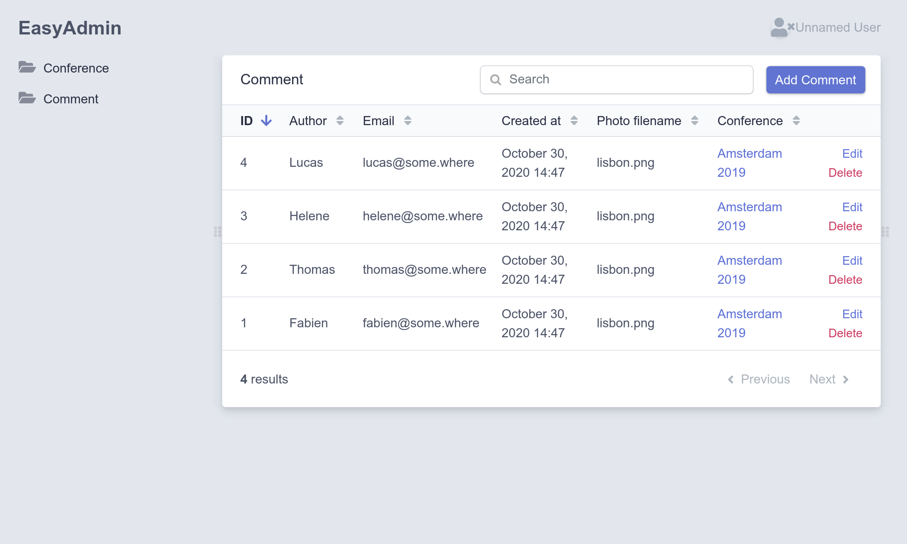

Ein Admin-Backend einrichten
============================

.. index::
    single: EasyAdmin
    single: Admin
    single: Backend

Das Hinzufügen von bevorstehenden Konferenzen zur Datenbank ist Aufgabe der Projektadministrator*innen. Ein *Admin-Backend* ist ein geschützter Bereich der Website, in dem *Projektadministrator*innen* die Website-Daten verwalten, Feedback-Einsendungen moderieren usw.

Wie können wir das schnell schaffen? Durch die Verwendung eines Bundles, das in der Lage ist, ein Admin-Backend basierend auf dem Modell des Projekts zu generieren. EasyAdmin ist genau das Richtige für Dich.

EasyAdmin konfigurieren
-----------------------

Füge zunächst EasyAdmin als Projektabhängigkeit hinzu:

.. code-block:: bash

    $ symfony composer req "admin:^2"

Zur Konfiguration von EasyAdmin wurde über das Flex recipe eine neue Konfigurationsdatei erstellt:

.. code-block:: yaml
    :caption: config/packages/easy_admin.yaml
    :class: ignore

    #easy_admin:
    #    entities:
    #        # List the entity class name you want to manage
    #        - App\Entity\Product
    #        - App\Entity\Category
    #        - App\Entity\User

Fast alle installierten Pakete haben eine solche Konfiguration wie diese unter dem Verzeichnis ``config/packages/``. In der Regel wurden die Standardeinstellungen sorgfältig ausgewählt, um für die meisten Anwendungen zu funktionieren.

Die ersten paar Zeilen kommentierst Du ein. Füge die Modellklassen des Projekts hinzu:

.. code-block:: yaml
    :caption: config/packages/easy_admin.yaml

    easy_admin:
        entities:
            - App\Entity\Conference
            - App\Entity\Comment

Greife auf das generierte Admin-Backend unter ``/admin`` zu. Boom! Eine schöne und funktionsreiche Verwaltungsoberfläche für Konferenzen und Kommentare:

.. figure:: screenshots/easy-admin-empty.png
    :alt: /admin/
    :align: center
    :figclass: with-browser

.. tip::

    Why is the backend accessible under ``/admin``? That's the default prefix configured in ``config/routes/easy_admin.yaml``:

    .. code-block:: yaml
        :caption: config/routes/easy_admin.yaml
        :class: ignore

        easy_admin_bundle:
            resource: '@EasyAdminBundle/Controller/EasyAdminController.php'
            prefix: /admin
            type: annotation

    You can change it to anything you like.

Adding conferences and comments is not possible yet as you would get an error: ``Object of class App\Entity\Conference could not be converted to string``. EasyAdmin tries to display the conference related to comments, but it can only do so if there is a string representation of a conference. Fix it by adding a ``__toString()`` method on the ``Conference`` class:

.. code-block:: diff
    :caption: patch_file

    --- a/src/Entity/Conference.php
    +++ b/src/Entity/Conference.php
    @@ -44,6 +44,11 @@ class Conference
             $this->comments = new ArrayCollection();
         }

    +    public function __toString(): string
    +    {
    +        return $this->city.' '.$this->year;
    +    }
    +
         public function getId(): ?int
         {
             return $this->id;

Das Gleiche gilt für die ``Comment``-Klasse:

.. code-block:: diff
    :caption: patch_file

    --- a/src/Entity/Comment.php
    +++ b/src/Entity/Comment.php
    @@ -48,6 +48,11 @@ class Comment
          */
         private $photoFilename;

    +    public function __toString(): string
    +    {
    +        return (string) $this->getEmail();
    +    }
    +
         public function getId(): ?int
         {
             return $this->id;

Du kannst Konferenzen nun direkt aus dem Admin-Backend hinzufügen, ändern oder löschen. Spiele damit und füge mindestens eine Konferenz hinzu.

.. figure:: screenshots/easy-admin.png
    :alt: /admin/?entity=Conference&action=list
    :align: center
    :figclass: with-browser

Füge einige Kommentare ohne Fotos hinzu. Stelle das Datum vorerst manuell ein; wir werden die ``createdAt``-Spalte in einem späteren Schritt automatisch ausfüllen.

EasyAdmin anpassen
------------------

Das Standard-Admin-Backend funktioniert gut, kann aber in vielerlei Hinsicht angepasst werden, um das Nutzungserlebnis zu verbessern. Lass uns einige einfache Änderungen vornehmen, um die Möglichkeiten zu demonstrieren. Ersetze die aktuelle Konfiguration durch Folgendes:

.. code-block:: yaml
    :caption: config/packages/easy_admin.yaml

    easy_admin:
        site_name: Conference Guestbook

        design:
            menu:
                - { route: 'homepage', label: 'Back to the website', icon: 'home' }
                - { entity: 'Conference', label: 'Conferences', icon: 'map-marker' }
                - { entity: 'Comment', label: 'Comments', icon: 'comments' }

        entities:
            Conference:
                class: App\Entity\Conference

            Comment:
                class: App\Entity\Comment
                list:
                    fields:
                        - author
                        - { property: 'email', type: 'email' }
                        - { property: 'createdAt', type: 'datetime' }
                    sort: ['createdAt', 'ASC']
                    filters: ['conference']
                edit:
                    fields:
                        - { property: 'conference' }
                        - { property: 'createdAt', type: datetime, type_options: { disabled: true } }
                        - 'author'
                        - { property: 'email', type: 'email' }
                        - text

We have overridden the ``design`` section to add icons to the menu items and to add a link back to the website home page.

For the ``Comment`` section, listing the fields lets us order them the way we want. Some fields are tweaked, like setting the creation date to read-only. The ``filters`` section defines which filters to expose on top of the regular search field.

.. figure:: screenshots/easy-admin-filter.png
    :alt: /admin/?entity=Comment&action=list
    :align: center
    :figclass: with-browser

Diese Anpassungen sind nur eine kleine Einführung in die Möglichkeiten von EasyAdmin.

Spiele mit dem Admin, filtere die Kommentare nach Konferenzen oder suche Kommentare z. B. nach E-Mail-Adresse. Das einzige Problem ist, dass jede*r auf das Backend zugreifen kann. Keine Sorge, wir werden es in einem der nächsten Schritt absichern.

.. code-block:: bash
    :class: hide

    $ symfony run psql -c "TRUNCATE conference RESTART IDENTITY CASCADE"

.. sidebar:: Weiterführendes

    * `EasyAdmin docs <https://symfony.com/doc/2.x/bundles/EasyAdminBundle/index.html>`_;

    * `SymfonyCasts EasyAdminBundle tutorial <https://symfonycasts.com/screencast/easyadminbundle>`_;

    * `Symfony Framework-Konfigurationsreferenz <https://symfony.com/doc/current/reference/configuration/framework.html>`_.
