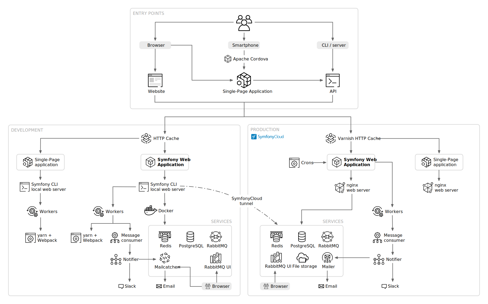

Presentando el proyecto
=======================

Tenemos que encontrar un proyecto en el que trabajar. Es todo un reto ya que necesitamos encontrar un proyecto lo suficientemente grande para cubrir Symfony a fondo, pero al mismo tiempo, debería ser lo suficientemente pequeño; no quiero que te aburras implementando características similares más de una vez.

Revelando el proyecto
---------------------

Como el libro tiene que ser publicado durante SymfonyCon Amsterdam, sería bueno que el proyecto estuviera relacionado de alguna manera con Symfony y las conferencias. ¿Qué tal un `libro de visitas <https://en.wikipedia.org/wiki/Guestbook>`_ ? A `livre d'or <https://fr.wikipedia.org/wiki/Livre_d%27or>`_ como decimos en francés. ¡Me gusta la sensación anticuada y desactualizada de desarrollar un libro de visitas en 2019!

Lo tenemos. El proyecto consiste en obtener comentarios sobre las conferencias: una lista de conferencias en la página principal, una página para cada conferencia, llena de comentarios agradables. Un comentario se compone de un pequeño texto y una foto opcional tomada durante la conferencia. Supongo que acabo de escribir todas las especificaciones que necesitamos para empezar.

El *proyecto* contendrá varias *aplicaciones*. Una aplicación web tradicional con una interfaz HTML, una API y una SPA para teléfonos móviles. ¿A que suena bien?

Aprender es hacer
-----------------

Se aprende haciendo. Punto. Leer un libro sobre Symfony está bien. Programar una aplicación en tu ordenador personal mientras lees un libro sobre Symfony es aún mejor. Este libro es muy especial ya que se ha hecho todo lo posible para que lo puedas seguir a la vez que programas y así asegurarte de que obtienes los mismos resultados que yo tenía en mi ordenador cuando lo desarrollé.

El libro contiene todo el código que necesitas para escribir y todos los comandos que necesitas ejecutar para obtener el resultado final. No falta ningún código. Todos los comandos están escritos. Esto es posible porque las aplicaciones modernas de Symfony tienen muy poco código de relleno. La mayor parte del código que escribiremos juntos es sobre la *lógica de negocio* del proyecto. Todo lo demás está, en su mayoría, automatizado o generado automáticamente para nosotros.

Contemplando el diagrama final de la infraestructura
----------------------------------------------------

Aunque la idea del proyecto parezca simple, no vamos a construir un proyecto tipo "Hello World". No usaremos solamente PHP y una base de datos.

El objetivo es crear un proyecto con algunas de las complejidades que se pueden encontrar en la vida real. ¿Quieres una prueba? Echa un vistazo a la infraestructura final del proyecto:

Uno de los grandes beneficios de usar un framework es la pequeña cantidad de código que se necesita para desarrollar un proyecto de este tipo:

* 20 clases PHP en la carpeta ``src/`` para el sitio web;

* 550 Líneas Lógicas de Código (LLOC) PHP según lo reportado por `PHPLOC <https://github.com/sebastianbergmann/phploc>`_ ;

* 40 líneas de ajustes de configuración en 3 archivos (vía anotaciones y YAML), principalmente para configurar el diseño del backend;

* 20 líneas para la configuración de la infraestructura de desarrollo (Docker);

* 100 líneas para la configuración de la infraestructura de producción (SymfonyCloud);

* 5 variables de entorno explícitas.

¿Listo para el desafío?

Obteniendo el código fuente del proyecto
-----------------------------------------

Para seguir pareciendo anticuado, podría haber creado un CD con el código fuente, ¿verdad? ¿Pero qué tal usar un repositorio Git en su lugar?

.. index::
    single: Project;Git Repository
    single: Git;clone

Clona el `repositorio del libro de visitas <https://github.com/the-fast-track/book-5.0-6>`_ en algún lugar de tu equipo local:

.. code-block:: bash
    :class: ignore

    $ symfony new --version=5.0-6 --book guestbook

Este repositorio contiene todo el código que aparece en el libro.

Fíjate en que estamos usando ``symfony new`` en lugar de ``git clone`` ya que este comando hace algo más que simplemente clonar el repositorio (alojado en Github bajo la organización ``the-fast-track``: ``https://github.com/the-fast-track/book-5.0-6``). También inicia el servidor web, los contenedores, migra la base de datos, carga los fixtures de datos... Tras ejecutar el comando, el sitio web debería estar en activo y funcionando, listo para ser utilizado.

El código está 100%  sincronizado con el código que verás en el libro (usa la URL exacta del repositorio que aparece arriba). Intentar sincronizar manualmente los cambios del libro con el código fuente del repositorio es casi imposible. Lo intenté en el pasado. Fracasé. Es simplemente imposible. Especialmente para libros como los que escribo: libros que cuentan una historia sobre el desarrollo de un sitio web. Como cada capítulo depende de los anteriores, un cambio puede tener consecuencias en todos los capítulos siguientes.

La buena noticia es que el repositorio Git para este libro se *genera automáticamente* a partir del contenido del libro. Sí, lo has leído bien. Me gusta automatizar todo, así que hay un *script* cuyo trabajo es leer el libro y crear el repositorio Git. Existe un efecto colateral: cuando se actualice el libro, el *script* fallará si los cambios son inconsistentes o si me olvido de actualizar algunas instrucciones. Esto es BDD, ¡Book Driven Development!

Navegando por el código fuente
-------------------------------

Mejor aún, el repositorio no es sólo la versión final del código en la rama ``master``. El *script* ejecuta cada acción explicada en el libro y hace un *commit* con el resultado al final de cada sección. También marca cada paso y subpaso para facilitar la navegación por el código. Bonito, ¿verdad?

.. index::
    single: Git;checkout

Si eres perezoso, puedes obtener el estado del código al final de cada paso seleccionando la etiqueta correcta. Por ejemplo, si deseas leer y probar el código al final del paso 10, ejecuta lo siguiente:

.. code-block:: bash
    :class: ignore

    $ symfony book:checkout 10

Al igual que hicimos para clonar el repositorio, no usaremos ``git checkout`` sino ``symfony book:checkout``. Este comando asegura que, cualquiera que sea el estado en el que te encuentres actualmente, acabarás con un sitio web funcional para el paso que pidas. **Ten en cuenta que todos los datos, códigos y contenedores existentes se eliminan mediante esta operación.**

También puedes consultar cualquier paso intermedio:

.. code-block:: bash
    :class: ignore

    $ symfony book:checkout 10.2

De nuevo, te recomiendo que lo programes tú mismo. Pero si te quedas atascado, siempre puedes comparar lo que tienes con el contenido del libro.

.. index::
    single: Git;diff

¿No estás seguro de que todo está bien en el subpaso 10.2? Obtén las diferencias:

.. code-block:: bash
    :class: ignore

    $ git diff step-10-1...step-10-2

    # And for the very first substep of a step:
    $ git diff step-9...step-10-1

.. index::
    single: Git;log

¿Quieres saber cuándo se ha creado o modificado un archivo?

.. code-block:: bash
    :class: ignore

    $ git log -- src/Controller/ConferenceController.php

También puedes buscar diferencias, etiquetas y *commits* directamente en GitHub. ¡Esta es una gran forma de copiar/pegar código si estás leyendo el libro en papel!
