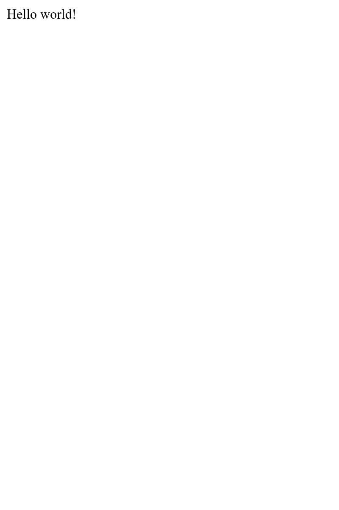

Construyendo una SPA
====================

.. index::
    single: SPA
    single: Mobile

La mayoría de los comentarios se enviarán durante la conferencia, donde algunas personas no traen un ordenador portátil. Pero probablemente tengan un teléfono inteligente. ¿Qué tal si creamos una aplicación móvil para echar un vistazo rápido a los comentarios de la conferencia?

Una forma de crear una aplicación móvil de este tipo es crear una aplicación de una sola página (SPA) en Javascript. Una SPA se ejecuta localmente, puede usar almacenamiento local, puede llamar a una API HTTP remota y puede aprovechar a los *service workers* para crear una experiencia casi nativa.

Creando la aplicación
----------------------

Para crear la aplicación móvil, vamos a utilizar `Preact`_ y **Symfony Encore**. **Preact** proporciona unos cimientos ligeros pero eficaces sobre los que trabajar, muy adecuados para nuestro libro de visitas SPA.

Para que tanto el sitio web como la SPA sean consistentes, vamos a reutilizar las hojas de estilo Sass del sitio web para la aplicación móvil.

Crea la aplicación SPA dentro de la carpeta ``spa`` y copia las hojas de estilo del sitio web:

.. code-block:: bash

    $ mkdir -p spa/src spa/public spa/assets/css
    $ cp assets/css/*.scss spa/assets/css/
    $ cd spa

.. note::

    Hemos creado un directorio ``public`` ya que interactuaremos principalmente con la SPA a través de un navegador. Podríamos haberle puesto nombre ``build`` si únicamente hubiéramos querido construir una aplicación móvil.

Inicializa el archivo ``package.json``  (equivalente al ``composer.json`` para JavaScript):

.. code-block:: bash

    $ yarn init -y

Ahora, agrega algunas dependencias que son necesarias:

.. code-block:: bash

    $ yarn add @symfony/webpack-encore @babel/core @babel/preset-env babel-preset-preact preact html-webpack-plugin bootstrap

Añade un archivo ``.gitignore``, se considera una buena práctica:

.. code-block:: text
    :caption: .gitignore

    /node_modules
    /public
    /yarn-error.log
    # used later by Cordova
    /app

El último paso de configuración es crear la configuración de Webpack Encore:

.. code-block:: javascript
    :caption: webpack.config.js
    :emphasize-lines: 8,11

    const Encore = require('@symfony/webpack-encore');
    const HtmlWebpackPlugin = require('html-webpack-plugin');

    Encore
        .setOutputPath('public/')
        .setPublicPath('/')
        .cleanupOutputBeforeBuild()
        .addEntry('app', './src/app.js')
        .enablePreactPreset()
        .enableSingleRuntimeChunk()
        .addPlugin(new HtmlWebpackPlugin({ template: 'src/index.ejs', alwaysWriteToDisk: true }))
    ;

    module.exports = Encore.getWebpackConfig();

Creando la plantilla principal de la SPA
----------------------------------------

Ahora toca crear la plantilla inicial en la que Preact mostrará la aplicación:

.. code-block:: html
    :caption: src/index.ejs
    :emphasize-lines: 12

    <!DOCTYPE html>
    <html>
    <head>
        <meta http-equiv="Content-Type" content="text/html; charset=utf-8" />
        <meta http-equiv="X-UA-Compatible" content="IE=edge" />
        <meta name="msapplication-tap-highlight" content="no" />
        <meta name="viewport" content="user-scalable=no, initial-scale=1, maximum-scale=1, minimum-scale=1, width=device-width" />

        <title>Conference Guestbook application</title>
    </head>
    <body>
        

    </body>
    </html>

La etiqueta ``
`` es donde la aplicación será mostrada vía JavaScript. Aquí está la primera versión del código que muestra la vista "Hello World":

.. code-block:: text
    :caption: src/app.js
    :emphasize-lines: 3,11

    import {h, render} from 'preact';

    function App() {
        return (
            

                Hello world!
            

        )
    }

    render(<App />, document.getElementById('app'));

La última línea registra la función ``App()``en el elemento ``#app`` de la página HTML.

¡Ahora todo está listo!

Ejecutando una SPA en el navegador
----------------------------------

.. index::
    single: Symfony CLI;server:start
    single: Symfony CLI;server:stop

Como esta aplicación es independiente del sitio web principal, necesitamos ejecutar otro servidor web:

.. code-block:: bash
    :class: hide

    $ symfony server:stop

.. code-block:: bash

    $ symfony server:start -d --passthru=index.html

El parámetro ``--passthru`` le dice al servidor web que pase todas las peticiones HTTP al archivo ``public/index.html`` ( ``public/`` es el directorio raíz web por defecto del servidor web). Esta página es gestionada por la aplicación Preact y es la encargada de generar la página que se mostrará en el historial del navegador.

Para compilar los archivos CSS **y JavaScript**, ejecuta ``yarn``:

.. code-block:: bash

    $ yarn encore dev

Abre la SPA en un navegador:

.. code-block:: bash
    :class: ignore

    $ symfony open:local

Y admira nuestra SPA de hola mundo:

Incorporando un enrutador (router) para gestionar estados
---------------------------------------------------------

La SPA actual no es capaz de gestionar diferentes páginas. Para implementar varias páginas, necesitamos un router, como para Symfony. Vamos a usar el **preact-router**. Éste toma una URL como entrada y, en función de la misma, selecciona un componente de Preact para mostrar.

Instala preact-router:

.. code-block:: bash

    $ yarn add preact-router

Crea una página para la página de inicio (un *componente de Preact* ):

.. code-block:: text
    :caption: src/pages/home.js

    import {h} from 'preact';

    export default function Home() {
        return (
            
Home

        );
    };

Y otra para la página de la conferencia:

.. code-block:: text
    :caption: src/pages/conference.js

    import {h} from 'preact';

    export default function Conference() {
        return (
            
Conference

        );
    };

Sustituye el mensaje "Hello World" del ``div`` por el componente ``Router``:

.. code-block:: diff
    :caption: patch_file
    :emphasize-lines: 15,17,20-23

    --- a/src/app.js
    +++ b/src/app.js
    @@ -1,9 +1,22 @@
     import {h, render} from 'preact';
    +import {Router, Link} from 'preact-router';
    +
    +import Home from './pages/home';
    +import Conference from './pages/conference';

     function App() {
         return (
             

    -            Hello world!
    +            <header>
    +                <Link href="/">Home</Link>
    +                 
    +                <Link href="/conference/amsterdam2019">Amsterdam 2019</Link>
    +            </header>
    +
    +            <Router>
    +                <Home path="/" />
    +                <Conference path="/conference/:slug" />
    +            </Router>
             

         )
     }

Reconstruye la aplicación:

.. code-block:: bash

    $ yarn encore dev

Si recargas la aplicación en el navegador, ya podrás hacer clic en "Home" y en los enlaces de las conferencias. Fíjate en que la URL del navegador y los botones Atrás/Adelante de tu navegador funcionan correctamente, como es de esperar.

Aplicando estilos a la SPA
--------------------------

En cuanto a la página web, añadamos el cargador Sass:

.. code-block:: bash

    $ yarn add node-sass sass-loader

Habilita el cargador Sass en Webpack y añade una referencia a la hoja de estilos:

.. code-block:: diff
    :caption: patch_file

    --- a/src/app.js
    +++ b/src/app.js
    @@ -1,3 +1,5 @@
    +import '../assets/css/app.scss';
    +
     import {h, render} from 'preact';
     import {Router, Link} from 'preact-router';

    --- a/webpack.config.js
    +++ b/webpack.config.js
    @@ -7,6 +7,7 @@ Encore
         .cleanupOutputBeforeBuild()
         .addEntry('app', './src/app.js')
         .enablePreactPreset()
    +    .enableSassLoader()
         .enableSingleRuntimeChunk()
         .addPlugin(new HtmlWebpackPlugin({ template: 'src/index.ejs', alwaysWriteToDisk: true }))
     ;

Ahora podemos actualizar la aplicación para usar las hojas de estilo:

.. code-block:: diff
    :caption: patch_file

    --- a/src/app.js
    +++ b/src/app.js
    @@ -9,10 +9,20 @@ import Conference from './pages/conference';
     function App() {
         return (
             

    -            <header>
    -                <Link href="/">Home</Link>
    -                 
    -                <Link href="/conference/amsterdam2019">Amsterdam 2019</Link>
    +            <header className="header">
    +                <nav className="navbar navbar-light bg-light">
    +                    

    +                        <Link className="navbar-brand mr-4 pr-2" href="/">
    +                            &#128217; Guestbook
    +                        </Link>
    +                    

    +                </nav>
    +
    +                <nav className="bg-light border-bottom text-center">
    +                    <Link className="nav-conference" href="/conference/amsterdam2019">
    +                        Amsterdam 2019
    +                    </Link>
    +                </nav>
                 </header>

                 <Router>

Reconstruye la aplicación una vez más:

.. code-block:: bash

    $ yarn encore dev

Ahora puedes disfrutar de una SPA con estilo:

.. figure:: screenshots/spa-home.png
    :alt: /
    :align: center
    :figclass: with-browser spa

Obteniendo datos desde una API
------------------------------

La estructura de la aplicación Preact ya está terminada: Preact Router maneja los estados de la página - incluyendo dónde se coloca el slug de la conferencia - y la hoja de estilo de la aplicación principal se utiliza para dar estilo a la SPA.

Para hacer que la SPA sea dinámica, necesitamos obtener los datos de la API a través de llamadas HTTP.

Configura Webpack para exponer la variable de entorno del *endpoint* de la API:

.. code-block:: diff
    :caption: patch_file

    --- a/webpack.config.js
    +++ b/webpack.config.js
    @@ -1,3 +1,4 @@
    +const webpack = require('webpack');
     const Encore = require('@symfony/webpack-encore');
     const HtmlWebpackPlugin = require('html-webpack-plugin');

    @@ -10,6 +11,9 @@ Encore
         .enableSassLoader()
         .enableSingleRuntimeChunk()
         .addPlugin(new HtmlWebpackPlugin({ template: 'src/index.ejs', alwaysWriteToDisk: true }))
    +    .addPlugin(new webpack.DefinePlugin({
    +        'ENV_API_ENDPOINT': JSON.stringify(process.env.API_ENDPOINT),
    +    }))
     ;

     module.exports = Encore.getWebpackConfig();

La variable de entorno ``API_ENDPOINT`` debe apuntar al servidor web del sitio web donde tenemos el *endpoint* de la API, en ``/api``. Lo configuraremos correctamente en breve, cuando ejecutemos ``yarn encore``.

Crea un fichero ``api.js`` que abstraerá la obtención de datos usando la API:

.. code-block:: text
    :caption: src/api/api.js

    function fetchCollection(path) {
        return fetch(ENV_API_ENDPOINT + path).then(resp => resp.json()).then(json => json['hydra:member']);
    }

    export function findConferences() {
        return fetchCollection('api/conferences');
    }

    export function findComments(conference) {
        return fetchCollection('api/comments?conference='+conference.id);
    }

Ahora puedes adaptar los componentes del encabezado (*header*) e inicio (*home*):

.. code-block:: diff
    :caption: patch_file

    --- a/src/app.js
    +++ b/src/app.js
    @@ -2,11 +2,23 @@ import '../assets/css/app.scss';

     import {h, render} from 'preact';
     import {Router, Link} from 'preact-router';
    +import {useState, useEffect} from 'preact/hooks';

    +import {findConferences} from './api/api';
     import Home from './pages/home';
     import Conference from './pages/conference';

     function App() {
    +    const [conferences, setConferences] = useState(null);
    +
    +    useEffect(() => {
    +        findConferences().then((conferences) => setConferences(conferences));
    +    }, []);
    +
    +    if (conferences === null) {
    +        return 
Loading...
;
    +    }
    +
         return (
             

                 <header className="header">
    @@ -19,15 +31,17 @@ function App() {
                     </nav>

                     <nav className="bg-light border-bottom text-center">
    -                    <Link className="nav-conference" href="/conference/amsterdam2019">
    -                        Amsterdam 2019
    -                    </Link>
    +                    {conferences.map((conference) => (
    +                        <Link className="nav-conference" href={'/conference/'+conference.slug}>
    +                            {conference.city} {conference.year}
    +                        </Link>
    +                    ))}
                     </nav>
                 </header>

                 <Router>
    -                <Home path="/" />
    -                <Conference path="/conference/:slug" />
    +                <Home path="/" conferences={conferences} />
    +                <Conference path="/conference/:slug" conferences={conferences} />
                 </Router>
             

         )
    --- a/src/pages/home.js
    +++ b/src/pages/home.js
    @@ -1,7 +1,28 @@
     import {h} from 'preact';
    +import {Link} from 'preact-router';
    +
    +export default function Home({conferences}) {
    +    if (!conferences) {
    +        return 
No conferences yet
;
    +    }

    -export default function Home() {
         return (
    -        
Home

    +        

    +            {conferences.map((conference)=> (
    +                

    +                    

    +                        

    +                            <h4 className="font-weight-light">
    +                                {conference.city} {conference.year}
    +                            </h4>
    +                        

    +
    +                        <Link className="btn btn-sm btn-blue stretched-link" href={'/conference/'+conference.slug}>
    +                            View
    +                        </Link>
    +                    

    +                

    +            ))}
    +        

         );
    -};
    +}

Por último, Preact Router está pasando el contenido por defecto de "slug" al componente Conference como una propiedad. Se usa para mostrar la conferencia adecuada y sus comentarios, de nuevo usando la API; y adapta el contenido mostrado para usar los datos de la API:

.. code-block:: diff
    :caption: patch_file

    --- a/src/pages/conference.js
    +++ b/src/pages/conference.js
    @@ -1,7 +1,48 @@
     import {h} from 'preact';
    +import {findComments} from '../api/api';
    +import {useState, useEffect} from 'preact/hooks';
    +
    +function Comment({comments}) {
    +    if (comments !== null && comments.length === 0) {
    +        return 
No comments yet
;
    +    }
    +
    +    if (!comments) {
    +        return 
Loading...
;
    +    }
    +
    +    return (
    +        

    +            {comments.map(comment => (
    +                

    +                    

    +                        {!comment.photoFilename ? '' : (
    +                            <a href={ENV_API_ENDPOINT+'uploads/photos/'+comment.photoFilename} target="_blank">
    +                                
    +                            </a>
    +                        )}
    +                    

    +
    +                    <h5 className="font-weight-light mt-3 mb-0">{comment.author}</h5>
    +                    
{comment.text}

    +                

    +            ))}
    +        

    +    );
    +}
    +
    +export default function Conference({conferences, slug}) {
    +    const conference = conferences.find(conference => conference.slug === slug);
    +    const [comments, setComments] = useState(null);
    +
    +    useEffect(() => {
    +        findComments(conference).then(comments => setComments(comments));
    +    }, [slug]);

    -export default function Conference() {
         return (
    -        
Conference

    +        

    +            <h4>{conference.city} {conference.year}</h4>
    +            <Comment comments={comments} />
    +        

         );
    -};
    +}

La SPA ahora necesita saber la URL de nuestra API a través de la variable de entorno ``API_ENDPOINT`. Configúrala con la URL del servidor web de la API (que se ejecuta en el directorio ``..``):

.. code-block:: bash

    $ API_ENDPOINT=`symfony var:export SYMFONY_PROJECT_DEFAULT_ROUTE_URL --dir=..` yarn encore dev

Ahora también la puedes ejecutar en segundo plano:

.. code-block:: bash

    $ API_ENDPOINT=`symfony var:export SYMFONY_PROJECT_DEFAULT_ROUTE_URL --dir=..` symfony run -d --watch=webpack.config.js yarn encore dev --watch

Y la aplicación debería funcionar correctamente en el navegador:

.. figure:: screenshots/spa-home-final.png
    :alt: /
    :align: center
    :figclass: with-browser spa

.. figure:: screenshots/spa-conference-final.png
    :alt: /conference/amsterdam-2019
    :align: center
    :figclass: with-browser spa

¡Impresionante! Ahora tenemos un SPA totalmente funcional, con router y datos reales. Podríamos organizar mejor la aplicación Preact más adelante si queremos, pero ya está funcionando muy bien.

Desplegando la SPA en producción
---------------------------------

.. index::
    single: SymfonyCloud;Multi-Applications

SymfonyCloud permite desplegar múltiples aplicaciones por proyecto. Se puede añadir otra aplicación creando un archivo ``.symfony.cloud.yaml`` en cualquier subdirectorio. Crea uno bajo ``spa/`` llamado ``spa``:

.. code-block:: yaml
    :caption: .symfony.cloud.yaml
    :emphasize-lines: 1

    name: spa

    type: php:7.3
    size: S

    build:
        flavor: none

    web:
        commands:
            start: sleep
        locations:
            "/":
                root: "public"
                index:
                    - "index.html"
                scripts: false
                expires: 10m

    hooks:
        build: |
            set -x -e

            curl -s https://get.symfony.com/cloud/configurator | (>&2 bash)
            (>&2
                unset NPM_CONFIG_PREFIX
                export NVM_DIR=${SYMFONY_APP_DIR}/.nvm

                yarn-install

                set +x && . "${SYMFONY_APP_DIR}/.nvm/nvm.sh" && set -x

                yarn encore prod
            )

.. index::
    single: SymfonyCloud;Routes

Edita el archivo ``.symfony/routes.yaml`` para enrutar el subdominio ``spa.`` a la aplicación ``spa`` que se encuentra en el directorio raíz del proyecto:

.. code-block:: bash

    $ cd ../

.. code-block:: diff
    :caption: patch_file
    :emphasize-lines: 4,5

    --- a/.symfony/routes.yaml
    +++ b/.symfony/routes.yaml
    @@ -1,2 +1,5 @@
    +"https://spa.{all}/": { type: upstream, upstream: "spa:http" }
    +"http://spa.{all}/": { type: redirect, to: "https://spa.{all}/" }
    +
     "https://{all}/": { type: upstream, upstream: "varnish:http", cache: { enabled: false } }
     "http://{all}/": { type: redirect, to: "https://{all}/" }

Configurando CORS para la SPA
-----------------------------

.. index::
    single: CORS
    single: Cross-Origin Resource Sharing

Si desplegaras el código ahora no funcionaría ya que un navegador bloquearía la solicitud de API. Tenemos que permitir explícitamente que la SPA acceda a la API. Obtén el nombre de dominio actual asociado a tu aplicación:

.. code-block:: bash

    $ symfony env:urls --first

Define la variable de entorno ``CORS_ALLOW_ORIGIN`` correctamente:

.. code-block:: bash

    $ symfony var:set "CORS_ALLOW_ORIGIN=^`symfony env:urls --first | sed 's#/$##' | sed 's#https://#https://spa.#'`$"

Si tu dominio fuera ``https://master-5szvwec-hzhac461b3a6o.eu.s5y.io/``, las llamadas a ``sed`` lo convertirán a ``https://spa.master-5szvwec-hzhac461b3a6o.eu.s5y.io``.

También necesitamos definir la variable de entorno ``API_ENDPOINT``:

.. code-block:: bash

    $ symfony var:set API_ENDPOINT=`symfony env:urls --first`

Realiza un *commit* y despliega:

.. code-block:: bash
    :class: ignore

    $ git add .
    $ git commit -a -m'Add the SPA application'
    $ symfony deploy

Accede a la SPA en un navegador especificando que es una aplicación:

.. code-block:: bash
    :class: ignore

    $ symfony open:remote --app=spa

Usando Cordova para construir una aplicación de Smartphone
-----------------------------------------------------------

.. index::
    single: SPA;Cordova
    single: Apache Cordova
    single: Cordova

**Apache Cordova** es una herramienta que crea aplicaciones multiplataforma para teléfonos inteligentes. Y, ¡buenas noticias!, puede utilizar la SPA que acabamos de crear.

Vamos a instalarlo:

.. code-block:: bash

    $ cd spa
    $ yarn global add cordova

.. note::

    También será necesario instalar el SDK de Android. Esta sección sólo menciona Android, pero Cordova funciona con todas las plataformas móviles, incluyendo iOS.

Crea la estructura de directorios de la aplicación:

.. code-block:: bash
    :class: answers(n)

    $ cordova create app

Y genera la aplicación Android:

.. code-block:: bash
    :class: ignore

    $ cd app
    $ cordova platform add android
    $ cd ..

Eso es todo lo que necesitas. Ahora puedes generar los archivos de producción y moverlos a Cordova:

.. code-block:: bash

    $ API_ENDPOINT=`symfony var:export SYMFONY_PROJECT_DEFAULT_ROUTE_URL --dir=..` yarn encore production
    $ rm -rf app/www
    $ mkdir -p app/www
    $ cp -R public/ app/www

Ejecuta la aplicación en un smartphone o en un emulador:

.. code-block:: bash
    :class: ignore

    $ cordova run android

.. sidebar:: Yendo más allá

    * `El sitio web oficial de Preact <https://preactjs.com/>`_;

    * `El sitio web oficial de Cordova <https://cordova.apache.org/>`_.

.. _`preact`: https://preactjs.com/
