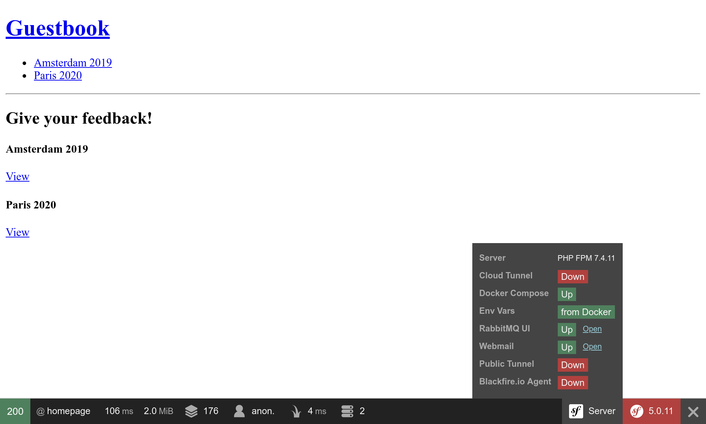
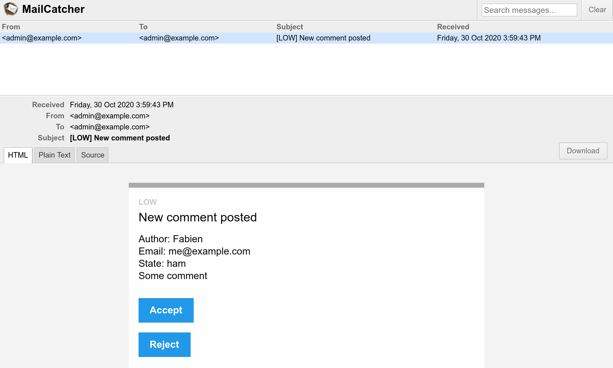

ارسال رایانامه به مدیران
=============================================

.. index::
    single: Components;Mailer
    single: Mailer
    single: Emails

مدیر جهت اطمینان از دریافت بازخورد باکیفیت، می‌بایست تمامی کامنت‌ها را تعدیل کند. زمانی که یک نظر در وضعیت ``ham`` یا ``potential_spam`` است، باید یک *رایانامه* به همراه دو پیوند به مدیر ارسال گردد: یک پیوند برای پذیرفتن کامنت و یکی برای ردکردن آن.

ابتدا کامپوننت سیمفونی Mailer را نصب نمایید:

.. code-block:: bash

    $ symfony composer req mailer

تنظیم یک رایانامه برای مدیر
--------------------------------------------------

برای ذخیره‌سازی رایانامه‌ی مدیر، از یک پارامتر کانتینر استفاده نمایید. همچنین برای نمایش مقصود خود، اجازه می‌دهیم که این پارامتر از طریق یک متغیر محیط تنظیم گردد (در «دنیای واقعی» قاعدتاً نیازی به اینکار نیست). جهت تسهیلِ تزریق در سرویس‌هایی که می‌خواهند از رایانامه‌ی مدیر استفاده نمایند، یک تنظیم ``bind`` در کانتینر تعریف کنید:

.. code-block:: diff
    :caption: patch_file

    --- a/config/services.yaml
    +++ b/config/services.yaml
    @@ -4,6 +4,7 @@
     # Put parameters here that don't need to change on each machine where the app is deployed
     # https://symfony.com/doc/current/best_practices/configuration.html#application-related-configuration
     parameters:
    +    default_admin_email: admin@example.com

     services:
         # default configuration for services in *this* file
    @@ -13,6 +14,7 @@ services:
             bind:
                 $photoDir: "%kernel.project_dir%/public/uploads/photos"
                 $akismetKey: "%env(AKISMET_KEY)%"
    +            $adminEmail: "%env(string:default:default_admin_email:ADMIN_EMAIL)%"

         # makes classes in src/ available to be used as services
         # this creates a service per class whose id is the fully-qualified class name

یک متغیر محیط ممکن است قبل از استفاده «پردازش» شود. در اینجا، اگر متغیر محیط ``ADMIN_EMAIL`` وجود نداشته باشد، ما از پردازشگر ``default`` برای بازگرداندن مقدار پارامتر ``default_admin_email`` استفاده می‌کنیم.

ارسال یک رایانامه‌ی اعلان
------------------------------------------------

برای ارسال یک رایانامه، می‌توانید از میان چندین کلاس انتزاعی، یکی را انتخاب نمایید؛ از ``Message``، که پایین‌ترین سطح است،  تا ``NotificationEmail``، که بالاترین سطح به شمار می‌رود. احتمالا شما بیشتر از کلاس ``Email`` استفاده خواهید کرد، اما ``NotificationEmail`` یک انتخاب عالی برای رایانامه‌های داخلی می‌باشد.

بیایید در رسیدگی‌کننده‌ی پیغام، منطق اعتبارسنجی خودکار را جایگزین نماییم:

.. code-block:: diff
    :caption: patch_file

    --- a/src/MessageHandler/CommentMessageHandler.php
    +++ b/src/MessageHandler/CommentMessageHandler.php
    @@ -7,6 +7,8 @@ use App\Repository\CommentRepository;
     use App\SpamChecker;
     use Doctrine\ORM\EntityManagerInterface;
     use Psr\Log\LoggerInterface;
    +use Symfony\Bridge\Twig\Mime\NotificationEmail;
    +use Symfony\Component\Mailer\MailerInterface;
     use Symfony\Component\Messenger\Handler\MessageHandlerInterface;
     use Symfony\Component\Messenger\MessageBusInterface;
     use Symfony\Component\Workflow\WorkflowInterface;
    @@ -18,15 +20,19 @@ class CommentMessageHandler implements MessageHandlerInterface
         private $commentRepository;
         private $bus;
         private $workflow;
    +    private $mailer;
    +    private $adminEmail;
         private $logger;

    -    public function __construct(EntityManagerInterface $entityManager, SpamChecker $spamChecker, CommentRepository $commentRepository, MessageBusInterface $bus, WorkflowInterface $commentStateMachine, LoggerInterface $logger = null)
    +    public function __construct(EntityManagerInterface $entityManager, SpamChecker $spamChecker, CommentRepository $commentRepository, MessageBusInterface $bus, WorkflowInterface $commentStateMachine, MailerInterface $mailer, string $adminEmail, LoggerInterface $logger = null)
         {
             $this->entityManager = $entityManager;
             $this->spamChecker = $spamChecker;
             $this->commentRepository = $commentRepository;
             $this->bus = $bus;
             $this->workflow = $commentStateMachine;
    +        $this->mailer = $mailer;
    +        $this->adminEmail = $adminEmail;
             $this->logger = $logger;
         }

    @@ -51,8 +57,13 @@ class CommentMessageHandler implements MessageHandlerInterface

                 $this->bus->dispatch($message);
             } elseif ($this->workflow->can($comment, 'publish') || $this->workflow->can($comment, 'publish_ham')) {
    -            $this->workflow->apply($comment, $this->workflow->can($comment, 'publish') ? 'publish' : 'publish_ham');
    -            $this->entityManager->flush();
    +            $this->mailer->send((new NotificationEmail())
    +                ->subject('New comment posted')
    +                ->htmlTemplate('emails/comment_notification.html.twig')
    +                ->from($this->adminEmail)
    +                ->to($this->adminEmail)
    +                ->context(['comment' => $comment])
    +            );
             } elseif ($this->logger) {
                 $this->logger->debug('Dropping comment message', ['comment' => $comment->getId(), 'state' => $comment->getState()]);
             }

مدخل اصلی برنامه، ``MailerInterface`` می‌باشد که اجازه می‌دهد تا ``send()``، رایانامه‌ها را ارسال کند.

برای ارسال یک رایانامه، به یک ارسال‌کننده نیاز داریم (سربرگ ``From``/``Sender``). به جای اینکه آن را صریحاً بر روی نمونه‌ی شیء Email تنظیم کنیم، آن را به صورت کلی تعریف می‌کنیم:

.. code-block:: diff
    :caption: patch_file

    --- a/config/packages/mailer.yaml
    +++ b/config/packages/mailer.yaml
    @@ -1,3 +1,5 @@
     framework:
         mailer:
             dsn: '%env(MAILER_DSN)%'
    +        envelope:
    +            sender: "%env(string:default:default_admin_email:ADMIN_EMAIL)%"

بسط قالب رایانامه‌ی اعلان
------------------------------------------------

.. index::
    single: Twig;extends
    single: Twig;block
    single: Twig;url

قالب رایانامه‌ی اعلان، از قالب پیشفرض رایانامه‌ی اعلان که همراه با سیمفونی است، ارث می‌برد:

.. code-block:: twig
    :caption: templates/emails/comment_notification.html.twig

    

    
        Author: {{ comment.author }} 
        Email: {{ comment.email }} 
        State: {{ comment.state }} 

        

            {{ comment.text }}
        

    

    
        <spacer size="16"></spacer>
        <button href="{{ url('review_comment', { id: comment.id }) }}">Accept</button>
        <button href="{{ url('review_comment', { id: comment.id, reject: true }) }}">Reject</button>
    

قالب تعدادی از بلوک‌ها را بازنویسی می‌کند تا پیغام رایانامه و برخی پیوند‌ها که به مدیر اجازه‌ی پذیرش یا رد کامنت را می‌دهد، سفارشی‌سازی کند. هر آرگمان راه (route) که یک پارامتر راه معتبر نباشد، به عنوان رشته‌ی پرس‌وجو (query string) اضافه می‌گردد (URL مربوط به رد کردن کامنت‌ها، به صورت ``/admin/comment/review/42?reject=true`` است).

قالب پیشفرض ``NotificationEmail``، به جای HTML از `Inky <https://get.foundation/emails/docs/inky.html>`_ برای طراحی رایانامه استفاده می‌کند. این موضوع کمک می‌کند تا رایانامه‌های واکنشی‌ای (responsive) ایجاد شود که با اکثر کلاینت‌های رایانامه سازگار باشند.

برای داشتن حداکثر سازگاری با خواننده‌های رایانامه، قالب پایه‌ی اعلان، به صورت پیشفرض تمام stylesheetها را درون‌خط (inline) می‌کند (به کمک بسته‌ی CSS inliner).

این دو ویژگی، بخشی از افزونه‌های اختیاری Twig هستند که لازم است نصب شوند:

.. code-block:: bash

    $ symfony composer req "twig/cssinliner-extra:^3" "twig/inky-extra:^3"

تولید URLهای مطلق (Absolute) در درون یک فرمان
----------------------------------------------------------------------

.. index::
    single: Twig;Link
    single: Link

در رایانامه‌ها، از آنجایی که به URLهای مطلق نیاز دارید، URLها را به جای ``path()`` با ``url()`` تولید کنید.

رایانامه در زمینه‌ی کنسول (console context) و از طریق رسیدگی‌کننده‌ی پیغام ارسال می‌شود. از آنجایی که در زمینه‌ی وب (web context)، ما شِما (scheme) و دامنه‌ی صفحه‌ی فعلی را می‌دانیم، تولید URLهای مطلق در این زمینه راحت‌تر است. اما در زمینه‌ی کنسول وضعیت چنین نیست.

برای استفاده‌ی صریح، شِما و نام دامنه را تعریف کنید:

.. code-block:: diff
    :caption: patch_file

    --- a/config/services.yaml
    +++ b/config/services.yaml
    @@ -5,6 +5,11 @@
     # https://symfony.com/doc/current/best_practices/configuration.html#application-related-configuration
     parameters:
         default_admin_email: admin@example.com
    +    default_domain: '127.0.0.1'
    +    default_scheme: 'http'
    +
    +    router.request_context.host: '%env(default:default_domain:SYMFONY_DEFAULT_ROUTE_HOST)%'
    +    router.request_context.scheme: '%env(default:default_scheme:SYMFONY_DEFAULT_ROUTE_SCHEME)%'

     services:
         # default configuration for services in *this* file

هنگامی که از رابط خط فرمان ``symfony`` به صورت محلی استفاده می‌کنید، متغیرهای محیط ``SYMFONY_DEFAULT_ROUTE_HOST`` و ``SYMFONY_DEFAULT_ROUTE_PORT`` بر اساس پیکربندی SymfonyCloud تعیین گردیده و به صورت خودکار تنظیم می‌شوند.

سیم‌کشی یک راه (Route) به یک کنترلر
----------------------------------------------------------

راهِ ``review_comment`` هنوز وجود ندارد، بیایید یک کنترلر مدیر ایجاد کنیم تا به آن رسیدگی کند:

.. code-block:: php
    :caption: src/Controller/AdminController.php

    namespace App\Controller;

    use App\Entity\Comment;
    use App\Message\CommentMessage;
    use Doctrine\ORM\EntityManagerInterface;
    use Symfony\Bundle\FrameworkBundle\Controller\AbstractController;
    use Symfony\Component\HttpFoundation\Request;
    use Symfony\Component\HttpFoundation\Response;
    use Symfony\Component\Messenger\MessageBusInterface;
    use Symfony\Component\Routing\Annotation\Route;
    use Symfony\Component\Workflow\Registry;
    use Twig\Environment;

    class AdminController extends AbstractController
    {
        private $twig;
        private $entityManager;
        private $bus;

        public function __construct(Environment $twig, EntityManagerInterface $entityManager, MessageBusInterface $bus)
        {
            $this->twig = $twig;
            $this->entityManager = $entityManager;
            $this->bus = $bus;
        }

        /**
         * @Route("/admin/comment/review/{id}", name="review_comment")
         */
        public function reviewComment(Request $request, Comment $comment, Registry $registry): Response
        {
            $accepted = !$request->query->get('reject');

            $machine = $registry->get($comment);
            if ($machine->can($comment, 'publish')) {
                $transition = $accepted ? 'publish' : 'reject';
            } elseif ($machine->can($comment, 'publish_ham')) {
                $transition = $accepted ? 'publish_ham' : 'reject_ham';
            } else {
                return new Response('Comment already reviewed or not in the right state.');
            }

            $machine->apply($comment, $transition);
            $this->entityManager->flush();

            if ($accepted) {
                $this->bus->dispatch(new CommentMessage($comment->getId()));
            }

            return $this->render('admin/review.html.twig', [
                'transition' => $transition,
                'comment' => $comment,
            ]);
        }
    }

URL مربوط به بازبینی کامنت، با ``/admin/`` آغاز می‌شود تا به کمک دیوارآتش تعریف‌شده در گام قبل از آن محافظت شود. مدیر باید احراز هویت شود تا بتواند به این منبع دسترسی پیدا کند.

به جای ایجاد یک نمونه‌ی ``Response``، ما از ``render()`` استفاده کرده‌ایم که یک متد میانبر است و توسط کلاس کنترلر پایه‌ی ``AbstractController``   فراهم شده است.

.. index::
    single: Twig;extends
    single: Twig;block

زمانی که بازبینی تمام شود، یک قالب کوتاه، از مدیر به خاطر تلاش سختش تشکر می‌کند:

.. code-block:: twig
    :caption: templates/admin/review.html.twig

    

    
        <h2>Comment reviewed, thank you!</h2>

        
Applied transition: <strong>{{ transition }}</strong>

        
New state: <strong>{{ comment.state }}</strong>

    

استفاده از یک Mail Catcher
-------------------------------------

.. index::
    single: Docker;Mail Catcher

بیایید به جای استفاده از یک سرور SMTP «واقعی» یا یک فراهم‌کننده‌ی شخص ثالث برای ارسال رایانامه‌ها، از یک mail catcher استفاده کنیم. یک mail catcher، یک سرور SMTP فراهم می‌کند که رایانامه‌ها را به مقصد نمی‌رساند، بلکه آن‌ها را از طریق یک واسط وب در دسترس قرار می‌دهد:

.. code-block:: diff

    --- a/docker-compose.yaml
    +++ b/docker-compose.yaml
    @@ -16,3 +16,7 @@ services:
         rabbitmq:
             image: rabbitmq:3.7-management
             ports: [5672, 15672]
    +
    +    mailer:
    +        image: schickling/mailcatcher
    +        ports: [1025, 1080]

کانتینرها را خاموش و بازراه‌اندازی کنید تا mail catcher را اضافه کنیم:

.. code-block:: bash

    $ docker-compose stop
    $ docker-compose up -d

.. code-block:: bash
    :class: hide

    $ sleep 10

دسترسی به Webmail
-------------------------

.. index::
    single: Symfony CLI;open:local:webmail

می توانید webmail را از طریق ترمینال باز نمایید:

.. code-block:: bash
    :class: ignore

    $ symfony open:local:webmail

یا از طریق نوار ابزار اشکال‌زدایی:

یک کامنت ثبت کنید، سپس باید یک رایانامه از طریق رابط webmail دریافت نمایید:

در رابط، بر روی عنوان رایانامه کلیک کرده و کامنت را هر طور که مناسب می‌دانید، پذیرش یا رد کنید:

.. figure:: screenshots/webmail-rejected.png
    :alt: /
    :align: center
    :figclass: with-browser

اگر آن طور که باید کار نمی‌کند، لاگ‌های را با `server:log`` بررسی کنید:

مدیریت اسکریپت‌های طولانی‌اجرا (Long-Running)
---------------------------------------------------------------------------

داشتن اسکریپت‌های طولانی‌اجرا، به همراه خود رفتارهایی را می‌آورد که باید از آن آگاه باشید. در PHP و در مدلی که برای درخواست‌های HTTP استفاده می‌شود، هر درخواست با یک وضعیت پاک و جدید شروع می‌شود. بر خلاف این مدل، مصرف‌کننده‌ی پیغام به صورت مستمر در پس‌زمینه در حال اجرا است. هر رسیدگی به پیغام، وضعیت موجود را که شامل حافظه‌ی نهانگاه (cache) نیز هست، به ارث می‌برد. شما باید بررسی کنید که آیا سرویس‌های شما نیاز دارند که همین رفتار را داشته باشند یا خیر.

ارسال ناهمزمان رایانامه‌ها
---------------------------------------------------

رایانامه‌ای که در رسیدگی‌کننده به پیغام ارسال می‌شود، ممکن برای ارسال به زمان احتیاج داشته باشد یا حتی ممکن است که یک استثناء پرتاب کند. در صورتی که در طول رسیدگی به پیغام، استثناء پرتاب شود، بازتلاش انجام می شود. اما به جای بازتلاش برای مصرف پیغام، بهتر است که تنها برای ارسال رایانامه بازتلاش کنیم.

هم اکنون می‌دانیم که چگونه این کار را انجام دهیم: پیغام رایانامه را به گذرگاه بفرستید.

یک نمونه ``MailerInterface`` بخش سخت کار را انجام می‌دهد: زمانی که گذرگاه تعریف شده است، به جای ارسال پیغام‌های رایانامه، آن‌ها را به گذرگاه اعزام می‌کند. کدتان نیازی به تغییر ندارد.

اما در حال حاضر، گذرگاه رایانامه‌ها را به صورت همزمان ارسال می‌کند، چرا که ما صفی که می‌خواهیم برای رایانامه‌ها استفاده شود را پیکربندی نکرده‌ایم. بیایید مجدداً از RabbitMQ استفاده کنیم:

.. code-block:: diff
    :caption: patch_file

    --- a/config/packages/messenger.yaml
    +++ b/config/packages/messenger.yaml
    @@ -19,3 +19,4 @@ framework:
             routing:
                 # Route your messages to the transports
                 App\Message\CommentMessage: async
    +            Symfony\Component\Mailer\Messenger\SendEmailMessage: async

با اینکه ما از یک حامل یکسان (RabbitMQ) برای پیغام‌های کامنت و پیغام‌های رایانامه استفاده می‌کنیم، لازم نیست که حتماً اینطور باشد. شما می‌توانید تصمیم بگیرید که از یک حامل دیگر استفاده کنید تا مثلاً اولویت‌های متفاوتی را برای پیغام‌ها در نظر بگیرید. همچنین استفاده از حامل‌های متفاوت، می‌تواند این امکان را به شما بدهد که برای رسیدگی به پیغام‌های مختلف، ماشین‌های کارگر متفاوتی را داشته باشید.

آزمودن رایانامه‌ها
------------------------------------

راه‌های زیادی برای آزمودن رایانامه‌ها وجود دارد.

اگر به ازای هر رایانامه یک کلاس بنویسید (مثلاً از طریق بسط دادن ``Email`` یا``TemplatedEmail``)، می‌توانید از آزمون‌های واحد استفاده کنید.

اما معمول‌ترین آزمون‌هایی که خواهید نوشت، آزمون‌های کارکردی‌ای هستند که بررسی می‌کنند که آیا یک عمل باعث ارسال رایانامه می‌شود یا خیر و احتمالاً اگر رایانامه‌ها پویا هستند، محتوای آن را می‌آزمایند.

سیمفونی دارای ادعاهایی (assertions) است که نوشتن این آزمون‌ها را آسان می‌کند:

.. code-block:: php
    :class: ignore

    public function testMailerAssertions()
    {
        $client = static::createClient();
        $client->request('GET', '/');

        $this->assertEmailCount(1);
        $event = $this->getMailerEvent(0);
        $this->assertEmailIsQueued($event);

        $email = $this->getMailerMessage(0);
        $this->assertEmailHeaderSame($email, 'To', 'fabien@example.com');
        $this->assertEmailTextBodyContains($email, 'Bar');
        $this->assertEmailAttachmentCount($email, 1);
    }

این ادعاها زمانی که رایانامه‌ها به صورت همزمان یا ناهمزمان ارسال می‌شوند، کار می‌کنند.

ارسال رایانامه در SymfonyCloud
---------------------------------------------

.. index::
    single: SymfonyCloud;Emails
    single: SymfonyCloud;Mailer
    single: SymfonyCloud;SMTP
    single: Emails

پیکربندی خاصی برای SymfonyCloud وجود ندارد. تمام حساب‌ها دارای یک حساب SendGrid هستند که به صورت خودکار برای ارسال رایانامه‌ها مورد استفاده قرار می‌گیرد.

شما هنوز نیاز دارید که پیکربندی SymfonyCloud را به‌‌روزرسانی کنید تا افزونه‌ی PHP با نام ``xsl`` را شامل شود که برای Inky مورد نیاز است:

.. code-block:: diff
    :caption: patch_file

    --- a/.symfony.cloud.yaml
    +++ b/.symfony.cloud.yaml
    @@ -4,6 +4,7 @@ type: php:7.4

     runtime:
         extensions:
    +        - xsl
             - amqp
             - redis
             - pdo_pgsql

.. index::
    single: Symfony CLI;env:setting:set

.. note::

    محض احتیاط، رایانامه‌ها به صورت پیشفرض تنها در شاخه‌ی ``master`` ارسال می‌گردند. اگر می‌دانید که دارید چه کاری انجام می‌دهید، صریحاً SMTP را در شاخه‌های non-``master`` فعال کنید:

    .. code-block:: bash

        $ symfony env:setting:set email on

.. sidebar:: بیشتر بدانید

    * `آموزش تصویری Mailer در SymfonyCasts <https://symfonycasts.com/screencast/mailer>`_؛

    * `مستندات زبان قالب‌نویسی Inky <https://get.foundation/emails/docs/inky.html>`_؛

    * `پردازشگرهای متغیرهای محیط <https://symfony.com/doc/current/configuration/env_var_processors.html>`_؛

    * `مستندات Mailer در چارچوب سیمفونی <https://symfony.com/doc/current/mailer.html>`_؛

    * The `SymfonyCloud documentation about Emails <https://symfony.com/doc/current/cloud/services/emails.html>`_.
