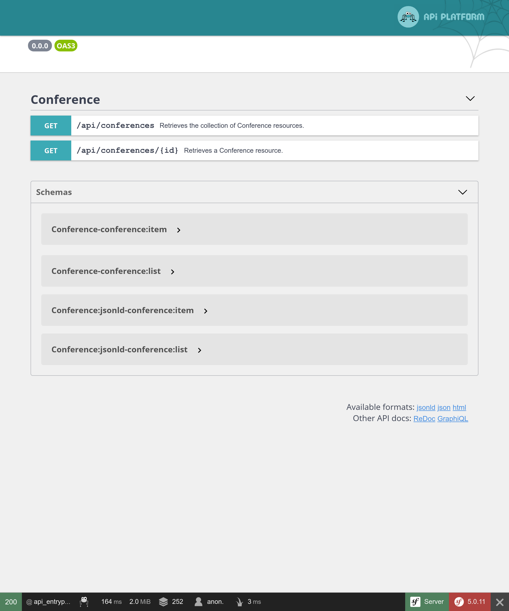

ارائه‌ی یک API با استفاده از API Platform
==============================================================

.. index::
    single: API
    single: HTTP API
    single: API Platform

ما پیاده‌سازی وب‌سایت Guestbook را تمام کرده‌ایم. برای اینکه اجازه دهیم از داده‌ها بیشتر استفاده شود، نظرتان در مورد ارائه‌ی یک API چیست؟ یک API می‌تواند توسط اپلیکیشن‌های موبایلی، برای نمایش تمام کنفرانس‌ها و کامنت‌هایشان مورد استفاده قرار بگیرد یا حتی به کاربران اجازه دهد تا کامنت ارسال کنند.

در این گام، می‌خواهیم یک API فقط‌خواندنی را پیاده‌سازی کنیم.

نصب API Platform
-------------------

ارائه‌ی یک API با نوشتن مقداری کد امکان‌پذیر است. اما اگر می‌خواهیم از استانداردها استفاده کنیم، بهتر است از راهکاری بهره بگیریم که بخش سخت کار را انجام دهد. راهکاری مثل API Platform:

.. code-block:: bash

    $ symfony composer req api

ارائه‌ی یک API برای کنفرانس‌ها
-------------------------------------------------------

.. index::
    single: Annotations;@ApiResource
    single: Annotations;@Groups

تعدادی حاشیه‌نویسی بر روی کلاس Conference، تمام چیزی است که برای پیکربندی API احتیاج داریم:

.. code-block:: diff
    :caption: patch_file

    --- a/src/Entity/Conference.php
    +++ b/src/Entity/Conference.php
    @@ -2,16 +2,25 @@

     namespace App\Entity;

    +use ApiPlatform\Core\Annotation\ApiResource;
     use App\Repository\ConferenceRepository;
     use Doctrine\Common\Collections\ArrayCollection;
     use Doctrine\Common\Collections\Collection;
     use Doctrine\ORM\Mapping as ORM;
     use Symfony\Bridge\Doctrine\Validator\Constraints\UniqueEntity;
    +use Symfony\Component\Serializer\Annotation\Groups;
     use Symfony\Component\String\Slugger\SluggerInterface;

     /**
      * @ORM\Entity(repositoryClass=ConferenceRepository::class)
      * @UniqueEntity("slug")
    + *
    + * @ApiResource(
    + *     collectionOperations={"get"={"normalization_context"={"groups"="conference:list"}}},
    + *     itemOperations={"get"={"normalization_context"={"groups"="conference:item"}}},
    + *     order={"year"="DESC", "city"="ASC"},
    + *     paginationEnabled=false
    + * )
      */
     class Conference
     {
    @@ -19,21 +28,29 @@ class Conference
          * @ORM\Id
          * @ORM\GeneratedValue
          * @ORM\Column(type="integer")
    +     *
    +     * @Groups({"conference:list", "conference:item"})
          */
         private $id;

         /**
          * @ORM\Column(type="string", length=255)
    +     *
    +     * @Groups({"conference:list", "conference:item"})
          */
         private $city;

         /**
          * @ORM\Column(type="string", length=4)
    +     *
    +     * @Groups({"conference:list", "conference:item"})
          */
         private $year;

         /**
          * @ORM\Column(type="boolean")
    +     *
    +     * @Groups({"conference:list", "conference:item"})
          */
         private $isInternational;

    @@ -44,6 +61,8 @@ class Conference

         /**
          * @ORM\Column(type="string", length=255, unique=true)
    +     *
    +     * @Groups({"conference:list", "conference:item"})
          */
         private $slug;

حاشیه‌نویسی اصلی ``@ApiResource``، API را برای کنفرانس‌ها پیکربندی می‌کند. این حاشیه‌نویسی عملیات‌های ممکن را به ``get`` محدود می‌کند و چیزهای مختلفی را پیکربندی می‌کند: همچون اینکه چه فیلدهایی نمایش داده شود و ترتیب کنفرانس‌ها به چه شکل باشد.

به صورت پیشفرض و به لطف پیکربندی موجود در ``config/routes/api_platform.yaml`` که توسط recipe‌ مربوط به بسته اضافه شده است، مدخل اصلی برای API همان ``/api`` است.

رابط وب به شما اجازه می‌ده تا با API فعل‌وانفعال داشته باشید:

از آن استفاده کنید تا امکانات مختلف را امتحان کنید:

.. figure:: screenshots/api-conferences.png
    :alt: /api
    :align: center
    :figclass: with-browser

تصور کنید که اگر تمام این‌ها را از ابتدا پیاده‌سازی می‌کردید چقدر طول می‌کشید!

ارائه‌ی API برای کامنت‌ها
----------------------------------------------

.. index::
    single: Annotations;@ApiResource
    single: Annotations;@ApiFilter
    single: Annotations;@Groups

همین کار را برای کامنت‌ها بکنید:

.. code-block:: diff
    :caption: patch_file

    --- a/src/Entity/Comment.php
    +++ b/src/Entity/Comment.php
    @@ -2,13 +2,26 @@

     namespace App\Entity;

    +use ApiPlatform\Core\Annotation\ApiFilter;
    +use ApiPlatform\Core\Annotation\ApiResource;
    +use ApiPlatform\Core\Bridge\Doctrine\Orm\Filter\SearchFilter;
     use App\Repository\CommentRepository;
     use Doctrine\ORM\Mapping as ORM;
    +use Symfony\Component\Serializer\Annotation\Groups;
     use Symfony\Component\Validator\Constraints as Assert;

     /**
      * @ORM\Entity(repositoryClass=CommentRepository::class)
      * @ORM\HasLifecycleCallbacks()
    + *
    + * @ApiResource(
    + *     collectionOperations={"get"={"normalization_context"={"groups"="comment:list"}}},
    + *     itemOperations={"get"={"normalization_context"={"groups"="comment:item"}}},
    + *     order={"createdAt"="DESC"},
    + *     paginationEnabled=false
    + * )
    + *
    + * @ApiFilter(SearchFilter::class, properties={"conference": "exact"})
      */
     class Comment
     {
    @@ -16,18 +29,24 @@ class Comment
          * @ORM\Id
          * @ORM\GeneratedValue
          * @ORM\Column(type="integer")
    +     *
    +     * @Groups({"comment:list", "comment:item"})
          */
         private $id;

         /**
          * @ORM\Column(type="string", length=255)
          * @Assert\NotBlank
    +     *
    +     * @Groups({"comment:list", "comment:item"})
          */
         private $author;

         /**
          * @ORM\Column(type="text")
          * @Assert\NotBlank
    +     *
    +     * @Groups({"comment:list", "comment:item"})
          */
         private $text;

    @@ -35,22 +54,30 @@ class Comment
          * @ORM\Column(type="string", length=255)
          * @Assert\NotBlank
          * @Assert\Email
    +     *
    +     * @Groups({"comment:list", "comment:item"})
          */
         private $email;

         /**
          * @ORM\Column(type="datetime")
    +     *
    +     * @Groups({"comment:list", "comment:item"})
          */
         private $createdAt;

         /**
          * @ORM\ManyToOne(targetEntity=Conference::class, inversedBy="comments")
          * @ORM\JoinColumn(nullable=false)
    +     *
    +     * @Groups({"comment:list", "comment:item"})
          */
         private $conference;

         /**
          * @ORM\Column(type="string", length=255, nullable=true)
    +     *
    +     * @Groups({"comment:list", "comment:item"})
          */
         private $photoFilename;

از حاشیه‌نویسی‌های مشابه‌ای برای پیکربندی کلاس استفاده شده است.

محدودسازی کامنت‌هایی که توسط API ارائه گردیده
----------------------------------------------------------------------------------

به صورت پیشفرض، API Platform تمام کامنت‌های درون پایگاه‌داده را ارائه می‌کند. اما برای کامنت‌ها، تنها باید آن‌هایی که منتشر‌شده هستند بخشی از API باشند.

زمانی که لازم دارید آیتم‌های بازگردانده‌شده توسط API را محدود کنید، سرویسی ایجاد کنید که یا رابط ``QueryCollectionExtensionInterface`` را که برای کنترل پرس‌وجو‌های Doctrine مربوط برای collectionها است، پیاده‌سازی کند یا اینکه رابط ``QueryItemExtensionInterface`` را پیاده‌سازی کند که برای کنترل آیتم‌ها مورد استفاده قرار می‌گیرد:

.. code-block:: php
    :caption: src/Api/FilterPublishedCommentQueryExtension.php
    :emphasize-lines: 13-15,20-22

    namespace App\Api;

    use ApiPlatform\Core\Bridge\Doctrine\Orm\Extension\QueryCollectionExtensionInterface;
    use ApiPlatform\Core\Bridge\Doctrine\Orm\Extension\QueryItemExtensionInterface;
    use ApiPlatform\Core\Bridge\Doctrine\Orm\Util\QueryNameGeneratorInterface;
    use App\Entity\Comment;
    use Doctrine\ORM\QueryBuilder;

    class FilterPublishedCommentQueryExtension implements QueryCollectionExtensionInterface, QueryItemExtensionInterface
    {
        public function applyToCollection(QueryBuilder $qb, QueryNameGeneratorInterface $queryNameGenerator, string $resourceClass, string $operationName = null)
        {
            if (Comment::class === $resourceClass) {
                $qb->andWhere(sprintf("%s.state = 'published'", $qb->getRootAliases()[0]));
            }
        }

        public function applyToItem(QueryBuilder $qb, QueryNameGeneratorInterface $queryNameGenerator, string $resourceClass, array $identifiers, string $operationName = null, array $context = [])
        {
            if (Comment::class === $resourceClass) {
                $qb->andWhere(sprintf("%s.state = 'published'", $qb->getRootAliases()[0]));
            }
        }
    }

این کلاسِ بسط پرس‌وجو (query extension)، منطقش را تنها به منبع ``Comment`` اعمال می‌کند و سازنده‌ی پرس‌وجوی Doctrine را تغییر می‌دهد تا تنها کامنت‌هایی با وضعیت ``published`` را در نظر بگیرد.

پیکربندی CORS
---------------------

.. index::
    single: CORS
    single: Cross-Origin Resource Sharing

به صورت پیشفرض، در تمام کلاینت‌های مدرن HTTP، سیاست امنیتی same-origin، فراخوانی API از سایر دامنه‌ها را ممنوع می‌کند. باندل CORS، که به عنوان بخشی از ``composer req api`` نصب گردیده است، سربرگ Cross-Origin Resource Sharing را بر اساس متغیر محیط ``CORS_ALLOW_ORIGIN``، ارسال می‌کند.

به صورت پیشفرض، مقدار آن که در ``.env`` تعریف شده است، درخواست‌های HTTP از ``localhost`` و ``127.0.0.1`` را بر روی هر درگاهی  (port) اجازه می‌دهد. این دقیقاً همان چیزی است که ما در گام بعدی لازم داریم، چرا که می‌خواهیم یک SPA ایجاد کنیم که وب سرور خود را خواهد داشت که API را فراخوانی می‌کند.

.. sidebar:: بیشتر بدانید

    * `آموزش تصویری API Platform در SymfonyCasts <https://symfonycasts.com/screencast/api-platform>`_؛

    * برای فعال‌سازی پشتیبانی از GraphQL، فرمان ``composer require webonyx/graphql-php`` را اجرا کنید و سپس آدرس ``/api/graphql`` را مرور کنید.
