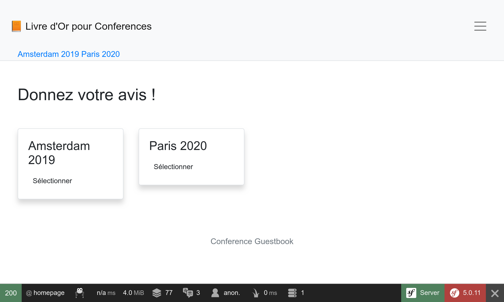

بومی‌سازی یک اپلیکیشن
=========================================

با وجود همراهان بین‌المللی، سیمفونی قادر بوده است که بین‌المللی‌سازی (i18n) و بومی‌سازی (l10n) را مثل همیشه به صورت آماده، فراهم آورد. بومی‌سازی یک اپلیکیشن تنها منحصر به ترجمه‌ی رابط کاربری نیست، علاوه بر این شامل صورت‌های جمع (plurals)، قالب‌بندی تاریخ و واحد پولی، URLها و ... را نیز می‌شود.

بین‌المللی‌سازی URL‌ها
-------------------------------------------

.. index::
    single: Components;Routing
    single: Routing;Locale
    single: Routing;Requirements
    single: Annotations;@Route

اولین گام در بین‌المللی‌سازی وب‌سایت، بین‌المللی‌سازی URLها است. وقتی رابط کاربری یک وب‌سایت را ترجمه می‌کنید، URL باید به ازای هر ناحیه (locale) متفاوت باشد تا با نهان‌سازی‌های HTTP به خوبی کار کند (هرگز از URL یکسان و ذخیره‌ی ناحیه در نشست استفاده نکنید).

از پارامتر راه ویژه‌ی ``_locale`` برای ارجاع به ناحیه‌ی راه‌ها استفاده کنید:

.. code-block:: diff
    :caption: patch_file
    :emphasize-lines: 8

    --- a/src/Controller/ConferenceController.php
    +++ b/src/Controller/ConferenceController.php
    @@ -34,7 +34,7 @@ class ConferenceController extends AbstractController
         }

         /**
    -     * @Route("/", name="homepage")
    +     * @Route("/{_locale}/", name="homepage")
          */
         public function index(ConferenceRepository $conferenceRepository): Response
         {

در حال حاضر در صفحه‌ی اصلی، ناحیه به صورت داخلی و با توجه به URL تنظیم می‌گردد؛ برای مثال اگر ``/fr/`` را وارد کرده باشید، ``$request->getLocale()`` مقدار ``fr`` را بازمی‌گرداند.

از آنجایی که قادر نخواهید بود محتوا را به تمام نواحی معتبر ترجمه کنید، نواحی را تنها به نواحی‌ای که می‌خواهید پشتیبانی کنید، محدود نمایید:

.. code-block:: diff
    :caption: patch_file
    :emphasize-lines: 8

    --- a/src/Controller/ConferenceController.php
    +++ b/src/Controller/ConferenceController.php
    @@ -34,7 +34,7 @@ class ConferenceController extends AbstractController
         }

         /**
    -     * @Route("/{_locale}/", name="homepage")
    +     * @Route("/{_locale<en|fr>}/", name="homepage")
          */
         public function index(ConferenceRepository $conferenceRepository): Response
         {

هر پارامترِ راه می‌تواند از طریق یک regular expression در درون ``<`` ``>`` محدود گردد. حالا راه مربوط به ``homepage``، تنها وقتی که پارامتر ``_locale`` دارای یکی از مقادیر ``en`` یا ``fr`` باشد، تطبیق می‌یابد. سعی کنید ``/es/`` را وارد کنید، شما باید با یک 404 مواجه شوید چرا که هیچ راهی مطابقت پیدا نخواهد کرد.

از آنجایی که شما از همین الزام برای تقریباً تمام راه‌ها استفاده خواهید کرد، بیایید آن را به یک پارامتر کانتینر منتقل کنیم:

.. code-block:: diff
    :caption: patch_file

    --- a/config/services.yaml
    +++ b/config/services.yaml
    @@ -7,6 +7,7 @@ parameters:
         default_admin_email: admin@example.com
         default_domain: '127.0.0.1'
         default_scheme: 'http'
    +    app.supported_locales: 'en|fr'

         router.request_context.host: '%env(default:default_domain:SYMFONY_DEFAULT_ROUTE_HOST)%'
         router.request_context.scheme: '%env(default:default_scheme:SYMFONY_DEFAULT_ROUTE_SCHEME)%'
    --- a/src/Controller/ConferenceController.php
    +++ b/src/Controller/ConferenceController.php
    @@ -34,7 +34,7 @@ class ConferenceController extends AbstractController
         }

         /**
    -     * @Route("/{_locale<en|fr>}/", name="homepage")
    +     * @Route("/{_locale<%app.supported_locales%>}/", name="homepage")
          */
         public function index(ConferenceRepository $conferenceRepository): Response
         {

افزودن یک زبان می‌تواند از طریق به‌روزرسانی پارامتر ``app.supported_languages`` انجام شود.

همین پیشوند راه مخصوص ناحیه را به سایر URLها بیافزایید:

.. code-block:: diff
    :caption: patch_file

    --- a/src/Controller/ConferenceController.php
    +++ b/src/Controller/ConferenceController.php
    @@ -47,7 +47,7 @@ class ConferenceController extends AbstractController
         }

         /**
    -     * @Route("/conference_header", name="conference_header")
    +     * @Route("/{_locale<%app.supported_locales%>}/conference_header", name="conference_header")
          */
         public function conferenceHeader(ConferenceRepository $conferenceRepository): Response
         {
    @@ -60,7 +60,7 @@ class ConferenceController extends AbstractController
         }

         /**
    -     * @Route("/conference/{slug}", name="conference")
    +     * @Route("/{_locale<%app.supported_locales%>}/conference/{slug}", name="conference")
          */
         public function show(Request $request, Conference $conference, CommentRepository $commentRepository, NotifierInterface $notifier, string $photoDir): Response
         {

کار ما تقریباً تمام است. ما دیگر راهی که با ``/`` مطابقت داشته باشد نداریم. بیایید آن را مجدداً اضافه کرده و به ``/en/`` بازهدایت کنیم:

.. code-block:: diff
    :caption: patch_file

    --- a/src/Controller/ConferenceController.php
    +++ b/src/Controller/ConferenceController.php
    @@ -33,6 +33,14 @@ class ConferenceController extends AbstractController
             $this->bus = $bus;
         }

    +    /**
    +     * @Route("/")
    +     */
    +    public function indexNoLocale(): Response
    +    {
    +        return $this->redirectToRoute('homepage', ['_locale' => 'en']);
    +    }
    +
         /**
          * @Route("/{_locale<%app.supported_locales%>}/", name="homepage")
          */

حالا که تمام راه‌ها از ناحیه آگاه هستند، توجه کنید که URLهای تولید شده در صفحات نیز، ناحیه‌ی فعلی را به صورت خودکار در نظر می‌گیرند.

افزودن یک تعویض‌گر ناحیه
----------------------------------------------

.. index::
    single: Twig;path
    single: Twig;Locale

برای اجازه به کاربران برای تعویض ناحیه‌ی پیشفرض ``en`` به ناحیه‌ای دیگر، بیایید یک تعویض‌گر در سربرگ اضافه کنیم:

.. code-block:: diff
    :caption: patch_file

    --- a/templates/base.html.twig
    +++ b/templates/base.html.twig
    @@ -34,6 +34,16 @@
                                         Admin
                                     </a>
                                 </li>
    +<li class="nav-item dropdown">
    +    <a class="nav-link dropdown-toggle" href="#" id="dropdown-language" role="button"
    +        data-toggle="dropdown" aria-haspopup="true" aria-expanded="false">
    +        English
    +    </a>
    +    

    +        <a class="dropdown-item" href="{{ path('homepage', {_locale: 'en'}) }}">English</a>
    +        <a class="dropdown-item" href="{{ path('homepage', {_locale: 'fr'}) }}">Français</a>
    +    

    +</li>
                             </ul>
                         

                     

برای تعویض به ناحیه‌ای دیگر، ما صریحاً پارامتر راه ``_locale`` را به تابع ``path()`` می‌دهیم.

.. index::
    single: Twig;app.request
    single: Twig;locale_name

قالب را به‌روزرسانی کنید تا به جای مقدار «English» که هاردکد شده است، نام ناحیه‌‌ی فعلی را نمایش دهد:

.. code-block:: diff
    :caption: patch_file

    --- a/templates/base.html.twig
    +++ b/templates/base.html.twig
    @@ -37,7 +37,7 @@
     <li class="nav-item dropdown">
         <a class="nav-link dropdown-toggle" href="#" id="dropdown-language" role="button"
             data-toggle="dropdown" aria-haspopup="true" aria-expanded="false">
    -        English
    +        {{ app.request.locale|locale_name(app.request.locale) }}
         </a>
         

             <a class="dropdown-item" href="{{ path('homepage', {_locale: 'en'}) }}">English</a>

``app`` یک متغیر جهانی در Twig است که دسترسی به درخواست فعلی را ارائه می‌کند. برای تبدیل ناحیه به یک رشته‌ی (string) قابل فهم برای انسان، ما می‌خواهیم از یک فیلتر Twig با نام ``locale_name`` استفاده کنیم.

.. index::
    single: Components;String

بسته به ناحیه، نام ناحیه همواره حرف اولش بزرگ نیست. برای اینکه جملات را به صورت صحیح capitalize کنیم، به یک فیلترِ آگاه از Unicode نیاز داریم که کامپوننت رشته‌ی سیمفونی (Symfony String) و پیاده‌سازی آن در Twig از این قابلیت برخوردار هستند:

.. code-block:: bash

    $ symfony composer req twig/string-extra

.. index::
    single: Twig;u.title

.. code-block:: diff
    :caption: patch_file

    --- a/templates/base.html.twig
    +++ b/templates/base.html.twig
    @@ -37,7 +37,7 @@
     <li class="nav-item dropdown">
         <a class="nav-link dropdown-toggle" href="#" id="dropdown-language" role="button"
             data-toggle="dropdown" aria-haspopup="true" aria-expanded="false">
    -        {{ app.request.locale|locale_name(app.request.locale) }}
    +        {{ app.request.locale|locale_name(app.request.locale)|u.title }}
         </a>
         

             <a class="dropdown-item" href="{{ path('homepage', {_locale: 'en'}) }}">English</a>

حالا می‌توانید از طریق تعویض‌گر، ناحیه را از فرانسوی به انگلیسی تغییر دهید و تمام رابط کاربری به زیبایی خود را منطبق می‌کند:

.. figure:: screenshots/intl-switcher.png
    :alt: /fr/conference/amsterdam-2019
    :align: center
    :figclass: with-browser

ترجمه‌ی رابط کاربری
-------------------------------------

.. index::
    single: Components;Translation
    single: Translation
    single: Twig;trans

برای شروع به ترجمه‌ی وب‌سایت، نیاز داریم که کامپوننت ترجمه‌ی سیمفونی (Symfony Translation) را نصب کنیم:

.. code-block:: bash

    $ symfony composer req translation

ترجمه‌ی تک تک جملات یک وب‌سایت بزرگ می‌تواند خسته‌کننده باشد، اما خوشبختانه ما تنها تعداد انگشت شماری پیغام در وب‌سایتمان داریم. بیایید با تمام جملات موجود در صفحه‌ی اصلی شروع کنیم:

.. code-block:: diff
    :caption: patch_file

    --- a/templates/base.html.twig
    +++ b/templates/base.html.twig
    @@ -20,7 +20,7 @@
                 <nav class="navbar navbar-expand-xl navbar-light bg-light">
                     

                         <a class="navbar-brand mr-4 pr-2" href="{{ path('homepage') }}">
    -                        &#128217; Conference Guestbook
    +                        &#128217; {{ 'Conference Guestbook'|trans }}
                         </a>

                         <button class="navbar-toggler border-0" type="button" data-toggle="collapse" data-target="#header-menu" aria-controls="navbarSupportedContent" aria-expanded="false" aria-label="Show/Hide navigation">
    --- a/templates/conference/index.html.twig
    +++ b/templates/conference/index.html.twig
    @@ -4,7 +4,7 @@

     
         <h2 class="mb-5">
    -        Give your feedback!
    +        {{ 'Give your feedback!'|trans }}
         </h2>

         
    @@ -21,7 +21,7 @@

                                 <a href="{{ path('conference', { slug: conference.slug }) }}"
                                    class="btn btn-sm btn-blue stretched-link">
    -                                View
    +                                {{ 'View'|trans }}
                                 </a>
                             

                         

فیلتر ``trans`` در Twig،  برای ورودی داده‌شده، به دنبال ترجمه‌ای منطبق با ناحیه‌ی فعلی می‌گردد. اگر آن را پیدا نکند، به *ناحیه‌ی پیشفرض* که در ``config/packages/translation.yaml`` پیکربندی شده است، برمی‌گردد:

.. code-block:: yaml
    :class: ignore
    :emphasize-lines: 2

    framework:
        default_locale: en
        translator:
            default_path: '%kernel.project_dir%/translations'
            fallbacks:
                - en

توجه کنید که «tab» مربوط به ترجمه در نوارابزار اشکال‌زدایی به رنگ قرمز درآمده است:

.. figure:: screenshots/intl-wdt.png
    :alt: /fr/
    :align: center
    :figclass: with-browser

این به ما می‌گوید که ۳ پیغام هنوز ترجمه نشده‌اند.

بر روی «tab» کلیک کنید تا تمام پیغام‌هایی که سیمفونی نتوانسته ترجمه‌ای برایشان بیابد، لیست شوند:

.. figure:: screenshots/intl-profiler.png
    :alt: /_profiler/64282d?panel=translation
    :align: center
    :figclass: with-browser

فراهم‌کردن ترجمه‌ها
---------------------------------------

همانطور که ممکن است در ``config/packages/translation.yaml`` دیده باشید، ترجمه‌ها در درون پوشه‌ی ریشه‌ی ``translations/`` ذخیره می شوند که به صورت خودکار برای شما ایجاد شده است.

به‌جای ایجاد فایل‌های ترجمه به صورت دستی، از فرمان ``translation:update`` استفاده کنید:

.. code-block:: bash

    $ symfony console translation:update fr --force --domain=messages

این فرمان برای ناحیه‌ی ``fr`` و دامنه‌ی ``messages`` (که تمام پیغام‌ها به جز پیغام‌های هسته‌ای -همچون خطاهای اعتبارسنجی و امنیتی- را شامل می‌شود)، یک فایل ترجمه تولید می‌کند (پرچم ``--force``).

فایل ``translations/messages+intl-icu.fr.xlf`` را وایرایش و پیغام‌ها را به فرانسوی ترجمه کنید. فرانسوی بلد نیستید؟ بگذارید من کمکتان کنم:

.. code-block:: diff
    :caption: patch_file

    --- a/translations/messages+intl-icu.fr.xlf
    +++ b/translations/messages+intl-icu.fr.xlf
    @@ -7,15 +7,15 @@
         <body>
           <trans-unit id="LNAVleg" resname="Give your feedback!">
             <source>Give your feedback!</source>
    -        <target>__Give your feedback!</target>
    +        <target>Donnez votre avis !</target>
           </trans-unit>
           <trans-unit id="3Mg5pAF" resname="View">
             <source>View</source>
    -        <target>__View</target>
    +        <target>Sélectionner</target>
           </trans-unit>
           <trans-unit id="eOy4.6V" resname="Conference Guestbook">
             <source>Conference Guestbook</source>
    -        <target>__Conference Guestbook</target>
    +        <target>Livre d'Or pour Conferences</target>
           </trans-unit>
         </body>
       </file>

توجه کنید که ما تمام قالب‌ها را ترجمه نمی‌کنیم، اما شما آزادید که این کار را انجام دهید:

ترجمه‌ی فرم‌ها
-----------------------------

.. index::
    single: Translation;Form
    single: Form;Translation

برچسب‌های فرم به صورت خودکار توسط سیمفونی و از طریق سیستم ترجمه، نمایش داده می‌شوند. به صفحه‌ی کنفرانس بروید و بر روی tab مربوط به «Translation» که در نوارابزار اشکال‌زدایی وب قرار دارد، کلیک کنید؛ شما باید تمام پیغام‌های آماده برای ترجمه را ببینید:

.. figure:: screenshots/intl-form-profiler.png
    :alt: /_profiler/64282d?panel=translation
    :align: center
    :figclass: with-browser

بومی‌سازی تاریخ‌ها
-------------------------------------

.. index::
    single: Localization
    single: Twig;format_datetime
    single: Twig;format_time
    single: Twig;format_date
    single: Twig;format_currency
    single: Twig;format_number

اگر شما ناحیه را به فرانسوی تعویض نمایید و به صفحه‌ی کنفرانسی بروید که تعدادی کامنت دارد، متوجه خواهید شد که تاریخ کامنت‌ها به طور خودکار بومی‌سازی شده است. این موضوع به این علت کار می‌کند که ما از فیلتر ``format_datetime`` در Twig که ناحیه‌آگاه (locale-aware) است،  استفاده کردیم (``{{ comment.createdAt|format_datetime('medium', 'short') }}``).

بومی‌سازی برای تاریخ‌ها، زمان‌ها (``format_time``)، واحدهای پولی (``format_currency``) و  در اعداد (``format_number``) به صورت عمومی (درصد‌ها، مدت‌زمان‌ها، صورت هجی‌شده‌ی اعداد و ...) کار می‌کند.

ترجمه‌ی صورت‌های جمع
----------------------------------------

.. index::
    single: Translation;Plurals
    single: Translation;Conditions

مدیریت صورت‌های جمع در ترجمه، یک کاربرد خاص از مسئله‌ی عمومی‌تر انتخاب یک ترجمه براساس شرایط ویژه است.

در یک صفحه‌ی کنفرانس، ما تعداد کامنت‌ها را نمایش می‌دهیم: ``There are 2 comments``. برای ۱ کامنت، ما ``There are 1 comments`` را نمایش می‌دهیم که غلط است. برای تبدیل جمله به یک پیغام قابل ترجمه، قالب را اصلاح کنید:

.. code-block:: diff
    :caption: patch_file

    --- a/templates/conference/show.html.twig
    +++ b/templates/conference/show.html.twig
    @@ -44,7 +44,7 @@
                             

                         

                     
    -                
There are {{ comments|length }} comments.

    +                
{{ 'nb_of_comments'|trans({count: comments|length}) }}

                     
                         <a href="{{ path('conference', { slug: conference.slug, offset: previous }) }}">Previous</a>
                     

برای این پیغام، ما از یک راهبرد ترجمه‌ی دیگر استفاده کرده‌ایم. به جای نگهداری نسخه‌ی انگلیسی در قالب، ما آن را با یک شناسه‌ی منحصربه‌فرد جایگزین کرده‌ایم. این راهبرد برای متن‌های پیچیده و بزرگ، بهتر کار می‌کند.

فایل ترجمه را با افزودن پیغام جدید به‌روزرسانی کنید:

.. code-block:: diff
    :caption: patch_file

    --- a/translations/messages+intl-icu.fr.xlf
    +++ b/translations/messages+intl-icu.fr.xlf
    @@ -17,6 +17,10 @@
             <source>Conference Guestbook</source>
             <target>Livre d'Or pour Conferences</target>
           </trans-unit>
    +      <trans-unit id="Dg2dPd6" resname="nb_of_comments">
    +        <source>nb_of_comments</source>
    +        <target>{count, plural, =0 {Aucun commentaire.} =1 {1 commentaire.} other {# commentaires.}}</target>
    +      </trans-unit>
         </body>
       </file>
     </xliff>

از آنجایی که نیاز داریم ترجمه‌ی انگلیسی را فراهم کنیم، پس هنوز کار ما تمام نشده‌ است. فایل ``translations/messages+intl-icu.en.xlf`` را ایجاد کنید:

.. code-block:: xml
    :caption: translations/messages+intl-icu.en.xlf
    :emphasize-lines: 10

    <?xml version="1.0" encoding="utf-8"?>
    <xliff xmlns="urn:oasis:names:tc:xliff:document:1.2" version="1.2">
      <file source-language="en" target-language="en" datatype="plaintext" original="file.ext">
        <header>
          <tool tool-id="symfony" tool-name="Symfony"/>
        </header>
        <body>
          <trans-unit id="maMQz7W" resname="nb_of_comments">
            <source>nb_of_comments</source>
            <target>{count, plural, =0 {There are no comments.} one {There is one comment.} other {There are # comments.}}</target>
          </trans-unit>
        </body>
      </file>
    </xliff>

به‌روزرسانی آزمون‌های کارکردی
----------------------------------------------------------

به‌روزرسانی آزمون‌های کارکردی برای هماهنگی با تغییرات ایجاد‌شده در URLها و محتوا را فراموش نکنید:

.. code-block:: diff
    :caption: patch_file

    --- a/tests/Controller/ConferenceControllerTest.php
    +++ b/tests/Controller/ConferenceControllerTest.php
    @@ -11,7 +11,7 @@ class ConferenceControllerTest extends WebTestCase
         public function testIndex()
         {
             $client = static::createClient();
    -        $client->request('GET', '/');
    +        $client->request('GET', '/en/');

             $this->assertResponseIsSuccessful();
             $this->assertSelectorTextContains('h2', 'Give your feedback');
    @@ -20,7 +20,7 @@ class ConferenceControllerTest extends WebTestCase
         public function testCommentSubmission()
         {
             $client = static::createClient();
    -        $client->request('GET', '/conference/amsterdam-2019');
    +        $client->request('GET', '/en/conference/amsterdam-2019');
             $client->submitForm('Submit', [
                 'comment_form[author]' => 'Fabien',
                 'comment_form[text]' => 'Some feedback from an automated functional test',
    @@ -41,7 +41,7 @@ class ConferenceControllerTest extends WebTestCase
         public function testConferencePage()
         {
             $client = static::createClient();
    -        $crawler = $client->request('GET', '/');
    +        $crawler = $client->request('GET', '/en/');

             $this->assertCount(2, $crawler->filter('h4'));

    @@ -50,6 +50,6 @@ class ConferenceControllerTest extends WebTestCase
             $this->assertPageTitleContains('Amsterdam');
             $this->assertResponseIsSuccessful();
             $this->assertSelectorTextContains('h2', 'Amsterdam 2019');
    -        $this->assertSelectorExists('div:contains("There are 1 comments")');
    +        $this->assertSelectorExists('div:contains("There is one comment")');
         }
     }

.. sidebar:: بیشتر بدانید

    * `ترجمه‌ی پیغام‌ها با استفاده از ICU formatter <https://symfony.com/doc/current/translation/message_format.html>`_؛

    * `استفاده از فیلترهای ترجمه‌ی Twig <https://symfony.com/doc/current/translation/templates.html#translation-filters>`_.
