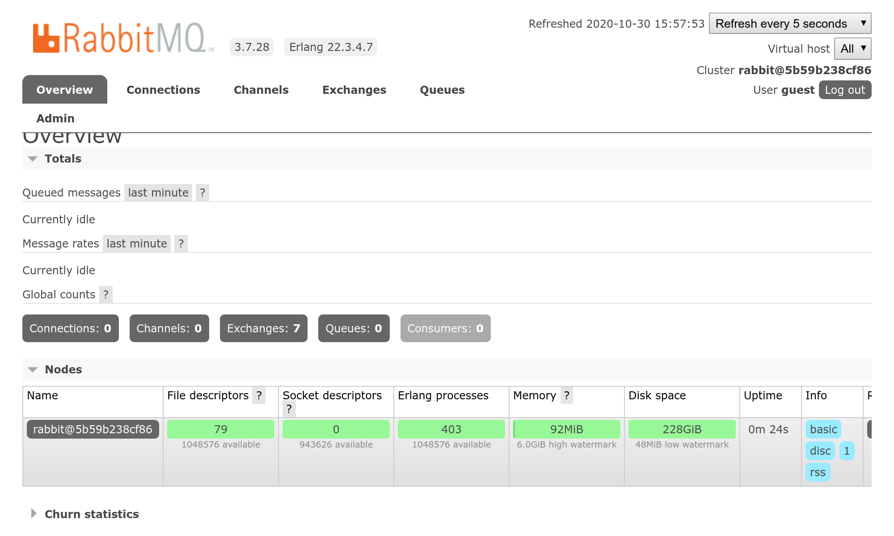

Faire de l'asynchrone
=====================

.. index::
    single: Async

Vérifier la présence de spam pendant le traitement de la soumission du formulaire peut entraîner certains problèmes. Si l'API d'Akismet devient lente, notre site web sera également lent pour les internautes. Mais pire encore, si nous atteignons le délai d'attente maximal ou si l'API d'Akismet n'est pas disponible, nous pourrions perdre des commentaires.

Idéalement, nous devrions stocker les données soumises, sans les publier, et renvoyer une réponse immédiatement. La vérification du spam pourra être faite par la suite.

Marquer les commentaires
------------------------

.. index::
    single: Command;make:entity

Nous avons besoin d'introduire un état (``state``) pour les commentaires : ``submitted``, ``spam`` et ``published``.

Ajoutez la propriété ``state`` à la classe ``Comment`` :

.. code-block:: bash
    :class: answers(state||string||255||no)

    $ symfony console make:entity Comment

.. index::
    single: Command;make:migration

Créez une migration de base de données :

.. code-block:: bash

    $ symfony console make:migration

Modifiez la migration pour mettre à jour tous les commentaires existants comme étant ``published`` par défaut :

.. code-block:: diff
    :caption: patch_file

    --- a/migrations/Version00000000000000.php
    +++ b/migrations/Version00000000000000.php
    @@ -20,7 +20,9 @@ final class Version20200714155905 extends AbstractMigration
         public function up(Schema $schema) : void
         {
             // this up() migration is auto-generated, please modify it to your needs
    -        $this->addSql('ALTER TABLE comment ADD state VARCHAR(255) NOT NULL');
    +        $this->addSql('ALTER TABLE comment ADD state VARCHAR(255)');
    +        $this->addSql("UPDATE comment SET state='published'");
    +        $this->addSql('ALTER TABLE comment ALTER COLUMN state SET NOT NULL');
         }

         public function down(Schema $schema) : void

.. index::
    single: Command;doctrine:migrations:migrate

Migrez la base de données :

.. code-block:: bash
    :class: answers(y)

    $ symfony console doctrine:migrations:migrate

.. index::
    single: Annotations;@ORM\\Column

Nous devrions également nous assurer que, par défaut, le paramètre ``state`` est initialisé avec la valeur ``submitted`` :

.. code-block:: diff
    :caption: patch_file

    --- a/src/Entity/Comment.php
    +++ b/src/Entity/Comment.php
    @@ -55,9 +55,9 @@ class Comment
         private $photoFilename;

         /**
    -     * @ORM\Column(type="string", length=255)
    +     * @ORM\Column(type="string", length=255, options={"default": "submitted"})
          */
    -    private $state;
    +    private $state = 'submitted';

         public function __toString(): string
         {

Modifiez la configuration d'EasyAdmin pour voir l'état du commentaire :

.. code-block:: diff
    :caption: patch_file

    --- a/config/packages/easy_admin.yaml
    +++ b/config/packages/easy_admin.yaml
    @@ -18,6 +18,7 @@ easy_admin:
                         - author
                         - { property: 'email', type: 'email' }
                         - { property: 'photoFilename', type: 'image', 'base_path': "/uploads/photos", label: 'Photo' }
    +                    - state
                         - { property: 'createdAt', type: 'datetime' }
                     sort: ['createdAt', 'ASC']
                     filters: ['conference']
    @@ -26,5 +27,6 @@ easy_admin:
                         - { property: 'conference' }
                         - { property: 'createdAt', type: datetime, type_options: { disabled: true } }
                         - 'author'
    +                    - { property: 'state' }
                         - { property: 'email', type: 'email' }
                         - text

N'oubliez pas de modifier les tests en renseignant le ``state`` dans les fixtures :

.. code-block:: diff
    :caption: patch_file

    --- a/src/DataFixtures/AppFixtures.php
    +++ b/src/DataFixtures/AppFixtures.php
    @@ -37,8 +37,16 @@ class AppFixtures extends Fixture
             $comment1->setAuthor('Fabien');
             $comment1->setEmail('fabien@example.com');
             $comment1->setText('This was a great conference.');
    +        $comment1->setState('published');
             $manager->persist($comment1);

    +        $comment2 = new Comment();
    +        $comment2->setConference($amsterdam);
    +        $comment2->setAuthor('Lucas');
    +        $comment2->setEmail('lucas@example.com');
    +        $comment2->setText('I think this one is going to be moderated.');
    +        $manager->persist($comment2);
    +
             $admin = new Admin();
             $admin->setRoles(['ROLE_ADMIN']);
             $admin->setUsername('admin');

.. index::
    single: Test;Container
    single: Container;Test

Pour les tests du contrôleur, simulez la validation :

.. code-block:: diff
    :caption: patch_file

    --- a/tests/Controller/ConferenceControllerTest.php
    +++ b/tests/Controller/ConferenceControllerTest.php
    @@ -2,6 +2,8 @@

     namespace App\Tests\Controller;

    +use App\Repository\CommentRepository;
    +use Doctrine\ORM\EntityManagerInterface;
     use Symfony\Bundle\FrameworkBundle\Test\WebTestCase;

     class ConferenceControllerTest extends WebTestCase
    @@ -22,10 +24,16 @@ class ConferenceControllerTest extends WebTestCase
             $client->submitForm('Submit', [
                 'comment_form[author]' => 'Fabien',
                 'comment_form[text]' => 'Some feedback from an automated functional test',
    -            'comment_form[email]' => 'me@automat.ed',
    +            'comment_form[email]' => $email = 'me@automat.ed',
                 'comment_form[photo]' => dirname(__DIR__, 2).'/public/images/under-construction.gif',
             ]);
             $this->assertResponseRedirects();
    +
    +        // simulate comment validation
    +        $comment = self::$container->get(CommentRepository::class)->findOneByEmail($email);
    +        $comment->setState('published');
    +        self::$container->get(EntityManagerInterface::class)->flush();
    +
             $client->followRedirect();
             $this->assertSelectorExists('div:contains("There are 2 comments")');
         }

À partir d'un test PHPUnit, vous pouvez obtenir n'importe quel service depuis le conteneur grâce à ``self::$container->get()`` ; il donne également accès aux services non publics.

Comprendre Messenger
--------------------

.. index::
    single: Messenger
    single: Components;Messenger

La gestion du code asynchrone avec Symfony est faite par le composant Messenger :

.. code-block:: bash

    $ symfony composer req messenger

Lorsqu'une action doit être exécutée de manière asynchrone, envoyez un *message* à un *messenger bus*. Le bus stocke le message dans une *file d'attente* et rend immédiatement la main pour permettre au flux des opérations de reprendre aussi vite que possible.

Un *consumer* s'exécute continuellement en arrière-plan pour lire les nouveaux messages dans la file d'attente et exécuter la logique associée. Le consumer peut s'exécuter sur le même serveur que l'application web, ou sur un serveur séparé.

C'est très similaire à la façon dont les requêtes HTTP sont traitées, sauf que nous n'avons pas de réponse.

Coder un gestionnaire de messages
---------------------------------

Un message est une classe de données (*data object*), qui ne doit contenir aucune logique. Il sera sérialisé pour être stocké dans une file d'attente, donc ne stockez que des données "simples" et sérialisables.

Créez la classe ``CommentMessage`` :

.. code-block:: php
    :caption: src/Message/CommentMessage.php

    namespace App\Message;

    class CommentMessage
    {
        private $id;
        private $context;

        public function __construct(int $id, array $context = [])
        {
            $this->id = $id;
            $this->context = $context;
        }

        public function getId(): int
        {
            return $this->id;
        }

        public function getContext(): array
        {
            return $this->context;
        }
    }

Dans le monde de Messenger, nous n'avons pas de contrôleurs, mais des gestionnaires de messages.

Sous un nouveau namespace ``App\MessageHandler``, créez une classe ``CommentMessageHandler`` qui saura comment gérer les messages ``CommentMessage`` :

.. code-block:: php
    :caption: src/MessageHandler/CommentMessageHandler.php

    namespace App\MessageHandler;

    use App\Message\CommentMessage;
    use App\Repository\CommentRepository;
    use App\SpamChecker;
    use Doctrine\ORM\EntityManagerInterface;
    use Symfony\Component\Messenger\Handler\MessageHandlerInterface;

    class CommentMessageHandler implements MessageHandlerInterface
    {
        private $spamChecker;
        private $entityManager;
        private $commentRepository;

        public function __construct(EntityManagerInterface $entityManager, SpamChecker $spamChecker, CommentRepository $commentRepository)
        {
            $this->entityManager = $entityManager;
            $this->spamChecker = $spamChecker;
            $this->commentRepository = $commentRepository;
        }

        public function __invoke(CommentMessage $message)
        {
            $comment = $this->commentRepository->find($message->getId());
            if (!$comment) {
                return;
            }

            if (2 === $this->spamChecker->getSpamScore($comment, $message->getContext())) {
                $comment->setState('spam');
            } else {
                $comment->setState('published');
            }

            $this->entityManager->flush();
        }
    }

``MessageHandlerInterface`` est une interface de *marqueur*. Elle aide seulement Symfony à enregistrer et à configurer automatiquement la classe en tant que gestionnaire Messenger. Par convention, la logique d'un gestionnaire réside dans une méthode appelée ``__invoke()``. Le type ``CommentMessage`` précisé en tant qu'argument unique de cette méthode indique à Messenger quelle classe elle va gérer.

Modifiez le contrôleur pour utiliser le nouveau système :

.. code-block:: diff
    :caption: patch_file

    --- a/src/Controller/ConferenceController.php
    +++ b/src/Controller/ConferenceController.php
    @@ -5,14 +5,15 @@ namespace App\Controller;
     use App\Entity\Comment;
     use App\Entity\Conference;
     use App\Form\CommentFormType;
    +use App\Message\CommentMessage;
     use App\Repository\CommentRepository;
     use App\Repository\ConferenceRepository;
    -use App\SpamChecker;
     use Doctrine\ORM\EntityManagerInterface;
     use Symfony\Bundle\FrameworkBundle\Controller\AbstractController;
     use Symfony\Component\HttpFoundation\File\Exception\FileException;
     use Symfony\Component\HttpFoundation\Request;
     use Symfony\Component\HttpFoundation\Response;
    +use Symfony\Component\Messenger\MessageBusInterface;
     use Symfony\Component\Routing\Annotation\Route;
     use Twig\Environment;

    @@ -20,11 +21,13 @@ class ConferenceController extends AbstractController
     {
         private $twig;
         private $entityManager;
    +    private $bus;

    -    public function __construct(Environment $twig, EntityManagerInterface $entityManager)
    +    public function __construct(Environment $twig, EntityManagerInterface $entityManager, MessageBusInterface $bus)
         {
             $this->twig = $twig;
             $this->entityManager = $entityManager;
    +        $this->bus = $bus;
         }

         /**
    @@ -40,7 +43,7 @@ class ConferenceController extends AbstractController
         /**
          * @Route("/conference/{slug}", name="conference")
          */
    -    public function show(Request $request, Conference $conference, CommentRepository $commentRepository, SpamChecker $spamChecker, string $photoDir): Response
    +    public function show(Request $request, Conference $conference, CommentRepository $commentRepository, string $photoDir): Response
         {
             $comment = new Comment();
             $form = $this->createForm(CommentFormType::class, $comment);
    @@ -58,6 +61,7 @@ class ConferenceController extends AbstractController
                 }

                 $this->entityManager->persist($comment);
    +            $this->entityManager->flush();

                 $context = [
                     'user_ip' => $request->getClientIp(),
    @@ -65,11 +69,8 @@ class ConferenceController extends AbstractController
                     'referrer' => $request->headers->get('referer'),
                     'permalink' => $request->getUri(),
                 ];
    -            if (2 === $spamChecker->getSpamScore($comment, $context)) {
    -                throw new \RuntimeException('Blatant spam, go away!');
    -            }

    -            $this->entityManager->flush();
    +            $this->bus->dispatch(new CommentMessage($comment->getId(), $context));

                 return $this->redirectToRoute('conference', ['slug' => $conference->getSlug()]);
             }

Au lieu de dépendre du SpamChecker, nous envoyons maintenant un message dans le bus. Le gestionnaire décide alors ce qu'il en fait.

Nous avons fait quelque chose que nous n'avions pas prévu. Nous avons découplé notre contrôleur du vérificateur de spam, et déplacé la logique vers une nouvelle classe, le gestionnaire. C'est un cas d'utilisation parfait pour le bus. Testez le code, il fonctionne. Tout se fait encore de manière synchrone, mais le code est probablement déjà "mieux".

Filtrer les commentaires affichés
----------------------------------

Modifiez la logique d'affichage pour éviter que des commentaires non publiés n'apparaissent sur le site :

.. code-block:: diff
    :caption: patch_file

    --- a/src/Repository/CommentRepository.php
    +++ b/src/Repository/CommentRepository.php
    @@ -27,7 +27,9 @@ class CommentRepository extends ServiceEntityRepository
         {
             $query = $this->createQueryBuilder('c')
                 ->andWhere('c.conference = :conference')
    +            ->andWhere('c.state = :state')
                 ->setParameter('conference', $conference)
    +            ->setParameter('state', 'published')
                 ->orderBy('c.createdAt', 'DESC')
                 ->setMaxResults(self::PAGINATOR_PER_PAGE)
                 ->setFirstResult($offset)

Faire vraiment de l'asynchrone
------------------------------

.. index::
    single: RabbitMQ

Par défaut, les gestionnaires sont appelés de manière synchrone. Pour les rendre asynchrone, vous devez configurer explicitement la file d'attente à utiliser pour chaque gestionnaire dans le fichier de configuration ``config/packages/messenger.yaml`` :

.. code-block:: diff
    :caption: patch_file

    --- a/config/packages/messenger.yaml
    +++ b/config/packages/messenger.yaml
    @@ -5,10 +5,10 @@ framework:

             transports:
                 # https://symfony.com/doc/current/messenger.html#transport-configuration
    -            # async: '%env(MESSENGER_TRANSPORT_DSN)%'
    +            async: '%env(RABBITMQ_DSN)%'
                 # failed: 'doctrine://default?queue_name=failed'
                 # sync: 'sync://'

             routing:
                 # Route your messages to the transports
    -            # 'App\Message\YourMessage': async
    +            App\Message\CommentMessage: async

La configuration indique au bus d'envoyer les instances de ``App\Message\CommentMessage`` à la file d'attente ``async``, qui est définie par un DSN stocké dans la variable d'environnement ``RABBITMQ_DSN``.

Adding RabbitMQ to the Docker Stack
-----------------------------------

.. index::
    single: Docker;RabbitMQ

As you might have guessed, we are going to use RabbitMQ:

.. code-block:: diff
    :caption: patch_file

    --- a/docker-compose.yaml
    +++ b/docker-compose.yaml
    @@ -12,3 +12,7 @@ services:
         redis:
             image: redis:5-alpine
             ports: [6379]
    +
    +    rabbitmq:
    +        image: rabbitmq:3.7-management
    +        ports: [5672, 15672]

Restarting Docker Services
--------------------------

To force Docker Compose to take the RabbitMQ container into account, stop the containers and restart them:

.. code-block:: bash

    $ docker-compose stop
    $ docker-compose up -d

.. code-block:: bash
    :class: hide

    $ sleep 10

.. index::
    single: Database;Dump
    single: Symfony CLI;run pg_dump
    single: Symfony CLI;run psql

.. sidebar:: Sauvegarder et restaurer la base de données

    Never call ``docker-compose down`` if you don't want to lose data. Or backup first. Use ``pg_dump`` to dump the database data:

    .. code-block:: bash
        :class: ignore

        $ symfony run pg_dump --data-only > dump.sql

    And restore the data:

    .. code-block:: bash
        :class: ignore

        $ symfony run psql < dump.sql

Consommer des messages
----------------------

Si vous essayez de soumettre un nouveau commentaire, le vérificateur de spam ne sera plus appelé. Ajoutez un appel à la fonction ``error_log()`` dans la méthode ``getSpamScore()`` pour le confirmer. Au lieu d'avoir un nouveau commentaire, un message est en attente dans RabbitMQ, prêt à être consommé par d'autres processus.

.. index::
    single: Command;messenger:consume

Comme vous pouvez l'imaginer, Symfony est livré avec une commande pour consommer les messages. Exécutez-la maintenant :

.. code-block:: bash
    :class: ignore

    $ symfony console messenger:consume async -vv

Cette commande devrait immédiatement consommer le message envoyé pour le commentaire soumis :

.. code-block:: text
    :class: ignore

     [OK] Consuming messages from transports "async".

     // The worker will automatically exit once it has received a stop signal via the messenger:stop-workers command.

     // Quit the worker with CONTROL-C.

    11:30:20 INFO      [messenger] Received message App\Message\CommentMessage ["message" => App\Message\CommentMessage^ { …},"class" => "App\Message\CommentMessage"]
    11:30:20 INFO      [http_client] Request: "POST https://80cea32be1f6.rest.akismet.com/1.1/comment-check"
    11:30:20 INFO      [http_client] Response: "200 https://80cea32be1f6.rest.akismet.com/1.1/comment-check"
    11:30:20 INFO      [messenger] Message App\Message\CommentMessage handled by App\MessageHandler\CommentMessageHandler::__invoke ["message" => App\Message\CommentMessage^ { …},"class" => "App\Message\CommentMessage","handler" => "App\MessageHandler\CommentMessageHandler::__invoke"]
    11:30:20 INFO      [messenger] App\Message\CommentMessage was handled successfully (acknowledging to transport). ["message" => App\Message\CommentMessage^ { …},"class" => "App\Message\CommentMessage"]

L'activité du consumer de messages est enregistrée dans les logs, mais vous pouvez avoir un affichage instantané dans la console en passant l'option ``-vv``. Vous devriez même voir l'appel vers l'API d'Akismet.

Pour arrêter le consumer, appuyez sur ``Ctrl+C``.

Exploring the RabbitMQ Web Management Interface
-----------------------------------------------

.. index::
    single: Symfony CLI;open:local:rabbitmq

If you want to see queues and messages flowing through RabbitMQ, open its web management interface:

.. code-block:: bash
    :class: ignore

    $ symfony open:local:rabbitmq

Or from the web debug toolbar:

.. figure:: screenshots/rabbitmq-wdt.png
    :alt: /
    :align: center
    :figclass: with-browser

Use ``guest``/``guest`` to login to the RabbitMQ management UI:

Lancer des *workers* en arrière-plan
-------------------------------------

Au lieu de lancer le consumer à chaque fois que nous publions un commentaire et de l'arrêter immédiatement après, nous voulons l'exécuter en continu sans avoir trop de fenêtres ou d'onglets du terminal ouverts.

La commande ``symfony`` peut gérer des commandes en tâche de fond ou des workers en utilisant l'option daemon (``-d``) sur la commande ``run``.

.. index::
    single: Command;messenger:consume
    single: Symfony CLI;run -d --watch

Exécutez à nouveau le consumer du message, mais en tâche de fond :

.. code-block:: bash

    $ symfony run -d --watch=config,src,templates,vendor symfony console messenger:consume async

L'option ``--watch`` indique à Symfony que la commande doit être redémarrée chaque fois qu'il y a un changement dans un des fichiers des répertoires ``config/``, ``vendor/``, ``src/`` ou ``templates/``.

.. note::

    N'utilisez pas ``-vv`` pour éviter les doublons dans ``server:log`` (messages enregistrés et messages de la console).

Si le consumer cesse de fonctionner pour une raison quelconque (limite de mémoire, bogue, etc.), il sera redémarré automatiquement. Et s'il tombe en panne trop rapidement, la commande ``symfony`` s'arrêtera.

.. index::
    single: Symfony CLI;server:log

Les logs sont diffusés en continu par la commande ``symfony server:log``, en même temps que ceux de PHP, du serveur web et de l'application :

.. code-block:: bash
    :class: ignore

    $ symfony server:log

.. index::
    single: Command;messenger:consume
    single: Symfony CLI;server:status

Utilisez la commande ``server:status`` pour lister tous les workers en arrière-plan gérés pour le projet en cours :

.. code-block:: bash
    :class: ignore

    $ symfony server:status

    Web server listening on https://127.0.0.1:8000
      Command symfony console messenger:consume async running with PID 15774 (watching config/, src/, templates/)

Pour arrêter un worker, arrêtez le serveur web ou tuez le PID (identifiant du processus) donné par la commande ``server:status`` :

.. code-block:: bash
    :class: ignore

    $ kill 15774

Renvoyer des messages ayant échoué
------------------------------------

Que faire si Akismet est en panne alors qu'un message est en train d'être consommé ? Il n'y a aucun impact pour les personnes qui soumettent des commentaires, mais le message est perdu et le spam n'est pas vérifié.

Messenger dispose d'un mécanisme de relance lorsqu'une exception se produit lors du traitement d'un message. Configurons-le :

.. code-block:: diff
    :caption: patch_file

    --- a/config/packages/messenger.yaml
    +++ b/config/packages/messenger.yaml
    @@ -5,10 +5,17 @@ framework:

             transports:
                 # https://symfony.com/doc/current/messenger.html#transport-configuration
    -            async: '%env(RABBITMQ_DSN)%'
    -            # failed: 'doctrine://default?queue_name=failed'
    +            async:
    +                dsn: '%env(RABBITMQ_DSN)%'
    +                retry_strategy:
    +                    max_retries: 3
    +                    multiplier: 2
    +
    +            failed: 'doctrine://default?queue_name=failed'
                 # sync: 'sync://'

    +        failure_transport: failed
    +
             routing:
                 # Route your messages to the transports
                 App\Message\CommentMessage: async

.. index::
    single: Command;messenger:failed:show
    single: Command;messenger:failed:retry

Si un problème survient lors de la manipulation d'un message, le consumer réessaiera 3 fois avant d'abandonner. Mais au lieu de jeter le message, il le stockera dans une mémoire plus permanente, la file d'attente ``failed``, qui utilise la base de données Doctrine.

Inspectez les messages ayant échoué et relancez-les à l'aide des commandes suivantes :

.. code-block:: bash
    :class: ignore

    $ symfony console messenger:failed:show

    $ symfony console messenger:failed:retry

Deploying RabbitMQ
------------------

.. index::
    single: SymfonyCloud;RabbitMQ
    single: RabbitMQ

Adding RabbitMQ to the production servers can be done by adding it to the list of services:

.. code-block:: diff
    :caption: patch_file

    --- a/.symfony/services.yaml
    +++ b/.symfony/services.yaml
    @@ -5,3 +5,8 @@ db:

     rediscache:
         type: redis:5.0
    +
    +queue:
    +    type: rabbitmq:3.7
    +    disk: 1024
    +    size: S

Reference it in the web container configuration as well and enable the ``amqp`` PHP extension:

.. code-block:: diff
    :caption: patch_file

    --- a/.symfony.cloud.yaml
    +++ b/.symfony.cloud.yaml
    @@ -4,6 +4,7 @@ type: php:7.4

     runtime:
         extensions:
    +        - amqp
             - redis
             - pdo_pgsql
             - apcu
    @@ -26,6 +27,7 @@ disk: 512
     relationships:
         database: "db:postgresql"
         redis: "rediscache:redis"
    +    rabbitmq: "queue:rabbitmq"

     web:
         locations:

.. index::
    single: SymfonyCloud;Tunnel
    single: Symfony CLI;tunnel:open
    single: Symfony CLI;tunnel:close
    single: Symfony CLI;open:remote:rabbitmq

When the RabbitMQ service is installed on a project, you can access its web management interface by opening the tunnel first:

.. code-block:: bash
    :class: ignore

    $ symfony tunnel:open
    $ symfony open:remote:rabbitmq

    # when done
    $ symfony tunnel:close

Exécuter des workers sur SymfonyCloud
--------------------------------------

.. index::
    single: SymfonyCloud;Workers
    single: Workers

Pour consommer les messages de RabbitMQ, nous devons exécuter la commande ``messenger:consume`` en continu. Sur SymfonyCloud, c'est le rôle d'un *worker* :

.. code-block:: diff
    :caption: patch_file

    --- a/.symfony.cloud.yaml
    +++ b/.symfony.cloud.yaml
    @@ -54,3 +54,8 @@ hooks:
             set -x -e

             (>&2 symfony-deploy)
    +
    +workers:
    +    messages:
    +        commands:
    +            start: symfony console messenger:consume async -vv --time-limit=3600 --memory-limit=128M

Comme pour la commande ``symfony``, SymfonyCloud gère les redémarrages et les logs.

.. index::
    single: Symfony CLI;logs

Pour obtenir les logs d'un worker, utilisez :

.. code-block:: bash
    :class: ignore

    $ symfony logs --worker=messages all

.. sidebar:: Aller plus loin

    * `Tutoriel SymfonyCasts sur Messenger <https://symfonycasts.com/screencast/messenger>`_ ;

    * L'architecture de l'`Enterprise service bus <https://fr.wikipedia.org/wiki/Enterprise_service_bus>`_ et le `modèle CQRS <https://martinfowler.com/bliki/CQRS.html>`_ ;

    * La `documentation de Symfony Messenger <https://symfony.com/doc/current/messenger.html>`_ ;

    * `RabbitMQ docs <https://www.rabbitmq.com/documentation.html>`_.
