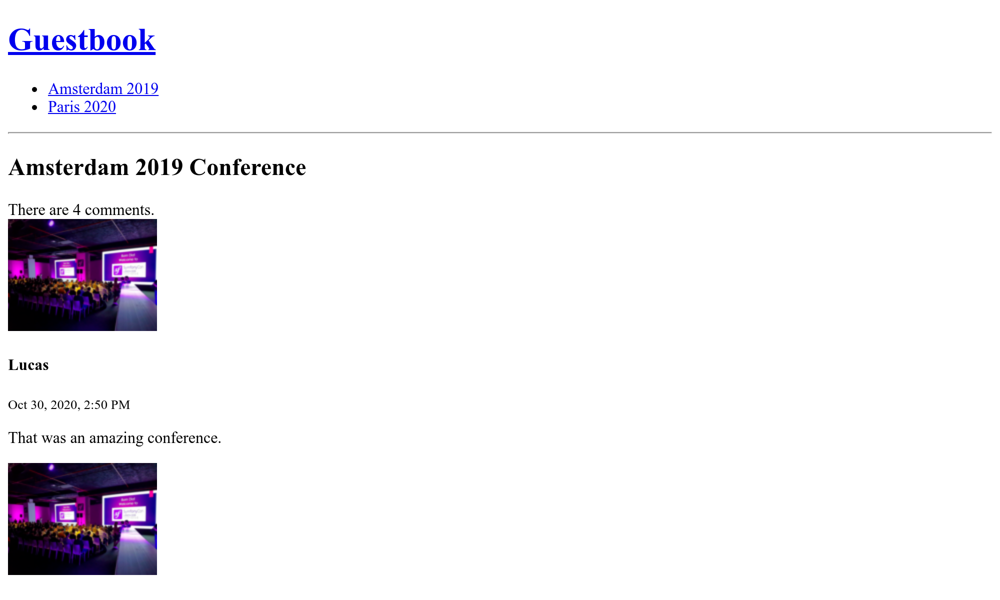

Doctrine オブジェクトのライフサイクルを管理する
==================================================================

新しくコメントをした際には、自動的に現在の日時が ``createdAt`` としてセットされると良いですね。

Doctrine は、データベースに追加されるときや更新されるときといったライフサイクルにおいてオブジェクトやプロパティを操作するいろいろな方法があります。

ライフサイクルのコールバックを定義する
---------------------------------------------------------

.. index::
    single: Doctrine;Lifecycle
    single: Annotations;@ORM\\Entity
    single: Annotations;@ORM\\HasLifecycleCallbacks
    single: Annotations;@ORM\\PrePersist

サービスの依存が必要なく、エンティティを1つしか操作しないときは、エンティティクラスにコールバックを定義すると良いでしょう:

.. code-block:: diff
    :caption: patch_file

    --- a/src/Entity/Comment.php
    +++ b/src/Entity/Comment.php
    @@ -7,6 +7,7 @@ use Doctrine\ORM\Mapping as ORM;

     /**
      * @ORM\Entity(repositoryClass=CommentRepository::class)
    + * @ORM\HasLifecycleCallbacks()
      */
     class Comment
     {
    @@ -106,6 +107,14 @@ class Comment
             return $this;
         }

    +    /**
    +     * @ORM\PrePersist
    +     */
    +    public function setCreatedAtValue()
    +    {
    +        $this->createdAt = new \DateTime();
    +    }
    +
         public function getConference(): ?Conference
         {
             return $this->conference;

``@ORM\PrePersist`` は、最初にデータベースに保存されたときにトリガーとして呼ばれる *イベント* です。このイベントの際に ``setCreatedAtValue()`` メソッドが呼ばれ、現在の日時が ``createdAt`` プロパティにセットされます。

カンファンレンスへスラッグを追加する
------------------------------------------------------

``/conference/1`` といったカンファレンスの URL は特に意味はありません。これはデータベースのプライマリーキーといった実装の詳細に依るものになっています。

代わりに ``/conference/paris-2020`` といった URL はどうですか？こちらの方が良いですね。 ``paris-2020`` はカンファレンスの *スラッグ* と呼んでいます。

.. index::
    single: Command;make:entity

カンファレンスに ``slug`` プロパティを追加しましょう （ 255文字の長さで nullable でない型です）:

.. code-block:: bash
    :class: answers(slug||string||255||no)

    $ symfony console make:entity Conference

.. index::
    single: Command;make:migration

新しいカラムを追加するのでマイグレーションファイルを作成しましょう:

.. code-block:: bash

    $ symfony console make:migration

.. index::
    single: Command;doctrine:migrations:migrate

新しいマイグレーションを実行します:

.. code-block:: bash
    :class: ignore

    $ symfony console doctrine:migrations:migrate

エラーになりましたが、想定内のことです。先程スラッグは ``null`` にならないように指定したのですが、マイグレーションを走らせると既存のカンファレンスのエンティティは ``null`` となってしまうからです。修正してみましょう:

.. code-block:: diff
    :caption: patch_file

    --- a/migrations/Version00000000000000.php
    +++ b/migrations/Version00000000000000.php
    @@ -20,7 +20,9 @@ final class Version20200714152808 extends AbstractMigration
         public function up(Schema $schema) : void
         {
             // this up() migration is auto-generated, please modify it to your needs
    -        $this->addSql('ALTER TABLE conference ADD slug VARCHAR(255) NOT NULL');
    +        $this->addSql('ALTER TABLE conference ADD slug VARCHAR(255)');
    +        $this->addSql("UPDATE conference SET slug=CONCAT(LOWER(city), '-', year)");
    +        $this->addSql('ALTER TABLE conference ALTER COLUMN slug SET NOT NULL');
         }

         public function down(Schema $schema) : void

ここでは、カラムを追加し、 ``null`` を許容した後に、スラッグに ``null`` でない値をセットします。最後に、スラッグのカラムを ``null`` 不可にしています。

.. note::

    実際のプロジェクトでは、 ``CONCAT(LOWER(city), '-', year)`` ではなく、 "本当の" スラッグを使用する必要があります。

.. index::
    single: Command;doctrine:migrations:migrate

これでマイグレーションが正しく動くはずです:

.. code-block:: bash
    :class: answers(y)

    $ symfony console doctrine:migrations:migrate

.. index::
    single: Annotations;@ORM\\UniqueEntity
    single: Annotations;@ORM\\Column

これで各カンファレンスを探すためにスラッグを使うようにしたので、カンファレンスエンティティを修正して、スラッグがデータベース上でユニークになるようにしましょう:

.. code-block:: diff
    :caption: patch_file

    --- a/src/Entity/Conference.php
    +++ b/src/Entity/Conference.php
    @@ -6,9 +6,11 @@ use App\Repository\ConferenceRepository;
     use Doctrine\Common\Collections\ArrayCollection;
     use Doctrine\Common\Collections\Collection;
     use Doctrine\ORM\Mapping as ORM;
    +use Symfony\Bridge\Doctrine\Validator\Constraints\UniqueEntity;

     /**
      * @ORM\Entity(repositoryClass=ConferenceRepository::class)
    + * @UniqueEntity("slug")
      */
     class Conference
     {
    @@ -40,7 +42,7 @@ class Conference
         private $comments;

         /**
    -     * @ORM\Column(type="string", length=255)
    +     * @ORM\Column(type="string", length=255, unique=true)
          */
         private $slug;

.. index::
    single: Command;make:migration

既にわかっているとは思いますが、ここでマイグレーションをする必要があります:

.. code-block:: bash

    $ symfony console make:migration

.. index::
    single: Command;doctrine:migrations:migrate

.. code-block:: bash
    :class: answers(y)

    $ symfony console doctrine:migrations:migrate

スラッグを生成する
---------------------------

.. index::
    single: Components;String
    single: Slug

URL は、ASCII 文字以外を変換する必要があり、正しくスラッグを生成することは、英語圏以外の言語にとって難しいです。例えば、 ``é`` を ``e`` に変換する必要があります。

車輪の再発明をせずに Symfony の ``String`` コンポーネントを使いましょう。 文字列から *スラッグを生成* する方法が実装されています:

.. code-block:: bash

    $ symfony composer req string

``Conference`` クラスに、カンファレンスの情報からスラッグを生成する ``computeSlug()`` メソッドを追加します:

.. code-block:: diff
    :caption: patch_file

    --- a/src/Entity/Conference.php
    +++ b/src/Entity/Conference.php
    @@ -7,6 +7,7 @@ use Doctrine\Common\Collections\ArrayCollection;
     use Doctrine\Common\Collections\Collection;
     use Doctrine\ORM\Mapping as ORM;
     use Symfony\Bridge\Doctrine\Validator\Constraints\UniqueEntity;
    +use Symfony\Component\String\Slugger\SluggerInterface;

     /**
      * @ORM\Entity(repositoryClass=ConferenceRepository::class)
    @@ -61,6 +62,13 @@ class Conference
             return $this->id;
         }

    +    public function computeSlug(SluggerInterface $slugger)
    +    {
    +        if (!$this->slug || '-' === $this->slug) {
    +            $this->slug = (string) $slugger->slug((string) $this)->lower();
    +        }
    +    }
    +
         public function getCity(): ?string
         {
             return $this->city;

``computeSlug()`` メソッドは、現在のスラッグが何も指定していないか ``-`` と値が渡ったときのみ動作します。``-`` の値は、バックエンドでカンファレンスを追加するときにスラッグが必須となるので使用します。空ではないこの特別な値でアプリケーションにスラッグを自動生成させることができます。

複雑なライフサイクルのコールバックを定義する
------------------------------------------------------------------

.. index::
    single: Doctrine;Entity Listener

``createdAt`` プロパティのように ``slug`` も更新時に ``computeSlug()`` メソッドを呼べば自動的にセットされるようにした方が良いですね。

このメソッドは ``SluggerInterface`` の実装に依存していますので、以前のように ``prePersist`` イベントに追加することはできません。

代わりに Doctrineエンティティのリスナーを作成しましょう:

.. code-block:: php
    :caption: src/EntityListener/ConferenceEntityListener.php

    namespace App\EntityListener;

    use App\Entity\Conference;
    use Doctrine\ORM\Event\LifecycleEventArgs;
    use Symfony\Component\String\Slugger\SluggerInterface;

    class ConferenceEntityListener
    {
        private $slugger;

        public function __construct(SluggerInterface $slugger)
        {
            $this->slugger = $slugger;
        }

        public function prePersist(Conference $conference, LifecycleEventArgs $event)
        {
            $conference->computeSlug($this->slugger);
        }

        public function preUpdate(Conference $conference, LifecycleEventArgs $event)
        {
            $conference->computeSlug($this->slugger);
        }
    }

新しくカンファレンスが追加されたとき（``perPersist()``）と更新されたとき（``preUpdated()``）に、スラッグは更新されます。

コンテナにサービスを設定する
------------------------------------------

.. index::
    single: Components;Dependency Injection
    single: Dependency Injection

まだ、Symfony の鍵となるコンポーネント *DIコンテナ* について話していませんでした。このコンテナは、 *サービス* を作成したり必要なときにインジェクトしたりといった管理を行います:

*サービス* は "グローバル" なオブジェクトで、メーラーやロガーやスラッグ作成などの機能を提供します。これらは Doctrine のエンティティのインスタンスのような *データオブジェクト* とは違います。

実際は、必要なときにサービスが自動的にインジェクトされるのでコンテナを直接使うことはあまりありません。コンテナは型宣言によってコントローラの引数のオブジェクトを注入します。

前のステップでイベントリスナーがどうやって登録されたか不思議に思いませんでしたか？コンテナがその役割を担っていました。クラスが特定のインターフェースを実装すると、コンテナは、そのクラスがどうやって登録されるか知ることになるのです。

ただ、この自動化は、サードパーティのパッケージなどに用意してくれるわけではありません。例えば、さきほど出てきたエンティティのリスナーは、インターフェースを実装していませんし、そういったクラスの継承をしているわけではないので、Symfony のサービスコンテナによって自動的に管理されていません。

コンテナにリスナーを定義する必要があります。依存のワイヤリングは省略することができますが、コンテナが推測できるように手動で *タグ* を追加して Doctrine のイベントディスパッチャーにリスナーを登録する必要があります。

.. code-block:: diff
    :caption: patch_file

    --- a/config/services.yaml
    +++ b/config/services.yaml
    @@ -29,3 +29,7 @@ services:

         # add more service definitions when explicit configuration is needed
         # please note that last definitions always *replace* previous ones
    +    App\EntityListener\ConferenceEntityListener:
    +        tags:
    +            - { name: 'doctrine.orm.entity_listener', event: 'prePersist', entity: 'App\Entity\Conference'}
    +            - { name: 'doctrine.orm.entity_listener', event: 'preUpdate', entity: 'App\Entity\Conference'}

.. note::

    Doctrine のイベントリスナーとSymfony のイベントリスナーは同じように見えますが、内部では異なるインフラストラクチャーを使っており別物ですので注意してください。

アプリケーションでスラッグを使用する
------------------------------------------------------

バックエンドでさらにカンファレンスを追加したり、既に登録されているものの年や都市を変更してみましょう。 ``-`` を値として使用しなければ、スラッグは更新されません。

.. index::
    single: Twig;for
    single: Twig;if
    single: Twig;path
    single: Annotations;@Route

最後に行う変更として、コントローラーやテンプレートでカンファレンスの ``id`` を指定する代わりに ``スラッグ`` を使用するように修正しましょう:

.. code-block:: diff
    :caption: patch_file

    --- a/src/Controller/ConferenceController.php
    +++ b/src/Controller/ConferenceController.php
    @@ -31,7 +31,7 @@ class ConferenceController extends AbstractController
         }

         /**
    -     * @Route("/conference/{id}", name="conference")
    +     * @Route("/conference/{slug}", name="conference")
          */
         public function show(Request $request, Conference $conference, CommentRepository $commentRepository): Response
         {
    --- a/templates/base.html.twig
    +++ b/templates/base.html.twig
    @@ -10,7 +10,7 @@
                 <h1><a href="{{ path('homepage') }}">Guestbook</a></h1>
                 <ul>
                 
    -                <li><a href="{{ path('conference', { id: conference.id }) }}">{{ conference }}</a></li>
    +                <li><a href="{{ path('conference', { slug: conference.slug }) }}">{{ conference }}</a></li>
                 
                 </ul>
                 

    --- a/templates/conference/index.html.twig
    +++ b/templates/conference/index.html.twig
    @@ -8,7 +8,7 @@
         
             <h4>{{ conference }}</h4>
             

    -            <a href="{{ path('conference', { id: conference.id }) }}">View</a>
    +            <a href="{{ path('conference', { slug: conference.slug }) }}">View</a>
             

         
     
    --- a/templates/conference/show.html.twig
    +++ b/templates/conference/show.html.twig
    @@ -22,10 +22,10 @@
             

             
    -            <a href="{{ path('conference', { id: conference.id, offset: previous }) }}">Previous</a>
    +            <a href="{{ path('conference', { slug: conference.slug, offset: previous }) }}">Previous</a>
             
             
    -            <a href="{{ path('conference', { id: conference.id, offset: next }) }}">Next</a>
    +            <a href="{{ path('conference', { slug: conference.slug, offset: next }) }}">Next</a>
             
         
             
No comments have been posted yet for this conference.

これでカンファレンスのページへスラッグから辿ることができるようになりました:

.. sidebar:: より深く学ぶために

    * `Doctrine イベントシステム <https://symfony.com/doc/current/doctrine/events.html>`_ (ライフサイクルコールバックとリスナーとエンティティリスナーとライフサイクルサブスクライバー);

    * The `String component docs <https://symfony.com/doc/current/components/string.html>`_;

    * `サービスコンテナ <https://symfony.com/doc/current/service_container.html>`_;

    * `Symfony サービスの Cheat Sheet <https://github.com/andreia/symfony-cheat-sheets/blob/master/Symfony4/services_en_42.pdf>`_.
