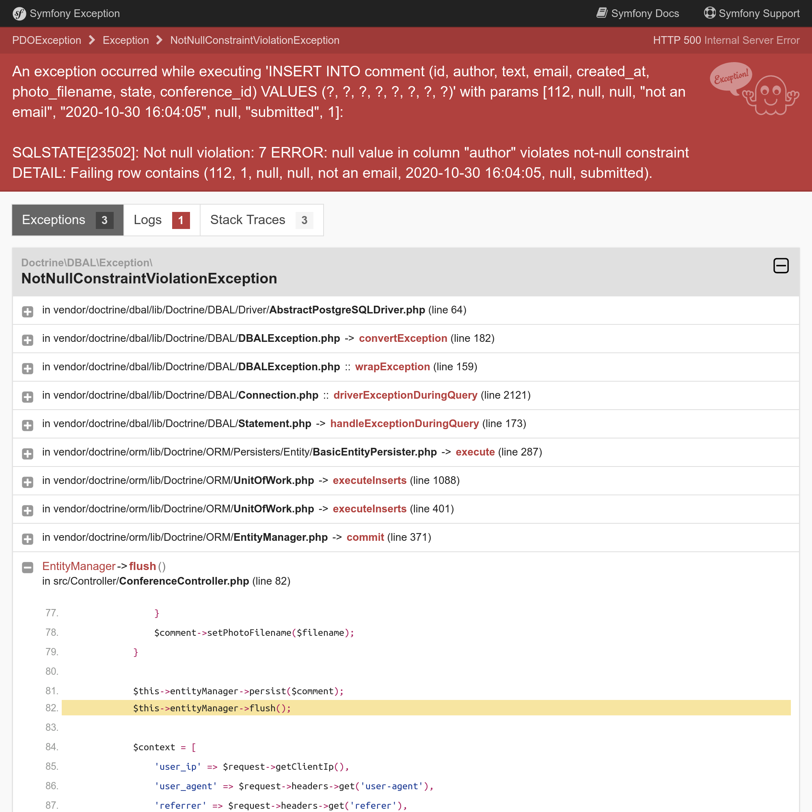

あらゆる手段で通知する
=================================

ゲストブックアプリケーションは、カンファレンスのフィードバックを集めることができるようになりましたが、まだユーザーにフィードバックを返すようにしていません。

As comments are moderated, they probably don't understand why their comments are not published instantly. They might even re-submit them thinking there was some technical problems. Giving them feedback after posting a comment would be
great.

さらに、コメントが公開されたらユーザーに通知してあげた方が良いですね。ユーザーからメールアドレスを聞いて、それを使いましょう。

ユーザーに通知する方法はたくさんあります。メールは、最初に思いつく媒体ですね。Web アプリケーションの通知もあります。SMS メッセージを送ってあげることもできますし、 Slack や Telegram にメッセージを投稿してあげることも考えられます。

.. index::
    single: Components;Notifier
    single: Notifier

Symfony Notifier コンポーネントは、通知に関する戦略をたくさん実装しています:

.. code-block:: bash

    $ symfony composer req notifier

ブラウザの Webアプリケーション通知を送る
----------------------------------------------------------

.. index::
    single: Flash Messages

最初のステップとして、コメントの投稿後に、直接ブラウザ内にコメントがモデレートされるといったことを通知してあげましょう:

.. code-block:: diff
    :caption: patch_file

    --- a/src/Controller/ConferenceController.php
    +++ b/src/Controller/ConferenceController.php
    @@ -14,6 +14,8 @@ use Symfony\Component\HttpFoundation\File\Exception\FileException;
     use Symfony\Component\HttpFoundation\Request;
     use Symfony\Component\HttpFoundation\Response;
     use Symfony\Component\Messenger\MessageBusInterface;
    +use Symfony\Component\Notifier\Notification\Notification;
    +use Symfony\Component\Notifier\NotifierInterface;
     use Symfony\Component\Routing\Annotation\Route;
     use Twig\Environment;

    @@ -59,7 +61,7 @@ class ConferenceController extends AbstractController
         /**
          * @Route("/conference/{slug}", name="conference")
          */
    -    public function show(Request $request, Conference $conference, CommentRepository $commentRepository, string $photoDir): Response
    +    public function show(Request $request, Conference $conference, CommentRepository $commentRepository, NotifierInterface $notifier, string $photoDir): Response
         {
             $comment = new Comment();
             $form = $this->createForm(CommentFormType::class, $comment);
    @@ -88,9 +90,15 @@ class ConferenceController extends AbstractController

                 $this->bus->dispatch(new CommentMessage($comment->getId(), $context));

    +            $notifier->send(new Notification('Thank you for the feedback; your comment will be posted after moderation.', ['browser']));
    +
                 return $this->redirectToRoute('conference', ['slug' => $conference->getSlug()]);
             }

    +        if ($form->isSubmitted()) {
    +            $notifier->send(new Notification('Can you check your submission? There are some problems with it.', ['browser']));
    +        }
    +
             $offset = max(0, $request->query->getInt('offset', 0));
             $paginator = $commentRepository->getCommentPaginator($conference, $offset);

この Notifier は、 *通知* を *チャネル* から *受け手* に *送ります* 。

通知は題名を一つと、オプショナルな内容と、重要度を持っています。

通知は重要度に応じて、チャネルに送られます。例えば、緊急の通知は SMS で送ることができ、通常の通知はメールで送ることができます。

ブラウザの通知においては、受信者はいません。

.. index::
    single: Twig;for

ブラウザの通知は、 *notification* セクションの *フラッシュメッセージ* を使用します。カンファレンスのテンプレートを更新して、フラッシュメッセージを表示するようにしましょう:

.. code-block:: diff
    :caption: patch_file

    --- a/templates/conference/show.html.twig
    +++ b/templates/conference/show.html.twig
    @@ -3,6 +3,13 @@
     Conference Guestbook - {{ conference }}

     
    +    
    +        

    +            {{ message }}
    +            <button type="button" class="close" data-dismiss="alert" aria-label="Close">&times;</button>
    +        

    +    
    +
         <h2 class="mb-5">
             {{ conference }} Conference
         </h2>

これで、ユーザーがコメントを投稿した際にモデレートがされることを通知されるようになりました:

.. figure:: screenshots/form-success-notification.png
    :alt: /conference/amsterdam-2019
    :align: center
    :figclass: with-browser

また、フォームエラーがあったときは、Webサイトの上部にわかりやすい通知が表示されます:

.. tip::

    フラッシュメッセージは、格納先として *HTTP セッション* を使用します。それによって、セッションがメッセージのチェックをするようになるので、 HTTP キャッシュが無効になります。

    そのため、ホームページの HTTP キャッシュを失わないようにベースとなるテンプレートではなく、 ``show.html.twig`` テンプレートにフラッシュメッセージのスニペットを追加しています。

メールで通知する
------------------------

``MailerInterface`` でコメントが投稿されたとメールを管理者に送るのではなく、メッセージハンドラー内で通知(notifier)コンポーネントを使うようにしましょう:

.. code-block:: diff
    :caption: patch_file

    --- a/src/MessageHandler/CommentMessageHandler.php
    +++ b/src/MessageHandler/CommentMessageHandler.php
    @@ -4,14 +4,14 @@ namespace App\MessageHandler;

     use App\ImageOptimizer;
     use App\Message\CommentMessage;
    +use App\Notification\CommentReviewNotification;
     use App\Repository\CommentRepository;
     use App\SpamChecker;
     use Doctrine\ORM\EntityManagerInterface;
     use Psr\Log\LoggerInterface;
    -use Symfony\Bridge\Twig\Mime\NotificationEmail;
    -use Symfony\Component\Mailer\MailerInterface;
     use Symfony\Component\Messenger\Handler\MessageHandlerInterface;
     use Symfony\Component\Messenger\MessageBusInterface;
    +use Symfony\Component\Notifier\NotifierInterface;
     use Symfony\Component\Workflow\WorkflowInterface;

     class CommentMessageHandler implements MessageHandlerInterface
    @@ -21,22 +21,20 @@ class CommentMessageHandler implements MessageHandlerInterface
         private $commentRepository;
         private $bus;
         private $workflow;
    -    private $mailer;
    +    private $notifier;
         private $imageOptimizer;
    -    private $adminEmail;
         private $photoDir;
         private $logger;

    -    public function __construct(EntityManagerInterface $entityManager, SpamChecker $spamChecker, CommentRepository $commentRepository, MessageBusInterface $bus, WorkflowInterface $commentStateMachine, MailerInterface $mailer, ImageOptimizer $imageOptimizer, string $adminEmail, string $photoDir, LoggerInterface $logger = null)
    +    public function __construct(EntityManagerInterface $entityManager, SpamChecker $spamChecker, CommentRepository $commentRepository, MessageBusInterface $bus, WorkflowInterface $commentStateMachine, NotifierInterface $notifier, ImageOptimizer $imageOptimizer, string $photoDir, LoggerInterface $logger = null)
         {
             $this->entityManager = $entityManager;
             $this->spamChecker = $spamChecker;
             $this->commentRepository = $commentRepository;
             $this->bus = $bus;
             $this->workflow = $commentStateMachine;
    -        $this->mailer = $mailer;
    +        $this->notifier = $notifier;
             $this->imageOptimizer = $imageOptimizer;
    -        $this->adminEmail = $adminEmail;
             $this->photoDir = $photoDir;
             $this->logger = $logger;
         }
    @@ -62,13 +60,7 @@ class CommentMessageHandler implements MessageHandlerInterface

                 $this->bus->dispatch($message);
             } elseif ($this->workflow->can($comment, 'publish') || $this->workflow->can($comment, 'publish_ham')) {
    -            $this->mailer->send((new NotificationEmail())
    -                ->subject('New comment posted')
    -                ->htmlTemplate('emails/comment_notification.html.twig')
    -                ->from($this->adminEmail)
    -                ->to($this->adminEmail)
    -                ->context(['comment' => $comment])
    -            );
    +            $this->notifier->send(new CommentReviewNotification($comment), ...$this->notifier->getAdminRecipients());
             } elseif ($this->workflow->can($comment, 'optimize')) {
                 if ($comment->getPhotoFilename()) {
                     $this->imageOptimizer->resize($this->photoDir.'/'.$comment->getPhotoFilename());

``getAdminRecipients()`` メソッドは、通知(notifier)設定にある管理者の受信者設定を返します;自分のメールアドレスを追加して更新しましょう:

.. code-block:: diff
    :caption: patch_file

    --- a/config/packages/notifier.yaml
    +++ b/config/packages/notifier.yaml
    @@ -13,4 +13,4 @@ framework:
                 medium: ['email']
                 low: ['email']
             admin_recipients:
    -            - { email: admin@example.com }
    +            - { email: "%env(string:default:default_admin_email:ADMIN_EMAIL)%" }

``CommentReviewNotification`` クラスを作成してください:

.. code-block:: php
    :caption: src/Notification/CommentReviewNotification.php

    namespace App\Notification;

    use App\Entity\Comment;
    use Symfony\Component\Notifier\Message\EmailMessage;
    use Symfony\Component\Notifier\Notification\EmailNotificationInterface;
    use Symfony\Component\Notifier\Notification\Notification;
    use Symfony\Component\Notifier\Recipient\Recipient;

    class CommentReviewNotification extends Notification implements EmailNotificationInterface
    {
        private $comment;

        public function __construct(Comment $comment)
        {
            $this->comment = $comment;

            parent::__construct('New comment posted');
        }

        public function asEmailMessage(Recipient $recipient, string $transport = null): ?EmailMessage
        {
            $message = EmailMessage::fromNotification($this, $recipient, $transport);
            $message->getMessage()
                ->htmlTemplate('emails/comment_notification.html.twig')
                ->context(['comment' => $this->comment])
            ;

            return $message;
        }
    }

``EmailNotificationInterface`` にある ``asEmailMessage()`` メソッドはオプショナルですが、これを使用するとメールをカスタマイズすることがでできます。

メールを直接送るのではなく、通知(Notifier)を使う利点の一つは、通知(Notifier)と実際に使用する "チャネル"を切り離すことです。実際に、通知がメール送信になっているということを明示していません。

代わりに、そのチャネルは、通知の *重要度* に応じて ``config/packages/notifier.yaml`` に設定されます（デフォルトでは、 ``低`` となっています）:

.. code-block:: yaml
    :caption: config/packages/notifier.yaml
    :class: ignore

    framework:
    notifier:
        channel_policy:
            # use chat/slack, chat/telegram, sms/twilio or sms/nexmo
            urgent: ['email']
            high: ['email']
            medium: ['email']
            low: ['email']

既に、 ``ブラウザ`` と ``メール`` のチャネルについて説明しましたが、より派手なものを見てみましょう。

管理者とチャットをする
---------------------------------

.. index::
    single: Slack

ポジティブなフィードバックが来ることを期待しています。もしくは、せめて建設的なフィードバックだと嬉しいです。 "グレート！" や "最高だね！" といったコメントがあったら他のコメントよりも早く受理したいですね。

こういったメッセージのために、メールに加えて Slack や Telegram のようなインスタントメッセージによるアラートを追加したいと思います。

.. index::
    single: Components;Notifier
    single: Notifier

Symfony Notifer に Slack のサポートをインストールします:

.. code-block:: bash

    $ symfony composer req slack-notifier

まず、Slack のアクセストークンとチャネルIDで、次のようなメッセージの送信先の DSN を構成してください: ``slack://ACCESS_TOKEN@default?channel=CHANNEL``

.. index::
    single: Command;secrets:set

アクセストークンは、扱いに注意しないといけない情報なので、Slack の DSN は、シークレットストアに格納しましょう:

.. code-block:: bash
    :class: answers(slack://ACCESS_TOKEN@default?channel=CHANNEL)

    $ symfony console secrets:set SLACK_DSN

本番で同作業をしてください:

.. code-block:: bash
    :class: answers(slack://ACCESS_TOKEN@default?channel=CHANNEL)

    $ APP_ENV=prod symfony console secrets:set SLACK_DSN

Slack のチャター(Chatter)サポートを有効化してください:

.. code-block:: diff
    :caption: patch_file

    --- a/config/packages/notifier.yaml
    +++ b/config/packages/notifier.yaml
    @@ -1,7 +1,7 @@
     framework:
         notifier:
    -        #chatter_transports:
    -        #    slack: '%env(SLACK_DSN)%'
    +        chatter_transports:
    +            slack: '%env(SLACK_DSN)%'
             #    telegram: '%env(TELEGRAM_DSN)%'
             #texter_transports:
             #    twilio: '%env(TWILIO_DSN)%'

コメントの内容に応じてメッセージをルートするように Notification クラスを更新してください（簡単な正規表現で良いです）:

.. code-block:: diff
    :caption: patch_file

    --- a/src/Notification/CommentReviewNotification.php
    +++ b/src/Notification/CommentReviewNotification.php
    @@ -29,4 +29,15 @@ class CommentReviewNotification extends Notification implements EmailNotificatio

             return $message;
         }
    +
    +    public function getChannels(Recipient $recipient): array
    +    {
    +        if (preg_match('{\b(great|awesome)\b}i', $this->comment->getText())) {
    +            return ['email', 'chat/slack'];
    +        }
    +
    +        $this->importance(Notification::IMPORTANCE_LOW);
    +
    +        return ['email'];
    +    }
     }

メールの見た目を微調整するため、"通常の" コメントの重要度の変更もしました。

これで完成です！コメントの内容に "最高ですね" と書いて投稿してみましょう。メッセージが Slack に流れるはずです。

``ChatNotificationInterface`` を実装して、デフォルトの Slack メセージの表示を上書きすることができます:

.. code-block:: diff
    :caption: patch_file

    --- a/src/Notification/CommentReviewNotification.php
    +++ b/src/Notification/CommentReviewNotification.php
    @@ -3,12 +3,17 @@
     namespace App\Notification;

     use App\Entity\Comment;
    +use Symfony\Component\Notifier\Bridge\Slack\Block\SlackDividerBlock;
    +use Symfony\Component\Notifier\Bridge\Slack\Block\SlackSectionBlock;
    +use Symfony\Component\Notifier\Bridge\Slack\SlackOptions;
    +use Symfony\Component\Notifier\Message\ChatMessage;
     use Symfony\Component\Notifier\Message\EmailMessage;
    +use Symfony\Component\Notifier\Notification\ChatNotificationInterface;
     use Symfony\Component\Notifier\Notification\EmailNotificationInterface;
     use Symfony\Component\Notifier\Notification\Notification;
     use Symfony\Component\Notifier\Recipient\Recipient;

    -class CommentReviewNotification extends Notification implements EmailNotificationInterface
    +class CommentReviewNotification extends Notification implements EmailNotificationInterface, ChatNotificationInterface
     {
         private $comment;

    @@ -30,6 +35,28 @@ class CommentReviewNotification extends Notification implements EmailNotificatio
             return $message;
         }

    +    public function asChatMessage(Recipient $recipient, string $transport = null): ?ChatMessage
    +    {
    +        if ('slack' !== $transport) {
    +            return null;
    +        }
    +
    +        $message = ChatMessage::fromNotification($this, $recipient, $transport);
    +        $message->subject($this->getSubject());
    +        $message->options((new SlackOptions())
    +            ->iconEmoji('tada')
    +            ->iconUrl('https://guestbook.example.com')
    +            ->username('Guestbook')
    +            ->block((new SlackSectionBlock())->text($this->getSubject()))
    +            ->block(new SlackDividerBlock())
    +            ->block((new SlackSectionBlock())
    +                ->text(sprintf('%s (%s) says: %s', $this->comment->getAuthor(), $this->comment->getEmail(), $this->comment->getText()))
    +            )
    +        );
    +
    +        return $message;
    +    }
    +
         public function getChannels(Recipient $recipient): array
         {
             if (preg_match('{\b(great|awesome)\b}i', $this->comment->getText())) {

かなり良くなりましたが、さらに改善してみましょう。Slack から直接コメントを受理したり、拒否したりできたら良いと思いませんか？

レビューURL を受理する通知を変更して、 Slack メッセージにボタンを2つ追加してください:

.. code-block:: diff
    :caption: patch_file

    --- a/src/Notification/CommentReviewNotification.php
    +++ b/src/Notification/CommentReviewNotification.php
    @@ -3,6 +3,7 @@
     namespace App\Notification;

     use App\Entity\Comment;
    +use Symfony\Component\Notifier\Bridge\Slack\Block\SlackActionsBlock;
     use Symfony\Component\Notifier\Bridge\Slack\Block\SlackDividerBlock;
     use Symfony\Component\Notifier\Bridge\Slack\Block\SlackSectionBlock;
     use Symfony\Component\Notifier\Bridge\Slack\SlackOptions;
    @@ -16,10 +17,12 @@ use Symfony\Component\Notifier\Recipient\Recipient;
     class CommentReviewNotification extends Notification implements EmailNotificationInterface, ChatNotificationInterface
     {
         private $comment;
    +    private $reviewUrl;

    -    public function __construct(Comment $comment)
    +    public function __construct(Comment $comment, string $reviewUrl)
         {
             $this->comment = $comment;
    +        $this->reviewUrl = $reviewUrl;

             parent::__construct('New comment posted');
         }
    @@ -52,6 +55,10 @@ class CommentReviewNotification extends Notification implements EmailNotificatio
                 ->block((new SlackSectionBlock())
                     ->text(sprintf('%s (%s) says: %s', $this->comment->getAuthor(), $this->comment->getEmail(), $this->comment->getText()))
                 )
    +            ->block((new SlackActionsBlock())
    +                ->button('Accept', $this->reviewUrl, 'primary')
    +                ->button('Reject', $this->reviewUrl.'?reject=1', 'danger')
    +            )
             );

             return $message;

変更の検知の扱いを Slack メッセージから受けとるようにしましょう。まず、レビューURL を渡すようにメッセージハンドラーを更新してください:

.. code-block:: diff
    :caption: patch_file

    --- a/src/MessageHandler/CommentMessageHandler.php
    +++ b/src/MessageHandler/CommentMessageHandler.php
    @@ -60,7 +60,8 @@ class CommentMessageHandler implements MessageHandlerInterface

                 $this->bus->dispatch($message);
             } elseif ($this->workflow->can($comment, 'publish') || $this->workflow->can($comment, 'publish_ham')) {
    -            $this->notifier->send(new CommentReviewNotification($comment), ...$this->notifier->getAdminRecipients());
    +            $notification = new CommentReviewNotification($comment, $message->getReviewUrl());
    +            $this->notifier->send($notification, ...$this->notifier->getAdminRecipients());
             } elseif ($this->workflow->can($comment, 'optimize')) {
                 if ($comment->getPhotoFilename()) {
                     $this->imageOptimizer->resize($this->photoDir.'/'.$comment->getPhotoFilename());

コメント・メッセージの一部としてレビューURLを追加しましょう:

.. code-block:: diff
    :caption: patch_file

    --- a/src/Message/CommentMessage.php
    +++ b/src/Message/CommentMessage.php
    @@ -5,14 +5,21 @@ namespace App\Message;
     class CommentMessage
     {
         private $id;
    +    private $reviewUrl;
         private $context;

    -    public function __construct(int $id, array $context = [])
    +    public function __construct(int $id, string $reviewUrl, array $context = [])
         {
             $this->id = $id;
    +        $this->reviewUrl = $reviewUrl;
             $this->context = $context;
         }

    +    public function getReviewUrl(): string
    +    {
    +        return $this->reviewUrl;
    +    }
    +
         public function getId(): int
         {
             return $this->id;

最後に、コントローラーでレビューURL を生成するように修正して、コメント・メッセージのコンストラクタに渡しましょう:

.. code-block:: diff
    :caption: patch_file

    --- a/src/Controller/AdminController.php
    +++ b/src/Controller/AdminController.php
    @@ -12,6 +12,7 @@ use Symfony\Component\HttpFoundation\Response;
     use Symfony\Component\HttpKernel\KernelInterface;
     use Symfony\Component\Messenger\MessageBusInterface;
     use Symfony\Component\Routing\Annotation\Route;
    +use Symfony\Component\Routing\Generator\UrlGeneratorInterface;
     use Symfony\Component\Workflow\Registry;
     use Twig\Environment;

    @@ -51,7 +52,8 @@ class AdminController extends AbstractController
             $this->entityManager->flush();

             if ($accepted) {
    -            $this->bus->dispatch(new CommentMessage($comment->getId()));
    +            $reviewUrl = $this->generateUrl('review_comment', ['id' => $comment->getId()], UrlGeneratorInterface::ABSOLUTE_URL);
    +            $this->bus->dispatch(new CommentMessage($comment->getId(), $reviewUrl));
             }

             return $this->render('admin/review.html.twig', [
    --- a/src/Controller/ConferenceController.php
    +++ b/src/Controller/ConferenceController.php
    @@ -17,6 +17,7 @@ use Symfony\Component\Messenger\MessageBusInterface;
     use Symfony\Component\Notifier\Notification\Notification;
     use Symfony\Component\Notifier\NotifierInterface;
     use Symfony\Component\Routing\Annotation\Route;
    +use Symfony\Component\Routing\Generator\UrlGeneratorInterface;
     use Twig\Environment;

     class ConferenceController extends AbstractController
    @@ -88,7 +89,8 @@ class ConferenceController extends AbstractController
                     'permalink' => $request->getUri(),
                 ];

    -            $this->bus->dispatch(new CommentMessage($comment->getId(), $context));
    +            $reviewUrl = $this->generateUrl('review_comment', ['id' => $comment->getId()], UrlGeneratorInterface::ABSOLUTE_URL);
    +            $this->bus->dispatch(new CommentMessage($comment->getId(), $reviewUrl, $context));

                 $notifier->send(new Notification('Thank you for the feedback; your comment will be posted after moderation.', ['browser']));

コードを分離させることで、いろんな場所での変更が必要ですが、テスタビリティ、責務の明確化、再利用性などが上がります。

これでメッセージがより使いやすくなったはずですので、試してください:

.. image:: images/slack-message.png
    :align: center

一律に非同期にする
---------------------------

ここで修正が必要なちょっとした問題を説明しましょう。各コメントは、メールと Slack メッセージで受け取るようになりました。Slack メッセージがエラーだった際（間違ったチャネルIDやトークンなど）には、メッセンジャーのメッセージは破棄されるまでに3回リトライします。しかし、Slack メッセージが何も届いていなくても、メールの送信が先に行われるので、メールが3通届くことになります。この問題を修正する方法として、Slack メッセージに送る処理を非同期とすることができます:

.. code-block:: diff
    :caption: patch_file

    --- a/config/packages/messenger.yaml
    +++ b/config/packages/messenger.yaml
    @@ -20,3 +20,5 @@ framework:
                 # Route your messages to the transports
                 App\Message\CommentMessage: async
                 Symfony\Component\Mailer\Messenger\SendEmailMessage: async
    +            Symfony\Component\Notifier\Message\ChatMessage: async
    +            Symfony\Component\Notifier\Message\SmsMessage: async

すべてが非同期処理になると、メッセージは独立して実行できるようになります。電話の SMS で通知を受け取りたいかもしれませんので、非同期であるSMSメッセージも有効にしましょう。

メールでユーザーに通知する
---------------------------------------

最後に、コメントの投稿が受理されたらユーザーに通知しましょう。ここはぜひ自分で実装してみてください。

.. sidebar:: より深く学ぶために

    * `Symfony のフラッシュメッセージ <https://symfony.com/doc/current/controller.html#flash-messages>`_.
