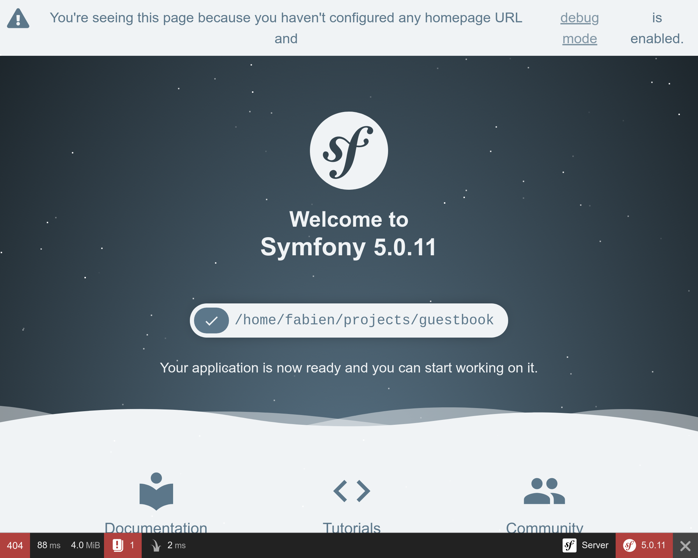

トラブルシューティング
=================================

プロジェクトのセットアップは、正しいデバッグツールを用意することでもあります。

依存ライブラリの追加
------------------------------

前章で作成したプロジェクトでは、ライブラリの依存はほとんどありませんでした。テンプレートエンジンもデバッグツールもロガーもありませんでした。それは、必要になったときにライブラリを追加すれば良いという考えからです。なぜなら、HTTP API や CLI ツールを開発するのにテンプレートエンジンはいらないですからね。

では、どうやって依存ライブラリを追加しましょうか。Composer でですね。ただし、 "ただの" Composer パッケージのインストールのみでなく、以下の "特別" な2つのパッケージをインストールしましょう:

* *Symfony Components*: ほとんどのアプリケーションが必要とするコアな機能と低レベルの抽象レイヤーを実装しているパッケージです（routing, console, HTTP client, mailer, cache, など）

* *Symfomy Bundles*: 高レベルの機能を追加したり、サードパーティのライブラリを統合する機能を提供するパッケージです（ほとんどの場合、バンドルはコミュニティによって作成されています）

.. index::
    single: Components;Profiler
    single: Profiler
    single: Web Profiler
    single: Web Debug Toolbar

でははじめに、問題の原因を調べるのに役に立つ Symfony Profiler を追加しましょう:

.. code-block:: bash

    $ symfony composer req profiler --dev

``profiler`` は ``symfony/profiler-pack`` パッケージのエイリアスです。

*エイリアス* は、 Composer の機能ではなく、 Symfony が提供する便利な機能の一つです。エイリアスは、ポピュラーな Composer パッケージのショートカットです。アプリケーションの ORM が必要であれば、 ``orm`` を require してください。 API の開発がしたければ、 ``api`` を require してください。これらのエイリアスは、Composer package に自動的に解決されます。このエイリアスは Symfony のコアチームによって選ばれています。

もう一つ便利な機能として、``symfony/cache`` と書かずに ``symfony`` を省略して ``cache`` を require することができます。

.. tip::

    前章で ``symfony/flex`` という Composer プラグインに関して言及したのを覚えていますか？このプラグインがエイリアス機能を提供しています。

Symfony の環境について
-----------------------------

``composer req`` コマンドに ``--dev`` フラグが指定されてていたのに気づきましたか？ Symfony Profiler は、開発時のみに必要な機能なので、本番ではインストールしないようにしたいですからね。

Symfony は、 *環境* の概念があります。デフォルトでは、 ``dev``, ``prod``, ``test`` の3つの環境がありますが、必要であれば追加することができます。すべての環境において、同じコードが使われますが、異なる *設定* をすることが可能です。

例えば、``dev`` 環境では、すべてのデバッグツールを有効にしています。しかし、``prod`` 環境では、アプリケーションのパフォーマンスを最適にしています。

``APP_ENV`` の環境変数を変更することで、環境をスイッチすることができます。

SymfonyCloud へデプロイする際は ``APP_ENV`` に既にセットされている環境は、自動的に ``prod`` となります。

環境設定の扱いに関して
---------------------------------

.. index::
    single: Environment Variables
    single: .env
    single: .env.local

``APP_ENV`` はあなたのターミナルにセットしてある "実際の" 環境変数です。

.. code-block:: bash
    :class: ignore

    $ export APP_ENV=dev

本番のサーバーで、環境変数を使用して ``APP_ENV`` のような値をセットするのは良いことです。しかし、開発時のマシンでは、環境変数をたくさん定義するとややこしくなりますので、代わりに ``.env`` ファイルに定義します。

注意が必要な ``.env`` ファイルはプロジェクトを作成したときに自動的に生成されます:

.. code-block:: text
    :caption: .env
    :class: ignore

    ###> symfony/framework-bundle ###
    APP_ENV=dev
    APP_SECRET=c2927f273163f7225a358e3a1bbbed8a
    #TRUSTED_PROXIES=127.0.0.1,127.0.0.2
    #TRUSTED_HOSTS='^localhost|example\.com$'
    ###< symfony/framework-bundle ###

.. tip::

    Symfony Flex のレシピによって、``.env`` を使用すれば、どんなパッケージも環境変数をセットすることが可能です。

``.env`` ファイルはリポジトリにコミットされ、本番の *デフォルト* の値として使われます。 ``.env.local`` ファイルを作成すれば値を上書きすることができますが、リポジトリにコミットするべきファイルではないので、 ``.gitignore`` に既に書いてあります。

シークレットな値や注意が必要な値をこれらのファイルに書かないでください。他のステップでシークレットな値を扱う方法を学びますので、待っていてください。

すべてをログに吐こう
------------------------------

.. index::
    single: Logger

新しいプロジェクトでは、ロギングやデバッギングは有効になっていません。開発時のデバッグのための問題の調査のためにツールを追加しましょう。また、いくつかは本番でも使用します:

.. code-block:: bash

    $ symfony composer req logger

.. index::
    single: Components;Debug
    single: Debug

まず、開発環境のみに使用するデバッグツールをインストールしましょう:

.. code-block:: bash

    $ symfony composer req debug --dev

Symfony Debugging Tools について
------------------------------------

ホームページを更新すると、スクリーンの一番下にツールバーが表示されていると思います:

最初に気づくこととして **404** が赤字で表示されていますね。このページはまだホームページとして定義していないので最初の表示として使われています。エラーページですが、デフォルトでも、ちゃんと表示されるなんて素敵でしょう。正しい HTTP ステータスコードは 200 ではなく 404 となっています。このようにデバッグツールバーがあるので、正しい情報を見ることができます。

小さな感嘆符（!）をクリックすると、Symfony profiler 内のログから "実際の" 例外のメッセージを見ることができます。スタックトレースを見たいときは、左のメニューの "Exception"  リンクをクリックしてください。

コードに問題があるときは、以下のような問題が起きている箇所を調べることができる例外ページが表示されます:

.. figure:: screenshots/exception.png
    :alt: //
    :align: center
    :figclass: with-browser

いくつかクリックして、Symfony profiler でどんな情報にアクセスができるか試してくてください。

.. index::
    single: Symfony CLI;server:log

デバッグ時にはログはとても役に立ちます。Symfony には、すべてのログ（Webサーバのログ、PHPのログ、アプリケーションのログ）を tail できる便利なコマンドがあります。

.. code-block:: bash
    :class: ignore

    $ symfony server:log

では、小さな実験をしてみましょう。 ``public/index.php`` を開いて、 PHP のコードを壊してみてください（たとえばfoobar という文字をコードの途中に追加してみましょう）。ブラウザでページを更新して何がログに流れてくるか見てみましょう:

.. code-block:: text
    :class: ignore

    Dec 21 10:04:59 |DEBUG| PHP    PHP Parse error:  syntax error, unexpected 'use' (T_USE) in public/index.php on line 5 path="/usr/bin/php7.42" php="7.42.0"
    Dec 21 10:04:59 |ERROR| SERVER GET  (500) / ip="127.0.0.1"

エラーに気づきやすいように色付けされて出力されます。

.. index::
    single: Components;VarDumper
    single: VarDumper
    single: dump

Symfony の ``dump()`` 関数も便利なデバッグヘルパーです。見やすくインタラクティブなフォーマットで複雑な変数をダンプして見ることができます。

今度は、 ``public/index.php`` を修正して Request オブジェクトをダンプしてみましょう:

.. code-block:: diff
    :caption: patch_file

    --- a/public/index.php
    +++ b/public/index.php
    @@ -23,5 +23,8 @@ if ($trustedHosts = $_SERVER['TRUSTED_HOSTS'] ?? false) {
     $kernel = new Kernel($_SERVER['APP_ENV'], (bool) $_SERVER['APP_DEBUG']);
     $request = Request::createFromGlobals();
     $response = $kernel->handle($request);
    +
    +dump($request);
    +
     $response->send();
     $kernel->terminate($request, $response);

ページを更新すると、 "target" アイコンがツールバーに表示されていますね。この "target" アイコンをクリックするとよりシンプルな詳細ページへ遷移します:

.. figure:: screenshots/dumper.png
    :alt: /
    :align: center
    :figclass: with-browser

.. index::
    single: Git;checkout

このステップで行った変更を戻しましょう:

.. code-block:: bash

    $ git checkout public/index.php

IDE の設定
-------------

開発環境では、例外が投げられると Symfony は、例外メッセージとスタックトレースのページを表示します。ファイルパスから、自分の使っている IDE で問題の箇所を開くことができます。この機能を使うには、 IDE を設定する必要があります。Symfony は最初からたくさんの IDE をサポートしています; 私は VSCode を今回のプロジェクトで使用しています:

.. code-block:: diff
    :caption: patch_file

    --- a/php.ini
    +++ b/php.ini
    @@ -6,3 +6,4 @@ max_execution_time=30
     session.use_strict_mode=On
     realpath_cache_ttl=3600
     zend.detect_unicode=Off
    +xdebug.file_link_format=vscode://file/%f:%l

ファイルへのリンクは例外だけではありません。例えば、IDE に設定すれば、デバッグの際のコントローラも開くことができます。

本番のデバッグ
---------------------

.. index::
    single: SymfonyCloud;Remote Logs
    single: SymfonyCloud;SSH
    single: Symfony CLI;logs
    single: Symfony CLI;ssh

本番サーバのデバッグは、より複雑です。例えば、 Symfony profiler は使えませんし、ログの情報も冗長にしていません。それでも、ログの tail は可能です:

.. code-block:: bash
    :class: ignore

    $ symfony logs

また、Webコンテナ上に SSH で接続することも可能です:

.. code-block:: bash
    :class: ignore

    $ symfony ssh

簡単に壊すことはできないので心配しないでください。ほとんどのファイルシステムは書き込み権限はありません。本番でのホットフィックスはできないようになっています。より良い方法はこの書籍の後の方で説明します。

.. sidebar:: より深く学ぶために

    * `SymfonyCasts Environment と設定ファイルのチュートリアル <https://symfonycasts.com/screencast/symfony-fundamentals/environment-config-files>`_;

    * `SymfonyCasts Environment Variables のチュートリアル <https://symfonycasts.com/screencast/symfony-fundamentals/environment-variables>`_;

    * `SymfonyCasts: Webデバッグツールバーとプロファイラーのチュートリアル <https://symfonycasts.com/screencast/symfony/debug-toolbar-profiler>`_;

    * Symfony アプリケーションにおける `複数の .env ファイルの使い方 <https://symfony.com/doc/current/configuration.html#managing-multiple-env-files>`_
