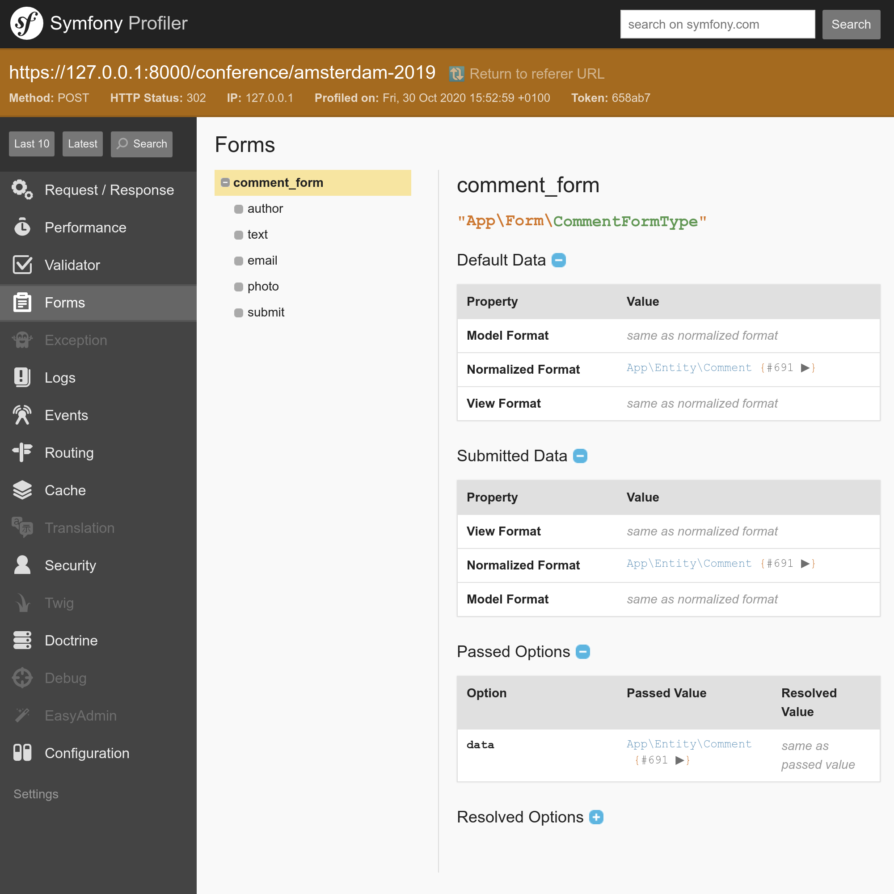

Aceitando Feedback com Formulários
===================================

.. index::
    single: Components;Form
    single: Form

Hora de deixar nossos participantes darem feedback sobre as conferências. Eles contribuirão com seus comentários através de um *formulário HTML*.

Gerando um Form Type
--------------------

.. index::
    single: Command;make:form

Use o bundle Maker para gerar uma classe de formulário:

.. code-block:: bash

    $ symfony console make:form CommentFormType Comment

.. code-block:: text
    :class: ignore
    :emphasize-lines: 1

     created: src/Form/CommentFormType.php

      Success!

     Next: Add fields to your form and start using it.
     Find the documentation at https://symfony.com/doc/current/forms.html

A classe ``App\Form\CommentFormType`` define um formulário para a entidade ``App\Entity\Comment``:

.. code-block:: php
    :caption: src/App/Form/CommentFormType.php
    :class: ignore

    namespace App\Form;

    use App\Entity\Comment;
    use Symfony\Component\Form\AbstractType;
    use Symfony\Component\Form\FormBuilderInterface;
    use Symfony\Component\OptionsResolver\OptionsResolver;

    class CommentFormType extends AbstractType
    {
        public function buildForm(FormBuilderInterface $builder, array $options)
        {
            $builder
                ->add('author')
                ->add('text')
                ->add('email')
                ->add('createdAt')
                ->add('photoFilename')
                ->add('conference')
            ;
        }

        public function configureOptions(OptionsResolver $resolver)
        {
            $resolver->setDefaults([
                'data_class' => Comment::class,
            ]);
        }
    }

Um `form type`_ descreve os *campos de formulário* ligados a um modelo. Ele faz a conversão de dados entre os dados submetidos e as propriedades da classe de modelo. Por padrão, o Symfony usa os metadados da entidade ``Comment`` - como os metadados do Doctrine - para adivinhar a configuração de cada campo. Por exemplo, o campo ``text`` é renderizado como um ``textarea`` porque usa uma coluna maior no banco de dados.

Exibindo um Formulário
-----------------------

Para exibir o formulário para o usuário, crie o formulário no controlador e passe-o para o template:

.. code-block:: diff
    :caption: patch_file
    :emphasize-lines: 18,24

    --- a/src/Controller/ConferenceController.php
    +++ b/src/Controller/ConferenceController.php
    @@ -2,7 +2,9 @@

     namespace App\Controller;

    +use App\Entity\Comment;
     use App\Entity\Conference;
    +use App\Form\CommentFormType;
     use App\Repository\CommentRepository;
     use App\Repository\ConferenceRepository;
     use Symfony\Bundle\FrameworkBundle\Controller\AbstractController;
    @@ -35,6 +37,9 @@ class ConferenceController extends AbstractController
          */
         public function show(Request $request, Conference $conference, CommentRepository $commentRepository): Response
         {
    +        $comment = new Comment();
    +        $form = $this->createForm(CommentFormType::class, $comment);
    +
             $offset = max(0, $request->query->getInt('offset', 0));
             $paginator = $commentRepository->getCommentPaginator($conference, $offset);

    @@ -43,6 +48,7 @@ class ConferenceController extends AbstractController
                 'comments' => $paginator,
                 'previous' => $offset - CommentRepository::PAGINATOR_PER_PAGE,
                 'next' => min(count($paginator), $offset + CommentRepository::PAGINATOR_PER_PAGE),
    +            'comment_form' => $form->createView(),
             ]));
         }
     }

Você nunca deve instanciar o form type diretamente. Em vez disso, use o método ``createForm()``. Este método faz parte do ``AbstractController`` e facilita a criação de formulários.

.. index::
    single: Twig;form

Ao passar um formulário para um template, utilize ``createView()`` para converter os dados para um formato adequado para templates.

A exibição do formulário no template pode ser feita através da função ``form`` do Twig:

.. code-block:: diff
    :caption: patch_file
    :emphasize-lines: 10

    --- a/templates/conference/show.html.twig
    +++ b/templates/conference/show.html.twig
    @@ -30,4 +30,8 @@
         
             
No comments have been posted yet for this conference.

         
    +
    +    <h2>Add your own feedback</h2>
    +
    +    {{ form(comment_form) }}
     

Ao atualizar uma página de conferência no navegador, observe que cada campo de formulário mostra o elemento HTML correto (o tipo de dado é derivado do modelo):

.. figure:: screenshots/form.png
    :alt: /conference/amsterdam-2019
    :align: center
    :figclass: with-browser

A função ``form()`` gera o formulário HTML com base em todas as informações definidas no form type. Ela também adiciona ``enctype=multipart/form-data`` na tag ``<form>`` como exigido pelo campo de entrada de upload de arquivo. Além disso, ela cuida da exibição das mensagens de erro quando o envio apresenta alguns erros. Tudo pode ser personalizado substituindo os templates padrão, mas não precisaremos disso neste projeto.

Personalizando um Form Type
---------------------------

Mesmo que os campos de formulário sejam configurados com base em seu modelo correspondente, é possível personalizar diretamente a configuração padrão na classe do form type:

.. code-block:: diff
    :caption: patch_file

    --- a/src/Form/CommentFormType.php
    +++ b/src/Form/CommentFormType.php
    @@ -4,20 +4,31 @@ namespace App\Form;

     use App\Entity\Comment;
     use Symfony\Component\Form\AbstractType;
    +use Symfony\Component\Form\Extension\Core\Type\EmailType;
    +use Symfony\Component\Form\Extension\Core\Type\FileType;
    +use Symfony\Component\Form\Extension\Core\Type\SubmitType;
     use Symfony\Component\Form\FormBuilderInterface;
     use Symfony\Component\OptionsResolver\OptionsResolver;
    +use Symfony\Component\Validator\Constraints\Image;

     class CommentFormType extends AbstractType
     {
         public function buildForm(FormBuilderInterface $builder, array $options)
         {
             $builder
    -            ->add('author')
    +            ->add('author', null, [
    +                'label' => 'Your name',
    +            ])
                 ->add('text')
    -            ->add('email')
    -            ->add('createdAt')
    -            ->add('photoFilename')
    -            ->add('conference')
    +            ->add('email', EmailType::class)
    +            ->add('photo', FileType::class, [
    +                'required' => false,
    +                'mapped' => false,
    +                'constraints' => [
    +                    new Image(['maxSize' => '1024k'])
    +                ],
    +            ])
    +            ->add('submit', SubmitType::class)
             ;
         }

Note que adicionamos um botão submit (que nos permite continuar a usar a expressão simples ``{{ form(comment_form) }}`` no template).

Alguns campos não podem ser configurados automaticamente, como o ``photoFilename``. A entidade ``Comment`` só precisa salvar o nome do arquivo da foto, mas o formulário tem que lidar com o upload do arquivo em si. Para tratar este caso, adicionamos um campo chamado ``photo`` como um campo não-``mapped``: ele não será mapeado para nenhuma propriedade em ``Comment``. Vamos gerenciá-lo manualmente para implementar alguma lógica específica (como armazenar a foto carregada no disco).

Como exemplo de personalização, nós também modificamos o label padrão para alguns campos.

.. figure:: screenshots/form-customized.png
    :alt: /conference/amsterdam-2019
    :align: center
    :figclass: with-browser

Validando Modelos
-----------------

O Form Type configura a renderização do frontend do formulário (através de alguma validação HTML5). Aqui está o formulário HTML gerado:

.. code-block:: html
    :class: ignore

    <form name="comment_form" method="post" enctype="multipart/form-data">
        

            

                <label for="comment_form_author" class="required">Your name</label>
                <input type="text" id="comment_form_author" name="comment_form[author]" required="required" maxlength="255" />
            

            

                <label for="comment_form_text" class="required">Text</label>
                <textarea id="comment_form_text" name="comment_form[text]" required="required"></textarea>
            

            

                <label for="comment_form_email" class="required">Email</label>
                <input type="email" id="comment_form_email" name="comment_form[email]" required="required" />
            

            

                <label for="comment_form_photo">Photo</label>
                <input type="file" id="comment_form_photo" name="comment_form[photo]" />
            

            

                <button type="submit" id="comment_form_submit" name="comment_form[submit]">Submit</button>
            

            <input type="hidden" id="comment_form__token" name="comment_form[_token]" value="DwqsEanxc48jofxsqbGBVLQBqlVJ_Tg4u9-BL1Hjgac" />
        

    </form>

O formulário usa o campo do tipo ``email`` para o e-mail do comentário, e torna a maioria dos campos ``required``. Observe que o formulário também contém um campo ``_token`` oculto para proteger o formulário de `ataques CSRF <https://owasp.org/www-community/attacks/csrf>`_.

Mas se o envio do formulário ignorar a validação HTML (usando um cliente HTTP que não impõe essas regras de validação como o cURL), dados inválidos poderão chegar ao servidor.

Também precisamos adicionar algumas restrições de validação no modelo de dados ``Comment``:

.. code-block:: diff
    :caption: patch_file

    --- a/src/Entity/Comment.php
    +++ b/src/Entity/Comment.php
    @@ -4,6 +4,7 @@ namespace App\Entity;

     use App\Repository\CommentRepository;
     use Doctrine\ORM\Mapping as ORM;
    +use Symfony\Component\Validator\Constraints as Assert;

     /**
      * @ORM\Entity(repositoryClass=CommentRepository::class)
    @@ -20,16 +21,20 @@ class Comment

         /**
          * @ORM\Column(type="string", length=255)
    +     * @Assert\NotBlank
          */
         private $author;

         /**
          * @ORM\Column(type="text")
    +     * @Assert\NotBlank
          */
         private $text;

         /**
          * @ORM\Column(type="string", length=255)
    +     * @Assert\NotBlank
    +     * @Assert\Email
          */
         private $email;

Tratando um Formulário
-----------------------

O código que escrevemos até agora é suficiente para exibir o formulário.

Agora devemos lidar com a submissão do formulário e a persistência de suas informações no banco de dados no controlador:

.. code-block:: diff
    :caption: patch_file

    --- a/src/Controller/ConferenceController.php
    +++ b/src/Controller/ConferenceController.php
    @@ -7,6 +7,7 @@ use App\Entity\Conference;
     use App\Form\CommentFormType;
     use App\Repository\CommentRepository;
     use App\Repository\ConferenceRepository;
    +use Doctrine\ORM\EntityManagerInterface;
     use Symfony\Bundle\FrameworkBundle\Controller\AbstractController;
     use Symfony\Component\HttpFoundation\Request;
     use Symfony\Component\HttpFoundation\Response;
    @@ -16,10 +17,12 @@ use Twig\Environment;
     class ConferenceController extends AbstractController
     {
         private $twig;
    +    private $entityManager;

    -    public function __construct(Environment $twig)
    +    public function __construct(Environment $twig, EntityManagerInterface $entityManager)
         {
             $this->twig = $twig;
    +        $this->entityManager = $entityManager;
         }

         /**
    @@ -39,6 +42,15 @@ class ConferenceController extends AbstractController
         {
             $comment = new Comment();
             $form = $this->createForm(CommentFormType::class, $comment);
    +        $form->handleRequest($request);
    +        if ($form->isSubmitted() && $form->isValid()) {
    +            $comment->setConference($conference);
    +
    +            $this->entityManager->persist($comment);
    +            $this->entityManager->flush();
    +
    +            return $this->redirectToRoute('conference', ['slug' => $conference->getSlug()]);
    +        }

             $offset = max(0, $request->query->getInt('offset', 0));
             $paginator = $commentRepository->getCommentPaginator($conference, $offset);

Quando o formulário é enviado, o objeto ``Comment`` é atualizado usando os dados enviados.

A conferência é forçada a ser a mesma que a da URL (nós a removemos do formulário).

Se o formulário não for válido, exibimos a página, mas agora o formulário conterá os valores enviados e as mensagens de erro para que possam ser exibidos de volta para o usuário.

Teste o formulário. Ele deve funcionar bem e os dados devem ser armazenados no banco de dados (verifique no painel administrativo). Mas há um problema: as fotos. Elas não funcionam, pois ainda não as tratamos no controlador.

Fazendo o Upload de Arquivos
----------------------------

As fotos carregadas devem ser armazenadas no disco local, em algum lugar acessível pelo frontend para que possamos exibi-las na página da conferência. Vamos guardá-las no diretório ``public/uploads/photos``:

.. code-block:: diff
    :caption: patch_file

    --- a/src/Controller/ConferenceController.php
    +++ b/src/Controller/ConferenceController.php
    @@ -9,6 +9,7 @@ use App\Repository\CommentRepository;
     use App\Repository\ConferenceRepository;
     use Doctrine\ORM\EntityManagerInterface;
     use Symfony\Bundle\FrameworkBundle\Controller\AbstractController;
    +use Symfony\Component\HttpFoundation\File\Exception\FileException;
     use Symfony\Component\HttpFoundation\Request;
     use Symfony\Component\HttpFoundation\Response;
     use Symfony\Component\Routing\Annotation\Route;
    @@ -38,13 +39,22 @@ class ConferenceController extends AbstractController
         /**
          * @Route("/conference/{slug}", name="conference")
          */
    -    public function show(Request $request, Conference $conference, CommentRepository $commentRepository): Response
    +    public function show(Request $request, Conference $conference, CommentRepository $commentRepository, string $photoDir): Response
         {
             $comment = new Comment();
             $form = $this->createForm(CommentFormType::class, $comment);
             $form->handleRequest($request);
             if ($form->isSubmitted() && $form->isValid()) {
                 $comment->setConference($conference);
    +            if ($photo = $form['photo']->getData()) {
    +                $filename = bin2hex(random_bytes(6)).'.'.$photo->guessExtension();
    +                try {
    +                    $photo->move($photoDir, $filename);
    +                } catch (FileException $e) {
    +                    // unable to upload the photo, give up
    +                }
    +                $comment->setPhotoFilename($filename);
    +            }

                 $this->entityManager->persist($comment);
                 $this->entityManager->flush();

Para gerenciar os uploads de fotos, criamos um nome aleatório para o arquivo. Em seguida, movemos o arquivo carregado para a sua localização final (o diretório de fotos). Finalmente, armazenamos o nome do arquivo no objeto Comment.

.. index::
    single: Container;Bind
    single: Bind

Notou o novo argumento no método ``show()``? ``$photoDir`` é uma string e não um serviço. Como o Symfony pode saber o que injetar aqui? O Container do Symfony é capaz de armazenar *parâmetros* além dos serviços. Os parâmetros são escalares que ajudam a configurar os serviços. Esses parâmetros podem ser injetados nos serviços explicitamente ou podem ser *vinculados por nome*:

.. code-block:: diff
    :caption: patch_file

    --- a/config/services.yaml
    +++ b/config/services.yaml
    @@ -10,6 +10,8 @@ services:
         _defaults:
             autowire: true      # Automatically injects dependencies in your services.
             autoconfigure: true # Automatically registers your services as commands, event subscribers, etc.
    +        bind:
    +            $photoDir: "%kernel.project_dir%/public/uploads/photos"

         # makes classes in src/ available to be used as services
         # this creates a service per class whose id is the fully-qualified class name

A configuração ``bind`` permite que o Symfony injete o valor sempre que um serviço tiver um argumento ``$photoDir``.

Tente fazer o upload de um arquivo PDF em vez de uma foto. Você deve ver as mensagens de erro em ação. O design é muito feio no momento, mas não se preocupe, tudo ficará bonito em poucos passos quando formos trabalhar no design do site. Para os formulários, mudaremos uma linha de configuração para estilizar todos os elementos do formulário.

Depurando Formulários
----------------------

Quando um formulário é enviado e algo não funciona muito bem, use o painel "Form" do Profiler do Symfony. Ele fornece informações sobre o formulário, todas as suas opções, os dados enviados e como eles são convertidos internamente. Se o formulário contiver erros, eles também serão listados.

O fluxo de trabalho típico do formulário é assim:

* O formulário é exibido em uma página;

* O usuário submete o formulário através de uma requisição POST;

* O servidor redireciona o usuário para outra página ou para a mesma página.

Mas como você pode acessar o profiler para uma requisição de submissão de formulário bem-sucedida? Como a página é redirecionada imediatamente, nunca vemos a barra de ferramentas para depuração web da requisição POST. Não há problema: na página redirecionada, passe o mouse sobre a parte verde contendo o texto "200" à esquerda. Você deve ver o redirecionamento "302" com um link para o profile (entre parênteses).

.. figure:: screenshots/form-wdt.png
    :alt: /conference/amsterdam-2019
    :align: center
    :figclass: with-browser

Clique nele para acessar o profile da requisição POST e vá para o painel "Form":

.. code-block:: bash
    :class: hide

    $ rm -rf var/cache

Exibindo as Fotos Carregadas no Painel Administrativo
-----------------------------------------------------

No momento, o painel administrativo está exibindo o nome do arquivo da foto, mas nós queremos ver, de fato, a foto:

.. code-block:: diff
    :caption: patch_file

    --- a/config/packages/easy_admin.yaml
    +++ b/config/packages/easy_admin.yaml
    @@ -17,6 +17,7 @@ easy_admin:
                     fields:
                         - author
                         - { property: 'email', type: 'email' }
    +                    - { property: 'photoFilename', type: 'image', 'base_path': "/uploads/photos", label: 'Photo' }
                         - { property: 'createdAt', type: 'datetime' }
                     sort: ['createdAt', 'ASC']
                     filters: ['conference']

Excluindo as Fotos Carregadas do Git
------------------------------------

Não faça o commit ainda! Não queremos armazenar as imagens carregadas no repositório do Git. Adicione o diretório ``/public/uploads`` ao arquivo ``.gitignore``:

.. code-block:: diff
    :caption: patch_file

    --- a/.gitignore
    +++ b/.gitignore
    @@ -1,3 +1,4 @@
    +/public/uploads

     ###> symfony/framework-bundle ###
     /.env.local

Armazenando Arquivos Carregados em Servidores de Produção
-----------------------------------------------------------

A última etapa é armazenar os arquivos carregados nos servidores de produção. Por que teríamos que fazer algo especial? Porque a maioria das plataformas de nuvem modernas usa containers somente leitura por vários motivos. A SymfonyCloud não é exceção.

Nem tudo é somente leitura em um projeto Symfony. Nós nos esforçamos para gerar o máximo de cache possível ao construir o container (durante a fase de aquecimento do cache), mas o Symfony ainda precisa ser capaz de escrever em algum lugar para o cache de usuário, os logs e as sessões, se eles forem armazenados no sistema de arquivos, e muito mais.

Dê uma olhada em ``.symfony.cloud.yaml``, já existe uma *montagem* gravável para o diretório ``var/``. O diretório ``var/`` é o único diretório onde o Symfony escreve (caches, logs, ...).

Vamos criar uma nova montagem para as fotos carregadas:

.. code-block:: diff
    :caption: patch_file

    --- a/.symfony.cloud.yaml
    +++ b/.symfony.cloud.yaml
    @@ -38,6 +38,7 @@ web:

     mounts:
         "/var": { source: local, source_path: var }
    +    "/public/uploads": { source: local, source_path: uploads }

     hooks:
         build: |

Agora você pode implantar o código e as fotos serão armazenadas no diretório ``public/uploads/`` como em nossa versão local.

.. sidebar:: Indo Além

    * `Tutorial do SymfonyCasts sobre Formulários <https://symfonycasts.com/screencast/symfony-forms>`_;

    * Como `personalizar a renderização do Form do Symfony em HTML <https://symfony.com/doc/current/form/form_customization.html>`_;

    * `Validando Formulários do Symfony <https://symfony.com/doc/current/forms.html#validating-forms>`_;

    * A `referência dos Form Types do Symfony <https://symfony.com/doc/current/reference/forms/types.html>`_;

    * A `documentação do FlysystemBundle <https://github.com/thephpleague/flysystem-bundle/blob/master/docs/1-getting-started.md>`_, que fornece integração com vários provedores de armazenamento em nuvem, como AWS S3, Azure e Google Cloud Storage;

    * Os `Parâmetros de Configuração do Symfony <https://symfony.com/doc/current/configuration.html#configuration-parameters>`_;

    * As `Restrições de Validação do Symfony <https://symfony.com/doc/current/validation.html#basic-constraints>`_;

    * A `Cheat Sheet do Form do Symfony <https://github.com/andreia/symfony-cheat-sheets/blob/master/Symfony2/how_symfony2_forms_works_en.pdf>`_.

.. _`form type`: https://symfony.com/doc/current/forms.html#form-types
