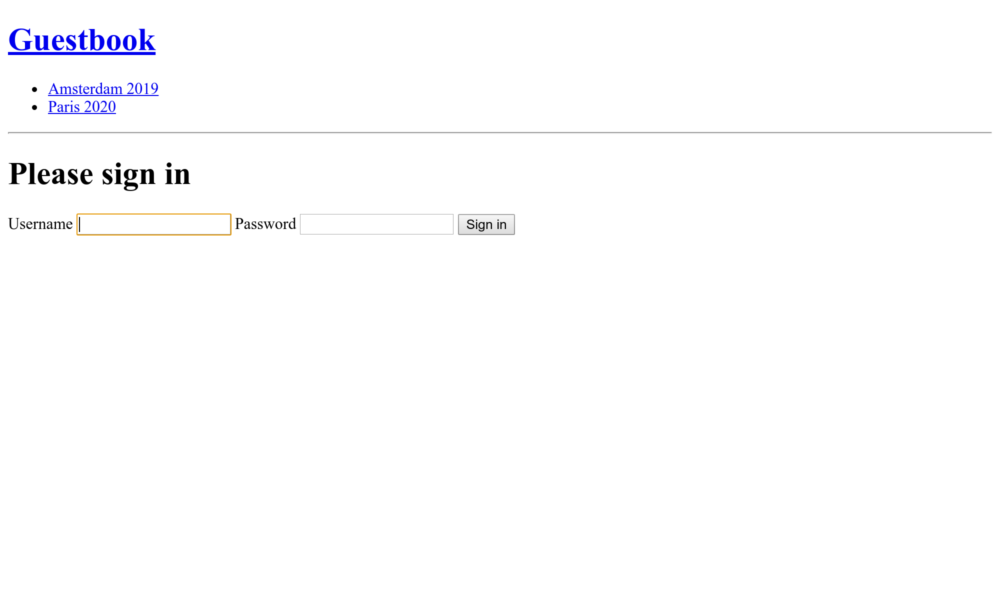

Protegendo o Painel Administrativo
==================================

A interface do painel administrativo deve ser acessível somente por pessoas confiáveis. Essa área do site pode ser protegida usando o componente Security do Symfony.

Assim como no Twig, o componente Security já está instalado via dependências transitivas. Vamos adicioná-lo explicitamente ao arquivo ``composer.json`` do projeto:

.. index::
    single: Components;Security
    single: Security

.. code-block:: bash

    $ symfony composer req security

Definindo uma Entidade User
---------------------------

Mesmo que os participantes não consigam criar suas próprias contas no site, vamos criar um sistema de autenticação totalmente funcional para o administrador. Teremos, portanto, apenas um usuário, o administrador do site.

O primeiro passo é definir uma entidade ``User``. Para evitar confusões, vamos chamá-la ``Admin``.

Para integrar a entidade ``Admin`` com o sistema de autenticação do componente Security do Symfony, ela precisa seguir alguns requisitos específicos. Por exemplo, precisa de uma propriedade ``password``.

.. index::
    single: Command;make:user

Use o comando dedicado ``make:user`` para criar a entidade ``Admin`` ao invés do tradicional ``make:entity``:

.. code-block:: bash
    :class: answers(yes||username||yes)

    $ symfony console make:user Admin

Responda as questões interativas: queremos usar o Doctrine para armazenar os administradores (``yes``), usar ``username`` para o nome de exibição único dos administradores, e cada usuário terá uma senha (``yes``).

A classe gerada contém métodos como ``getRoles()``, ``eraseCredentials()`` e alguns outros que são necessários para o sistema de autenticação do Symfony.

Se você quiser adicionar mais propriedades ao usuário ``Admin``, use ``make:entity``.

Vamos adicionar um método ``__toString()``, já que o EasyAdmin gosta deles:

.. code-block:: diff

    --- a/src/Entity/Admin.php
    +++ b/src/Entity/Admin.php
    @@ -75,6 +75,11 @@ class Admin implements UserInterface
             return $this;
         }

    +    public function __toString(): string
    +    {
    +        return $this->username;
    +    }
    +
         /**
          * @see UserInterface
          */

Além de gerar a entidade ``Admin``, o comando também atualizou a configuração de segurança para conectar a entidade com o sistema de autenticação:

.. code-block:: diff
    :class: ignore
    :emphasize-lines: 6,7,15,16

    --- a/config/packages/security.yaml
    +++ b/config/packages/security.yaml
    @@ -1,7 +1,15 @@
     security:
    +    encoders:
    +        App\Entity\Admin:
    +            algorithm: auto
    +
         # https://symfony.com/doc/current/security.html#where-do-users-come-from-user-providers
         providers:
    -        in_memory: { memory: null }
    +        # used to reload user from session & other features (e.g. switch_user)
    +        app_user_provider:
    +            entity:
    +                class: App\Entity\Admin
    +                property: username
         firewalls:
             dev:
                 pattern: ^/(_(profiler|wdt)|css|images|js)/

Deixamos o Symfony selecionar o melhor algoritmo possível para codificar senhas (que evoluirão com o tempo).

Hora de gerar uma migração e migrar o banco de dados:

.. code-block:: bash

    $ symfony console make:migration
    $ symfony console doctrine:migrations:migrate -n

Gerando uma Senha para o Usuário Admin
---------------------------------------

.. index::
    single: Security;Encoding Passwords

Não vamos desenvolver um sistema dedicado para criar contas administrativas. Mais uma vez, só teremos um administrador. O login será ``admin`` e precisamos codificar a senha.

.. index::
    single: Command;security:encode-password

Escolha o que desejar como senha e execute o seguinte comando para gerar a senha codificada:

.. code-block:: bash
    :class: answers(admin)

    $ symfony console security:encode-password

.. code-block:: text
    :class: ignore
    :emphasize-lines: 11

    Symfony Password Encoder Utility
    ================================

     Type in your password to be encoded:
     >

     ------------------ ---------------------------------------------------------------------------------------------------
      Key                Value
     ------------------ ---------------------------------------------------------------------------------------------------
      Encoder used       Symfony\Component\Security\Core\Encoder\MigratingPasswordEncoder
      Encoded password   $argon2id$v=19$m=65536,t=4,p=1$BQG+jovPcunctc30xG5PxQ$TiGbx451NKdo+g9vLtfkMy4KjASKSOcnNxjij4gTX1s
     ------------------ ---------------------------------------------------------------------------------------------------

     ! [NOTE] Self-salting encoder used: the encoder generated its own built-in salt.

     [OK] Password encoding succeeded

Criando um Admin
----------------

.. index::
    single: Symfony CLI;run psql

Insira o usuário admin através de uma instrução SQL:

.. code-block:: bash

    $ symfony run psql -c "INSERT INTO admin (id, username, roles, password) \
      VALUES (nextval('admin_id_seq'), 'admin', '[\"ROLE_ADMIN\"]', \
      '\$argon2id\$v=19\$m=65536,t=4,p=1\$BQG+jovPcunctc30xG5PxQ\$TiGbx451NKdo+g9vLtfkMy4KjASKSOcnNxjij4gTX1s')"

Observe o escape do sinal ``$`` no valor da coluna da senha; escape  todos eles!

Configurando a Autenticação
-----------------------------

.. index::
    single: Command;make:auth
    single: Security;Authenticator
    single: Security;Form Login
    single: Login
    single: Logout

Agora que temos um usuário admin, podemos proteger o painel administrativo. O Symfony suporta várias estratégias de autenticação. Vamos usar o clássico e popular *sistema de autenticação de formulário*.

Execute o comando ``make:auth`` para atualizar a configuração de segurança, gerar um template de login e criar um *autenticador*:

.. code-block:: bash
    :class: answers(1||AppAuthenticator||SecurityController||yes)

    $ symfony console make:auth

Selecione ``1`` para gerar um autenticador de formulário de login, nomeie a classe do autenticador ``AppAuthenticator``, o controlador ``SecurityController`` e gere uma URL ``/logout`` (``yes``).

O comando atualizou a configuração de segurança para conectar as classes geradas:

.. code-block:: diff
    :class: ignore
    :emphasize-lines: 9

    --- a/config/packages/security.yaml
    +++ b/config/packages/security.yaml
    @@ -16,6 +16,13 @@ security:
                 security: false
             main:
                 anonymous: lazy
    +            guard:
    +                authenticators:
    +                    - App\Security\AppAuthenticator
    +            logout:
    +                path: app_logout
    +                # where to redirect after logout
    +                # target: app_any_route

                 # activate different ways to authenticate
                 # https://symfony.com/doc/current/security.html#firewalls-authentication

Como sugerido pela saída do comando, precisamos personalizar a rota no método ``onAuthenticationSuccess()`` para redirecionar o usuário após ele fazer login com sucesso:

.. code-block:: diff

    --- a/src/Security/AppAuthenticator.php
    +++ b/src/Security/AppAuthenticator.php
    @@ -96,8 +96,7 @@ class AppAuthenticator extends AbstractFormLoginAuthenticator implements Passwor
                 return new RedirectResponse($targetPath);
             }

    -        // For example : return new RedirectResponse($this->urlGenerator->generate('some_route'));
    -        throw new \Exception('TODO: provide a valid redirect inside '.__FILE__);
    +        return new RedirectResponse($this->urlGenerator->generate('easyadmin'));
         }

         protected function getLoginUrl()

.. index::
    single: Command;debug:router
    single: Routing;Debug
    single: Debug;Routing

.. tip::

    Como sei que a rota do EasyAdmin é ``easyadmin``? Eu não sei. Mas executei o seguinte comando que mostra a associação entre nomes de rotas e caminhos:

    .. code-block:: bash

        $ symfony console debug:router

Adicionando Regras de Controle de Acesso de Autorização
---------------------------------------------------------

.. index::
    single: Security;Authorization
    single: Security;Access Control

Um sistema de segurança é composto por duas partes: *autenticação* e *autorização*. Ao criar o usuário admin, nós demos a ele o papel ``ROLE_ADMIN``. Vamos restringir a seção ``/admin`` aos usuários que têm esse papel, adicionando uma regra ao ``access_control``:

.. code-block:: diff
    :emphasize-lines: 8

    --- a/config/packages/security.yaml
    +++ b/config/packages/security.yaml
    @@ -34,5 +34,5 @@ security:
         # Easy way to control access for large sections of your site
         # Note: Only the *first* access control that matches will be used
         access_control:
    -        # - { path: ^/admin, roles: ROLE_ADMIN }
    +        - { path: ^/admin, roles: ROLE_ADMIN }
             # - { path: ^/profile, roles: ROLE_USER }

As regras do ``access_control`` restringem o acesso por expressões regulares. Ao tentar acessar uma URL que comece com ``/admin``, o sistema de segurança irá verificar se o usuário logado possui o papel ``ROLE_ADMIN``.

Autenticação com o Formulário de Login
-----------------------------------------

Se você tentar acessar o painel administrativo, agora deverá ser redirecionado para a página de login e solicitado a digitar um login e uma senha:

Faça login usando ``admin`` e qualquer senha em texto simples que você tenha codificado anteriormente. Caso tenha copiado meu comando SQL exatamente, a senha é ``admin``.

Note que o EasyAdmin reconhece automaticamente o sistema de autenticação do Symfony:

.. figure:: screenshots/easy-admin-secured.png
    :alt: /admin/
    :align: center
    :figclass: with-browser

Tente clicar no link "Sign out". Você conseguiu! Um painel administrativo totalmente seguro.

.. index::
    single: Command;make:registration-form

.. note::

    Se você quiser criar um sistema de autenticação de formulário com todos os recursos, dê uma olhada no comando ``make:registration-form``.

.. sidebar:: Indo Além

    * A `documentação sobre Segurança do Symfony <https://symfony.com/doc/current/security.html>`_;

    * `Tutorial sobre Segurança no SymfonyCasts <https://symfonycasts.com/screencast/symfony-security>`_;

    * `Como Criar um Formulário de Login <https://symfony.com/doc/current/security/form_login_setup.html>`_ em aplicações Symfony;

    * A `Cheat Sheet sobre Segurança do Symfony <https://github.com/andreia/symfony-cheat-sheets/blob/master/Symfony4/security_en_44.pdf>`_.
