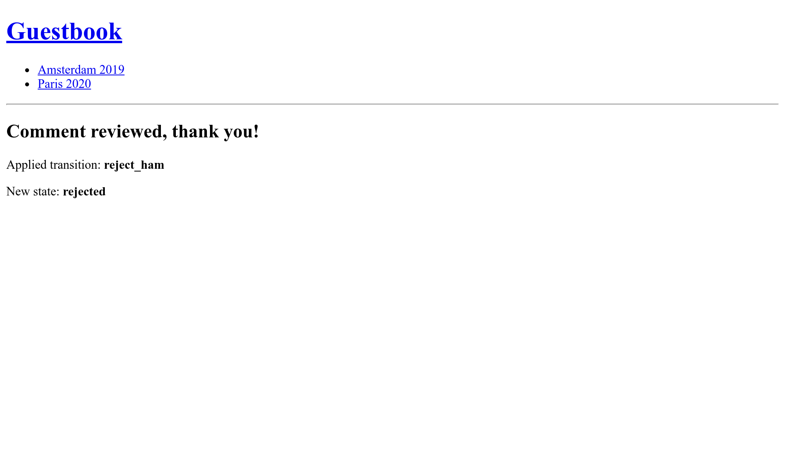

Enviando E-Mails aos Administradores
====================================

.. index::
    single: Components;Mailer
    single: Mailer
    single: Emails

Para garantir um feedback de alta qualidade, o administrador deve moderar todos os comentários. Quando um comentário está no estado ``ham`` ou ``potential_spam``, um *e-mail* deve ser enviado ao administrador com dois links: um para aceitar o comentário e outro para rejeitá-lo.

Primeiro, instale o componente Mailer do Symfony:

.. code-block:: bash

    $ symfony composer req mailer

Definindo um E-Mail para o Administrador
----------------------------------------

Para armazenar o e-mail do administrador, use um parâmetro do container. Para fins de demonstração, também permitimos que ele seja definido através de uma variável de ambiente (isso não deve ser necessário na "vida real"). Para facilitar a injeção em serviços que precisam do e-mail do administrador, defina uma configuração ``bind`` no container:

.. code-block:: diff
    :caption: patch_file

    --- a/config/services.yaml
    +++ b/config/services.yaml
    @@ -4,6 +4,7 @@
     # Put parameters here that don't need to change on each machine where the app is deployed
     # https://symfony.com/doc/current/best_practices/configuration.html#application-related-configuration
     parameters:
    +    default_admin_email: admin@example.com

     services:
         # default configuration for services in *this* file
    @@ -13,6 +14,7 @@ services:
             bind:
                 $photoDir: "%kernel.project_dir%/public/uploads/photos"
                 $akismetKey: "%env(AKISMET_KEY)%"
    +            $adminEmail: "%env(string:default:default_admin_email:ADMIN_EMAIL)%"

         # makes classes in src/ available to be used as services
         # this creates a service per class whose id is the fully-qualified class name

Uma variável de ambiente pode ser "processada" antes de ser usada. Aqui, estamos usando o processador ``default`` para recorrer ao valor do parâmetro ``default_admin_email`` se a variável de ambiente ``ADMIN_EMAIL`` não existir.

Enviando um E-Mail de Notificação
-----------------------------------

Para enviar um e-mail, você pode escolher entre várias abstrações da classe ``Email``; de ``Message``, o nível mais baixo, a ``NotificationEmail``, o mais alto. Você provavelmente usará mais a classe ``Email``, mas ``NotificationEmail`` é a escolha perfeita para e-mails internos.

No manipulador de mensagens, vamos substituir a lógica de validação automática:

.. code-block:: diff
    :caption: patch_file

    --- a/src/MessageHandler/CommentMessageHandler.php
    +++ b/src/MessageHandler/CommentMessageHandler.php
    @@ -7,6 +7,8 @@ use App\Repository\CommentRepository;
     use App\SpamChecker;
     use Doctrine\ORM\EntityManagerInterface;
     use Psr\Log\LoggerInterface;
    +use Symfony\Bridge\Twig\Mime\NotificationEmail;
    +use Symfony\Component\Mailer\MailerInterface;
     use Symfony\Component\Messenger\Handler\MessageHandlerInterface;
     use Symfony\Component\Messenger\MessageBusInterface;
     use Symfony\Component\Workflow\WorkflowInterface;
    @@ -18,15 +20,19 @@ class CommentMessageHandler implements MessageHandlerInterface
         private $commentRepository;
         private $bus;
         private $workflow;
    +    private $mailer;
    +    private $adminEmail;
         private $logger;

    -    public function __construct(EntityManagerInterface $entityManager, SpamChecker $spamChecker, CommentRepository $commentRepository, MessageBusInterface $bus, WorkflowInterface $commentStateMachine, LoggerInterface $logger = null)
    +    public function __construct(EntityManagerInterface $entityManager, SpamChecker $spamChecker, CommentRepository $commentRepository, MessageBusInterface $bus, WorkflowInterface $commentStateMachine, MailerInterface $mailer, string $adminEmail, LoggerInterface $logger = null)
         {
             $this->entityManager = $entityManager;
             $this->spamChecker = $spamChecker;
             $this->commentRepository = $commentRepository;
             $this->bus = $bus;
             $this->workflow = $commentStateMachine;
    +        $this->mailer = $mailer;
    +        $this->adminEmail = $adminEmail;
             $this->logger = $logger;
         }

    @@ -51,8 +57,13 @@ class CommentMessageHandler implements MessageHandlerInterface

                 $this->bus->dispatch($message);
             } elseif ($this->workflow->can($comment, 'publish') || $this->workflow->can($comment, 'publish_ham')) {
    -            $this->workflow->apply($comment, $this->workflow->can($comment, 'publish') ? 'publish' : 'publish_ham');
    -            $this->entityManager->flush();
    +            $this->mailer->send((new NotificationEmail())
    +                ->subject('New comment posted')
    +                ->htmlTemplate('emails/comment_notification.html.twig')
    +                ->from($this->adminEmail)
    +                ->to($this->adminEmail)
    +                ->context(['comment' => $comment])
    +            );
             } elseif ($this->logger) {
                 $this->logger->debug('Dropping comment message', ['comment' => $comment->getId(), 'state' => $comment->getState()]);
             }

A ``MailerInterface`` é o principal ponto de entrada e permite o envio (``send()``) de e-mails.

Para enviar um e-mail, precisamos de um remetente (o cabeçalho ``From``/``Sender``). Em vez de defini-lo explicitamente na instância Email, defina-o globalmente:

.. code-block:: diff
    :caption: patch_file

    --- a/config/packages/mailer.yaml
    +++ b/config/packages/mailer.yaml
    @@ -1,3 +1,5 @@
     framework:
         mailer:
             dsn: '%env(MAILER_DSN)%'
    +        envelope:
    +            sender: "%env(string:default:default_admin_email:ADMIN_EMAIL)%"

Estendendo o Template de E-Mail de Notificação
------------------------------------------------

.. index::
    single: Twig;extends
    single: Twig;block
    single: Twig;url

O template de e-mail de notificação herda do template de e-mail de notificação padrão que vem com o Symfony:

.. code-block:: twig
    :caption: templates/emails/comment_notification.html.twig

    

    
        Author: {{ comment.author }} 
        Email: {{ comment.email }} 
        State: {{ comment.state }} 

        

            {{ comment.text }}
        

    

    
        <spacer size="16"></spacer>
        <button href="{{ url('review_comment', { id: comment.id }) }}">Accept</button>
        <button href="{{ url('review_comment', { id: comment.id, reject: true }) }}">Reject</button>
    

O template sobrescreve alguns blocos para personalizar a mensagem do e-mail e adicionar alguns links que permitem ao administrador aceitar ou rejeitar um comentário. Qualquer argumento de rota que não seja um parâmetro de rota válido é adicionado como um parâmetro de URL (a URL para rejeitar se parece com ``/admin/comment/review/42?reject=true``).

O template padrão ``NotificationEmail`` usa a `Inky <https://get.foundation/emails/docs/inky.html>`_ em vez de HTML para o design dos e-mails. Ela ajuda a criar e-mails responsivos que são compatíveis com todos os clientes de e-mail populares.

Para compatibilidade máxima com os leitores de e-mail, o layout base  de notificação torna todas as folhas de estilo inline (através do pacote CSS inliner) por padrão.

Esses dois recursos fazem parte das extensões Twig opcionais que precisam ser instaladas:

.. code-block:: bash

    $ symfony composer req "twig/cssinliner-extra:^3" "twig/inky-extra:^3"

Gerando URLs Absolutas em um Comando
------------------------------------

.. index::
    single: Twig;Link
    single: Link

Nos e-mails, gere as URLs com ``url()`` ao invés de ``path()``, pois você precisa de URLs absolutas (com esquema e host).

O e-mail é enviado a partir do manipulador de mensagens, em um contexto de console. Gerar URLs absolutas em um contexto web é mais fácil, pois conhecemos o esquema e o domínio da página atual. Esse não é o caso em um contexto de console.

Defina explicitamente o nome de domínio e o esquema que serão utilizados:

.. code-block:: diff
    :caption: patch_file

    --- a/config/services.yaml
    +++ b/config/services.yaml
    @@ -5,6 +5,11 @@
     # https://symfony.com/doc/current/best_practices/configuration.html#application-related-configuration
     parameters:
         default_admin_email: admin@example.com
    +    default_domain: '127.0.0.1'
    +    default_scheme: 'http'
    +
    +    router.request_context.host: '%env(default:default_domain:SYMFONY_DEFAULT_ROUTE_HOST)%'
    +    router.request_context.scheme: '%env(default:default_scheme:SYMFONY_DEFAULT_ROUTE_SCHEME)%'

     services:
         # default configuration for services in *this* file

As variáveis de ambiente ``SYMFONY_DEFAULT_ROUTE_HOST`` e ``SYMFONY_DEFAULT_ROUTE_PORT`` são automaticamente definidas localmente ao usar a CLI ``symfony`` e determinadas com base na configuração na SymfonyCloud.

Conectando uma Rota a um Controlador
------------------------------------

A rota ``review_comment`` ainda não existe, vamos criar um controlador de administração para lidar com ela:

.. code-block:: php
    :caption: src/Controller/AdminController.php

    namespace App\Controller;

    use App\Entity\Comment;
    use App\Message\CommentMessage;
    use Doctrine\ORM\EntityManagerInterface;
    use Symfony\Bundle\FrameworkBundle\Controller\AbstractController;
    use Symfony\Component\HttpFoundation\Request;
    use Symfony\Component\HttpFoundation\Response;
    use Symfony\Component\Messenger\MessageBusInterface;
    use Symfony\Component\Routing\Annotation\Route;
    use Symfony\Component\Workflow\Registry;
    use Twig\Environment;

    class AdminController extends AbstractController
    {
        private $twig;
        private $entityManager;
        private $bus;

        public function __construct(Environment $twig, EntityManagerInterface $entityManager, MessageBusInterface $bus)
        {
            $this->twig = $twig;
            $this->entityManager = $entityManager;
            $this->bus = $bus;
        }

        /**
         * @Route("/admin/comment/review/{id}", name="review_comment")
         */
        public function reviewComment(Request $request, Comment $comment, Registry $registry): Response
        {
            $accepted = !$request->query->get('reject');

            $machine = $registry->get($comment);
            if ($machine->can($comment, 'publish')) {
                $transition = $accepted ? 'publish' : 'reject';
            } elseif ($machine->can($comment, 'publish_ham')) {
                $transition = $accepted ? 'publish_ham' : 'reject_ham';
            } else {
                return new Response('Comment already reviewed or not in the right state.');
            }

            $machine->apply($comment, $transition);
            $this->entityManager->flush();

            if ($accepted) {
                $this->bus->dispatch(new CommentMessage($comment->getId()));
            }

            return $this->render('admin/review.html.twig', [
                'transition' => $transition,
                'comment' => $comment,
            ]);
        }
    }

A URL de revisão de comentário começa com ``/admin/`` para protegê-la com o firewall definido em uma etapa anterior. O administrador precisa estar autenticado para acessar esse recurso.

Em vez de criar uma instância ``Response``, nós usamos ``render()``, um método de atalho fornecido pela classe base do controlador ``AbstractController``.

.. index::
    single: Twig;extends
    single: Twig;block

Quando a revisão é concluída, um pequeno template agradece ao administrador pelo seu trabalho duro:

.. code-block:: twig
    :caption: templates/admin/review.html.twig

    

    
        <h2>Comment reviewed, thank you!</h2>

        
Applied transition: <strong>{{ transition }}</strong>

        
New state: <strong>{{ comment.state }}</strong>

    

Usando um Coletor de E-Mails
----------------------------

.. index::
    single: Docker;Mail Catcher

Em vez de usar um servidor SMTP "real" ou um provedor de terceiros para enviar e-mails, vamos usar um coletor de e-mails. Um coletor de e-mails fornece um servidor SMTP que não entrega os e-mails, mas os torna disponíveis através de uma interface web:

.. code-block:: diff

    --- a/docker-compose.yaml
    +++ b/docker-compose.yaml
    @@ -16,3 +16,7 @@ services:
         rabbitmq:
             image: rabbitmq:3.7-management
             ports: [5672, 15672]
    +
    +    mailer:
    +        image: schickling/mailcatcher
    +        ports: [1025, 1080]

Desligue e reinicie os containers para adicionar o coletor de e-mails:

.. code-block:: bash

    $ docker-compose stop
    $ docker-compose up -d

.. code-block:: bash
    :class: hide

    $ sleep 10

Acessando o Webmail
-------------------

.. index::
    single: Symfony CLI;open:local:webmail

Você pode abrir o webmail a partir de um terminal:

.. code-block:: bash
    :class: ignore

    $ symfony open:local:webmail

Ou a partir da barra de ferramentas para depuração web:

.. figure:: screenshots/webmail-wdt.png
    :alt: /
    :align: center
    :figclass: with-browser

Envie um comentário, você deve receber um e-mail na interface do webmail:

.. figure:: screenshots/webmail.png
    :alt: /
    :align: center
    :figclass: with-browser

Clique no título do e-mail na interface e aceite ou rejeite o comentário conforme achar melhor:

Verifique os logs com ``server:log`` se não funcionar como esperado.

Gerenciando Scripts de Longa Duração
--------------------------------------

Ter scripts de longa duração causa comportamentos dos quais você deve estar ciente. Ao contrário do modelo PHP usado para HTTP onde cada requisição começa com um estado limpo, o consumidor de mensagens está executando continuamente em segundo plano. Cada manipulação de uma mensagem herda o estado atual, incluindo o cache de memória. Para evitar qualquer problema com o Doctrine, seus gerenciadores de entidade são automaticamente limpos após a manipulação de uma mensagem. Você deve verificar se seus próprios serviços precisam fazer o mesmo ou não.

Enviando E-Mails de Forma Assíncrona
-------------------------------------

O e-mail enviado no manipulador de mensagens pode levar algum tempo para ser enviado. Ele pode até lançar uma exceção. No caso de uma exceção ser lançada durante a manipulação de uma mensagem, a manipulação será repetida. Mas em vez de tentar consumir novamente a mensagem do comentário, seria melhor tentar apenas enviar o e-mail novamente.

Já sabemos como fazer isso: envie a mensagem de e-mail para o barramento.

Uma instância ``MailerInterface`` faz o trabalho pesado: quando um barramento é definido, ela despacha as mensagens de e-mail para ele em vez de enviá-las normalmente. Não são necessárias alterações no seu código.

Mas, no momento, o barramento está enviando o e-mail de forma síncrona, pois não configuramos a fila que queremos usar para e-mails. Vamos utilizar o RabbitMQ outra vez:

.. code-block:: diff
    :caption: patch_file

    --- a/config/packages/messenger.yaml
    +++ b/config/packages/messenger.yaml
    @@ -19,3 +19,4 @@ framework:
             routing:
                 # Route your messages to the transports
                 App\Message\CommentMessage: async
    +            Symfony\Component\Mailer\Messenger\SendEmailMessage: async

Mesmo utilizando o mesmo transporte (RabbitMQ) para mensagens de comentário e mensagens de e-mail, isto não precisa ser assim. Você pode decidir usar outro transporte para administrar prioridades diferentes de mensagem, por exemplo. A utilização de transportes diferentes também lhe dá a oportunidade de ter diferentes workers lidando com diferentes tipos de mensagens. É flexível e você decide.

Testando E-Mails
----------------

Há muitas formas de testar e-mails.

Você pode escrever testes unitários se você escrever uma classe por e-mail (estendendo ``Email`` ou ``TemplatedEmail``, por exemplo).

Os testes mais comuns que você irá escrever, entretanto, são testes funcionais que verificam se algumas ações disparam um e-mail e, provavelmente, testes sobre o conteúdo dos e-mails, se forem dinâmicos.

Symfony vem com assertions que facilitam esses testes:

.. code-block:: php
    :class: ignore

    public function testMailerAssertions()
    {
        $client = static::createClient();
        $client->request('GET', '/');

        $this->assertEmailCount(1);
        $event = $this->getMailerEvent(0);
        $this->assertEmailIsQueued($event);

        $email = $this->getMailerMessage(0);
        $this->assertEmailHeaderSame($email, 'To', 'fabien@example.com');
        $this->assertEmailTextBodyContains($email, 'Bar');
        $this->assertEmailAttachmentCount($email, 1);
    }

Estas assertions funcionam quando os e-mails são enviados de forma síncrona ou assíncrona.

Enviando E-Mails na SymfonyCloud
--------------------------------

.. index::
    single: SymfonyCloud;Emails
    single: SymfonyCloud;Mailer
    single: SymfonyCloud;SMTP
    single: Emails

Não há nenhuma configuração específica para a SymfonyCloud. Todas as contas vêm com uma conta do Sendgrid que é utilizada automaticamente para enviar e-mails.

Você ainda precisa atualizar a configuração da SymfonyCloud para incluir a extensão ``xsl`` do PHP que é necessária para a Inky:

.. code-block:: diff
    :caption: patch_file

    --- a/.symfony.cloud.yaml
    +++ b/.symfony.cloud.yaml
    @@ -4,6 +4,7 @@ type: php:7.4

     runtime:
         extensions:
    +        - xsl
             - amqp
             - redis
             - pdo_pgsql

.. index::
    single: Symfony CLI;env:setting:set

.. note::

    Só por precaução, por padrão, os e-mails são enviados *apenas* na branch ``master``. Habilite o SMTP explicitamente em outros branches se você sabe o que está fazendo:

    .. code-block:: bash

        $ symfony env:setting:set email on

.. sidebar:: Indo Além

    * `Tutorial sobre o Mailer no SymfonyCasts <https://symfonycasts.com/screencast/mailer>`_;

    * A `documentação da linguagem de template Inky <https://get.foundation/emails/docs/inky.html>`_;

    * Os `Processadores de Variáveis de Ambiente <https://symfony.com/doc/current/configuration/env_var_processors.html>`_;

    * A `documentação do Mailer do Symfony <https://symfony.com/doc/current/mailer.html>`_;

    * The `SymfonyCloud documentation about Emails <https://symfony.com/doc/current/cloud/services/emails.html>`_.
