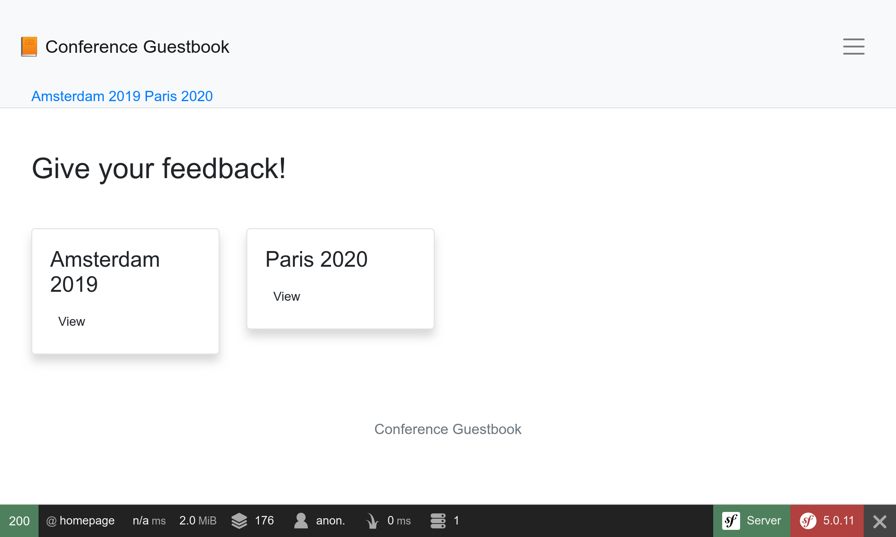

Estilizando a Interface do Usuário com o Webpack
=================================================

.. index::
    single: Encore
    single: Webpack
    single: Components;Encore
    single: Stylesheet

Nós não dedicamos nenhum momento ao design da interface do usuário. Para estilizar como um profissional, vamos usar uma stack moderna, baseada no `Webpack <https://webpack.js.org/>`_. E para adicionar um toque de Symfony e facilitar sua integração com a aplicação, vamos instalar o *Webpack Encore*:

.. code-block:: bash

    $ symfony composer req encore

Um ambiente completo do Webpack foi criado para você: ``package.json`` e ``webpack.config.js`` foram gerados e contêm uma boa configuração padrão. Abra o ``webpack.config.js``, ele usa a abstração do Encore para configurar o Webpack.

O arquivo ``package.json`` define alguns comandos legais que usaremos o tempo todo.

O diretório ``assets`` contém os principais pontos de entrada para os assets do projeto: ``styles/app.css`` e ``app.js``.

Utilizando Sass
---------------

.. index::
    single: Sass

Ao invés de usar CSS simples, vamos mudar para `Sass <https://sass-lang.com/>`_:

.. code-block:: bash

    $ mv assets/styles/app.css assets/styles/app.scss

.. code-block:: diff
    :caption: patch_file

    --- a/assets/app.js
    +++ b/assets/app.js
    @@ -6,7 +6,7 @@
      */

     // any CSS you import will output into a single css file (app.css in this case)
    -import './styles/app.css';
    +import './styles/app.scss';

     // Need jQuery? Install it with "yarn add jquery", then uncomment to import it.
     // import $ from 'jquery';

Instale o loader do Sass:

.. code-block:: bash

    $ yarn add node-sass sass-loader --dev

E habilite o loader do Sass no webpack:

.. code-block:: diff
    :caption: patch_file

    --- a/webpack.config.js
    +++ b/webpack.config.js
    @@ -54,7 +54,7 @@ Encore
         })

         // enables Sass/SCSS support
    -    //.enableSassLoader()
    +    .enableSassLoader()

         // uncomment if you use TypeScript
         //.enableTypeScriptLoader()

Como eu sabia quais pacotes instalar? Se tentássemos construir nossos assets sem eles, o Encore nos daria uma mensagem de erro sugerindo o comando ``yarn add`` necessário para instalar dependências para carregar arquivos ``.scss``.

Tirando Proveito do Bootstrap
-----------------------------

.. index::
    single: Bootstrap

Para começar com bons padrões e construir um site responsivo, um framework CSS como o `Bootstrap <https://getbootstrap.com/>`_ pode fazer milagres. Instale-o como um pacote:

.. code-block:: bash

    $ yarn add bootstrap jquery popper.js bs-custom-file-input --dev

Importe o Bootstrap no arquivo CSS (também limpamos o arquivo):

.. code-block:: diff
    :caption: patch_file

    --- a/assets/styles/app.scss
    +++ b/assets/styles/app.scss
    @@ -1,3 +1 @@
    -body {
    -    background-color: lightgray;
    -}
    +@import '~bootstrap/scss/bootstrap';

Faça o mesmo para o arquivo JS:

.. code-block:: diff
    :caption: patch_file

    --- a/assets/app.js
    +++ b/assets/app.js
    @@ -7,8 +7,7 @@

     // any CSS you import will output into a single css file (app.css in this case)
     import './styles/app.scss';
    +import 'bootstrap';
    +import bsCustomFileInput from 'bs-custom-file-input';

    -// Need jQuery? Install it with "yarn add jquery", then uncomment to import it.
    -// import $ from 'jquery';
    -
    -console.log('Hello Webpack Encore! Edit me in assets/app.js');
    +bsCustomFileInput.init();

O sistema de formulários do Symfony suporta o Bootstrap nativamente com um tema especial, habilite-o:

.. code-block:: yaml
    :caption: config/packages/twig.yaml

    twig:
        form_themes: ['bootstrap_4_layout.html.twig']

Estilizando o HTML
------------------

Estamos agora prontos para estilizar a aplicação. Baixe e extraia o arquivo na raiz do projeto:

.. code-block:: bash

    $ php -r "copy('https://symfony.com/uploads/assets/guestbook-5.0.zip', 'guestbook-5.0.zip');"
    $ unzip -o guestbook-5.0.zip
    $ rm guestbook-5.0.zip

Dê uma olhada nos templates, você pode aprender um truque ou dois sobre o Twig.

Construindo Assets
------------------

.. index::
    single: Symfony CLI;run

Uma mudança importante ao usar o Webpack é que os arquivos CSS e JS não podem ser utilizados diretamente pela aplicação. Eles precisam ser "compilados" primeiro.

No desenvolvimento, a compilação dos assets pode ser feita através do comando ``encore dev``:

.. code-block:: bash

    $ symfony run yarn encore dev

Em vez de executar o comando toda vez que houver uma alteração, envie-o para segundo plano e deixe-o acompanhar as alterações no JS e no CSS:

.. code-block:: bash
    :class: ignore

    $ symfony run -d yarn encore dev --watch

Reserve um tempo para descobrir as mudanças visuais. Dê uma olhada no novo design em um navegador.

.. figure:: screenshots/design-conference.png
    :alt: /conference/amsterdam-2019
    :align: center
    :figclass: with-browser

O formulário de login gerado agora possui estilo, assim como o bundle Maker usa classes CSS do Bootstrap por padrão:

.. figure:: screenshots/login-styled.png
    :alt: /login
    :align: center
    :figclass: with-browser

Em produção, a SymfonyCloud detecta automaticamente que você está usando o Encore e compila os assets para você durante a fase de construção.

.. sidebar:: Indo Além

    * `Documentação do Webpack <https://webpack.js.org/concepts/>`_;

    * `Documentação do Symfony sobre o Webpack Encore  <https://symfony.com/doc/current/frontend.html>`_;

    * `Tutorial sobre o Webpack Encore no SymfonyCasts <https://symfonycasts.com/screencast/webpack-encore>`_.
