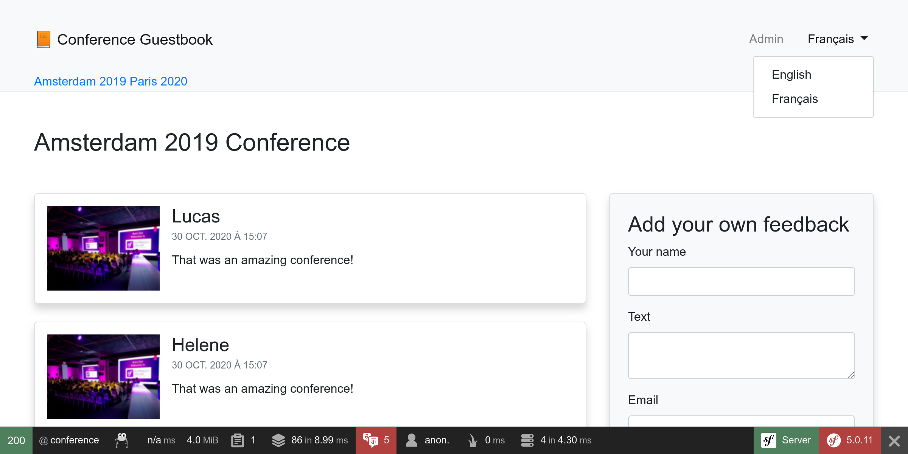
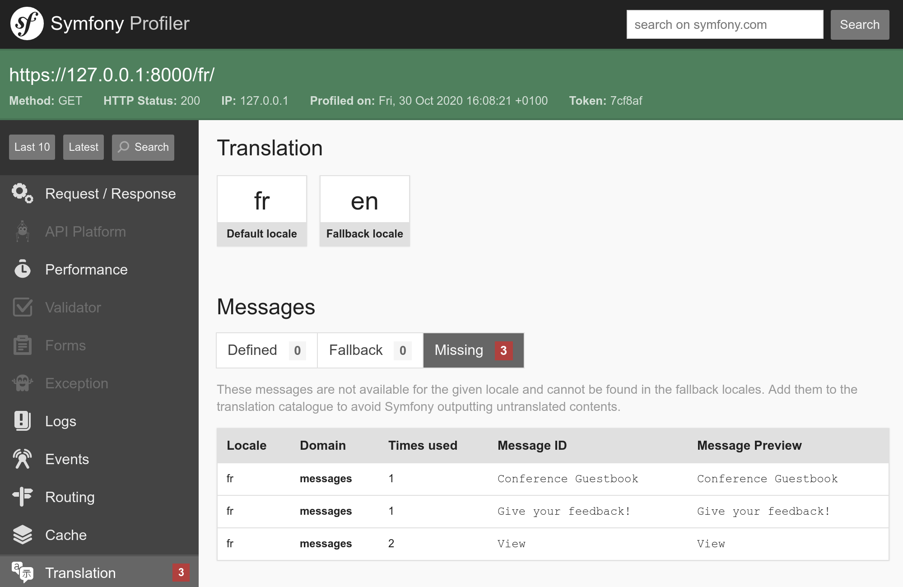
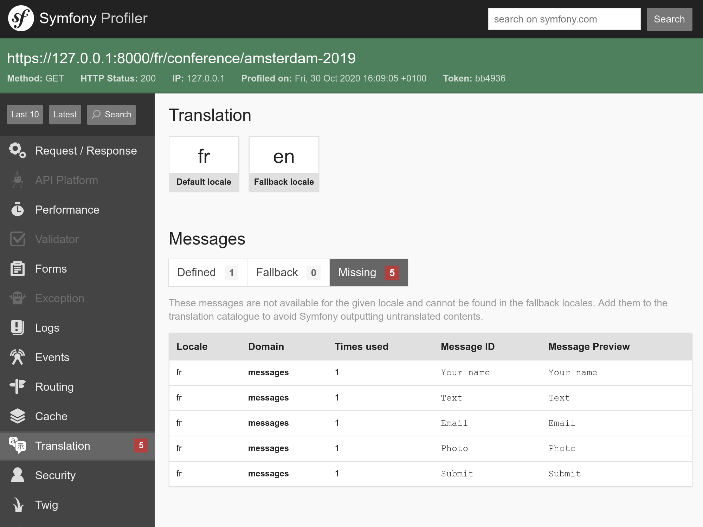

Localizando uma Aplicação
===========================

Com um público internacional, o Symfony é capaz de lidar com internacionalização (i18n) e localização (l10n) na instalação padrão praticamente desde sempre. Localizar uma aplicação não é apenas sobre a tradução da interface, é também sobre plurais, formatação de data e moeda, URLs e muito mais.

Internacionalizando URLs
------------------------

.. index::
    single: Components;Routing
    single: Routing;Locale
    single: Routing;Requirements
    single: Annotations;@Route

O primeiro passo para internacionalizar o site é internacionalizar as URLs. Ao traduzir a interface de um site, a URL deve ser diferente por localização para poder funcionar bem com caches HTTP (nunca use a mesma URL e guarde a localização em sessão).

Utilize o parâmetro especial de rota ``_locale`` para referenciar a localização nas rotas:

.. code-block:: diff
    :caption: patch_file
    :emphasize-lines: 8

    --- a/src/Controller/ConferenceController.php
    +++ b/src/Controller/ConferenceController.php
    @@ -34,7 +34,7 @@ class ConferenceController extends AbstractController
         }

         /**
    -     * @Route("/", name="homepage")
    +     * @Route("/{_locale}/", name="homepage")
          */
         public function index(ConferenceRepository $conferenceRepository): Response
         {

Na página inicial, a localização agora é definida internamente dependendo da URL; por exemplo, se você acessar ``/fr/``, ``$request->getLocale()`` retornará ``fr``.

Como você provavelmente não poderá traduzir o conteúdo em todas as localizações válidas, restrinja àquelas que você deseja suportar:

.. code-block:: diff
    :caption: patch_file
    :emphasize-lines: 8

    --- a/src/Controller/ConferenceController.php
    +++ b/src/Controller/ConferenceController.php
    @@ -34,7 +34,7 @@ class ConferenceController extends AbstractController
         }

         /**
    -     * @Route("/{_locale}/", name="homepage")
    +     * @Route("/{_locale<en|fr>}/", name="homepage")
          */
         public function index(ConferenceRepository $conferenceRepository): Response
         {

Cada parâmetro de rota pode ser restringido por uma expressão regular dentro de ``<`` ``>``. A rota ``homepage`` agora só corresponde quando o parâmetro ``_locale`` é ``en`` ou ``fr``. Tente acessar ``/es/``, você deve obter um erro 404, pois nenhuma rota corresponde.

Como vamos usar o mesmo requisito em quase todas as rotas, vamos movê-lo para um parâmetro do container:

.. code-block:: diff
    :caption: patch_file

    --- a/config/services.yaml
    +++ b/config/services.yaml
    @@ -7,6 +7,7 @@ parameters:
         default_admin_email: admin@example.com
         default_domain: '127.0.0.1'
         default_scheme: 'http'
    +    app.supported_locales: 'en|fr'

         router.request_context.host: '%env(default:default_domain:SYMFONY_DEFAULT_ROUTE_HOST)%'
         router.request_context.scheme: '%env(default:default_scheme:SYMFONY_DEFAULT_ROUTE_SCHEME)%'
    --- a/src/Controller/ConferenceController.php
    +++ b/src/Controller/ConferenceController.php
    @@ -34,7 +34,7 @@ class ConferenceController extends AbstractController
         }

         /**
    -     * @Route("/{_locale<en|fr>}/", name="homepage")
    +     * @Route("/{_locale<%app.supported_locales%>}/", name="homepage")
          */
         public function index(ConferenceRepository $conferenceRepository): Response
         {

A adição de um idioma pode ser feita atualizando o parâmetro ``app.supported_languages``.

Adicione o mesmo prefixo de localização da rota nas outras URLs:

.. code-block:: diff
    :caption: patch_file

    --- a/src/Controller/ConferenceController.php
    +++ b/src/Controller/ConferenceController.php
    @@ -47,7 +47,7 @@ class ConferenceController extends AbstractController
         }

         /**
    -     * @Route("/conference_header", name="conference_header")
    +     * @Route("/{_locale<%app.supported_locales%>}/conference_header", name="conference_header")
          */
         public function conferenceHeader(ConferenceRepository $conferenceRepository): Response
         {
    @@ -60,7 +60,7 @@ class ConferenceController extends AbstractController
         }

         /**
    -     * @Route("/conference/{slug}", name="conference")
    +     * @Route("/{_locale<%app.supported_locales%>}/conference/{slug}", name="conference")
          */
         public function show(Request $request, Conference $conference, CommentRepository $commentRepository, NotifierInterface $notifier, string $photoDir): Response
         {

Estamos quase finalizando. Já não temos mais uma rota que corresponda a ``/``. Vamos adicioná-la novamente e redirecioná-la para ``/en/``:

.. code-block:: diff
    :caption: patch_file

    --- a/src/Controller/ConferenceController.php
    +++ b/src/Controller/ConferenceController.php
    @@ -33,6 +33,14 @@ class ConferenceController extends AbstractController
             $this->bus = $bus;
         }

    +    /**
    +     * @Route("/")
    +     */
    +    public function indexNoLocale(): Response
    +    {
    +        return $this->redirectToRoute('homepage', ['_locale' => 'en']);
    +    }
    +
         /**
          * @Route("/{_locale<%app.supported_locales%>}/", name="homepage")
          */

Agora que todas as rotas principais reconhecem a localização, note que as URLs geradas nas páginas levam a localização atual em conta automaticamente.

Adicionando um Alternador de Localização
------------------------------------------

.. index::
    single: Twig;path
    single: Twig;Locale

Para permitir que os usuários mudem a localização padrão ``en`` para outra, vamos adicionar um alternador ao cabeçalho:

.. code-block:: diff
    :caption: patch_file

    --- a/templates/base.html.twig
    +++ b/templates/base.html.twig
    @@ -34,6 +34,16 @@
                                         Admin
                                     </a>
                                 </li>
    +<li class="nav-item dropdown">
    +    <a class="nav-link dropdown-toggle" href="#" id="dropdown-language" role="button"
    +        data-toggle="dropdown" aria-haspopup="true" aria-expanded="false">
    +        English
    +    </a>
    +    

    +        <a class="dropdown-item" href="{{ path('homepage', {_locale: 'en'}) }}">English</a>
    +        <a class="dropdown-item" href="{{ path('homepage', {_locale: 'fr'}) }}">Français</a>
    +    

    +</li>
                             </ul>
                         

                     

Para trocar para outra localização, nós passamos explicitamente o parâmetro de rota ``_locale`` para a função ``path()``.

.. index::
    single: Twig;app.request
    single: Twig;locale_name

Atualize o template para exibir o nome da localização atual ao invés de "English" fixado no código:

.. code-block:: diff
    :caption: patch_file

    --- a/templates/base.html.twig
    +++ b/templates/base.html.twig
    @@ -37,7 +37,7 @@
     <li class="nav-item dropdown">
         <a class="nav-link dropdown-toggle" href="#" id="dropdown-language" role="button"
             data-toggle="dropdown" aria-haspopup="true" aria-expanded="false">
    -        English
    +        {{ app.request.locale|locale_name(app.request.locale) }}
         </a>
         

             <a class="dropdown-item" href="{{ path('homepage', {_locale: 'en'}) }}">English</a>

``app`` é uma variável global do Twig que fornece acesso à requisição atual. Para converter a localização para uma string legível aos humanos, utilizamos o filtro do Twig ``locale_name``.

.. index::
    single: Components;String

Dependendo da localização, o nome da localização nem sempre é capitalizado. Para capitalizar frases corretamente, precisamos de um filtro que reconheça o Unicode, conforme fornecido pelo componente String do Symfony e sua implementação Twig:

.. code-block:: bash

    $ symfony composer req twig/string-extra

.. index::
    single: Twig;u.title

.. code-block:: diff
    :caption: patch_file

    --- a/templates/base.html.twig
    +++ b/templates/base.html.twig
    @@ -37,7 +37,7 @@
     <li class="nav-item dropdown">
         <a class="nav-link dropdown-toggle" href="#" id="dropdown-language" role="button"
             data-toggle="dropdown" aria-haspopup="true" aria-expanded="false">
    -        {{ app.request.locale|locale_name(app.request.locale) }}
    +        {{ app.request.locale|locale_name(app.request.locale)|u.title }}
         </a>
         

             <a class="dropdown-item" href="{{ path('homepage', {_locale: 'en'}) }}">English</a>

Agora você pode mudar do francês para o inglês através do alternador de localização e toda a interface adapta-se muito bem:

Traduzindo a Interface
----------------------

.. index::
    single: Components;Translation
    single: Translation
    single: Twig;trans

Para começar a traduzir o site, precisamos instalar o componente Translation do Symfony:

.. code-block:: bash

    $ symfony composer req translation

Traduzir cada uma das frases de um grande site pode ser entediante, mas, felizmente, só temos um punhado de mensagens no nosso site. Vamos começar com todas as frases da página inicial:

.. code-block:: diff
    :caption: patch_file

    --- a/templates/base.html.twig
    +++ b/templates/base.html.twig
    @@ -20,7 +20,7 @@
                 <nav class="navbar navbar-expand-xl navbar-light bg-light">
                     

                         <a class="navbar-brand mr-4 pr-2" href="{{ path('homepage') }}">
    -                        &#128217; Conference Guestbook
    +                        &#128217; {{ 'Conference Guestbook'|trans }}
                         </a>

                         <button class="navbar-toggler border-0" type="button" data-toggle="collapse" data-target="#header-menu" aria-controls="navbarSupportedContent" aria-expanded="false" aria-label="Show/Hide navigation">
    --- a/templates/conference/index.html.twig
    +++ b/templates/conference/index.html.twig
    @@ -4,7 +4,7 @@

     
         <h2 class="mb-5">
    -        Give your feedback!
    +        {{ 'Give your feedback!'|trans }}
         </h2>

         
    @@ -21,7 +21,7 @@

                                 <a href="{{ path('conference', { slug: conference.slug }) }}"
                                    class="btn btn-sm btn-blue stretched-link">
    -                                View
    +                                {{ 'View'|trans }}
                                 </a>
                             

                         

O filtro ``trans`` do Twig procura uma tradução da entrada fornecida para a localização atual. Se não for encontrada, ele volta para a *localização padrão* conforme configurada em ``config/packages/translation.yaml``:

.. code-block:: yaml
    :class: ignore
    :emphasize-lines: 2

    framework:
        default_locale: en
        translator:
            default_path: '%kernel.project_dir%/translations'
            fallbacks:
                - en

Note que a guia Translation na barra de ferramentas para depuração web ficou vermelha:

.. figure:: screenshots/intl-wdt.png
    :alt: /fr/
    :align: center
    :figclass: with-browser

Ela nos diz que 3 mensagens ainda não foram traduzidas.

Clique na guia para listar todas as mensagens para as quais o Symfony não encontrou uma tradução:

Fornecendo Traduções
----------------------

Como você pode ter visto em ``config/packages/translation.yaml``, as traduções são armazenadas em um diretório raiz ``translations/``, que foi criado automaticamente para nós.

Em vez de criar os arquivos de tradução à mão, use o comando ``translation:update``:

.. code-block:: bash

    $ symfony console translation:update fr --force --domain=messages

Esse comando gera um arquivo de tradução (flag ``--force``) para a localização ``fr`` e o domínio ``messages`` (que contém todas as mensagens que não são principais, como validação ou erros de segurança).

Edite o arquivo ``translations/messages+intl-icu.fr.xlf`` e traduza as mensagens em francês. Não fala francês? Vou te ajudar:

.. code-block:: diff
    :caption: patch_file

    --- a/translations/messages+intl-icu.fr.xlf
    +++ b/translations/messages+intl-icu.fr.xlf
    @@ -7,15 +7,15 @@
         <body>
           <trans-unit id="LNAVleg" resname="Give your feedback!">
             <source>Give your feedback!</source>
    -        <target>__Give your feedback!</target>
    +        <target>Donnez votre avis !</target>
           </trans-unit>
           <trans-unit id="3Mg5pAF" resname="View">
             <source>View</source>
    -        <target>__View</target>
    +        <target>Sélectionner</target>
           </trans-unit>
           <trans-unit id="eOy4.6V" resname="Conference Guestbook">
             <source>Conference Guestbook</source>
    -        <target>__Conference Guestbook</target>
    +        <target>Livre d'Or pour Conferences</target>
           </trans-unit>
         </body>
       </file>

Note que não vamos traduzir todos os templates, mas sinta-se à vontade para fazê-lo:

.. figure:: screenshots/intl-translated.png
    :alt: /fr/
    :align: center
    :figclass: with-browser

Traduzindo Formulários
-----------------------

.. index::
    single: Translation;Form
    single: Form;Translation

As labels dos formulários são exibidas automaticamente pelo Symfony através do sistema de tradução. Vá até uma página de uma conferência e clique na guia "Translation" da barra de ferramentas para depuração web; você deve ver todas as labels prontas para tradução:

Localizando Datas
-----------------

.. index::
    single: Localization
    single: Twig;format_datetime
    single: Twig;format_time
    single: Twig;format_date
    single: Twig;format_currency
    single: Twig;format_number

Se você trocar para francês e visitar a página web de uma conferência que possua alguns comentários, você vai notar que as datas dos comentários foram alteradas automaticamente para o formato francês. Isso é possível porque nós usamos o filtro do Twig ``format_datetime``, que reconhece a localização (``{{ comment.createdAt|format_datetime('medium', 'short') }}``).

A localização funciona para datas, horas (``format_time``), moedas (``format_currency``) e números (``format_number``) em geral (porcentagens, durações, soletrações, ...).

Traduzindo Plurais
------------------

.. index::
    single: Translation;Plurals
    single: Translation;Conditions

Gerenciar plurais em traduções é um caso de uso do problema mais comum em selecionar uma tradução com base em uma condição.

Em uma página de uma conferência, exibimos o número de comentários: ``There are 2 comments``. Para 1 comentário, nós exibimos ``There are 1 comments``, que está errado. Modifique o template para converter a frase em uma mensagem traduzível:

.. code-block:: diff
    :caption: patch_file

    --- a/templates/conference/show.html.twig
    +++ b/templates/conference/show.html.twig
    @@ -44,7 +44,7 @@
                             

                         

                     
    -                
There are {{ comments|length }} comments.

    +                
{{ 'nb_of_comments'|trans({count: comments|length}) }}

                     
                         <a href="{{ path('conference', { slug: conference.slug, offset: previous }) }}">Previous</a>
                     

Para essa mensagem, usamos outra estratégia de tradução. Em vez de manter a versão em inglês no template, substituímos ela por um identificador único. Essa estratégia funciona melhor para textos complexos e grandes quantidades de texto.

Atualize o arquivo de tradução adicionando a nova mensagem:

.. code-block:: diff
    :caption: patch_file

    --- a/translations/messages+intl-icu.fr.xlf
    +++ b/translations/messages+intl-icu.fr.xlf
    @@ -17,6 +17,10 @@
             <source>Conference Guestbook</source>
             <target>Livre d'Or pour Conferences</target>
           </trans-unit>
    +      <trans-unit id="Dg2dPd6" resname="nb_of_comments">
    +        <source>nb_of_comments</source>
    +        <target>{count, plural, =0 {Aucun commentaire.} =1 {1 commentaire.} other {# commentaires.}}</target>
    +      </trans-unit>
         </body>
       </file>
     </xliff>

Ainda não terminamos, pois agora precisamos fornecer a tradução em inglês. Crie o arquivo ``translations/messages+intl-icu.en.xlf``:

.. code-block:: xml
    :caption: translations/messages+intl-icu.en.xlf
    :emphasize-lines: 10

    <?xml version="1.0" encoding="utf-8"?>
    <xliff xmlns="urn:oasis:names:tc:xliff:document:1.2" version="1.2">
      <file source-language="en" target-language="en" datatype="plaintext" original="file.ext">
        <header>
          <tool tool-id="symfony" tool-name="Symfony"/>
        </header>
        <body>
          <trans-unit id="maMQz7W" resname="nb_of_comments">
            <source>nb_of_comments</source>
            <target>{count, plural, =0 {There are no comments.} one {There is one comment.} other {There are # comments.}}</target>
          </trans-unit>
        </body>
      </file>
    </xliff>

Atualizando Testes Funcionais
-----------------------------

Não se esqueça de atualizar os testes funcionais para levar em conta as alterações de URLs e de conteúdo:

.. code-block:: diff
    :caption: patch_file

    --- a/tests/Controller/ConferenceControllerTest.php
    +++ b/tests/Controller/ConferenceControllerTest.php
    @@ -11,7 +11,7 @@ class ConferenceControllerTest extends WebTestCase
         public function testIndex()
         {
             $client = static::createClient();
    -        $client->request('GET', '/');
    +        $client->request('GET', '/en/');

             $this->assertResponseIsSuccessful();
             $this->assertSelectorTextContains('h2', 'Give your feedback');
    @@ -20,7 +20,7 @@ class ConferenceControllerTest extends WebTestCase
         public function testCommentSubmission()
         {
             $client = static::createClient();
    -        $client->request('GET', '/conference/amsterdam-2019');
    +        $client->request('GET', '/en/conference/amsterdam-2019');
             $client->submitForm('Submit', [
                 'comment_form[author]' => 'Fabien',
                 'comment_form[text]' => 'Some feedback from an automated functional test',
    @@ -41,7 +41,7 @@ class ConferenceControllerTest extends WebTestCase
         public function testConferencePage()
         {
             $client = static::createClient();
    -        $crawler = $client->request('GET', '/');
    +        $crawler = $client->request('GET', '/en/');

             $this->assertCount(2, $crawler->filter('h4'));

    @@ -50,6 +50,6 @@ class ConferenceControllerTest extends WebTestCase
             $this->assertPageTitleContains('Amsterdam');
             $this->assertResponseIsSuccessful();
             $this->assertSelectorTextContains('h2', 'Amsterdam 2019');
    -        $this->assertSelectorExists('div:contains("There are 1 comments")');
    +        $this->assertSelectorExists('div:contains("There is one comment")');
         }
     }

.. sidebar:: Indo Além

    * `Traduzindo mensagens usando o formatador ICU <https://symfony.com/doc/current/translation/message_format.html>`_;

    * `Usando filtros de tradução do Twig <https://symfony.com/doc/current/translation/templates.html#translation-filters>`_.
