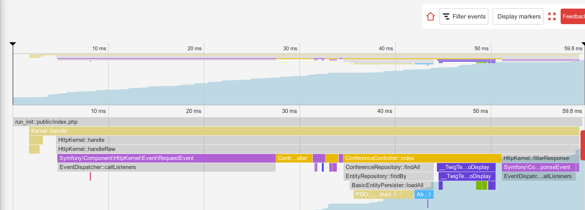

Descobrindo o Funcionamento Interno do Symfony
==============================================

.. index::
    single: Blackfire
    single: Debugging
    single: Internals

Usamos o Symfony para desenvolver uma aplicação poderosa por um bom tempo, mas a maior parte do código executado pela aplicação vem do Symfony. Algumas centenas de linhas de código versus milhares de linhas de código.

Eu gosto de entender como as coisas funcionam nos bastidores. E sempre fui fascinado por ferramentas que me ajudam a entender como as coisas funcionam. A primeira vez que usei um depurador gradual ou a primeira vez que descobri o ``ptrace`` são memórias mágicas.

Gostaria de entender melhor como funciona o Symfony? Está na hora de ver como o Symfony faz a sua aplicação funcionar. Ao invés de descrever como o Symfony lida com uma requisição HTTP a partir de uma perspectiva teórica, o que seria bastante chato, vamos utilizar o Blackfire para obter algumas representações visuais e usá-lo para descobrir alguns tópicos mais avançados.

Entendendo o Funcionamento Interno do Symfony com o Blackfire
-------------------------------------------------------------

Você já sabe que todas as requisições HTTP são servidas por um único ponto de entrada: o arquivo ``public/index.php``. Mas o que acontece depois? Como os controladores são chamados?

Vamos fazer o profile da página inicial em inglês em produção com o Blackfire através da extensão para navegadores do Blackfire:

.. code-block:: bash
    :class: ignore

    $ symfony remote:open

Ou diretamente através da linha de comando:

.. code-block:: bash
    :class: ignore

    $ blackfire curl `symfony env:urls --first`en/

Vá até a visualização da "Timeline" do profile, você deve ver algo semelhante ao seguinte:

A partir da timeline, passe o mouse sobre as barras coloridas para ter mais informações sobre cada chamada; você aprenderá muito sobre como o Symfony funciona:

* O ponto de entrada principal é ``public/index.php``;

* O método ``Kernel::handle()`` manipula a requisição;

* Ele chama o ``HttpKernel`` que despacha alguns eventos;

* O primeiro evento é o ``RequestEvent``;

* O método ``ControllerResolver::getController()`` é chamado para determinar qual controlador deve ser chamado para a URL recebida;

* O método ``ControllerResolver::getArguments()`` é chamado para determinar quais argumentos passar ao controlador (o conversor de parâmetros é chamado);

* O método ``ConferenceController::index()`` é chamado e a maior parte do nosso código é executado por essa chamada;

* O método ``ConferenceRepository::findAll()`` obtém todas as conferências do banco de dados (observe a conexão com o banco de dados via ``PDO::__construct()``);

* O método ``Twig\Environment::render()`` renderiza o template;

* Os eventos ``ResponseEvent`` e ``FinishRequestEvent`` são despachados, mas parece que nenhum listener está realmente registrado, pois a execução deles parece ser muito rápida.

A timeline é uma ótima forma de entender como alguns códigos funcionam; o que é muito útil quando você tem um projeto desenvolvido por outra pessoa.

Agora, faça o profile da mesma página a partir da máquina local no ambiente de desenvolvimento:

.. code-block:: bash
    :class: ignore

    $ blackfire curl `symfony var:export SYMFONY_PROJECT_DEFAULT_ROUTE_URL`en/

Abra o profile. Você deve ser redirecionado para a visualização do gráfico de chamadas já que a requisição foi realmente rápida e a timeline estaria bem vazia:

.. figure:: images/blackfire-homepage-cached-dev.png
    :alt: /
    :align: center
    :figclass: with-browser

Você entende o que está acontecendo? O cache HTTP está habilitado e, desta forma, estamos fazendo o profile da camada de cache HTTP do Symfony. Como a página está no cache, ``HttpCache\Store::restoreResponse()`` está obtendo a resposta HTTP do cache e o controlador nunca é chamado.

Desabilite a camada de cache em ``public/index.php`` como fizemos na etapa anterior e tente novamente. Você pode ver imediatamente que o profile parece muito diferente:

.. figure:: images/blackfire-homepage-dev.png
    :alt: /
    :align: center
    :figclass: with-browser

As principais diferenças são as seguintes:

* O ``TerminateEvent``, que não era visível em produção, ocupa uma grande porcentagem do tempo de execução; olhando mais de perto, você pode ver que esse é o evento responsável por armazenar os dados do Profiler do Symfony coletados durante a requisição;

* Sob a chamada ``ConferenceController::index()``, observe o método ``SubRequestHandler::handle()`` que renderiza o ESI (é por isso que temos duas chamadas para ``Profiler::saveProfile()``, uma para a requisição principal e outra para o ESI).

Explore a timeline para saber mais; mude para a visualização do gráfico de chamadas para ter uma representação diferente dos mesmos dados.

Como acabamos de descobrir, o código executado em desenvolvimento e produção é bem diferente. O ambiente de desenvolvimento é mais lento pois o Profiler do Symfony tenta reunir muitos dados para facilitar a depuração dos problemas. É por isso que o usuário deve sempre fazer o profile com o ambiente de produção, mesmo localmente.

Alguns experimentos interessantes: faça o profile de uma página de erro, faça o profile da página ``/`` (que é um redirecionamento) ou de um recurso da API. Cada profile lhe dirá um pouco mais sobre como o Symfony funciona, quais classes/métodos são chamados, o que é caro executar e o que é barato.

Usando o Complemento de Depuração do Blackfire
------------------------------------------------

.. index::
    single: Blackfire;Debug Addon

Por padrão, o Blackfire remove todas as chamadas de método que não são significativas o suficiente para evitar ter excesso de informação e gráficos grandes. Ao usar o Blackfire como uma ferramenta de depuração, é melhor manter todas as chamadas. Isso é fornecido pelo complemento de depuração.

A partir da linha de comando, use a flag ``--debug``:

.. code-block:: bash
    :class: ignore

    $ blackfire --debug curl `symfony var:export SYMFONY_PROJECT_DEFAULT_ROUTE_URL`en/
    $ blackfire --debug curl `symfony env:urls --first`en/

.. index::
    single: .env.local.prod

Em produção, você verá, por exemplo, o carregamento de um arquivo chamado ``.env.local.php``:

.. figure:: images/blackfire-env-local-prod.png
    :alt: /
    :align: center
    :figclass: with-browser

.. index::
    single: Composer;Optimizations
    single: Composer;Autoloader
    single: Autoloader

De onde ele vem? A SymfonyCloud faz algumas otimizações ao implantar uma aplicação Symfony, como a otimização do autoloader do Composer (``--optimize-autoloader --apcu-autoloader --classmap-authoritative``). Ela também otimiza as variáveis de ambiente definidas no arquivo ``.env`` (para evitar o processamento do arquivo em cada requisição) gerando o arquivo ``.env.local.php``:

.. code-block:: bash
    :class: ignore

    $ symfony run composer dump-env prod

O Blackfire é uma ferramenta muito poderosa que ajuda a entender como o código é executado pelo PHP. Melhorar o desempenho é apenas uma maneira de usar um profiler.
