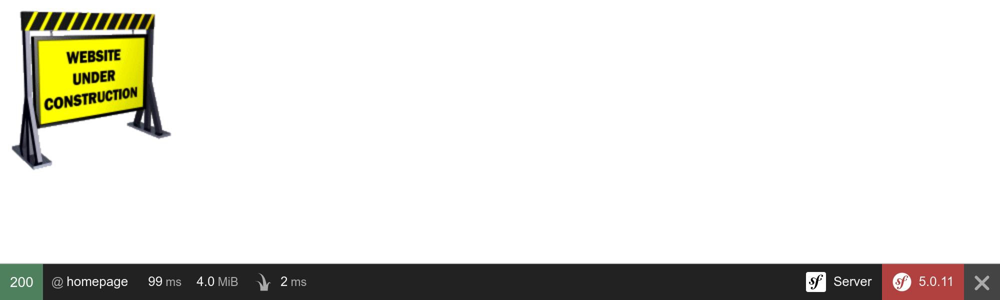

Criando um Controlador
======================

.. index::
    single: Controller
    single: Routing;Route

Nosso projeto do livro de visitas já está ativo nos servidores de produção, mas nós trapaceamos um pouco. O projeto ainda não tem nenhuma página web. A página inicial é exibida como uma entediante página de erro 404. Vamos resolver isso.

Quando uma requisição HTTP chega, como para a página inicial (``http://localhost:8000/``), o Symfony tenta encontrar uma *rota* que corresponda ao *caminho da requisição* (``/`` aqui). Uma *rota* é a ligação entre o caminho da requisição e um *callable do PHP*, uma função que cria a *resposta* HTTP para essa requisição.

Esses callables são chamados de "controladores". No Symfony, a maioria dos controladores são implementados como classes PHP. Você pode criar uma destas classes manualmente, mas como nós gostamos de ir rápido, vamos ver como o Symfony pode nos ajudar.

Evitando Esforço com o Bundle Maker
------------------------------------

.. index::
    single: Components;Maker Bundle
    single: Maker Bundle

Para gerar controladores sem esforço podemos usar o pacote ``symfony/maker-bundle``:

.. code-block:: bash

    $ symfony composer req maker --dev

Como o bundle Maker é útil apenas durante o desenvolvimento, não se esqueça de adicionar a flag ``--dev`` para evitar que ele seja habilitado em produção.

O bundle Maker ajuda a gerar várias classes diferentes. Vamos usá-lo o tempo todo neste livro. Cada "gerador" é definido em um comando e todos os comandos fazem parte do namespace de comando ``make``.

.. index::
    single: Command;list

O comando ``list`` que vem no Console do Symfony lista todos os comandos disponíveis em um determinado namespace; use-o para descobrir todos os geradores fornecidos pelo bundle Maker:

.. code-block:: bash
    :class: ignore

    $ symfony console list make

Escolhendo um Formato de Configuração
---------------------------------------

Antes de criar o primeiro controlador do projeto, precisamos decidir quais formatos de configuração queremos usar. O Symfony suporta YAML, XML, PHP e annotations sem necessidade de configuração.

Para *configurações relacionadas a pacotes*, *YAML* é a melhor escolha. Este é o formato usado no diretório ``config/``. Muitas vezes, quando você instala um novo pacote, a receita desse pacote adiciona um novo arquivo terminando em ``.yaml`` neste diretório.

Para *configurações relacionadas ao código PHP*, *annotations* é a melhor escolha, pois são definidas próximas ao código. Deixe-me explicar com um exemplo. Quando uma requisição chega, alguma configuração precisa dizer ao Symfony que o caminho da requisição deve ser tratado por um controlador específico (uma classe PHP). Ao usar os formatos de configuração YAML, XML ou PHP, dois arquivos estão envolvidos (o arquivo de configuração e o arquivo do controlador PHP). Ao usar annotations, a configuração é feita diretamente na classe do controlador.

Para gerenciar annotations, precisamos adicionar outra dependência:

.. code-block:: bash

    $ symfony composer req annotations

Você pode se perguntar, como adivinhar o nome do pacote que você precisa instalar para um recurso? Na maioria das vezes, você não precisa saber. Em muitos casos, o Symfony contém o pacote para instalar em suas mensagens de erro. Executar ``symfony make:controller`` sem o pacote ``annotations``, por exemplo, teria terminado com uma exceção contendo uma dica sobre a instalação do pacote correto.

Gerando um Controlador
----------------------

.. index::
    single: Command;make:controller

Crie o seu primeiro *Controlador* através do comando ``make:controller``:

.. code-block:: bash

    $ symfony console make:controller ConferenceController

.. index::
    single: Components;Routing
    single: Annotations;@Route

O comando cria uma classe ``ConferenceController`` no diretório ``src/Controller/``. A classe gerada consiste em algum código padrão pronto para ser otimizado:

.. code-block:: php
    :caption: src/Controller/ConferenceController.php
    :class: ignore
    :emphasize-lines: 10

    namespace App\Controller;

    use Symfony\Bundle\FrameworkBundle\Controller\AbstractController;
    use Symfony\Component\HttpFoundation\Response;
    use Symfony\Component\Routing\Annotation\Route;

    class ConferenceController extends AbstractController
    {
        /**
         * @Route("/conference", name="conference")
         */
        public function index(): Response
        {
            return $this->render('conference/index.html.twig', [
                'controller_name' => 'ConferenceController',
            ]);
        }
    }

A annotation ``@Route("/conference", name="conference")`` é o que torna o método ``index()`` um controlador (a configuração está próxima ao código que ela configura).

Quando você acessa ``/conference`` em um navegador, o controlador é executado e uma resposta é retornada.

Ajuste a rota para que coincida com a página inicial:

.. code-block:: diff
    :caption: patch_file
    :emphasize-lines: 8

    --- a/src/Controller/ConferenceController.php
    +++ b/src/Controller/ConferenceController.php
    @@ -9,7 +9,7 @@ use Symfony\Component\Routing\Annotation\Route;
     class ConferenceController extends AbstractController
     {
         /**
    -     * @Route("/conference", name="conference")
    +     * @Route("/", name="homepage")
          */
         public function index(): Response
         {

O ``name`` da rota será útil quando quisermos referenciar a página inicial no código. Em vez de deixarmos o caminho ``/`` fixo no código, usaremos o nome da rota.

Em vez da página padrão renderizada, vamos retornar uma página HTML simples:

.. code-block:: diff
    :caption: patch_file
    :emphasize-lines: 18

    --- a/src/Controller/ConferenceController.php
    +++ b/src/Controller/ConferenceController.php
    @@ -13,8 +13,13 @@ class ConferenceController extends AbstractController
          */
         public function index(): Response
         {
    -        return $this->render('conference/index.html.twig', [
    -            'controller_name' => 'ConferenceController',
    -        ]);
    +        return new Response(<<<EOF
    +<html>
    +    <body>
    +        
    +    </body>
    +</html>
    +EOF
    +        );
         }
     }

Atualize o navegador:

A principal responsabilidade de um controlador é retornar um objeto ``Response`` HTTP para a requisição.

.. _easter-egg:

Adicionando um Easter Egg
-------------------------

Para demonstrar como uma resposta pode aproveitar as informações da requisição, vamos adicionar um pequeno `Easter egg`_. Sempre que a página inicial tiver um parâmetro de URL como ``?hello=Fabien``, vamos adicionar um texto para cumprimentar a pessoa:

.. code-block:: diff
    :emphasize-lines: 16
    :class: ignore

    --- a/src/Controller/ConferenceController.php
    +++ b/src/Controller/ConferenceController.php
    @@ -3,6 +3,7 @@
     namespace App\Controller;

     use Symfony\Bundle\FrameworkBundle\Controller\AbstractController;
    +use Symfony\Component\HttpFoundation\Request;
     use Symfony\Component\HttpFoundation\Response;
     use Symfony\Component\Routing\Annotation\Route;

    @@ -11,11 +12,17 @@ class ConferenceController extends AbstractController
         /**
          * @Route("/", name="homepage")
          */
    -    public function index(): Response
    +    public function index(Request $request): Response
         {
    +        $greet = '';
    +        if ($name = $request->query->get('hello')) {
    +            $greet = sprintf('<h1>Hello %s!</h1>', htmlspecialchars($name));
    +        }
    +
             return new Response(<<<EOF
     <html>
         <body>
    +        $greet
             
         </body>
     </html>

O Symfony expõe os dados da requisição através de um objeto ``Request``. Quando o Symfony vê um argumento do controlador com essa declaração de tipo, ele automaticamente sabe passar o objeto para você. Podemos usá-lo para obter o item ``name`` dos parâmetros da URL e adicionar um título ``<h1>``.

Tente acessar ``/`` e então ``/?hello=Fabien`` em um navegador para ver a diferença.

.. note::

    Observe a chamada a ``htmlspecialchars()`` para evitar problemas de XSS. Isso é algo que será feito automaticamente para nós quando mudarmos para um mecanismo de template adequado.

Também poderíamos ter tornado o nome parte da URL:

.. code-block:: diff
    :emphasize-lines: 8,11
    :class: ignore

    --- a/src/Controller/ConferenceController.php
    +++ b/src/Controller/ConferenceController.php
    @@ -9,13 +9,19 @@ use Symfony\Component\Routing\Annotation\Route;
     class ConferenceController extends AbstractController
     {
         /**
    -     * @Route("/", name="homepage")
    +     * @Route("/hello/{name}", name="homepage")
          */
    -    public function index(): Response
    +    public function index(string $name = ''): Response
         {
    +        $greet = '';
    +        if ($name) {
    +            $greet = sprintf('<h1>Hello %s!</h1>', htmlspecialchars($name));
    +        }
    +
             return new Response(<<<EOF
     <html>
         <body>
    +        $greet
             
         </body>
     </html>

A parte ``{name}`` da rota é um *parâmetro de rota* dinâmico - ele funciona como um curinga. Agora você pode acessar ``/hello`` e então ``/hello/Fabien`` em um navegador para obter os mesmos resultados de antes. Você pode obter o *valor* do parâmetro ``{name}`` adicionando um argumento com o mesmo *nome* ao controlador. Então, ``$name``.

.. sidebar:: Indo Além

    * O sistema de `Roteamento <https://symfony.com/doc/current/routing.html>`_ do Symfony;

    * `SymfonyCasts: tutorial sobre rotas, controladores e páginas <https://symfonycasts.com/screencast/symfony/route-controller>`_;

    * `Annotations <https://www.doctrine-project.org/projects/doctrine-annotations/en/1.6/annotations.html>`_ em PHP;

    * O componente `HttpFoundation <https://symfony.com/doc/current/components/http_foundation.html>`_;

    * Ataques de segurança `XSS (Cross-Site Scripting) <https://owasp.org/www-community/attacks/xss/>`_;

    * A `Cheat Sheet das Rotas do Symfony <https://github.com/andreia/symfony-cheat-sheets/blob/master/Symfony4/routing_en_part1.pdf>`_.

.. _`Easter egg`: https://en.wikipedia.org/wiki/Easter_egg_(media)#In_computing
