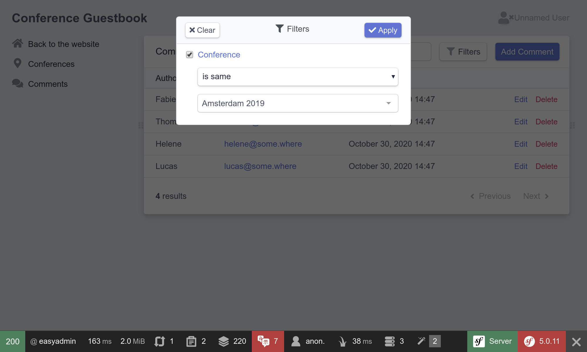

Configurando um Painel Administrativo
=====================================

.. index::
    single: EasyAdmin
    single: Admin
    single: Backend

Adicionar as próximas conferências ao banco de dados é tarefa dos administradores do projeto. Um *painel administrativo* é uma seção protegida do site onde *os administradores do projeto* podem gerenciar os dados do site, moderar os comentários enviados e muito mais.

Como podemos criar isso rápido? Usando um bundle que é capaz de gerar um painel administrativo baseado no modelo do projeto. O EasyAdmin se encaixa perfeitamente nessa tarefa.

Configurando o EasyAdmin
------------------------

Primeiro, adicione o EasyAdmin como uma dependência do projeto:

.. code-block:: bash

    $ symfony composer req "admin:^2"

Para configurar o EasyAdmin, um novo arquivo de configuração foi gerado por meio da sua receita do Flex:

.. code-block:: yaml
    :caption: config/packages/easy_admin.yaml
    :class: ignore

    #easy_admin:
    #    entities:
    #        # List the entity class name you want to manage
    #        - App\Entity\Product
    #        - App\Entity\Category
    #        - App\Entity\User

Quase todos os pacotes instalados têm uma configuração como esta dentro do diretório ``config/packages/``. Na maioria das vezes, os valores padrão foram escolhidos cuidadosamente para funcionar na maioria das aplicações.

Descomente as primeiras linhas e adicione as classes de modelo do projeto:

.. code-block:: yaml
    :caption: config/packages/easy_admin.yaml

    easy_admin:
        entities:
            - App\Entity\Conference
            - App\Entity\Comment

Acesse o painel administrativo gerado em ``/admin``. Boom! Uma interface de administração agradável e rica em recursos para conferências e comentários:

.. figure:: screenshots/easy-admin-empty.png
    :alt: /admin/
    :align: center
    :figclass: with-browser

.. tip::

    Why is the backend accessible under ``/admin``? That's the default prefix configured in ``config/routes/easy_admin.yaml``:

    .. code-block:: yaml
        :caption: config/routes/easy_admin.yaml
        :class: ignore

        easy_admin_bundle:
            resource: '@EasyAdminBundle/Controller/EasyAdminController.php'
            prefix: /admin
            type: annotation

    You can change it to anything you like.

Adding conferences and comments is not possible yet as you would get an error: ``Object of class App\Entity\Conference could not be converted to string``. EasyAdmin tries to display the conference related to comments, but it can only do so if there is a string representation of a conference. Fix it by adding a ``__toString()`` method on the ``Conference`` class:

.. code-block:: diff
    :caption: patch_file

    --- a/src/Entity/Conference.php
    +++ b/src/Entity/Conference.php
    @@ -44,6 +44,11 @@ class Conference
             $this->comments = new ArrayCollection();
         }

    +    public function __toString(): string
    +    {
    +        return $this->city.' '.$this->year;
    +    }
    +
         public function getId(): ?int
         {
             return $this->id;

Faça o mesmo para a classe ``Comment``:

.. code-block:: diff
    :caption: patch_file

    --- a/src/Entity/Comment.php
    +++ b/src/Entity/Comment.php
    @@ -48,6 +48,11 @@ class Comment
          */
         private $photoFilename;

    +    public function __toString(): string
    +    {
    +        return (string) $this->getEmail();
    +    }
    +
         public function getId(): ?int
         {
             return $this->id;

Agora você pode adicionar/modificar/excluir conferências diretamente do painel administrativo. Use-o e adicione pelo menos uma conferência.

.. figure:: screenshots/easy-admin.png
    :alt: /admin/?entity=Conference&action=list
    :align: center
    :figclass: with-browser

Adicione alguns comentários sem fotos. Defina a data manualmente por enquanto; iremos preencher a coluna ``createdAt`` automaticamente em um passo posterior.

.. figure:: screenshots/easy-admin-comments.png
    :alt: /admin/?entity=Comment&action=list
    :align: center
    :figclass: with-browser

Personalizando o EasyAdmin
--------------------------

O painel administrativo padrão funciona bem, mas pode ser personalizado de muitas maneiras para melhorar a experiência. Vamos fazer algumas mudanças simples para demonstrar as possibilidades. Substitua a configuração atual pela seguinte:

.. code-block:: yaml
    :caption: config/packages/easy_admin.yaml

    easy_admin:
        site_name: Conference Guestbook

        design:
            menu:
                - { route: 'homepage', label: 'Back to the website', icon: 'home' }
                - { entity: 'Conference', label: 'Conferences', icon: 'map-marker' }
                - { entity: 'Comment', label: 'Comments', icon: 'comments' }

        entities:
            Conference:
                class: App\Entity\Conference

            Comment:
                class: App\Entity\Comment
                list:
                    fields:
                        - author
                        - { property: 'email', type: 'email' }
                        - { property: 'createdAt', type: 'datetime' }
                    sort: ['createdAt', 'ASC']
                    filters: ['conference']
                edit:
                    fields:
                        - { property: 'conference' }
                        - { property: 'createdAt', type: datetime, type_options: { disabled: true } }
                        - 'author'
                        - { property: 'email', type: 'email' }
                        - text

We have overridden the ``design`` section to add icons to the menu items and to add a link back to the website home page.

For the ``Comment`` section, listing the fields lets us order them the way we want. Some fields are tweaked, like setting the creation date to read-only. The ``filters`` section defines which filters to expose on top of the regular search field.

Estas personalizações são apenas uma pequena introdução às possibilidades oferecidas pelo EasyAdmin.

Brinque com a área de administração, filtre os comentários por conferência ou pesquise comentários por e-mail, por exemplo. O único problema é que qualquer um pode acessar o backend. Não se preocupe, vamos protegê-lo em uma etapa futura.

.. code-block:: bash
    :class: hide

    $ symfony run psql -c "TRUNCATE conference RESTART IDENTITY CASCADE"

.. sidebar:: Indo Além

    * `EasyAdmin docs <https://symfony.com/doc/2.x/bundles/EasyAdminBundle/index.html>`_;

    * `SymfonyCasts EasyAdminBundle tutorial <https://symfonycasts.com/screencast/easyadminbundle>`_;

    * `Referência de configuração do framework Symfony <https://symfony.com/doc/current/reference/configuration/framework.html>`_.
