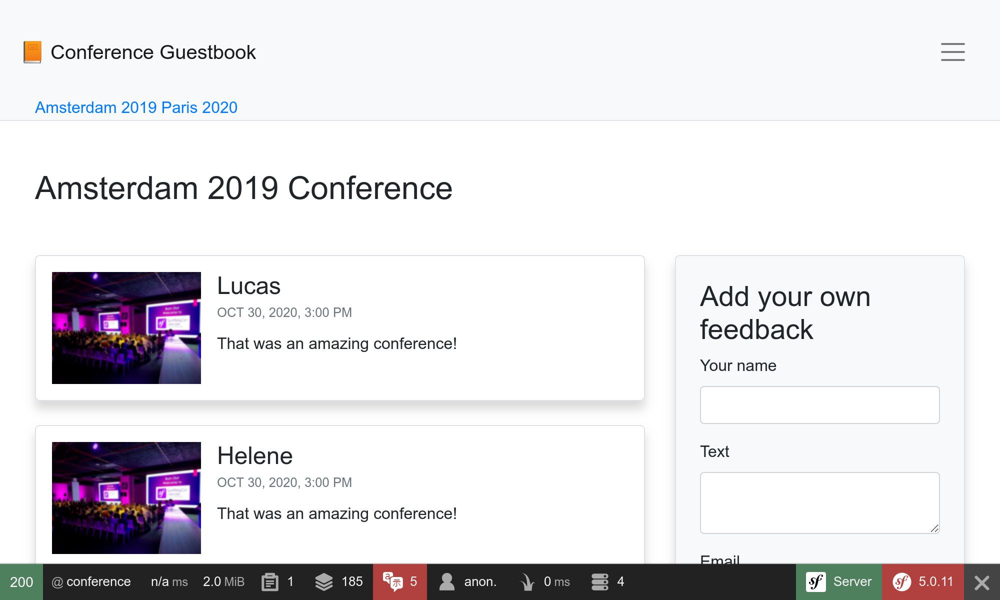
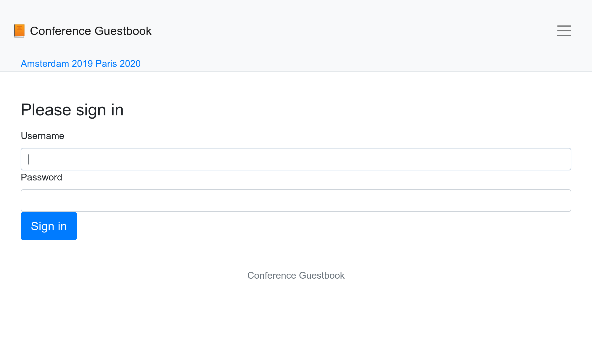

Stilarea interfeței cu Webpack
===============================

.. index::
    single: Encore
    single: Webpack
    single: Components;Encore
    single: Stylesheet

Nu am acordat timp pentru proiectarea interfeței de utilizator. Pentru a adăuga stiluri ca un profesionist, vom folosi unelte moderne, inclusiv `Webpack <https://webpack.js.org/>`_. Pentru a ușura integrarea acestuia cu aplicația, instalăm *Webpack Encore*:

.. code-block:: bash

    $ symfony composer req encore

Un mediu Webpack complet a fost creat pentru tine: ``package.json`` și ``webpack.config.js`` au fost generate și conțin o configurație implicită bună. Deschide ``webpack.config.js``, utilizează abstracția Encore pentru a configura Webpack.

Fișierul ``package.json`` definește câteva comenzi utile pe care le vom utiliza tot timpul.

Directorul ``assets`` conține principalele puncte de intrare pentru componentele de stilizare a proiectului: ``styles/app.css`` și ``app.js``.

Folosind Sass
-------------

.. index::
    single: Sass

În loc să utilizăm CSS simplu, să trecem la `Saas <https://sass-lang.com/>`_:

.. code-block:: bash

    $ mv assets/styles/app.css assets/styles/app.scss

.. code-block:: diff
    :caption: patch_file

    --- a/assets/app.js
    +++ b/assets/app.js
    @@ -6,7 +6,7 @@
      */

     // any CSS you import will output into a single css file (app.css in this case)
    -import './styles/app.css';
    +import './styles/app.scss';

     // Need jQuery? Install it with "yarn add jquery", then uncomment to import it.
     // import $ from 'jquery';

Instalează procesatorul Sass:

.. code-block:: bash

    $ yarn add node-sass sass-loader --dev

Și activează loader-ul Sass în webpack:

.. code-block:: diff
    :caption: patch_file

    --- a/webpack.config.js
    +++ b/webpack.config.js
    @@ -54,7 +54,7 @@ Encore
         })

         // enables Sass/SCSS support
    -    //.enableSassLoader()
    +    .enableSassLoader()

         // uncomment if you use TypeScript
         //.enableTypeScriptLoader()

De unde am știut ce pachete să instalez? Dacă am fi încercat să ne construim fișierele de stilizare fără ele, Encore ne-ar fi dat un frumos mesaj de eroare sugerând comanda ``yarn add`` necesară instalării dependențelor pentru a încărca fișierele ``.scss``.

Folosind Bootstrap
------------------

.. index::
    single: Bootstrap

Pentru a începe cu setări prestabilite bune și a construi un site web sensibil, un framework CSS precum `Bootstrap <https://getbootstrap.com/>`_ poate scurta procesul cu mult. Instalează-l ca pachet:

.. code-block:: bash

    $ yarn add bootstrap jquery popper.js bs-custom-file-input --dev

Solicită Bootstrap în fișierul CSS (am mai curățat fișierul):

.. code-block:: diff
    :caption: patch_file

    --- a/assets/styles/app.scss
    +++ b/assets/styles/app.scss
    @@ -1,3 +1 @@
    -body {
    -    background-color: lightgray;
    -}
    +@import '~bootstrap/scss/bootstrap';

Fă același lucru pentru fișierul JS:

.. code-block:: diff
    :caption: patch_file

    --- a/assets/app.js
    +++ b/assets/app.js
    @@ -7,8 +7,7 @@

     // any CSS you import will output into a single css file (app.css in this case)
     import './styles/app.scss';
    +import 'bootstrap';
    +import bsCustomFileInput from 'bs-custom-file-input';

    -// Need jQuery? Install it with "yarn add jquery", then uncomment to import it.
    -// import $ from 'jquery';
    -
    -console.log('Hello Webpack Encore! Edit me in assets/app.js');
    +bsCustomFileInput.init();

Sistemul de formulare Symfony acceptă Bootstrap nativ cu o temă specială, activează-l:

.. code-block:: yaml
    :caption: config/packages/twig.yaml

    twig:
        form_themes: ['bootstrap_4_layout.html.twig']

Stilizarea HTML-ului
--------------------

Suntem gata acum să stilăm aplicația. Descărcați și extindeți arhiva de la rădăcina proiectului:

.. code-block:: bash

    $ php -r "copy('https://symfony.com/uploads/assets/guestbook-5.0.zip', 'guestbook-5.0.zip');"
    $ unzip -o guestbook-5.0.zip
    $ rm guestbook-5.0.zip

Aruncă o privire la șabloane, poți afla un truc sau două despre Twig.

Compilând assets-urile web
---------------------------

.. index::
    single: Symfony CLI;run

O schimbare majoră atunci când utilizezi Webpack este că fișierele CSS și JS nu pot fi utilizate direct de aplicație. Mai întâi trebuie „compilate”.

În dezvoltare, compilarea fișierelor de stilizare se poate face prin comanda ``encore dev``:

.. code-block:: bash

    $ symfony run yarn encore dev

În loc de executarea comenzii de fiecare dată când există o schimbare, trimite-l la fundal și lasă-l să urmărească modificările JS și CSS:

.. code-block:: bash
    :class: ignore

    $ symfony run -d yarn encore dev --watch

Explorează schimbările vizuale. Aruncă o privire la noul design într-un browser.

.. figure:: screenshots/design-homepage.png
    :alt: /
    :align: center
    :figclass: with-browser

Formularul de autentificare generat este acum stilat, precum și pachetul Maker utilizează în mod implicit clasele CSS Bootstrap:

Pentru producție, SymfonyCloud detectează automat utilizarea Encore și compilează fișierele necesare pentru tine în timpul fazei de construcție.

.. sidebar:: Mergând mai departe

    * `Documentația Webpack <https://webpack.js.org/concepts/>`_;

    * `Documentația Symfony Webpack Encore <https://symfony.com/doc/current/frontend.html>`_;

    * `Tutorial SymfonyCasts Webpack Encore <https://symfonycasts.com/screencast/webpack-encore>`_.
