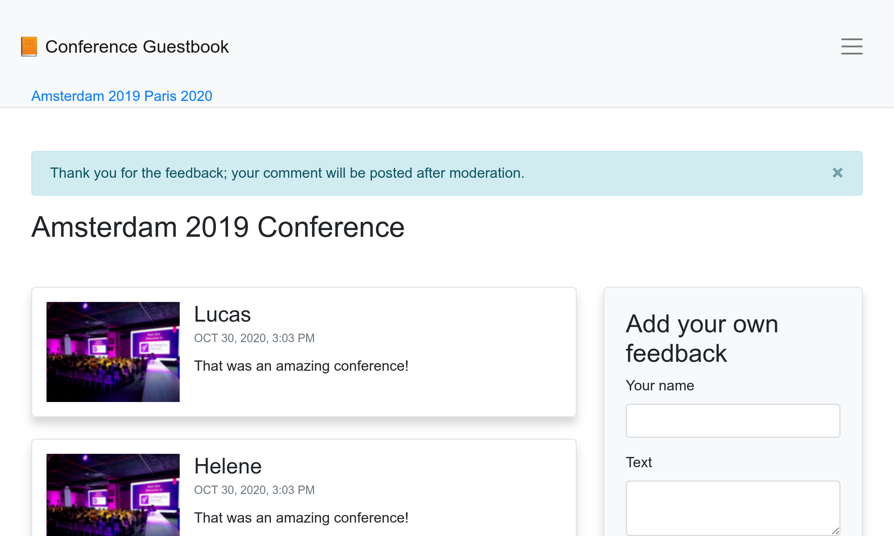
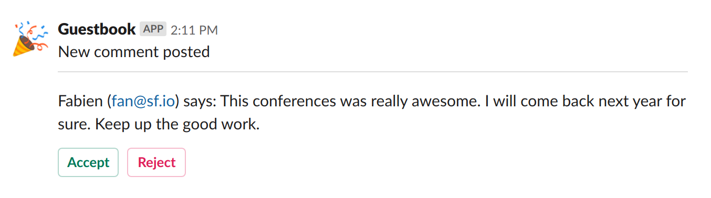

Notificarea prin toate mijloacele
=================================

Aplicația Cartea de oaspeți adună recenzii despre conferințe. Însă pentru moment nu suntem tocmai transparenți cu utilizatorii noștri.

As comments are moderated, they probably don't understand why their comments are not published instantly. They might even re-submit them thinking there was some technical problems. Giving them feedback after posting a comment would be
great.

De asemenea, ar trebui să-i anunțăm când comentariile lor au fost publicate. Cerem email-ul lor, deci ar fi bine să-l folosim.

Există multe modalități de notificare a utilizatorilor. E-mailul este primul suport la care te-ai putea gândi, dar notificările din aplicația web sunt altele. Ne-am putea gândi chiar să expediem mesaje SMS, să postăm un mesaj pe Slack sau Telegram. Există multe opțiuni.

.. index::
    single: Components;Notifier
    single: Notifier

Componenta Symfony Notifier implementează multe strategii de notificare:

.. code-block:: bash

    $ symfony composer req notifier

Expedierea notificărilor pentru aplicații web în browser
-----------------------------------------------------------

.. index::
    single: Flash Messages

Ca prim pas, să notificăm utilizatorilor direct în browser că comentariile sunt moderate după transmiterea lor:

.. code-block:: diff
    :caption: patch_file

    --- a/src/Controller/ConferenceController.php
    +++ b/src/Controller/ConferenceController.php
    @@ -14,6 +14,8 @@ use Symfony\Component\HttpFoundation\File\Exception\FileException;
     use Symfony\Component\HttpFoundation\Request;
     use Symfony\Component\HttpFoundation\Response;
     use Symfony\Component\Messenger\MessageBusInterface;
    +use Symfony\Component\Notifier\Notification\Notification;
    +use Symfony\Component\Notifier\NotifierInterface;
     use Symfony\Component\Routing\Annotation\Route;
     use Twig\Environment;

    @@ -59,7 +61,7 @@ class ConferenceController extends AbstractController
         /**
          * @Route("/conference/{slug}", name="conference")
          */
    -    public function show(Request $request, Conference $conference, CommentRepository $commentRepository, string $photoDir): Response
    +    public function show(Request $request, Conference $conference, CommentRepository $commentRepository, NotifierInterface $notifier, string $photoDir): Response
         {
             $comment = new Comment();
             $form = $this->createForm(CommentFormType::class, $comment);
    @@ -88,9 +90,15 @@ class ConferenceController extends AbstractController

                 $this->bus->dispatch(new CommentMessage($comment->getId(), $context));

    +            $notifier->send(new Notification('Thank you for the feedback; your comment will be posted after moderation.', ['browser']));
    +
                 return $this->redirectToRoute('conference', ['slug' => $conference->getSlug()]);
             }

    +        if ($form->isSubmitted()) {
    +            $notifier->send(new Notification('Can you check your submission? There are some problems with it.', ['browser']));
    +        }
    +
             $offset = max(0, $request->query->getInt('offset', 0));
             $paginator = $commentRepository->getCommentPaginator($conference, $offset);

Notificatorul *expediază* o *notificare*  *destinatarilor printr-un *canal*.

O notificare are un subiect, un conținut opțional și un nivel de importanță.

O notificare este trimisă pe unul sau mai multe canale în funcție de importanța lor. Poți expedia notificări urgente prin SMS și cele obișnuite prin e-mail, de exemplu.

Pentru notificările browserului, nu avem destinatari.

.. index::
    single: Twig;for

Notificarea browserului utilizează *mesaje flash* prin secțiunea *notificare*. Trebuie să le afișăm actualizând șablonul conferinței:

.. code-block:: diff
    :caption: patch_file

    --- a/templates/conference/show.html.twig
    +++ b/templates/conference/show.html.twig
    @@ -3,6 +3,13 @@
     Conference Guestbook - {{ conference }}

     
    +    
    +        

    +            {{ message }}
    +            <button type="button" class="close" data-dismiss="alert" aria-label="Close">&times;</button>
    +        

    +    
    +
         <h2 class="mb-5">
             {{ conference }} Conference
         </h2>

Utilizatorii vor fi anunțați acum că mesajul lor este moderat:

Ca bonus suplimentar, avem o notificare frumoasă în partea de sus a site-ului web, dacă există o eroare de formular:

.. figure:: screenshots/form-error-notification.png
    :alt: /conference/amsterdam-2019
    :align: center
    :figclass: with-browser

.. tip::

    Mesajele flash folosesc *sesiunea HTTP* ca mediu de stocare. Principala consecință este dezactivarea cache-ul HTTP, deoarece sistemul de sesiune trebuie pornit pentru a verifica dacă există mesaje.

    Acesta este motivul pentru care am adăugat fragmentul de mesaje flash în șablonul ``show.html.twig`` și nu în cel de bază, deoarece am fi pierdut memoria cache HTTP pentru pagina principală.

Notificarea administratorilor prin e-mail
-----------------------------------------

În loc să expediezi un e-mail prin ``MailerInterface`` pentru a anunța administratorul că un comentariu tocmai a fost postat, utilizăm componenta Notifier în handler-ul mesajului:

.. code-block:: diff
    :caption: patch_file

    --- a/src/MessageHandler/CommentMessageHandler.php
    +++ b/src/MessageHandler/CommentMessageHandler.php
    @@ -4,14 +4,14 @@ namespace App\MessageHandler;

     use App\ImageOptimizer;
     use App\Message\CommentMessage;
    +use App\Notification\CommentReviewNotification;
     use App\Repository\CommentRepository;
     use App\SpamChecker;
     use Doctrine\ORM\EntityManagerInterface;
     use Psr\Log\LoggerInterface;
    -use Symfony\Bridge\Twig\Mime\NotificationEmail;
    -use Symfony\Component\Mailer\MailerInterface;
     use Symfony\Component\Messenger\Handler\MessageHandlerInterface;
     use Symfony\Component\Messenger\MessageBusInterface;
    +use Symfony\Component\Notifier\NotifierInterface;
     use Symfony\Component\Workflow\WorkflowInterface;

     class CommentMessageHandler implements MessageHandlerInterface
    @@ -21,22 +21,20 @@ class CommentMessageHandler implements MessageHandlerInterface
         private $commentRepository;
         private $bus;
         private $workflow;
    -    private $mailer;
    +    private $notifier;
         private $imageOptimizer;
    -    private $adminEmail;
         private $photoDir;
         private $logger;

    -    public function __construct(EntityManagerInterface $entityManager, SpamChecker $spamChecker, CommentRepository $commentRepository, MessageBusInterface $bus, WorkflowInterface $commentStateMachine, MailerInterface $mailer, ImageOptimizer $imageOptimizer, string $adminEmail, string $photoDir, LoggerInterface $logger = null)
    +    public function __construct(EntityManagerInterface $entityManager, SpamChecker $spamChecker, CommentRepository $commentRepository, MessageBusInterface $bus, WorkflowInterface $commentStateMachine, NotifierInterface $notifier, ImageOptimizer $imageOptimizer, string $photoDir, LoggerInterface $logger = null)
         {
             $this->entityManager = $entityManager;
             $this->spamChecker = $spamChecker;
             $this->commentRepository = $commentRepository;
             $this->bus = $bus;
             $this->workflow = $commentStateMachine;
    -        $this->mailer = $mailer;
    +        $this->notifier = $notifier;
             $this->imageOptimizer = $imageOptimizer;
    -        $this->adminEmail = $adminEmail;
             $this->photoDir = $photoDir;
             $this->logger = $logger;
         }
    @@ -62,13 +60,7 @@ class CommentMessageHandler implements MessageHandlerInterface

                 $this->bus->dispatch($message);
             } elseif ($this->workflow->can($comment, 'publish') || $this->workflow->can($comment, 'publish_ham')) {
    -            $this->mailer->send((new NotificationEmail())
    -                ->subject('New comment posted')
    -                ->htmlTemplate('emails/comment_notification.html.twig')
    -                ->from($this->adminEmail)
    -                ->to($this->adminEmail)
    -                ->context(['comment' => $comment])
    -            );
    +            $this->notifier->send(new CommentReviewNotification($comment), ...$this->notifier->getAdminRecipients());
             } elseif ($this->workflow->can($comment, 'optimize')) {
                 if ($comment->getPhotoFilename()) {
                     $this->imageOptimizer->resize($this->photoDir.'/'.$comment->getPhotoFilename());

Metoda ``getAdminRecipients()`` returnează destinatarii admin așa cum au fost setați în configurația notificatorului; actualizeaz-o acum pentru a adăuga propria adresă de e-mail:

.. code-block:: diff
    :caption: patch_file

    --- a/config/packages/notifier.yaml
    +++ b/config/packages/notifier.yaml
    @@ -13,4 +13,4 @@ framework:
                 medium: ['email']
                 low: ['email']
             admin_recipients:
    -            - { email: admin@example.com }
    +            - { email: "%env(string:default:default_admin_email:ADMIN_EMAIL)%" }

Acum, creează clasa ``CommentReviewNotification``:

.. code-block:: php
    :caption: src/Notification/CommentReviewNotification.php

    namespace App\Notification;

    use App\Entity\Comment;
    use Symfony\Component\Notifier\Message\EmailMessage;
    use Symfony\Component\Notifier\Notification\EmailNotificationInterface;
    use Symfony\Component\Notifier\Notification\Notification;
    use Symfony\Component\Notifier\Recipient\Recipient;

    class CommentReviewNotification extends Notification implements EmailNotificationInterface
    {
        private $comment;

        public function __construct(Comment $comment)
        {
            $this->comment = $comment;

            parent::__construct('New comment posted');
        }

        public function asEmailMessage(Recipient $recipient, string $transport = null): ?EmailMessage
        {
            $message = EmailMessage::fromNotification($this, $recipient, $transport);
            $message->getMessage()
                ->htmlTemplate('emails/comment_notification.html.twig')
                ->context(['comment' => $this->comment])
            ;

            return $message;
        }
    }

Metoda ``asEmailMessage()`` din ``EmailNotificationInterface`` este opțională, dar permite personalizarea e-mailului.

Unul dintre avantajele folosirii notificatorului în loc de expeditorul direct pentru trimterea email-urilor, este că decuplează notificarea de „canalul” folosit pentru acesta. După cum vezi, nimic nu spune în mod explicit că notificarea trebuie expediată prin e-mail.

În schimb, canalul este configurat în ``config/packages/notifier.yaml`` în funcție de *importanța* notificării (``low`` în mod implicit):

.. code-block:: yaml
    :caption: config/packages/notifier.yaml
    :class: ignore

    framework:
    notifier:
        channel_policy:
            # use chat/slack, chat/telegram, sms/twilio or sms/nexmo
            urgent: ['email']
            high: ['email']
            medium: ['email']
            low: ['email']

Am vorbit despre canalele ``browser`` și ``e-mail``. Haideți să vedem unele mai extraordinare.

Chat cu administratorii
-----------------------

.. index::
    single: Slack

Să fim sinceri, cu toții așteptăm feedback pozitiv. Sau cel puțin feedback constructiv. Dacă cineva postează un comentariu cu cuvinte precum „grozav” sau „minunat”, am putea dori să le acceptăm mai repede decât celelalte.

Pentru astfel de mesaje, dorim să fim avertizați pe un sistem de mesagerie instantanee precum Slack sau Telegram, pe lângă e-mailul obișnuit.

.. index::
    single: Components;Notifier
    single: Notifier

Instalează componenta Slack pentru Symfony Notifier:

.. code-block:: bash

    $ symfony composer req slack-notifier

Pentru a începe, compune DSN Slack cu un jeton de acces Slack și identificatorul canalului Slack unde dorești să expediezi mesaje: ``slack://ACCESS_TOKEN@default?channel=CHANNEL``.

.. index::
    single: Command;secrets:set

Deoarece simbolul de acces este secret, păstrează Slack DSN în spațiul de stocare secret:

.. code-block:: bash
    :class: answers(slack://ACCESS_TOKEN@default?channel=CHANNEL)

    $ symfony console secrets:set SLACK_DSN

Fă același lucru pentru producție:

.. code-block:: bash
    :class: answers(slack://ACCESS_TOKEN@default?channel=CHANNEL)

    $ APP_ENV=prod symfony console secrets:set SLACK_DSN

Activează suportul pentru chat Slack:

.. code-block:: diff
    :caption: patch_file

    --- a/config/packages/notifier.yaml
    +++ b/config/packages/notifier.yaml
    @@ -1,7 +1,7 @@
     framework:
         notifier:
    -        #chatter_transports:
    -        #    slack: '%env(SLACK_DSN)%'
    +        chatter_transports:
    +            slack: '%env(SLACK_DSN)%'
             #    telegram: '%env(TELEGRAM_DSN)%'
             #texter_transports:
             #    twilio: '%env(TWILIO_DSN)%'

Actualizează clasa de notificare pentru a rota mesajele în funcție de conținutul textului de comentarii (un simplu regex va face treaba):

.. code-block:: diff
    :caption: patch_file

    --- a/src/Notification/CommentReviewNotification.php
    +++ b/src/Notification/CommentReviewNotification.php
    @@ -29,4 +29,15 @@ class CommentReviewNotification extends Notification implements EmailNotificatio

             return $message;
         }
    +
    +    public function getChannels(Recipient $recipient): array
    +    {
    +        if (preg_match('{\b(great|awesome)\b}i', $this->comment->getText())) {
    +            return ['email', 'chat/slack'];
    +        }
    +
    +        $this->importance(Notification::IMPORTANCE_LOW);
    +
    +        return ['email'];
    +    }
     }

De asemenea, am schimbat importanța comentariilor „obișnuite”, deoarece modifică ușor designul e-mailului.

Și gata! Expediem un comentariu cu „minunat” în text, ar trebui să primești un mesaj pe Slack.

În ceea ce privește e-mailul, poți implementa ``ChatNotificationInterface`` pentru a trece peste redarea implicită a mesajului Slack:

.. code-block:: diff
    :caption: patch_file

    --- a/src/Notification/CommentReviewNotification.php
    +++ b/src/Notification/CommentReviewNotification.php
    @@ -3,12 +3,17 @@
     namespace App\Notification;

     use App\Entity\Comment;
    +use Symfony\Component\Notifier\Bridge\Slack\Block\SlackDividerBlock;
    +use Symfony\Component\Notifier\Bridge\Slack\Block\SlackSectionBlock;
    +use Symfony\Component\Notifier\Bridge\Slack\SlackOptions;
    +use Symfony\Component\Notifier\Message\ChatMessage;
     use Symfony\Component\Notifier\Message\EmailMessage;
    +use Symfony\Component\Notifier\Notification\ChatNotificationInterface;
     use Symfony\Component\Notifier\Notification\EmailNotificationInterface;
     use Symfony\Component\Notifier\Notification\Notification;
     use Symfony\Component\Notifier\Recipient\Recipient;

    -class CommentReviewNotification extends Notification implements EmailNotificationInterface
    +class CommentReviewNotification extends Notification implements EmailNotificationInterface, ChatNotificationInterface
     {
         private $comment;

    @@ -30,6 +35,28 @@ class CommentReviewNotification extends Notification implements EmailNotificatio
             return $message;
         }

    +    public function asChatMessage(Recipient $recipient, string $transport = null): ?ChatMessage
    +    {
    +        if ('slack' !== $transport) {
    +            return null;
    +        }
    +
    +        $message = ChatMessage::fromNotification($this, $recipient, $transport);
    +        $message->subject($this->getSubject());
    +        $message->options((new SlackOptions())
    +            ->iconEmoji('tada')
    +            ->iconUrl('https://guestbook.example.com')
    +            ->username('Guestbook')
    +            ->block((new SlackSectionBlock())->text($this->getSubject()))
    +            ->block(new SlackDividerBlock())
    +            ->block((new SlackSectionBlock())
    +                ->text(sprintf('%s (%s) says: %s', $this->comment->getAuthor(), $this->comment->getEmail(), $this->comment->getText()))
    +            )
    +        );
    +
    +        return $message;
    +    }
    +
         public function getChannels(Recipient $recipient): array
         {
             if (preg_match('{\b(great|awesome)\b}i', $this->comment->getText())) {

Este mai bine, dar să facem un pas mai departe. Nu ar fi minunat să poți accepta sau respinge un comentariu direct din Slack?

Modifică notificarea pentru a accepta adresa URL de revizuire și adaugă două butoane în mesajul Slack:

.. code-block:: diff
    :caption: patch_file

    --- a/src/Notification/CommentReviewNotification.php
    +++ b/src/Notification/CommentReviewNotification.php
    @@ -3,6 +3,7 @@
     namespace App\Notification;

     use App\Entity\Comment;
    +use Symfony\Component\Notifier\Bridge\Slack\Block\SlackActionsBlock;
     use Symfony\Component\Notifier\Bridge\Slack\Block\SlackDividerBlock;
     use Symfony\Component\Notifier\Bridge\Slack\Block\SlackSectionBlock;
     use Symfony\Component\Notifier\Bridge\Slack\SlackOptions;
    @@ -16,10 +17,12 @@ use Symfony\Component\Notifier\Recipient\Recipient;
     class CommentReviewNotification extends Notification implements EmailNotificationInterface, ChatNotificationInterface
     {
         private $comment;
    +    private $reviewUrl;

    -    public function __construct(Comment $comment)
    +    public function __construct(Comment $comment, string $reviewUrl)
         {
             $this->comment = $comment;
    +        $this->reviewUrl = $reviewUrl;

             parent::__construct('New comment posted');
         }
    @@ -52,6 +55,10 @@ class CommentReviewNotification extends Notification implements EmailNotificatio
                 ->block((new SlackSectionBlock())
                     ->text(sprintf('%s (%s) says: %s', $this->comment->getAuthor(), $this->comment->getEmail(), $this->comment->getText()))
                 )
    +            ->block((new SlackActionsBlock())
    +                ->button('Accept', $this->reviewUrl, 'primary')
    +                ->button('Reject', $this->reviewUrl.'?reject=1', 'danger')
    +            )
             );

             return $message;

Acum trebuie să urmărim modificările înapoi. În primul rând, actualizează handler-ul de mesaje pentru a transmite adresa URL a recenziei:

.. code-block:: diff
    :caption: patch_file

    --- a/src/MessageHandler/CommentMessageHandler.php
    +++ b/src/MessageHandler/CommentMessageHandler.php
    @@ -60,7 +60,8 @@ class CommentMessageHandler implements MessageHandlerInterface

                 $this->bus->dispatch($message);
             } elseif ($this->workflow->can($comment, 'publish') || $this->workflow->can($comment, 'publish_ham')) {
    -            $this->notifier->send(new CommentReviewNotification($comment), ...$this->notifier->getAdminRecipients());
    +            $notification = new CommentReviewNotification($comment, $message->getReviewUrl());
    +            $this->notifier->send($notification, ...$this->notifier->getAdminRecipients());
             } elseif ($this->workflow->can($comment, 'optimize')) {
                 if ($comment->getPhotoFilename()) {
                     $this->imageOptimizer->resize($this->photoDir.'/'.$comment->getPhotoFilename());

După cum poți vedea, adresa URL a recenziei ar trebui să facă parte din mesajul de comentariu, să o adăugăm acum:

.. code-block:: diff
    :caption: patch_file

    --- a/src/Message/CommentMessage.php
    +++ b/src/Message/CommentMessage.php
    @@ -5,14 +5,21 @@ namespace App\Message;
     class CommentMessage
     {
         private $id;
    +    private $reviewUrl;
         private $context;

    -    public function __construct(int $id, array $context = [])
    +    public function __construct(int $id, string $reviewUrl, array $context = [])
         {
             $this->id = $id;
    +        $this->reviewUrl = $reviewUrl;
             $this->context = $context;
         }

    +    public function getReviewUrl(): string
    +    {
    +        return $this->reviewUrl;
    +    }
    +
         public function getId(): int
         {
             return $this->id;

În cele din urmă, actualizează controlerele pentru a genera adresa URL de revizuire și pentru a o transmite în constructorul de mesaje de comentarii:

.. code-block:: diff
    :caption: patch_file

    --- a/src/Controller/AdminController.php
    +++ b/src/Controller/AdminController.php
    @@ -12,6 +12,7 @@ use Symfony\Component\HttpFoundation\Response;
     use Symfony\Component\HttpKernel\KernelInterface;
     use Symfony\Component\Messenger\MessageBusInterface;
     use Symfony\Component\Routing\Annotation\Route;
    +use Symfony\Component\Routing\Generator\UrlGeneratorInterface;
     use Symfony\Component\Workflow\Registry;
     use Twig\Environment;

    @@ -51,7 +52,8 @@ class AdminController extends AbstractController
             $this->entityManager->flush();

             if ($accepted) {
    -            $this->bus->dispatch(new CommentMessage($comment->getId()));
    +            $reviewUrl = $this->generateUrl('review_comment', ['id' => $comment->getId()], UrlGeneratorInterface::ABSOLUTE_URL);
    +            $this->bus->dispatch(new CommentMessage($comment->getId(), $reviewUrl));
             }

             return $this->render('admin/review.html.twig', [
    --- a/src/Controller/ConferenceController.php
    +++ b/src/Controller/ConferenceController.php
    @@ -17,6 +17,7 @@ use Symfony\Component\Messenger\MessageBusInterface;
     use Symfony\Component\Notifier\Notification\Notification;
     use Symfony\Component\Notifier\NotifierInterface;
     use Symfony\Component\Routing\Annotation\Route;
    +use Symfony\Component\Routing\Generator\UrlGeneratorInterface;
     use Twig\Environment;

     class ConferenceController extends AbstractController
    @@ -88,7 +89,8 @@ class ConferenceController extends AbstractController
                     'permalink' => $request->getUri(),
                 ];

    -            $this->bus->dispatch(new CommentMessage($comment->getId(), $context));
    +            $reviewUrl = $this->generateUrl('review_comment', ['id' => $comment->getId()], UrlGeneratorInterface::ABSOLUTE_URL);
    +            $this->bus->dispatch(new CommentMessage($comment->getId(), $reviewUrl, $context));

                 $notifier->send(new Notification('Thank you for the feedback; your comment will be posted after moderation.', ['browser']));

Decuplarea codului înseamnă schimbări în mai multe locuri, dar ușurează testarea, interpretarea și reutilizarea.

Încearcă din nou, mesajul ar trebui să fie în formă bună acum:

Traniziție către procese asincrone
------------------------------------

Permite-mi să explic o ușoară problemă pe care ar trebui să o rezolvăm. Pentru fiecare comentariu, primim un e-mail și un mesaj Slack. Dacă mesajul Slack greșește (id-ul canalului greșit, simbolul greșit, ...), mesajul de mesagerie va fi reîncercat de trei ori înainte de a fi aruncat. Dar pe măsură ce e-mailul este trimis mai întâi, vom primi 3 e-mailuri și niciun mesaj Slack. O modalitate de a remedia este de a trimite mesaje Slack în mod asincron precum e-mailurile:

.. code-block:: diff
    :caption: patch_file

    --- a/config/packages/messenger.yaml
    +++ b/config/packages/messenger.yaml
    @@ -20,3 +20,5 @@ framework:
                 # Route your messages to the transports
                 App\Message\CommentMessage: async
                 Symfony\Component\Mailer\Messenger\SendEmailMessage: async
    +            Symfony\Component\Notifier\Message\ChatMessage: async
    +            Symfony\Component\Notifier\Message\SmsMessage: async

Imediat ce totul este asincron, mesajele devin independente. De asemenea, am activat mesaje SMS asincrone, în cazul în care dorești să fii notificat și pe telefon.

Notificarea utilizatorilor prin e-mail
--------------------------------------

Ultima sarcină este de a notifica utilizatorii atunci când mesajul lor este aprobat. Ce zici, te las să implementezi singur acest lucru?

.. sidebar:: Mergând mai departe

    * `Mesaje flash Symfony <https://symfony.com/doc/current/controller.html#flash-messages>`_.
