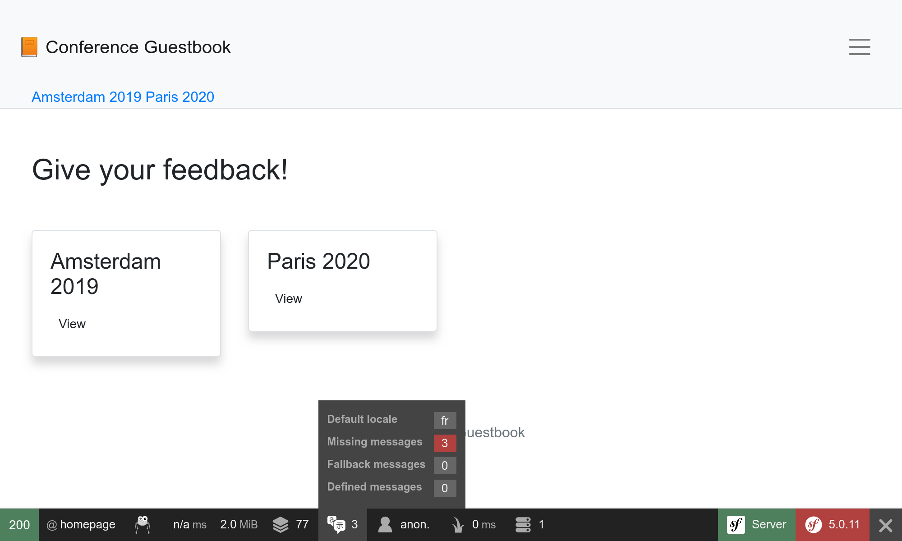

Localizarea unei aplicații
===========================

Cu o audiență internațională, Symfony a reușit să se descurce cu internaționalizarea (i18n) și localizarea (l10n) de la începuturi. Localizarea unei aplicații nu se referă doar la traducerea interfeței, ci și la formele de plural, formatare date și valute, adrese URL și multe altele.

Internaționalizarea adreselor URL
----------------------------------

.. index::
    single: Components;Routing
    single: Routing;Locale
    single: Routing;Requirements
    single: Annotations;@Route

Primul pas pentru internaționalizarea site-ului web este internaționalizarea adreselor URL. La traducerea unei interfețe a site-ului, URL-ul ar trebui să fie diferit în funcție de limbă pentru a funcționa bine cu cache-ul HTTP (nu folosi niciodată aceeași adresă URL și nu stoca locale în sesiune).

Utilizează parametrul special de rută ``_locale`` pentru a face referire în rute:

.. code-block:: diff
    :caption: patch_file
    :emphasize-lines: 8

    --- a/src/Controller/ConferenceController.php
    +++ b/src/Controller/ConferenceController.php
    @@ -34,7 +34,7 @@ class ConferenceController extends AbstractController
         }

         /**
    -     * @Route("/", name="homepage")
    +     * @Route("/{_locale}/", name="homepage")
          */
         public function index(ConferenceRepository $conferenceRepository): Response
         {

Pe pagina principală, variabila de limbă este acum setată intern, în funcție de URL; de exemplu, dacă navighezi spre ``/fr/``, ``$request-> getLocale()`` returnează ``fr``.

Întrucât probabil nu vei putea traduce conținutul în toate setările limbile valabile, restricționează-te la cele pe care dorești să le susții:

.. code-block:: diff
    :caption: patch_file
    :emphasize-lines: 8

    --- a/src/Controller/ConferenceController.php
    +++ b/src/Controller/ConferenceController.php
    @@ -34,7 +34,7 @@ class ConferenceController extends AbstractController
         }

         /**
    -     * @Route("/{_locale}/", name="homepage")
    +     * @Route("/{_locale<en|fr>}/", name="homepage")
          */
         public function index(ConferenceRepository $conferenceRepository): Response
         {

Fiecare parametru de traseu poate fi restricționat printr-o expresie obișnuită în interiorul ``<`` ``>``. Ruta ``homepage`` se potrivește acum doar când parametrul ``_locale`` este ``en`` sau ``fr``. Încearcă să accesezi ``/es/``, ar trebui să obții un răspuns 404, deoarece niciun traseu nu se potrivește.

Deoarece vom folosi aceeași cerință în aproape toate rutele, să o mutăm la un parametru container:

.. code-block:: diff
    :caption: patch_file

    --- a/config/services.yaml
    +++ b/config/services.yaml
    @@ -7,6 +7,7 @@ parameters:
         default_admin_email: admin@example.com
         default_domain: '127.0.0.1'
         default_scheme: 'http'
    +    app.supported_locales: 'en|fr'

         router.request_context.host: '%env(default:default_domain:SYMFONY_DEFAULT_ROUTE_HOST)%'
         router.request_context.scheme: '%env(default:default_scheme:SYMFONY_DEFAULT_ROUTE_SCHEME)%'
    --- a/src/Controller/ConferenceController.php
    +++ b/src/Controller/ConferenceController.php
    @@ -34,7 +34,7 @@ class ConferenceController extends AbstractController
         }

         /**
    -     * @Route("/{_locale<en|fr>}/", name="homepage")
    +     * @Route("/{_locale<%app.supported_locales%>}/", name="homepage")
          */
         public function index(ConferenceRepository $conferenceRepository): Response
         {

Adăugarea unei limbi se poate face prin actualizarea parametrului ``app.supported_languages``.

Adaugă același prefix de rută locală la celelalte adrese URL:

.. code-block:: diff
    :caption: patch_file

    --- a/src/Controller/ConferenceController.php
    +++ b/src/Controller/ConferenceController.php
    @@ -47,7 +47,7 @@ class ConferenceController extends AbstractController
         }

         /**
    -     * @Route("/conference_header", name="conference_header")
    +     * @Route("/{_locale<%app.supported_locales%>}/conference_header", name="conference_header")
          */
         public function conferenceHeader(ConferenceRepository $conferenceRepository): Response
         {
    @@ -60,7 +60,7 @@ class ConferenceController extends AbstractController
         }

         /**
    -     * @Route("/conference/{slug}", name="conference")
    +     * @Route("/{_locale<%app.supported_locales%>}/conference/{slug}", name="conference")
          */
         public function show(Request $request, Conference $conference, CommentRepository $commentRepository, NotifierInterface $notifier, string $photoDir): Response
         {

Suntem aproape gata. Nu mai avem un traseu care să se potrivească cu ``/``. Să-l adăugăm înapoi și să-l redirecționăm către ``/en/``:

.. code-block:: diff
    :caption: patch_file

    --- a/src/Controller/ConferenceController.php
    +++ b/src/Controller/ConferenceController.php
    @@ -33,6 +33,14 @@ class ConferenceController extends AbstractController
             $this->bus = $bus;
         }

    +    /**
    +     * @Route("/")
    +     */
    +    public function indexNoLocale(): Response
    +    {
    +        return $this->redirectToRoute('homepage', ['_locale' => 'en']);
    +    }
    +
         /**
          * @Route("/{_locale<%app.supported_locales%>}/", name="homepage")
          */

Acum, că toate rutele principale sunt conștiente de localizare, observă că adresele URL generate pe pagini iau în considerare automat limba curentă.

Adăugarea unui comutator de limbă
-----------------------------------

.. index::
    single: Twig;path
    single: Twig;Locale

Pentru a permite utilizatorilor să treacă de la varianta implicită ``en`` la alta, să adăugăm un comutator în antet:

.. code-block:: diff
    :caption: patch_file

    --- a/templates/base.html.twig
    +++ b/templates/base.html.twig
    @@ -34,6 +34,16 @@
                                         Admin
                                     </a>
                                 </li>
    +<li class="nav-item dropdown">
    +    <a class="nav-link dropdown-toggle" href="#" id="dropdown-language" role="button"
    +        data-toggle="dropdown" aria-haspopup="true" aria-expanded="false">
    +        English
    +    </a>
    +    

    +        <a class="dropdown-item" href="{{ path('homepage', {_locale: 'en'}) }}">English</a>
    +        <a class="dropdown-item" href="{{ path('homepage', {_locale: 'fr'}) }}">Français</a>
    +    

    +</li>
                             </ul>
                         

                     

Pentru a trece la o altă zonă locală, transmitem în mod explicit parametrul de rută ``_locale`` la funcția ``path()``.

.. index::
    single: Twig;app.request
    single: Twig;locale_name

Actualizează șablonul pentru a afișa numele limbii actuale în loc de cuvântul „Engleză” scris direct în cod:

.. code-block:: diff
    :caption: patch_file

    --- a/templates/base.html.twig
    +++ b/templates/base.html.twig
    @@ -37,7 +37,7 @@
     <li class="nav-item dropdown">
         <a class="nav-link dropdown-toggle" href="#" id="dropdown-language" role="button"
             data-toggle="dropdown" aria-haspopup="true" aria-expanded="false">
    -        English
    +        {{ app.request.locale|locale_name(app.request.locale) }}
         </a>
         

             <a class="dropdown-item" href="{{ path('homepage', {_locale: 'en'}) }}">English</a>

``app`` este o variabilă globală de tip Twig care oferă acces la solicitarea curentă. Pentru a transforma denumirea limbii curente într-un șir de caractere care poate fi citit de om, folosim filtrul Twig ``locale_name``.

.. index::
    single: Components;String

În funcție de local, numele local nu este întotdeauna cu majuscule. Pentru a valorifica corect propozițiile, avem nevoie de un filtru care să fie conștient de Unicode, așa cum este furnizat de componenta Symfony String și de implementarea sa Twig:

.. code-block:: bash

    $ symfony composer req twig/string-extra

.. index::
    single: Twig;u.title

.. code-block:: diff
    :caption: patch_file

    --- a/templates/base.html.twig
    +++ b/templates/base.html.twig
    @@ -37,7 +37,7 @@
     <li class="nav-item dropdown">
         <a class="nav-link dropdown-toggle" href="#" id="dropdown-language" role="button"
             data-toggle="dropdown" aria-haspopup="true" aria-expanded="false">
    -        {{ app.request.locale|locale_name(app.request.locale) }}
    +        {{ app.request.locale|locale_name(app.request.locale)|u.title }}
         </a>
         

             <a class="dropdown-item" href="{{ path('homepage', {_locale: 'en'}) }}">English</a>

Acum poți trece de la franceză la engleză prin intermediul comutatorului și întreaga interfață se adaptează destul de bine:

.. figure:: screenshots/intl-switcher.png
    :alt: /fr/conference/amsterdam-2019
    :align: center
    :figclass: with-browser

Traducerea interfeței
----------------------

.. index::
    single: Components;Translation
    single: Translation
    single: Twig;trans

Pentru a începe traducerea site-ului, trebuie să instalăm componenta Translation Symfony:

.. code-block:: bash

    $ symfony composer req translation

Traducerea fiecărei propoziții pe un site mare poate fi obositoare, dar, din fericire, avem doar o mână de mesaje pe site-ul nostru. Să începem cu toate propozițiile de pe pagina principală:

.. code-block:: diff
    :caption: patch_file

    --- a/templates/base.html.twig
    +++ b/templates/base.html.twig
    @@ -20,7 +20,7 @@
                 <nav class="navbar navbar-expand-xl navbar-light bg-light">
                     

                         <a class="navbar-brand mr-4 pr-2" href="{{ path('homepage') }}">
    -                        &#128217; Conference Guestbook
    +                        &#128217; {{ 'Conference Guestbook'|trans }}
                         </a>

                         <button class="navbar-toggler border-0" type="button" data-toggle="collapse" data-target="#header-menu" aria-controls="navbarSupportedContent" aria-expanded="false" aria-label="Show/Hide navigation">
    --- a/templates/conference/index.html.twig
    +++ b/templates/conference/index.html.twig
    @@ -4,7 +4,7 @@

     
         <h2 class="mb-5">
    -        Give your feedback!
    +        {{ 'Give your feedback!'|trans }}
         </h2>

         
    @@ -21,7 +21,7 @@

                                 <a href="{{ path('conference', { slug: conference.slug }) }}"
                                    class="btn btn-sm btn-blue stretched-link">
    -                                View
    +                                {{ 'View'|trans }}
                                 </a>
                             

                         

Filtrul Twig ``trans`` caută o traducere a intrării date la localul curent. Dacă nu este găsit, acesta revine la *setarea de bază*, așa cum este configurat în ``config/packages/translate.yaml``:

.. code-block:: yaml
    :class: ignore
    :emphasize-lines: 2

    framework:
        default_locale: en
        translator:
            default_path: '%kernel.project_dir%/translations'
            fallbacks:
                - en

Observă că fila de traducere a barei de instrumente de depanare web a devenit roșie:

Ne spune că 3 mesaje nu sunt încă traduse.

Faceți clic pe „fila“ pentru a lista toate mesajele pentru care Symfony nu a găsit o traducere:

.. figure:: screenshots/intl-profiler.png
    :alt: /_profiler/64282d?panel=translation
    :align: center
    :figclass: with-browser

Furnizarea traducerilor
-----------------------

Așa cum ai văzut în ``config/packages/translation.yaml``, traducerile sunt stocate într-un director root ``translations/``, care a fost creat automat pentru noi.

În loc să creezi fișierele de traducere manual, folosește comanda ``translation:update``:

.. code-block:: bash

    $ symfony console translation:update fr --force --domain=messages

Această comandă generează un fișier de traducere (opțiunea `` --force``) pentru localitatea ``fr`` și domeniul ``messages`` (care conține toate mesajele non-nucleu precum erorile de validare sau de securitate).

Editează fișierul ``traduceri/mesaje+intl-icu.fr.xlf`` și traduce mesajele în franceză. Nu vorbești franceza? Lasă-mă să te-ajut:

.. code-block:: diff
    :caption: patch_file

    --- a/translations/messages+intl-icu.fr.xlf
    +++ b/translations/messages+intl-icu.fr.xlf
    @@ -7,15 +7,15 @@
         <body>
           <trans-unit id="LNAVleg" resname="Give your feedback!">
             <source>Give your feedback!</source>
    -        <target>__Give your feedback!</target>
    +        <target>Donnez votre avis !</target>
           </trans-unit>
           <trans-unit id="3Mg5pAF" resname="View">
             <source>View</source>
    -        <target>__View</target>
    +        <target>Sélectionner</target>
           </trans-unit>
           <trans-unit id="eOy4.6V" resname="Conference Guestbook">
             <source>Conference Guestbook</source>
    -        <target>__Conference Guestbook</target>
    +        <target>Livre d'Or pour Conferences</target>
           </trans-unit>
         </body>
       </file>

Reține că nu vom traduce toate șabloanele, dar nu ezita să faci acest lucru:

.. figure:: screenshots/intl-translated.png
    :alt: /fr/
    :align: center
    :figclass: with-browser

Traducerea formularelor
-----------------------

.. index::
    single: Translation;Form
    single: Form;Translation

Etichetele de formular sunt afișate automat de Symfony prin intermediul sistemului de traducere. Accesează o pagină de conferință și fă clic pe fila „Translation” din bara de instrumente de depanare web; ar trebui să vezi toate etichetele pregătite pentru traducere:

.. figure:: screenshots/intl-form-profiler.png
    :alt: /_profiler/64282d?panel=translation
    :align: center
    :figclass: with-browser

Localizarea datelor
-------------------

.. index::
    single: Localization
    single: Twig;format_datetime
    single: Twig;format_time
    single: Twig;format_date
    single: Twig;format_currency
    single: Twig;format_number

Dacă comuți la limba franceză și accesezi o pagină web a conferinței care are unele comentarii, vei observa că datele comentariilor sunt localizate automat. Acest lucru funcționează pentru că am folosit filtrul Twig ``format_datetime``, care este localizat (``{{comment.createdAt|format_datetime('medium', 'short')}}``).

Localizarea funcționează pentru date, ore (``format_time``), valute (``format_currency``) și numere (``format_number``) în general (procente, durate, scriere, ...).

Traducerea pluralelor
---------------------

.. index::
    single: Translation;Plurals
    single: Translation;Conditions

Gestionarea pluralurilor în traduceri este una dintre problemele mai generale ale selectării unei traduceri pe baza unei condiții.

Pe o pagină de conferință, afișăm numărul de comentarii: `` There are 2 comments``. Pentru 1 comentariu, afișăm ``There are 1 comments``, ceea ce este greșit. Modifică șablonul pentru a converti propoziția într-un mesaj ce poate fi tradus:

.. code-block:: diff
    :caption: patch_file

    --- a/templates/conference/show.html.twig
    +++ b/templates/conference/show.html.twig
    @@ -44,7 +44,7 @@
                             

                         

                     
    -                
There are {{ comments|length }} comments.

    +                
{{ 'nb_of_comments'|trans({count: comments|length}) }}

                     
                         <a href="{{ path('conference', { slug: conference.slug, offset: previous }) }}">Previous</a>
                     

Pentru acest mesaj, am folosit o altă strategie de traducere. În loc să păstrăm versiunea engleză în șablon, am înlocuit-o cu un identificator unic. Această strategie funcționează mai bine pentru o cantitate complexă și mare de text.

Actualizează fișierul de traducere adăugând mesajul nou:

.. code-block:: diff
    :caption: patch_file

    --- a/translations/messages+intl-icu.fr.xlf
    +++ b/translations/messages+intl-icu.fr.xlf
    @@ -17,6 +17,10 @@
             <source>Conference Guestbook</source>
             <target>Livre d'Or pour Conferences</target>
           </trans-unit>
    +      <trans-unit id="Dg2dPd6" resname="nb_of_comments">
    +        <source>nb_of_comments</source>
    +        <target>{count, plural, =0 {Aucun commentaire.} =1 {1 commentaire.} other {# commentaires.}}</target>
    +      </trans-unit>
         </body>
       </file>
     </xliff>

Încă nu am terminat, deoarece acum trebuie să furnizăm traducerea în engleză. Creează fișierul ``translations/messages+intl-icu.en.xlf``:

.. code-block:: xml
    :caption: translations/messages+intl-icu.en.xlf
    :emphasize-lines: 10

    <?xml version="1.0" encoding="utf-8"?>
    <xliff xmlns="urn:oasis:names:tc:xliff:document:1.2" version="1.2">
      <file source-language="en" target-language="en" datatype="plaintext" original="file.ext">
        <header>
          <tool tool-id="symfony" tool-name="Symfony"/>
        </header>
        <body>
          <trans-unit id="maMQz7W" resname="nb_of_comments">
            <source>nb_of_comments</source>
            <target>{count, plural, =0 {There are no comments.} one {There is one comment.} other {There are # comments.}}</target>
          </trans-unit>
        </body>
      </file>
    </xliff>

Actualizarea testelor funcționale
----------------------------------

Nu uita să actualizezi testele funcționale să includă adresele URL și modificările de conținut:

.. code-block:: diff
    :caption: patch_file

    --- a/tests/Controller/ConferenceControllerTest.php
    +++ b/tests/Controller/ConferenceControllerTest.php
    @@ -11,7 +11,7 @@ class ConferenceControllerTest extends WebTestCase
         public function testIndex()
         {
             $client = static::createClient();
    -        $client->request('GET', '/');
    +        $client->request('GET', '/en/');

             $this->assertResponseIsSuccessful();
             $this->assertSelectorTextContains('h2', 'Give your feedback');
    @@ -20,7 +20,7 @@ class ConferenceControllerTest extends WebTestCase
         public function testCommentSubmission()
         {
             $client = static::createClient();
    -        $client->request('GET', '/conference/amsterdam-2019');
    +        $client->request('GET', '/en/conference/amsterdam-2019');
             $client->submitForm('Submit', [
                 'comment_form[author]' => 'Fabien',
                 'comment_form[text]' => 'Some feedback from an automated functional test',
    @@ -41,7 +41,7 @@ class ConferenceControllerTest extends WebTestCase
         public function testConferencePage()
         {
             $client = static::createClient();
    -        $crawler = $client->request('GET', '/');
    +        $crawler = $client->request('GET', '/en/');

             $this->assertCount(2, $crawler->filter('h4'));

    @@ -50,6 +50,6 @@ class ConferenceControllerTest extends WebTestCase
             $this->assertPageTitleContains('Amsterdam');
             $this->assertResponseIsSuccessful();
             $this->assertSelectorTextContains('h2', 'Amsterdam 2019');
    -        $this->assertSelectorExists('div:contains("There are 1 comments")');
    +        $this->assertSelectorExists('div:contains("There is one comment")');
         }
     }

.. sidebar:: Mergând mai departe

    * `Traducerea mesajelor folosind formatorul ICU <https://symfony.com/doc/current/translation/message_format.html>`_;

    * `Utilizarea filtrelor de traducere Twig <https://symfony.com/doc/current/translation/templates.html#translation-filters>`_.
