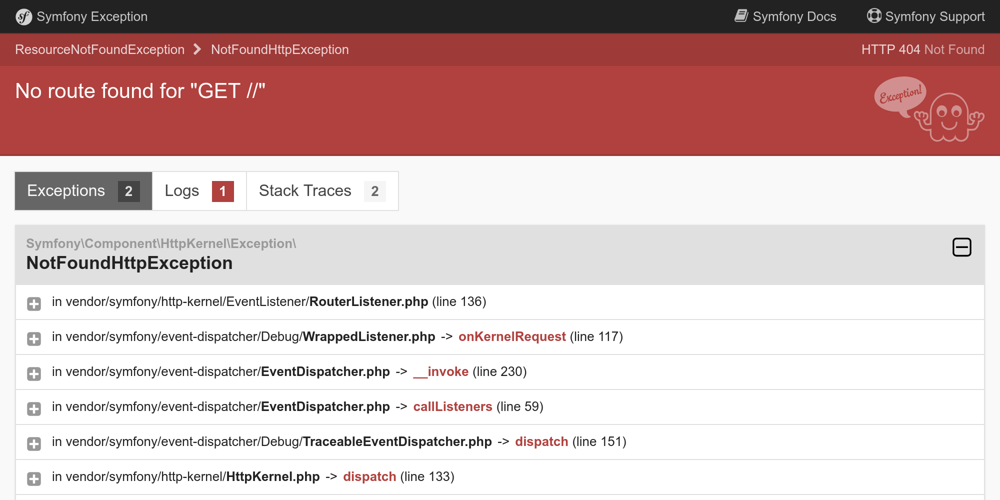
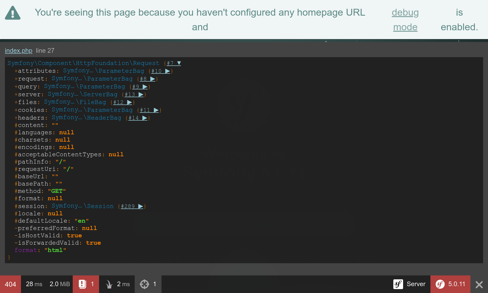

Depanarea problemelor
=====================

Configurarea unui proiect înseamnă și a avea instrumentele potrivite pentru a depana problemele.

Instalarea unor dependențe suplimentare
----------------------------------------

Nu uita că proiectul a fost creat cu foarte puține dependențe. Fără un motor de șabloane. Fără instrumente de depanare. Fără jurnale. Vreau să înțelegi că tu poți adăuga mai multe dependențe oricând vei avea nevoie de ele. De ce ai instala un *motor de șabloane* dacă dezvolți un API HTTP sau doar o comandă pentru consolă?

Cum putem adăuga mai multe dependențe? Prin intermediul Composer. Pe lângă pachetele composer „obișnuite”, vom lucra cu două tipuri „speciale” de pachete:

* *Componente Symfony*: pachete care implementează caracteristici și abstractizări de bază de care ai nevoie în majoritatea aplicațiilor (rute, comenzi în terminal, client HTTP, trimiterea de email-uri, cache, ...);

* *Symfony Bundles*: pachete care adaugă funcții avansate sau furnizează integrări cu librării terțe (pachetele sunt în cea mai mare parte contribuția comunității).

.. index::
    single: Components;Profiler
    single: Profiler
    single: Web Profiler
    single: Web Debug Toolbar

Pentru început, adăugăm Symfony Profiler, care te va ajuta să înțelegi mai bine ce anume nu a funcționat atunci când ai o eroare și vrei să găsești sursa problemei:

.. code-block:: bash

    $ symfony composer req profiler --dev

``profiler`` este un alias pentru pachetul ``symfony/profiler-pack``.

*Alias-urile* nu sunt o caracteristică a Composer, ci un concept furnizat de Symfony pentru a îți ușura viața. Aliasurile reprezintă scurtături pentru pachetele mai cunoscute și mai populare. Dorești un ORM pentru abstractizarea bazei de date în aplicația ta? Solicită ``orm``. Dorești să dezvolți un API? Solicită ``api``. Aceste aliasuri sunt asociate automat unui sau mai multe pachete Composer obișnuite. Ele sunt recomandări personale făcute de echipa care a creat Symfony.

O altă caracteristică utilă este că poți omite întotdeauna ``symfony`` din denumirea pachetului. Solicită ``cache`` în loc de ``symfony/cache``.

.. tip::

    Îți amintești că anterior am mai menționat un plugin Composer numit ``symfony/flex``? Posibilitatea de a folosi alias-uri se datorează acestui pachet.

Înțelegerea mediilor Symfony de dezvoltare
--------------------------------------------

Ai observat opțiunea ``--dev`` de pe comanda ``composer req``? Deoarece Symfony Profiller este util doar în timpul dezvoltării, vrem să evităm instalarea și folosirea acestuia în producție.

Symfony are conceptul de *mediu de lucru*. În mod implicit, are suport integrat pentru trei medii de lucru: ``dev``, ``prod`` și ``test``. Dar tu poți să mai adaugi oricâte dorești. Toate mediile vor folosi același cod sursă, dar îți vor permite să ai *configurații* diferite.

De exemplu, toate instrumentele de depanare sunt activate în mediul ``dev``. În ``prod``, aplicația este optimizată, în schimb, pentru performanță.

Trecerea de la un mediu la altul se poate face prin modificarea variabilei de mediu ``APP_ENV``.

În momentul în care ai lansat proiectul pe SymfonyCloud, mediul de lucru (stocat în ``APP_ENV``) a fost schimbat automat la ``prod``.

Gestionarea configurațiilor de mediu
-------------------------------------

.. index::
    single: Environment Variables
    single: .env
    single: .env.local

``APP_ENV`` poate fi setat folosind variabile de mediu „reale” din terminalul tău:

.. code-block:: bash
    :class: ignore

    $ export APP_ENV=dev

Utilizarea variabilelor reale de mediu este modalitatea preferată de a seta valori precum ``APP_ENV`` pe serverele de producție. Însă pe mașinile de dezvoltare, nevoia de a defini multe variabile de mediu poate fi greoaie. În schimb, definește-le într-un fișier ``.env``.

Un fișier ``.env`` a fost generat automat pentru tine atunci când a fost creat proiectul:

.. code-block:: text
    :caption: .env
    :class: ignore

    ###> symfony/framework-bundle ###
    APP_ENV=dev
    APP_SECRET=c2927f273163f7225a358e3a1bbbed8a
    #TRUSTED_PROXIES=127.0.0.1,127.0.0.2
    #TRUSTED_HOSTS='^localhost|example\.com$'
    ###< symfony/framework-bundle ###

.. tip::

    Orice pachet poate adăuga mai multe variabile de mediu în acest fișier prin rețeta proprie de Symfony Flex.

Fișierul ``.env`` este salvat în repozitoriu și descrie valorile *implicite* din producție. Poți înlocui aceste valori creând un fișier ``.env.local``. Acest fișier nu ar trebui să fie salvat și de aceea este menționat deja în fișierul ``.gitignore``.

Nu stoca niciodată valori secrete sau sensibile în aceste fișiere. Vom învăța mai târziu, într-un alt pas, cum să gestionezi secretele.

Adaugă în jurnal cât mai multe informații (logs)
----------------------------------------------------

.. index::
    single: Logger

Implicit, capacitatea de a scrie un jurnal sau depanarea sunt limitate în proiectele noi. Putem să adăugăm însă instrumente noi care să ne ajute să investigăm mai ușor problemele în dezvoltare, dar și în producție:

.. code-block:: bash

    $ symfony composer req logger

.. index::
    single: Components;Debug
    single: Debug

Instrumentele de depanare se instalează doar pentru mediul de dezvoltare:

.. code-block:: bash

    $ symfony composer req debug --dev

Descoperă instrumentele de depanare Symfony
--------------------------------------------

Dacă reîncarci prima pagină a site-ului, acum ar trebui să vezi o bară de instrumente în partea de jos a ecranului:

.. figure:: screenshots/wdt.png
    :alt: /
    :align: center
    :figclass: with-browser

Primul lucru pe care îl poți observa este **404** scris cu roșu. Amintește-ți că această pagină este un înlocuitor pentru că nu am definit încă o primă pagină. Chiar dacă pagina implicită care te întâmpină este frumoasă, este totuși o pagină de eroare. Deci, codul de stare HTTP este 404 și nu 200. Datorită barei de instrumente de depanare web, ai datele de depanare accesibile imediat.

Dacă dai click pe semnul de exclamare mic, vei vedea mesajul de excepție „real” ca parte a jurnalelor din Symfony Profiler. Dacă dorești să vizualizezi toate liniile de cod din firul de execuție, dă clic pe linkul „Exception” din meniul din stânga.

Ori de câte ori există o problemă cu codul tău, vei vedea o pagină de excepție precum următoarea, care îți oferă tot de ce ai nevoie pentru a înțelege problema și de unde provine:

Oferă-ți ceva timp pentru a explora informațiile din Symfony Profiler dând click pe toate butoanele disponibile.

.. index::
    single: Symfony CLI;server:log

De asemenea, jurnalele sunt destul de utile în sesiunile de depanare. Symfony are o comandă convenabilă pentru a urmări în terminal toate jurnalele (de pe serverul web, din PHP și din aplicația ta):

.. code-block:: bash
    :class: ignore

    $ symfony server:log

Să facem un mic experiment. Deschide ``public/index.php`` și introdu o eroare în codul PHP (adaugă foobar în mijlocul codului, de exemplu). Reîncarcă pagina în browser și observă noile intrări în jurnal:

.. code-block:: text
    :class: ignore

    Dec 21 10:04:59 |DEBUG| PHP    PHP Parse error:  syntax error, unexpected 'use' (T_USE) in public/index.php on line 5 path="/usr/bin/php7.42" php="7.42.0"
    Dec 21 10:04:59 |ERROR| SERVER GET  (500) / ip="127.0.0.1"

Rezultatul afișat este colorat frumos pentru a îți atrage atenția asupra erorilor.

.. index::
    single: Components;VarDumper
    single: VarDumper
    single: dump

Un alt mare ajutor în depanare este funcția Symfony ``dump()``. Este întotdeauna disponibilă și îți permite să afișezi variabile complexe într-un format frumos și interactiv.

Modifică temporar ``public/index.php`` pentru a afișa obiectul Request:

.. code-block:: diff
    :caption: patch_file

    --- a/public/index.php
    +++ b/public/index.php
    @@ -23,5 +23,8 @@ if ($trustedHosts = $_SERVER['TRUSTED_HOSTS'] ?? false) {
     $kernel = new Kernel($_SERVER['APP_ENV'], (bool) $_SERVER['APP_DEBUG']);
     $request = Request::createFromGlobals();
     $response = $kernel->handle($request);
    +
    +dump($request);
    +
     $response->send();
     $kernel->terminate($request, $response);

După ce vei reîncărca pagina, observă noua iconiță „target” din bara de instrumente; ea îți permite să inspectezi datele de depanare incluse în funcția ``dump()``. Dă click pe ea pentru a accesa o pagină completă în care navigarea e mai simplă:

.. index::
    single: Git;checkout

Anulează modificările înainte de a salva celelalte modificări efectuate în acest pas:

.. code-block:: bash

    $ git checkout public/index.php

Configurarea IDE-ului
---------------------

Când este aruncată o excepție, în mediul de dezvoltare, Symfony afișează o pagină cu mesajul de excepție și pașii executați înainte de eroare. Când se afișează o cale către un fișier, Symfony adaugă un link care deschide fișierul în IDE-ul preferat, fix la linia specificată.. Pentru a beneficia de această funcționalitate, trebuie să configurezi IDE-ul. Symfony oferă suport implicit pentru multe IDE-uri. Eu folosesc Visual Studio Code pentru acest proiect:

.. code-block:: diff
    :caption: patch_file

    --- a/php.ini
    +++ b/php.ini
    @@ -6,3 +6,4 @@ max_execution_time=30
     session.use_strict_mode=On
     realpath_cache_ttl=3600
     zend.detect_unicode=Off
    +xdebug.file_link_format=vscode://file/%f:%l

Linkurile către fișiere nu sunt doar pentru excepții. De exemplu, poți deschide controller-ul curent din bara de depanare după ce ți-ai configurat IDE-ul.

Depanarea în producție
------------------------

.. index::
    single: SymfonyCloud;Remote Logs
    single: SymfonyCloud;SSH
    single: Symfony CLI;logs
    single: Symfony CLI;ssh

Depanarea serverelor de producție a fost întotdeauna mai dificilă. De exemplu, în producție nu ai acces la depanatorul Symfony Profiller. Jurnalele sunt, în general, mai puțin explicite. Însă, citirea jurnalelor este posibilă:

.. code-block:: bash
    :class: ignore

    $ symfony logs

Te poți conecta prin SSH la containerul web:

.. code-block:: bash
    :class: ignore

    $ symfony ssh

Nu-ți face griji, e greu să strici ceva. Cea mai mare parte din sistemul de fișiere este protejat la scriere. Nu vei putea să faci o corectare rapidă în producție. Dar vei învăța un mod mult mai bun pe parcursul cărții.

.. sidebar:: Mergând mai departe

    * `Tutorial SymfonyCasts: medii și fișiere de configurare <https://symfonycasts.com/screencast/symfony-fundamentals/environment-config-files>`_;

    * `SymfonyCasts: tutorial de variabile de mediu <https://symfonycasts.com/screencast/symfony-fundamentals/environment-variables>`_;

    * `Tutorial SymfonyCasts: bara de depanare și Profiler <https://symfonycasts.com/screencast/symfony/debug-toolbar-profiler>`_;

    * `Gestionarea mai multor fișiere .env <https://symfony.com/doc/current/configuration.html#managing-multiple-env-files>`_ în aplicațiile Symfony.
