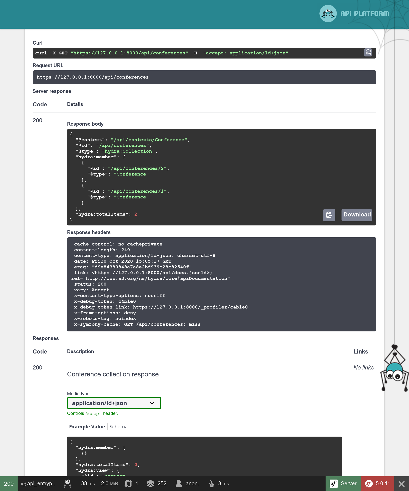

Создание API с помощью API Platform
===================================================

.. index::
    single: API
    single: HTTP API
    single: API Platform

Мы завершили разработку гостевой книги. Теперь, чтобы использовать данные в полной мере, может быть создадим API? В дальнейшем этот API может использоваться мобильным приложением, в котором будут показываться все конференции и комментарии к ним с возможностью для участников оставить свой отзыв к одной из них.

Сейчас мы разработаем API только для чтения данных.

Установка API Platform
-------------------------------

Конечно, вы можете создать API самостоятельно. Но если вы хотите следовать стандартам, которые применяются при разработке API, лучше всего воспользоваться готовым решением, которое сделает за вас всю грязную работу. API Platform — как раз одно из таких решений:

.. code-block:: bash

    $ symfony composer req api

Создание API для работы с конференциями
----------------------------------------------------------------------

.. index::
    single: Annotations;@ApiResource
    single: Annotations;@Groups

Несколько аннотаций в классе Conference — это всё, что нужно для настройки API:

.. code-block:: diff
    :caption: patch_file

    --- a/src/Entity/Conference.php
    +++ b/src/Entity/Conference.php
    @@ -2,16 +2,25 @@

     namespace App\Entity;

    +use ApiPlatform\Core\Annotation\ApiResource;
     use App\Repository\ConferenceRepository;
     use Doctrine\Common\Collections\ArrayCollection;
     use Doctrine\Common\Collections\Collection;
     use Doctrine\ORM\Mapping as ORM;
     use Symfony\Bridge\Doctrine\Validator\Constraints\UniqueEntity;
    +use Symfony\Component\Serializer\Annotation\Groups;
     use Symfony\Component\String\Slugger\SluggerInterface;

     /**
      * @ORM\Entity(repositoryClass=ConferenceRepository::class)
      * @UniqueEntity("slug")
    + *
    + * @ApiResource(
    + *     collectionOperations={"get"={"normalization_context"={"groups"="conference:list"}}},
    + *     itemOperations={"get"={"normalization_context"={"groups"="conference:item"}}},
    + *     order={"year"="DESC", "city"="ASC"},
    + *     paginationEnabled=false
    + * )
      */
     class Conference
     {
    @@ -19,21 +28,29 @@ class Conference
          * @ORM\Id
          * @ORM\GeneratedValue
          * @ORM\Column(type="integer")
    +     *
    +     * @Groups({"conference:list", "conference:item"})
          */
         private $id;

         /**
          * @ORM\Column(type="string", length=255)
    +     *
    +     * @Groups({"conference:list", "conference:item"})
          */
         private $city;

         /**
          * @ORM\Column(type="string", length=4)
    +     *
    +     * @Groups({"conference:list", "conference:item"})
          */
         private $year;

         /**
          * @ORM\Column(type="boolean")
    +     *
    +     * @Groups({"conference:list", "conference:item"})
          */
         private $isInternational;

    @@ -44,6 +61,8 @@ class Conference

         /**
          * @ORM\Column(type="string", length=255, unique=true)
    +     *
    +     * @Groups({"conference:list", "conference:item"})
          */
         private $slug;

API для конференций настраиваем через основную аннотацию ``@ApiResource``. С помощью неё можно ограничить допустимые CRUD-операции только до получения (``get``) и определить другие конфигурационные параметры для конференций: отображаемые поля и их порядок.

По умолчанию API доступен по пути ``/api``, который задан в файле ``config/routes/api_platform.yaml``. Данный файл с конфигурацией был добавлен рецептом пакета.

Для взаимодействия с API вы можете использовать следующий веб-интерфейс:

.. figure:: screenshots/api.png
    :alt: /api
    :align: center
    :figclass: with-browser

Используйте его, чтобы проверить различные возможности API:

Только представьте, сколько времени понадобится для реализации всего этого с нуля!

Создание API для комментариев
----------------------------------------------------

.. index::
    single: Annotations;@ApiResource
    single: Annotations;@ApiFilter
    single: Annotations;@Groups

API для получения комментариев сделаем по аналогии с предыдущим:

.. code-block:: diff
    :caption: patch_file

    --- a/src/Entity/Comment.php
    +++ b/src/Entity/Comment.php
    @@ -2,13 +2,26 @@

     namespace App\Entity;

    +use ApiPlatform\Core\Annotation\ApiFilter;
    +use ApiPlatform\Core\Annotation\ApiResource;
    +use ApiPlatform\Core\Bridge\Doctrine\Orm\Filter\SearchFilter;
     use App\Repository\CommentRepository;
     use Doctrine\ORM\Mapping as ORM;
    +use Symfony\Component\Serializer\Annotation\Groups;
     use Symfony\Component\Validator\Constraints as Assert;

     /**
      * @ORM\Entity(repositoryClass=CommentRepository::class)
      * @ORM\HasLifecycleCallbacks()
    + *
    + * @ApiResource(
    + *     collectionOperations={"get"={"normalization_context"={"groups"="comment:list"}}},
    + *     itemOperations={"get"={"normalization_context"={"groups"="comment:item"}}},
    + *     order={"createdAt"="DESC"},
    + *     paginationEnabled=false
    + * )
    + *
    + * @ApiFilter(SearchFilter::class, properties={"conference": "exact"})
      */
     class Comment
     {
    @@ -16,18 +29,24 @@ class Comment
          * @ORM\Id
          * @ORM\GeneratedValue
          * @ORM\Column(type="integer")
    +     *
    +     * @Groups({"comment:list", "comment:item"})
          */
         private $id;

         /**
          * @ORM\Column(type="string", length=255)
          * @Assert\NotBlank
    +     *
    +     * @Groups({"comment:list", "comment:item"})
          */
         private $author;

         /**
          * @ORM\Column(type="text")
          * @Assert\NotBlank
    +     *
    +     * @Groups({"comment:list", "comment:item"})
          */
         private $text;

    @@ -35,22 +54,30 @@ class Comment
          * @ORM\Column(type="string", length=255)
          * @Assert\NotBlank
          * @Assert\Email
    +     *
    +     * @Groups({"comment:list", "comment:item"})
          */
         private $email;

         /**
          * @ORM\Column(type="datetime")
    +     *
    +     * @Groups({"comment:list", "comment:item"})
          */
         private $createdAt;

         /**
          * @ORM\ManyToOne(targetEntity=Conference::class, inversedBy="comments")
          * @ORM\JoinColumn(nullable=false)
    +     *
    +     * @Groups({"comment:list", "comment:item"})
          */
         private $conference;

         /**
          * @ORM\Column(type="string", length=255, nullable=true)
    +     *
    +     * @Groups({"comment:list", "comment:item"})
          */
         private $photoFilename;

Такие же аннотации вы можете использовать для настройки класса.

Ограничение отображения комментариев из API
-------------------------------------------------------------------------------

По умолчанию API Platform возвращает все записи из базы данных. Однако в случае с API для комментариев, нам нужно показывать только опубликованные среди них.

Для получения через API только определённых элементов, создайте сервис, реализующий интерфейс ``QueryCollectionExtensionInterface`` для изменения Doctrine-запроса коллекций, и/или интерфейс ``QueryItemExtensionInterface`` для фильтрации элементов:

.. code-block:: php
    :caption: src/Api/FilterPublishedCommentQueryExtension.php
    :emphasize-lines: 13-15,20-22

    namespace App\Api;

    use ApiPlatform\Core\Bridge\Doctrine\Orm\Extension\QueryCollectionExtensionInterface;
    use ApiPlatform\Core\Bridge\Doctrine\Orm\Extension\QueryItemExtensionInterface;
    use ApiPlatform\Core\Bridge\Doctrine\Orm\Util\QueryNameGeneratorInterface;
    use App\Entity\Comment;
    use Doctrine\ORM\QueryBuilder;

    class FilterPublishedCommentQueryExtension implements QueryCollectionExtensionInterface, QueryItemExtensionInterface
    {
        public function applyToCollection(QueryBuilder $qb, QueryNameGeneratorInterface $queryNameGenerator, string $resourceClass, string $operationName = null)
        {
            if (Comment::class === $resourceClass) {
                $qb->andWhere(sprintf("%s.state = 'published'", $qb->getRootAliases()[0]));
            }
        }

        public function applyToItem(QueryBuilder $qb, QueryNameGeneratorInterface $queryNameGenerator, string $resourceClass, array $identifiers, string $operationName = null, array $context = [])
        {
            if (Comment::class === $resourceClass) {
                $qb->andWhere(sprintf("%s.state = 'published'", $qb->getRootAliases()[0]));
            }
        }
    }

Класс расширения запроса применяется исключительно к ресурсу ``Comment``, изменяя построитель запросов Doctrine, чтобы тот вернул только комментарии с состоянием ``published``.

Настройка CORS
-----------------------

.. index::
    single: CORS
    single: Cross-Origin Resource Sharing

Сейчас все современные HTTP-клиенты следуют правилам ограничения домена (same-origin policy), которые запрещают обращаться к API из других доменов. Бандл CORS, устанавливаемый в качестве одной из зависимостей при выполнении команды ``composer req api``, отправляет HTTP-заголовки механизма совместного использования ресурсов между разными источниками (Cross-Origin Resource Sharing), в соответствии со значением в переменной окружения ``CORS_ALLOW_ORIGIN``.

По умолчанию это значение определено в файле ``.env`` и разрешает выполнять HTTP-запросы с ``localhost`` и ``127.0.0.1`` через любой порт. Этой настройки как раз достаточно для следующего шага, где мы создадим SPA с собственным веб-сервером, который будет взаимодействовать с нашим API.

.. sidebar:: Двигаемся дальше

    * `Обучающий видеокурс по API Platform на SymfonyCasts <https://symfonycasts.com/screencast/api-platform>`_;

    * Чтобы включить поддержку GraphQL, выполните команду ``composer require webonyx/graphql-php``. Затем перейдите по пути ``/api/graphql`` в браузере.
