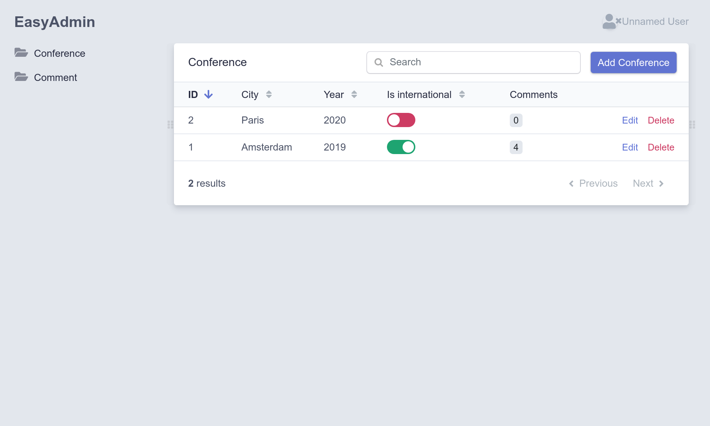

Создание административной панели
==============================================================

.. index::
    single: EasyAdmin
    single: Admin
    single: Backend

Именно администраторы проекта будут добавлять предстоящие конференции в базу данных. *Административная панель* — это защищённый раздел сайта, где *администраторы проекта* могут изменять данные, модерировать отзывы и многое другое.

Можно быстро сгенерировать панель администрирования на базе модели проекта, используя один из бандлов. EasyAdmin как раз то, что нам нужно.

Настройка бандла EasyAdmin
-----------------------------------------

Для начала добавьте бандл EasyAdmin в зависимости проекта:

.. code-block:: bash

    $ symfony composer req "admin:^2"

Для настройки EasyAdmin по его Flex-рецепту был создан новый конфигурационный файл:

.. code-block:: yaml
    :caption: config/packages/easy_admin.yaml
    :class: ignore

    #easy_admin:
    #    entities:
    #        # List the entity class name you want to manage
    #        - App\Entity\Product
    #        - App\Entity\Category
    #        - App\Entity\User

Почти все установленные пакеты имеют подобный файл с конфигурацией в директории ``config/packages/``. Чаще всего настройки по умолчанию отлично подходят для большинства приложений.

Раскомментируйте первую пару строк и добавьте классы моделей проекта:

.. code-block:: yaml
    :caption: config/packages/easy_admin.yaml

    easy_admin:
        entities:
            - App\Entity\Conference
            - App\Entity\Comment

Перейдите в браузере по пути ``/admin`` к уже готовой административной панели. И вуаля! У нас уже есть красивый и многофункциональный интерфейс для управления конференциями и комментариями:

.. figure:: screenshots/easy-admin-empty.png
    :alt: /admin/
    :align: center
    :figclass: with-browser

.. tip::

    Why is the backend accessible under ``/admin``? That's the default prefix configured in ``config/routes/easy_admin.yaml``:

    .. code-block:: yaml
        :caption: config/routes/easy_admin.yaml
        :class: ignore

        easy_admin_bundle:
            resource: '@EasyAdminBundle/Controller/EasyAdminController.php'
            prefix: /admin
            type: annotation

    You can change it to anything you like.

Adding conferences and comments is not possible yet as you would get an error: ``Object of class App\Entity\Conference could not be converted to string``. EasyAdmin tries to display the conference related to comments, but it can only do so if there is a string representation of a conference. Fix it by adding a ``__toString()`` method on the ``Conference`` class:

.. code-block:: diff
    :caption: patch_file

    --- a/src/Entity/Conference.php
    +++ b/src/Entity/Conference.php
    @@ -44,6 +44,11 @@ class Conference
             $this->comments = new ArrayCollection();
         }

    +    public function __toString(): string
    +    {
    +        return $this->city.' '.$this->year;
    +    }
    +
         public function getId(): ?int
         {
             return $this->id;

То же самое сделайте в классе ``Comment``:

.. code-block:: diff
    :caption: patch_file

    --- a/src/Entity/Comment.php
    +++ b/src/Entity/Comment.php
    @@ -48,6 +48,11 @@ class Comment
          */
         private $photoFilename;

    +    public function __toString(): string
    +    {
    +        return (string) $this->getEmail();
    +    }
    +
         public function getId(): ?int
         {
             return $this->id;

Теперь вы можете добавлять, изменять и удалять конференции непосредственно из административной панели. Изучите его интерфейс и добавьте хотя бы одну конференцию.

Добавьте несколько комментариев без фотографий. Пока установите дату вручную, затем в следующих шагах мы сделаем автозаполнение столбца ``createdAt``.

.. figure:: screenshots/easy-admin-comments.png
    :alt: /admin/?entity=Comment&action=list
    :align: center
    :figclass: with-browser

Настройка EasyAdmin
----------------------------

Административная панель по умолчанию работает хорошо, хотя она может по-разному настраиваться, чтобы улучшить удобство её использования. Внесем несколько простых изменений для демонстрации доступных вариантов. Заменим стандартную конфигурацию на следующую:

.. code-block:: yaml
    :caption: config/packages/easy_admin.yaml

    easy_admin:
        site_name: Conference Guestbook

        design:
            menu:
                - { route: 'homepage', label: 'Back to the website', icon: 'home' }
                - { entity: 'Conference', label: 'Conferences', icon: 'map-marker' }
                - { entity: 'Comment', label: 'Comments', icon: 'comments' }

        entities:
            Conference:
                class: App\Entity\Conference

            Comment:
                class: App\Entity\Comment
                list:
                    fields:
                        - author
                        - { property: 'email', type: 'email' }
                        - { property: 'createdAt', type: 'datetime' }
                    sort: ['createdAt', 'ASC']
                    filters: ['conference']
                edit:
                    fields:
                        - { property: 'conference' }
                        - { property: 'createdAt', type: datetime, type_options: { disabled: true } }
                        - 'author'
                        - { property: 'email', type: 'email' }
                        - text

We have overridden the ``design`` section to add icons to the menu items and to add a link back to the website home page.

For the ``Comment`` section, listing the fields lets us order them the way we want. Some fields are tweaked, like setting the creation date to read-only. The ``filters`` section defines which filters to expose on top of the regular search field.

.. figure:: screenshots/easy-admin-filter.png
    :alt: /admin/?entity=Comment&action=list
    :align: center
    :figclass: with-browser

Это всего лишь небольшая часть возможных настроек в EasyAdmin.

Ознакомьтесь с административной панелью, отфильтруйте комментарии по какой-нибудь конференции или, например, найдите их по адресу электронной почты. Однако есть последняя неразрешённая проблема — любой пользователь может войти в панель администрирования. Мы это обязательно исправим в следующих шагах.

.. code-block:: bash
    :class: hide

    $ symfony run psql -c "TRUNCATE conference RESTART IDENTITY CASCADE"

.. sidebar:: Двигаемся дальше

    * `EasyAdmin docs <https://symfony.com/doc/2.x/bundles/EasyAdminBundle/index.html>`_;

    * `SymfonyCasts EasyAdminBundle tutorial <https://symfonycasts.com/screencast/easyadminbundle>`_;

    * `Справочник по конфигурированию Symfony <https://symfony.com/doc/current/reference/configuration/framework.html>`_.
