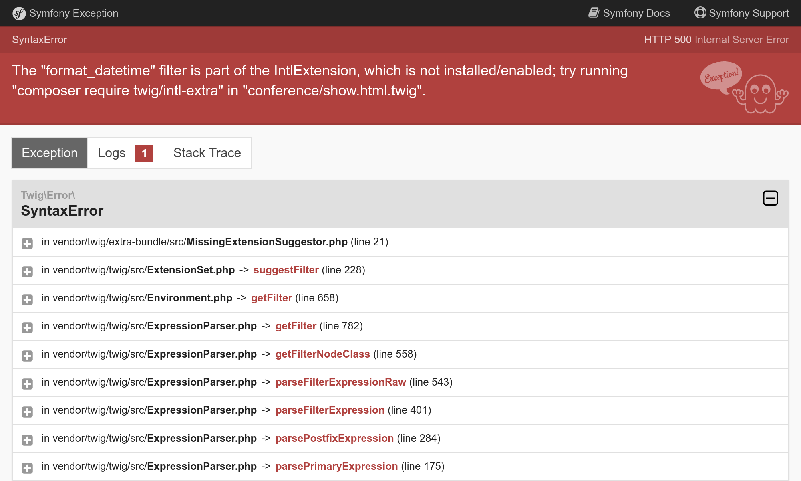

构建用户界面
==================

.. index::
    single: Twig
    single: Templates

一切准备就绪，可以去创建网站用户界面的初版。我们不会去美化它，只是先让它可以用起来。

你是否还记得，在之前的彩蛋环节，我们不得不在控制器中添加转义来避免安全问题吗？由于这个原因，我们在模板里不会用 PHP，而是用 Twig。`Twig`_ 除了帮我们处理转义之外，还有很多我们可以利用的好功能，比如模板继承。

安装 Twig
-----------

我们不需要把 Twig 作为依赖包来安装，因为在安装 EasyAdmin 的时候它作为一个 *传递性依赖* （即依赖包的依赖包）已经被安装过了。但是如果你以后想要切换到另一个管理后台 bundle 会怎么样？比如说切换到一个提供 API 和用 React 作为前端的 bundle？这种 bundle 很可能不再依赖 Twig，所以在移除 EasyAdmin 的时候 Twig 会被自动移除。

为了万无一失，让我们再告诉 Composer，不管用不用 EasyAdmin，我们的项目确实依赖 Twig。把它和其它依赖一样加进来就够了：

.. code-block:: bash

    $ symfony composer req twig

现在的 ``composer.json`` 文件里，Twig 是项目的直接依赖之一了：

.. code-block:: diff
    :class: ignore

    --- a/composer.json
    +++ b/composer.json
    @@ -14,6 +14,7 @@
             "symfony/framework-bundle": "4.4.*",
             "symfony/maker-bundle": "^1.0@dev",
             "symfony/orm-pack": "dev-master",
    +        "symfony/twig-pack": "^1.0",
             "symfony/yaml": "4.4.*"
         },
         "require-dev": {

把 Twig 用于模板
---------------------

.. index::
    single: Twig;Layout
    single: Twig;block

网站的所有页面会共享一样的 *布局*。当安装 Twig 时，它自动创建了 ``templates/`` 目录，而且 ``base.html.twig`` 文件里新建了一个样本布局。

.. code-block:: twig
    :caption: templates/base.html.twig
    :class: ignore

    <!DOCTYPE html>
    <html>
        <head>
            <meta charset="UTF-8">
            <title>Welcome!</title>
            
        </head>
        <body>
            
            
        </body>
    </html>

布局能定义一些 ``block`` 元素 ，*子模板* 在这些元素里 *扩展* 布局，加入它们自己的内容。

.. index::
    single: Twig;extends
    single: Twig;for

让我们在 ``templates/conference/index.html.twig`` 文件里为项目首页创建一个模板。

.. code-block:: twig
    :caption: templates/conference/index.html.twig

    

    Conference Guestbook

    
        <h2>Give your feedback!</h2>

        
            <h4>{{ conference }}</h4>
        
    

这个模板 *扩展* 了 ``base.html.twig``，并且重新定义了 ``title`` 和 ``body`` 块。

.. index::
    single: Twig;Syntax

模板中 ```` 的写法代表 *行为* 和 *结构*。

``{{ }}`` 的写法用来 *显示* 内容。``{{ conference }}`` 显示代表会议的字符串（即在 ``Conference`` 对象上调用 ``__toString`` 方法的结果）。

在控制器中使用 Twig
--------------------------

更新控制器来渲染 Twig 模板：

.. code-block:: diff
    :caption: patch_file

    --- a/src/Controller/ConferenceController.php
    +++ b/src/Controller/ConferenceController.php
    @@ -2,24 +2,21 @@

     namespace App\Controller;

    +use App\Repository\ConferenceRepository;
     use Symfony\Bundle\FrameworkBundle\Controller\AbstractController;
     use Symfony\Component\HttpFoundation\Response;
     use Symfony\Component\Routing\Annotation\Route;
    +use Twig\Environment;

     class ConferenceController extends AbstractController
     {
         /**
          * @Route("/", name="homepage")
          */
    -    public function index(): Response
    +    public function index(Environment $twig, ConferenceRepository $conferenceRepository): Response
         {
    -        return new Response(<<<EOF
    -<html>
    -    <body>
    -        
    -    </body>
    -</html>
    -EOF
    -        );
    +        return new Response($twig->render('conference/index.html.twig', [
    +            'conferences' => $conferenceRepository->findAll(),
    +        ]));
         }
     }

这里涉及很多的内容。

我们需要 Twig 的 ``Environment`` 对象（Twig 的主入口）才能渲染一个模板。注意一下，我们在控制器方法中用类型提示来获取 Twig 的实例。Symfony 很聪明，它知道如何注入正确的对象。

我们也需要会议的 *repository* 对象，用它从数据库中获取所有会议。

在控制器代码中，``render()`` 方法会渲染模板，并且传入一组变量到模板中。我们通过 ``conferences`` 变量把一组 ``Conference`` 对象传入模板。

控制器是一个标准的 PHP 类。如果想把它所依赖的类明确写在代码里的话，我们甚至不需要让它继承自 ``AbstractController`` 类。在控制器里你可以移除 ``AbstractController`` （但不要那样做，因为在后面的步骤中，我们会用到它提供的一些不错的快捷方法）。

创建会议页面
------------------

每个会议都要有单独的页面来列出关于它的评论。增加一个页面就是增加一个控制器方法，定义它的路由以及创建一个相关的模板。

在 ``src/Controller/ConferenceController.php`` 增加一个 ``show()`` 方法：

.. code-block:: diff
    :caption: patch_file

    --- a/src/Controller/ConferenceController.php
    +++ b/src/Controller/ConferenceController.php
    @@ -2,6 +2,8 @@

     namespace App\Controller;

    +use App\Entity\Conference;
    +use App\Repository\CommentRepository;
     use App\Repository\ConferenceRepository;
     use Symfony\Bundle\FrameworkBundle\Controller\AbstractController;
     use Symfony\Component\HttpFoundation\Response;
    @@ -19,4 +21,15 @@ class ConferenceController extends AbstractController
                 'conferences' => $conferenceRepository->findAll(),
             ]));
         }
    +
    +    /**
    +     * @Route("/conference/{id}", name="conference")
    +     */
    +    public function show(Environment $twig, Conference $conference, CommentRepository $commentRepository): Response
    +    {
    +        return new Response($twig->render('conference/show.html.twig', [
    +            'conference' => $conference,
    +            'comments' => $commentRepository->findBy(['conference' => $conference], ['createdAt' => 'DESC']),
    +        ]));
    +    }
     }

这个方法还有一个我们没见过的特殊行为。我们要求在该方法中注入一个 ``Conference`` 实例。但是数据库里可能有很多个会议。Symfony 能根据请求路径中的 ``{id}`` 来判断你要的是哪一个会议实例（``id`` 是数据库中 ``conference`` 表的主键）。

可以通过 ``findBy()`` 方法来获取与这次会议相关的评论，该方法接受一个过滤标准作为参数。

.. index::
    single: Twig;extends
    single: Twig;block
    single: Twig;for
    single: Twig;if
    single: Twig;else
    single: Twig;asset
    single: Twig;format_datetime
    single: Twig;length

最后一步就是创建 ``templates/conference/show.html.twig`` 文件：

.. code-block:: twig
    :caption: templates/conference/show.html.twig

    

    Conference Guestbook - {{ conference }}

    
        <h2>{{ conference }} Conference</h2>

        
            
                
                    
                

                <h4>{{ comment.author }}</h4>
                <small>
                    {{ comment.createdAt|format_datetime('medium', 'short') }}
                </small>

                
{{ comment.text }}

            
        
            
No comments have been posted yet for this conference.

        
    

在模板中，我们使用 ``|`` 的写法来调用 Twig 的 *过滤器*。过滤器用来转换一个值。``comments|length`` 返回评论的数量，``comment.createdAt|format_datetime('medium', 'short')`` 会把日期格式化为人们可读的形式。

通过 ``/conference/1`` 路径来访问“第一个”会议，注意下面这个错误：

这个错误是由于 ``format_datetime`` 过滤器并不是 Twig 核心的一部分。错误信息提示你要安装哪个包来解决问题。

.. code-block:: bash

    $ symfony composer req "twig/intl-extra:^3"

现在页面可以正常显示了。

把页面链接在一起
------------------------

.. index::
    single: Twig;Link
    single: Link

完成用户界面初版的最后一步，就是从首页链接到会议页。

.. code-block:: diff
    :caption: patch_file

    --- a/templates/conference/index.html.twig
    +++ b/templates/conference/index.html.twig
    @@ -7,5 +7,8 @@

         
             <h4>{{ conference }}</h4>
    +        

    +            <a href="/conference/{{ conference.id }}">View</a>
    +        

         
     

但出于多个原因，硬编码页面路径是个坏主意。最重要的原因是，如果你改变了路径（比如从 ``/conference/{id}`` 改到 ``/conferences/{id}``），那所有链接都需要手工去更新。

.. index::
    single: Twig;path

我们不用硬编码的方式，而是用 Twig 的 ``path()`` *函数*，并引用 *路径名*：

.. code-block:: diff
    :caption: patch_file

    --- a/templates/conference/index.html.twig
    +++ b/templates/conference/index.html.twig
    @@ -8,7 +8,7 @@
         
             <h4>{{ conference }}</h4>
             

    -            <a href="/conference/{{ conference.id }}">View</a>
    +            <a href="{{ path('conference', { id: conference.id }) }}">View</a>
             

         
     

``path()`` 函数会根据路径名来生成到一个页面的路径。路由的参数值通过一个 Twig 映射来传入。

对评论分页
---------------

.. index::
    single: Doctrine;Paginator
    single: Paginator

如果有成百上千的参会者，可以想见他们会留下非常多的评论。如果我们在同一个页面展示所有评论，那么这个页面会很快变得巨大无比。

在评论的 Repository 类里增加一个 ``getCommentPaginator()`` 方法，它根据具体的会议实例和偏移量（即从哪里开始算起）来返回一个评论 *Paginator*。

.. code-block:: diff
    :caption: patch_file

    --- a/src/Repository/CommentRepository.php
    +++ b/src/Repository/CommentRepository.php
    @@ -3,8 +3,10 @@
     namespace App\Repository;

     use App\Entity\Comment;
    +use App\Entity\Conference;
     use Doctrine\Bundle\DoctrineBundle\Repository\ServiceEntityRepository;
     use Doctrine\Persistence\ManagerRegistry;
    +use Doctrine\ORM\Tools\Pagination\Paginator;

     /**
      * @method Comment|null find($id, $lockMode = null, $lockVersion = null)
    @@ -14,11 +16,27 @@ use Doctrine\Persistence\ManagerRegistry;
      */
     class CommentRepository extends ServiceEntityRepository
     {
    +    public const PAGINATOR_PER_PAGE = 2;
    +
         public function __construct(ManagerRegistry $registry)
         {
             parent::__construct($registry, Comment::class);
         }

    +    public function getCommentPaginator(Conference $conference, int $offset): Paginator
    +    {
    +        $query = $this->createQueryBuilder('c')
    +            ->andWhere('c.conference = :conference')
    +            ->setParameter('conference', $conference)
    +            ->orderBy('c.createdAt', 'DESC')
    +            ->setMaxResults(self::PAGINATOR_PER_PAGE)
    +            ->setFirstResult($offset)
    +            ->getQuery()
    +        ;
    +
    +        return new Paginator($query);
    +    }
    +
         // /**
         //  * @return Comment[] Returns an array of Comment objects
         //  */

我们让每页最多可显示 2 条评论，这样方便测试。

把 Doctrine 的 Paginator 对象传入 Twig 来取代 Doctrine 的 Collection 对象，从而对模板中的分页进行管理。

.. code-block:: diff
    :caption: patch_file

    --- a/src/Controller/ConferenceController.php
    +++ b/src/Controller/ConferenceController.php
    @@ -6,6 +6,7 @@ use App\Entity\Conference;
     use App\Repository\CommentRepository;
     use App\Repository\ConferenceRepository;
     use Symfony\Bundle\FrameworkBundle\Controller\AbstractController;
    +use Symfony\Component\HttpFoundation\Request;
     use Symfony\Component\HttpFoundation\Response;
     use Symfony\Component\Routing\Annotation\Route;
     use Twig\Environment;
    @@ -25,11 +26,16 @@ class ConferenceController extends AbstractController
         /**
          * @Route("/conference/{id}", name="conference")
          */
    -    public function show(Environment $twig, Conference $conference, CommentRepository $commentRepository): Response
    +    public function show(Request $request, Environment $twig, Conference $conference, CommentRepository $commentRepository): Response
         {
    +        $offset = max(0, $request->query->getInt('offset', 0));
    +        $paginator = $commentRepository->getCommentPaginator($conference, $offset);
    +
             return new Response($twig->render('conference/show.html.twig', [
                 'conference' => $conference,
    -            'comments' => $commentRepository->findBy(['conference' => $conference], ['createdAt' => 'DESC']),
    +            'comments' => $paginator,
    +            'previous' => $offset - CommentRepository::PAGINATOR_PER_PAGE,
    +            'next' => min(count($paginator), $offset + CommentRepository::PAGINATOR_PER_PAGE),
             ]));
         }
     }

控制器从 Request 对象里的查询字符串（``$request->query``）获取 ``offset`` 值，如果这个值不存在就用默认值 0。

``previous`` 和 ``next`` 的偏移量会根据分页器提供的所有信息计算出来。

.. index::
    single: Twig;if

最后，更新模板，来添加上一页和下一页的链接。

.. code-block:: diff
    :caption: patch_file

    --- a/templates/conference/show.html.twig
    +++ b/templates/conference/show.html.twig
    @@ -6,6 +6,8 @@
         <h2>{{ conference }} Conference</h2>

         
    +        
There are {{ comments|length }} comments.

    +
             
                 
                     
    @@ -18,6 +20,13 @@

                 
{{ comment.text }}

             
    +
    +        
    +            <a href="{{ path('conference', { id: conference.id, offset: previous }) }}">Previous</a>
    +        
    +        
    +            <a href="{{ path('conference', { id: conference.id, offset: next }) }}">Next</a>
    +        
         
             
No comments have been posted yet for this conference.

         

你现在可以通过“上一页”和“下一页”的链接来浏览评论了。

.. figure:: screenshots/pagination-next.png
    :alt: /conference/1
    :align: center
    :figclass: with-browser

.. figure:: screenshots/pagination-previous.png
    :alt: /conference/1?offset=2
    :align: center
    :figclass: with-browser

重构控制器
---------------

你可能注意到了，``ConferenceController`` 类里的两个方法都用到了 Twig 的 Environment 实例作为参数。我们可以不用把它注入到每个方法里，而是用构造函数注入来代替（这样可以让参数列表更短，而且减少重复）：

.. code-block:: diff
    :caption: patch_file

    --- a/src/Controller/ConferenceController.php
    +++ b/src/Controller/ConferenceController.php
    @@ -13,12 +13,19 @@ use Twig\Environment;

     class ConferenceController extends AbstractController
     {
    +    private $twig;
    +
    +    public function __construct(Environment $twig)
    +    {
    +        $this->twig = $twig;
    +    }
    +
         /**
          * @Route("/", name="homepage")
          */
    -    public function index(Environment $twig, ConferenceRepository $conferenceRepository): Response
    +    public function index(ConferenceRepository $conferenceRepository): Response
         {
    -        return new Response($twig->render('conference/index.html.twig', [
    +        return new Response($this->twig->render('conference/index.html.twig', [
                 'conferences' => $conferenceRepository->findAll(),
             ]));
         }
    @@ -26,12 +33,12 @@ class ConferenceController extends AbstractController
         /**
          * @Route("/conference/{id}", name="conference")
          */
    -    public function show(Request $request, Environment $twig, Conference $conference, CommentRepository $commentRepository): Response
    +    public function show(Request $request, Conference $conference, CommentRepository $commentRepository): Response
         {
             $offset = max(0, $request->query->getInt('offset', 0));
             $paginator = $commentRepository->getCommentPaginator($conference, $offset);

    -        return new Response($twig->render('conference/show.html.twig', [
    +        return new Response($this->twig->render('conference/show.html.twig', [
                 'conference' => $conference,
                 'comments' => $paginator,
                 'previous' => $offset - CommentRepository::PAGINATOR_PER_PAGE,

.. sidebar:: 深入学习

    * `Twig 文档 <https://twig.symfony.com/doc/2.x/>`_；

    * 在 Symfony 应用中 `创建和使用模板 <https://symfony.com/doc/current/templates.html>`_；

    * `SymfonyCasts 的 Twig 教程 <https://symfonycasts.com/screencast/symfony/twig-recipe>`_；

    * `仅在 Symfony 应用中可用的 Twig 函数和过滤器 <https://symfony.com/doc/current/reference/twig_reference.html>`_；

    * `AbstractController 控制器基类 <https://symfony.com/doc/current/controller.html#the-base-controller-classes-services>`_。

.. _`Twig`: https://twig.symfony.com/
