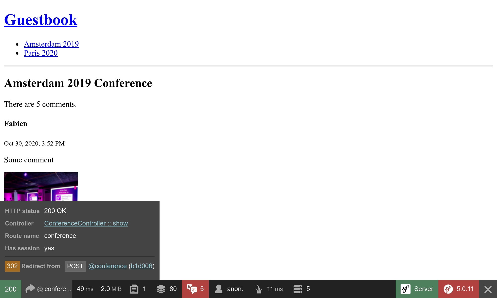

利用表单接收反馈
========================

.. index::
    single: Components;Form
    single: Form

是时候让我们的参会人员给出会议的反馈了。他们会通过 *HTML 表单* 来贡献他们的评论。

生成一个表单类型
------------------------

.. index::
    single: Command;make:form

用 *Maker bundle* 生成一个表单类：

.. code-block:: bash

    $ symfony console make:form CommentFormType Comment

.. code-block:: text
    :class: ignore
    :emphasize-lines: 1

     created: src/Form/CommentFormType.php

      Success!

     Next: Add fields to your form and start using it.
     Find the documentation at https://symfony.com/doc/current/forms.html

``App\Form\CommentFormType`` 类为 ``App\Entity\Comment`` 这个实体类定义了一个表单：

.. code-block:: php
    :caption: src/App/Form/CommentFormType.php
    :class: ignore

    namespace App\Form;

    use App\Entity\Comment;
    use Symfony\Component\Form\AbstractType;
    use Symfony\Component\Form\FormBuilderInterface;
    use Symfony\Component\OptionsResolver\OptionsResolver;

    class CommentFormType extends AbstractType
    {
        public function buildForm(FormBuilderInterface $builder, array $options)
        {
            $builder
                ->add('author')
                ->add('text')
                ->add('email')
                ->add('createdAt')
                ->add('photoFilename')
                ->add('conference')
            ;
        }

        public function configureOptions(OptionsResolver $resolver)
        {
            $resolver->setDefaults([
                'data_class' => Comment::class,
            ]);
        }
    }

`form type`_ 描述了绑定到模型的 *表单字段*。它把提交的表单数据转换为模型的类属性值。默认情况下，Symfony 会使用 ``Comment`` 实体的元数据来猜测每个字段的配置，比如 Doctrine 的元数据。例如，``text`` 类型的表字段会渲染成一个 ``textarea`` 页面元素，因为该字段是数据库表里一个容纳较多文字的列。

展示表单
------------

在控制器中创建表单，把它传入模板，从而将它展示给用户：

.. code-block:: diff
    :caption: patch_file
    :emphasize-lines: 18,24

    --- a/src/Controller/ConferenceController.php
    +++ b/src/Controller/ConferenceController.php
    @@ -2,7 +2,9 @@

     namespace App\Controller;

    +use App\Entity\Comment;
     use App\Entity\Conference;
    +use App\Form\CommentFormType;
     use App\Repository\CommentRepository;
     use App\Repository\ConferenceRepository;
     use Symfony\Bundle\FrameworkBundle\Controller\AbstractController;
    @@ -35,6 +37,9 @@ class ConferenceController extends AbstractController
          */
         public function show(Request $request, Conference $conference, CommentRepository $commentRepository): Response
         {
    +        $comment = new Comment();
    +        $form = $this->createForm(CommentFormType::class, $comment);
    +
             $offset = max(0, $request->query->getInt('offset', 0));
             $paginator = $commentRepository->getCommentPaginator($conference, $offset);

    @@ -43,6 +48,7 @@ class ConferenceController extends AbstractController
                 'comments' => $paginator,
                 'previous' => $offset - CommentRepository::PAGINATOR_PER_PAGE,
                 'next' => min(count($paginator), $offset + CommentRepository::PAGINATOR_PER_PAGE),
    +            'comment_form' => $form->createView(),
             ]));
         }
     }

你绝不应该直接实例化一个表单类型，而是应该用控制器的 ``createForm()`` 方法。这个方法来自 ``AbstractController`` 基类，它让创建表单变得很容易。

.. index::
    single: Twig;form

当把表单传递给模板时，要使用 ``createView()`` 方法把数据转换成适合于模板的格式。

在模板中展示表单可以用 ``form`` 这个 Twig 函数：

.. code-block:: diff
    :caption: patch_file
    :emphasize-lines: 10

    --- a/templates/conference/show.html.twig
    +++ b/templates/conference/show.html.twig
    @@ -30,4 +30,8 @@
         
             
No comments have been posted yet for this conference.

         
    +
    +    <h2>Add your own feedback</h2>
    +
    +    {{ form(comment_form) }}
     

在浏览器里刷新会议页面，你会注意到表单的每个字段都选用了合适的 HTML 元素（每个表单字段的类型是从模型中推断出来的）：

.. figure:: screenshots/form.png
    :alt: /conference/amsterdam-2019
    :align: center
    :figclass: with-browser

``form()`` 函数会根据表单类型里定义的所有信息来生成 HTML 的 form 元素。如果有文件上传，它还会在 ``<form>`` 标签里添加 ``enctype=multipart/form-data``。此外，当提交的信息有错时，它还会负责显示错误消息。通过覆盖默认的模板，你可以定制表单的任何部分，但在该项目中我们不需这样做。

定制一个表单类型
------------------------

虽然表单字段的配置是基于它们对应的模型字段，但你还是可以在表单类型的类中直接定制修改默认配置：

.. code-block:: diff
    :caption: patch_file

    --- a/src/Form/CommentFormType.php
    +++ b/src/Form/CommentFormType.php
    @@ -4,20 +4,31 @@ namespace App\Form;

     use App\Entity\Comment;
     use Symfony\Component\Form\AbstractType;
    +use Symfony\Component\Form\Extension\Core\Type\EmailType;
    +use Symfony\Component\Form\Extension\Core\Type\FileType;
    +use Symfony\Component\Form\Extension\Core\Type\SubmitType;
     use Symfony\Component\Form\FormBuilderInterface;
     use Symfony\Component\OptionsResolver\OptionsResolver;
    +use Symfony\Component\Validator\Constraints\Image;

     class CommentFormType extends AbstractType
     {
         public function buildForm(FormBuilderInterface $builder, array $options)
         {
             $builder
    -            ->add('author')
    +            ->add('author', null, [
    +                'label' => 'Your name',
    +            ])
                 ->add('text')
    -            ->add('email')
    -            ->add('createdAt')
    -            ->add('photoFilename')
    -            ->add('conference')
    +            ->add('email', EmailType::class)
    +            ->add('photo', FileType::class, [
    +                'required' => false,
    +                'mapped' => false,
    +                'constraints' => [
    +                    new Image(['maxSize' => '1024k'])
    +                ],
    +            ])
    +            ->add('submit', SubmitType::class)
             ;
         }

请注意我们增加了一个提交按钮（它允许我们在模板中继续使用 ``{{ form(comment_form) }}`` 这个简单的表达式）。

有一些字段无法去自动配置，比如 ``photoFilename`` 字段。``Comment`` 实体只需要保存照片的文件名，但表单需要处理文件上传。为了处理这种情况，我们需要在表单中增加一个非 ``mapped`` 字段 ``photo``：它不会被映射到 ``Comment`` 的任何属性。我们会手工管理它，以此来实现一些特别的逻辑（比如把上传的照片存储在磁盘上）。

为了演示定制功能，我们也修改了一些字段对应 label 标签的默认值。

验证模型
------------

表单类型配置了表单在前端的渲染（借助于一些 HTML5 的验证机制）。这是生成的 HTML 表单：

.. code-block:: html
    :class: ignore

    <form name="comment_form" method="post" enctype="multipart/form-data">
        

            

                <label for="comment_form_author" class="required">Your name</label>
                <input type="text" id="comment_form_author" name="comment_form[author]" required="required" maxlength="255" />
            

            

                <label for="comment_form_text" class="required">Text</label>
                <textarea id="comment_form_text" name="comment_form[text]" required="required"></textarea>
            

            

                <label for="comment_form_email" class="required">Email</label>
                <input type="email" id="comment_form_email" name="comment_form[email]" required="required" />
            

            

                <label for="comment_form_photo">Photo</label>
                <input type="file" id="comment_form_photo" name="comment_form[photo]" />
            

            

                <button type="submit" id="comment_form_submit" name="comment_form[submit]">Submit</button>
            

            <input type="hidden" id="comment_form__token" name="comment_form[_token]" value="DwqsEanxc48jofxsqbGBVLQBqlVJ_Tg4u9-BL1Hjgac" />
        

    </form>

在评论的邮箱字段，表单使用了 ``email`` 类型的 input 元素，而且在大多数字段上使用了 ``required`` 属性。请留意表单还包含了一个名为 ``_token`` 的隐藏字段，它会保护表单免受 `CSRF 攻击 <https://www.owasp.org/index.php/Cross-Site_Request_Forgery_(CSRF)>`_。

但如果表单提交绕过了 HTML 验证（比如，表单是通过一个类似 cURL 的 HTTP 客户端提交，数据就不会进行强制验证），那不合格的数据就会送达服务器。

在 ``Comment`` 数据模型上，我们需要增加一些用于验证的约束条件：

.. code-block:: diff
    :caption: patch_file

    --- a/src/Entity/Comment.php
    +++ b/src/Entity/Comment.php
    @@ -4,6 +4,7 @@ namespace App\Entity;

     use App\Repository\CommentRepository;
     use Doctrine\ORM\Mapping as ORM;
    +use Symfony\Component\Validator\Constraints as Assert;

     /**
      * @ORM\Entity(repositoryClass=CommentRepository::class)
    @@ -20,16 +21,20 @@ class Comment

         /**
          * @ORM\Column(type="string", length=255)
    +     * @Assert\NotBlank
          */
         private $author;

         /**
          * @ORM\Column(type="text")
    +     * @Assert\NotBlank
          */
         private $text;

         /**
          * @ORM\Column(type="string", length=255)
    +     * @Assert\NotBlank
    +     * @Assert\Email
          */
         private $email;

处理表单
------------

到目前为止，我们所写的代码足以用来展示表单。

现在我们应该在控制器中处理表单提交以及将它的信息在数据库中持久化：

.. code-block:: diff
    :caption: patch_file

    --- a/src/Controller/ConferenceController.php
    +++ b/src/Controller/ConferenceController.php
    @@ -7,6 +7,7 @@ use App\Entity\Conference;
     use App\Form\CommentFormType;
     use App\Repository\CommentRepository;
     use App\Repository\ConferenceRepository;
    +use Doctrine\ORM\EntityManagerInterface;
     use Symfony\Bundle\FrameworkBundle\Controller\AbstractController;
     use Symfony\Component\HttpFoundation\Request;
     use Symfony\Component\HttpFoundation\Response;
    @@ -16,10 +17,12 @@ use Twig\Environment;
     class ConferenceController extends AbstractController
     {
         private $twig;
    +    private $entityManager;

    -    public function __construct(Environment $twig)
    +    public function __construct(Environment $twig, EntityManagerInterface $entityManager)
         {
             $this->twig = $twig;
    +        $this->entityManager = $entityManager;
         }

         /**
    @@ -39,6 +42,15 @@ class ConferenceController extends AbstractController
         {
             $comment = new Comment();
             $form = $this->createForm(CommentFormType::class, $comment);
    +        $form->handleRequest($request);
    +        if ($form->isSubmitted() && $form->isValid()) {
    +            $comment->setConference($conference);
    +
    +            $this->entityManager->persist($comment);
    +            $this->entityManager->flush();
    +
    +            return $this->redirectToRoute('conference', ['slug' => $conference->getSlug()]);
    +        }

             $offset = max(0, $request->query->getInt('offset', 0));
             $paginator = $commentRepository->getCommentPaginator($conference, $offset);

当表单提交后，``Comment`` 对象会按照提交的数据进行更新。

评论对应的会议要强制保持和 URL 里标识的会议一样（我们把会议字段从表单中移除了）。

如果表单数据验证失败，我们会展示页面，但这时表单会包含提交的数据以及错误消息，这样它们能展示给用户看。

试一下这个表单。它应该能运行良好，而且数据会被保存在数据库中（在管理后台检查下这个数据）。但这里还是有个问题：照片。现在还不能上传照片，因为我们还没有在控制器中处理它。

上传文件
------------

上传的照片需要存储在本地磁盘上，而且前端页面要可以访问到它们，这样在会议页面就能找事这些照片。我们会把照片存储在 ``public/uploads/photos`` 目录下：

.. code-block:: diff
    :caption: patch_file

    --- a/src/Controller/ConferenceController.php
    +++ b/src/Controller/ConferenceController.php
    @@ -9,6 +9,7 @@ use App\Repository\CommentRepository;
     use App\Repository\ConferenceRepository;
     use Doctrine\ORM\EntityManagerInterface;
     use Symfony\Bundle\FrameworkBundle\Controller\AbstractController;
    +use Symfony\Component\HttpFoundation\File\Exception\FileException;
     use Symfony\Component\HttpFoundation\Request;
     use Symfony\Component\HttpFoundation\Response;
     use Symfony\Component\Routing\Annotation\Route;
    @@ -38,13 +39,22 @@ class ConferenceController extends AbstractController
         /**
          * @Route("/conference/{slug}", name="conference")
          */
    -    public function show(Request $request, Conference $conference, CommentRepository $commentRepository): Response
    +    public function show(Request $request, Conference $conference, CommentRepository $commentRepository, string $photoDir): Response
         {
             $comment = new Comment();
             $form = $this->createForm(CommentFormType::class, $comment);
             $form->handleRequest($request);
             if ($form->isSubmitted() && $form->isValid()) {
                 $comment->setConference($conference);
    +            if ($photo = $form['photo']->getData()) {
    +                $filename = bin2hex(random_bytes(6)).'.'.$photo->guessExtension();
    +                try {
    +                    $photo->move($photoDir, $filename);
    +                } catch (FileException $e) {
    +                    // unable to upload the photo, give up
    +                }
    +                $comment->setPhotoFilename($filename);
    +            }

                 $this->entityManager->persist($comment);
                 $this->entityManager->flush();

为了管理照片上传，我们给每个文件一个随机的名字。然后，我们把上传的文件移动到目的地（那个照片目录）。最后，我们把文件名存储在 Comment 对象里。

.. index::
    single: Container;Bind
    single: Bind

注意到 ``show()`` 方法里的新参数了吗？``$photoDir`` 是一个字符串，不是一个服务。Symfony 是如何知道要注入什么参数呢？Symfony 的服务容器除了存储服务外，也可以存储 *参数*。参数是一些用来帮助配置服务的标量。这些参数可以被显式地注入到服务中，也可以通过 *绑定名字* 来注入：

.. code-block:: diff
    :caption: patch_file

    --- a/config/services.yaml
    +++ b/config/services.yaml
    @@ -10,6 +10,8 @@ services:
         _defaults:
             autowire: true      # Automatically injects dependencies in your services.
             autoconfigure: true # Automatically registers your services as commands, event subscribers, etc.
    +        bind:
    +            $photoDir: "%kernel.project_dir%/public/uploads/photos"

         # makes classes in src/ available to be used as services
         # this creates a service per class whose id is the fully-qualified class name

通过 ``bind`` 里的设置，当一个服务有名为 ``$photoDir`` 的参数时，Symfony 就会注入对应的值。

试着上传一个 PDF 文件，而不是图片。你应该会看到错误消息。目前页面设计很难看，但别担心，再过几个步骤我们会去处理网站设计，到时一切都会变好看的。对于这些表单，我们会修改一行配置来给所有元素设置样式。

调试表单
------------

当表单提交后出了些问题，使用 Symfony 分析器的 “Form” 面板。它会告诉你有关表单的信息，它的全部选项，提交的数据以及它们在内部是如何转换的。如果表单包含了错误，这些错误也会被列出来。

典型的表单工作流像是这样：

* 页面上展示表单；

* 用户通过 POST 请求提交表单；

* 服务器把用户重定向到一个新页面或原来的页面。

当请求成功提交后，你如何查看探查器里的信息呢？由于页面被立刻重定向了，我们再也见不到 web 排错工具栏里的 POST 请求了。没问题，在重定向到的页面里，在 “200” 状态码的绿色区域悬浮鼠标，你会看到一个 “302” 重定向，它带有一个指向页面分析信息的链接（在括号中）。

点击那个链接，可以打开那个 POST 请求的分析页，然后进入 “Form” 面板：

.. code-block:: bash
    :class: hide

    $ rm -rf var/cache

.. figure:: screenshots/form-profiler.png
    :alt: /_profiler/450aa5
    :align: center
    :figclass: with-browser

在管理后台中显示上传的照片
---------------------------------------

现在后台只是显示照片的文件名，但我们想要看到真实的照片：

.. code-block:: diff
    :caption: patch_file

    --- a/config/packages/easy_admin.yaml
    +++ b/config/packages/easy_admin.yaml
    @@ -17,6 +17,7 @@ easy_admin:
                     fields:
                         - author
                         - { property: 'email', type: 'email' }
    +                    - { property: 'photoFilename', type: 'image', 'base_path': "/uploads/photos", label: 'Photo' }
                         - { property: 'createdAt', type: 'datetime' }
                     sort: ['createdAt', 'ASC']
                     filters: ['conference']

在 Git 仓库中排除上传的照片
--------------------------------------

先不要提交！我们可不想把上传的图片存放进 Git 仓库。在 ``.gitignore`` 文件中添加 ``/public/uploads`` 目录：

.. code-block:: diff
    :caption: patch_file

    --- a/.gitignore
    +++ b/.gitignore
    @@ -1,3 +1,4 @@
    +/public/uploads

     ###> symfony/framework-bundle ###
     /.env.local

在生产服务器上存储上传的文件
------------------------------------------

最后一步是在生产服务器上存储上传的文件。为什么我们需要做一些特殊处理？因为出于各种原因，大多数现代云平台都使用只读容器。SymfonyCloud 也不例外。

在 Symfony 项目中，并不是所有的组成部分都是只读的。当构建容器的时候，我们尽可能尝试生成尽量多的缓存（在缓存预热阶段），但是 Symfony 仍然需要在某些地方可写，比如用户缓存、日志、会话数据（如果会话是存储在文件系统中的话）和其它更多地方。

看一下 ``.symfony.cloud.yaml`` 文件，这里已经有针对 ``var/`` 目录的可写 *挂载点*。``var/`` 目录是 Symfony 唯一要写入数据的地方（缓存、日志......）。

现在我们为上传的照片创建一个新的挂载点：

.. code-block:: diff
    :caption: patch_file

    --- a/.symfony.cloud.yaml
    +++ b/.symfony.cloud.yaml
    @@ -38,6 +38,7 @@ web:

     mounts:
         "/var": { source: local, source_path: var }
    +    "/public/uploads": { source: local, source_path: uploads }

     hooks:
         build: |

现在你可以部署代码，之后照片就会存储在 ``public/uploads/`` 目录，和本地版本一样。

.. sidebar:: 深入学习

    * `SymfonyCasts 的表单教程 <https://symfonycasts.com/screencast/symfony-forms>`_；

    * 如何 `定制 Symfony 表单在 HTML 里的渲染  <https://symfony.com/doc/current/form/form_customization.html>`_；

    * `验证 Symfony 表单 <https://symfony.com/doc/current/forms.html#validating-forms>`_；

    * `Symfony 表单类型参考 <https://symfony.com/doc/current/reference/forms/types.html>`_；

    * `FlysystemBundle 文档 <https://github.com/thephpleague/flysystem-bundle/blob/master/docs/1-getting-started.md>`_，它提供了和多个云存储服务的集成，比如 AWS S3、Azure 和 Google Cloud Storage；

    * `Symfony 配置参数 <https://symfony.com/doc/current/configuration.html#configuration-parameters>`_。

    * `Symfony 用于验证的约束 <https://symfony.com/doc/current/validation.html#basic-constraints>`_；

    * `Symfony 表单速查表 <https://github.com/andreia/symfony-cheat-sheets/blob/master/Symfony2/how_symfony2_forms_works_en.pdf>`_。

.. _`form type`: https://symfony.com/doc/current/forms.html#form-types
