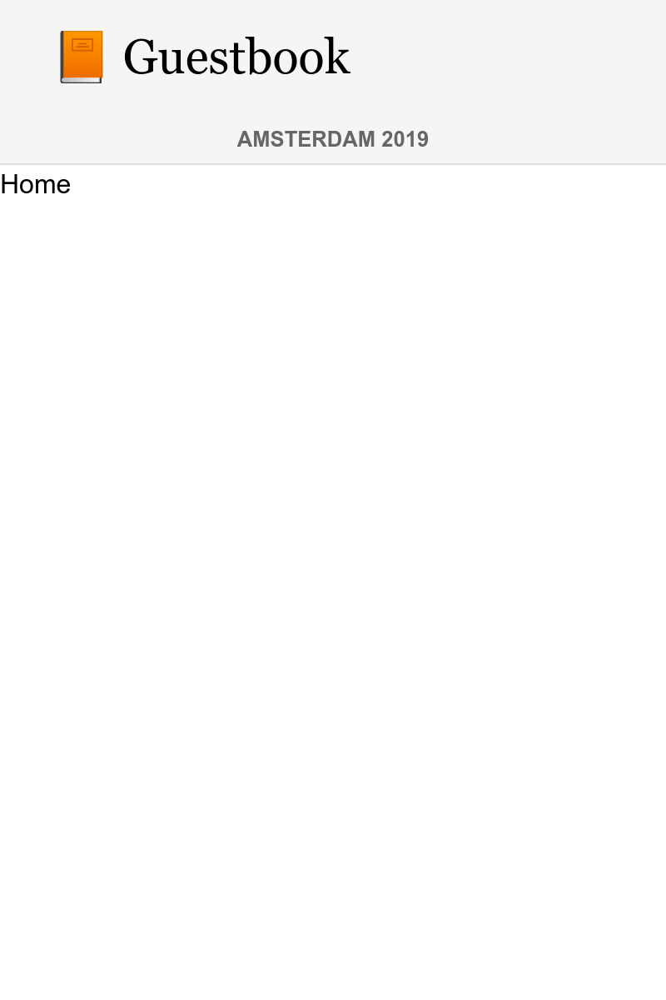
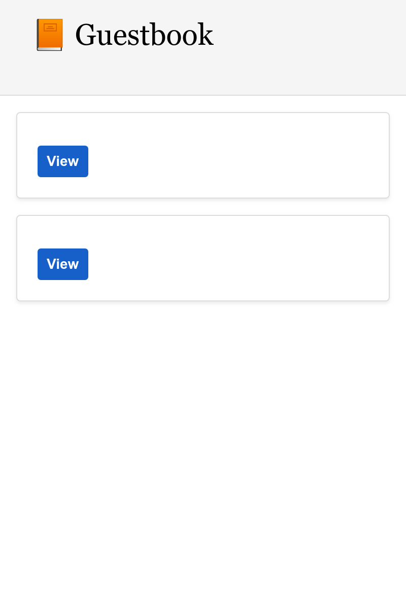

构建单页应用
==================

.. index::
    single: SPA
    single: Mobile

大多数的评论会在会议期间提交。在开会时，有些人没带笔记本电脑，但他们很可能都有智能手机。创建一个移动应用程序来快速查看会议评论，你觉得怎么样？

创建这样一个移动应用的方式之一是构建一个使用 JavaScript 的单页应用（SPA）。一个单页应用运行在本地，可以使用本地存储，能够调用远程 HTTP API 接口，也可以利用 service worker 创造接近原生应用的体验。

创建应用
------------

我们会使用 `Preact`_ 和 **Symfony 的 Encore** 来创建这个移动应用。**Preact** 作为一个轻量而高效的基础库，很适合用于我们的留言本单页应用。

为了保持网站和单页应用的一致性，我们会在移动应用里重用网站的 Sass 样式表。

在 ``spa`` 目录下创建这个单页应用，将网站的样式表复制进来：

.. code-block:: bash

    $ mkdir -p spa/src spa/public spa/assets/css
    $ cp assets/css/*.scss spa/assets/css/
    $ cd spa

.. note::

    因为我们主要是通过浏览器来和单页应用交互的，所以我们创建了 ``public`` 目录。如果只是想要开发一个移动应用，我们也可以把它命名为 ``build``。

初始化 ``package.json`` 文件（这个文件对 JavaScript 的意义就相当于 ``composer.json`` 对 PHP 的意义）：

.. code-block:: bash

    $ yarn init -y

现在来添加一些必要的依赖包：

.. code-block:: bash

    $ yarn add @symfony/webpack-encore @babel/core @babel/preset-env babel-preset-preact preact html-webpack-plugin bootstrap

另外，加上一个 ``.gitignore`` 文件：

.. code-block:: text
    :caption: .gitignore

    /node_modules
    /public
    /yarn-error.log
    # used later by Cordova
    /app

最后一步是创建 Webpack Encore 的配置：

.. code-block:: javascript
    :caption: webpack.config.js
    :emphasize-lines: 8,11

    const Encore = require('@symfony/webpack-encore');
    const HtmlWebpackPlugin = require('html-webpack-plugin');

    Encore
        .setOutputPath('public/')
        .setPublicPath('/')
        .cleanupOutputBeforeBuild()
        .addEntry('app', './src/app.js')
        .enablePreactPreset()
        .enableSingleRuntimeChunk()
        .addPlugin(new HtmlWebpackPlugin({ template: 'src/index.ejs', alwaysWriteToDisk: true }))
    ;

    module.exports = Encore.getWebpackConfig();

创建单页应用的主模板
------------------------------

是时候创建初始模板了，Preact 会在其中渲染应用程序：

.. code-block:: html
    :caption: src/index.ejs
    :emphasize-lines: 12

    <!DOCTYPE html>
    <html>
    <head>
        <meta http-equiv="Content-Type" content="text/html; charset=utf-8" />
        <meta http-equiv="X-UA-Compatible" content="IE=edge" />
        <meta name="msapplication-tap-highlight" content="no" />
        <meta name="viewport" content="user-scalable=no, initial-scale=1, maximum-scale=1, minimum-scale=1, width=device-width" />

        <title>Conference Guestbook application</title>
    </head>
    <body>
        

    </body>
    </html>

``
`` 标签就是 JavaScript 进行渲染应用的地方。这是代码的第一版，它会渲染一个 “Hello World” 视图：

.. code-block:: text
    :caption: src/app.js
    :emphasize-lines: 3,11

    import {h, render} from 'preact';

    function App() {
        return (
            

                Hello world!
            

        )
    }

    render(<App />, document.getElementById('app'));

最后一行把 ``App()`` 函数注册到 HTML 页面的 ``#app`` 元素上。

现在一切就绪！

在浏览器中运行单页应用
---------------------------------

.. index::
    single: Symfony CLI;server:start
    single: Symfony CLI;server:stop

由于这个应用是独立于网站之外的，我们需要运行另外一个 web 服务器：

.. code-block:: bash
    :class: hide

    $ symfony server:stop

.. code-block:: bash

    $ symfony server:start -d --passthru=index.html

``--passthru`` 选项告诉 web 服务器把所有 HTTP 请求传递到 ``public/index.html`` 文件（``public/`` 是 web 服务器默认的 web 根目录）。这个页面由 Preact 应用来管理，它根据 "browser" 中的历史来获取要渲染的页面。

运行 ``yarn`` 来编译 CSS **和 JavaScript** 文件：

.. code-block:: bash

    $ yarn encore dev

在浏览器中打开这个应用：

.. code-block:: bash
    :class: ignore

    $ symfony open:local

看一下我们的 Hello World 应用：

.. figure:: screenshots/spa.png
    :alt: /
    :align: center
    :figclass: with-browser spa

增加路由管理器来处理状态
------------------------------------

目前这个单页应用不能处理不同的页面。要实现多页面，我们需要一个路由管理器，就像在 Symfony 里的一样。我们会使用 **preact-router**。它以一个 URL 作为输入，然后匹配出一个要渲染的 Preact 组件。

安装 preact-router：

.. code-block:: bash

    $ yarn add preact-router

为首页创建一个页面（即一个 *Preact 组件*）：

.. code-block:: text
    :caption: src/pages/home.js

    import {h} from 'preact';

    export default function Home() {
        return (
            
Home

        );
    };

和另一个用于会议页面的组件：

.. code-block:: text
    :caption: src/pages/conference.js

    import {h} from 'preact';

    export default function Conference() {
        return (
            
Conference

        );
    };

用 ``Router`` 组件代替 "Hello World" 的 ``div`` 元素：

.. code-block:: diff
    :caption: patch_file
    :emphasize-lines: 15,17,20-23

    --- a/src/app.js
    +++ b/src/app.js
    @@ -1,9 +1,22 @@
     import {h, render} from 'preact';
    +import {Router, Link} from 'preact-router';
    +
    +import Home from './pages/home';
    +import Conference from './pages/conference';

     function App() {
         return (
             

    -            Hello world!
    +            <header>
    +                <Link href="/">Home</Link>
    +                 
    +                <Link href="/conference/amsterdam2019">Amsterdam 2019</Link>
    +            </header>
    +
    +            <Router>
    +                <Home path="/" />
    +                <Conference path="/conference/:slug" />
    +            </Router>
             

         )
     }

重新构建应用：

.. code-block:: bash

    $ yarn encore dev

你在浏览器里刷新应用后，你可以点击“首页”和会议的链接。注意，浏览器的 URL 和后退/前进按钮会如你所预期的那样工作。

为单页应用添加样式
---------------------------

就像在网站中一样，我们来添加 Sass 加载器：

.. code-block:: bash

    $ yarn add node-sass sass-loader

在 Webpack 里启用 Sass 加载器，并在样式表里添加引用：

.. code-block:: diff
    :caption: patch_file

    --- a/src/app.js
    +++ b/src/app.js
    @@ -1,3 +1,5 @@
    +import '../assets/css/app.scss';
    +
     import {h, render} from 'preact';
     import {Router, Link} from 'preact-router';

    --- a/webpack.config.js
    +++ b/webpack.config.js
    @@ -7,6 +7,7 @@ Encore
         .cleanupOutputBeforeBuild()
         .addEntry('app', './src/app.js')
         .enablePreactPreset()
    +    .enableSassLoader()
         .enableSingleRuntimeChunk()
         .addPlugin(new HtmlWebpackPlugin({ template: 'src/index.ejs', alwaysWriteToDisk: true }))
     ;

现在我们可以更新应用程序来使用新的样式表：

.. code-block:: diff
    :caption: patch_file

    --- a/src/app.js
    +++ b/src/app.js
    @@ -9,10 +9,20 @@ import Conference from './pages/conference';
     function App() {
         return (
             

    -            <header>
    -                <Link href="/">Home</Link>
    -                 
    -                <Link href="/conference/amsterdam2019">Amsterdam 2019</Link>
    +            <header className="header">
    +                <nav className="navbar navbar-light bg-light">
    +                    

    +                        <Link className="navbar-brand mr-4 pr-2" href="/">
    +                            &#128217; Guestbook
    +                        </Link>
    +                    

    +                </nav>
    +
    +                <nav className="bg-light border-bottom text-center">
    +                    <Link className="nav-conference" href="/conference/amsterdam2019">
    +                        Amsterdam 2019
    +                    </Link>
    +                </nav>
                 </header>

                 <Router>

再构建一次应用：

.. code-block:: bash

    $ yarn encore dev

现在你可以好好欣赏这个拥有完善样式的单页应用了：

从 API 获取数据
--------------------

现在这个 Preact 应用的结构已经完成了：Preact Router 会处理包括会议 slug 占位在内的页面状态，主样式表也会给单页应用提供样式。

为了使单页应用使用动态内容，我们需要通过 HTTP 请求来从 API 接口获取数据。

配置 Webpack 来暴露出包含 API 地址的环境变量：

.. code-block:: diff
    :caption: patch_file

    --- a/webpack.config.js
    +++ b/webpack.config.js
    @@ -1,3 +1,4 @@
    +const webpack = require('webpack');
     const Encore = require('@symfony/webpack-encore');
     const HtmlWebpackPlugin = require('html-webpack-plugin');

    @@ -10,6 +11,9 @@ Encore
         .enableSassLoader()
         .enableSingleRuntimeChunk()
         .addPlugin(new HtmlWebpackPlugin({ template: 'src/index.ejs', alwaysWriteToDisk: true }))
    +    .addPlugin(new webpack.DefinePlugin({
    +        'ENV_API_ENDPOINT': JSON.stringify(process.env.API_ENDPOINT),
    +    }))
     ;

     module.exports = Encore.getWebpackConfig();

``API_ENDPOINT`` 环境变量要指向网站的 web 服务器，那里的 API 端点都在 ``/api`` 路径下。我们在稍后运行 ``yarn encore`` 时会把它设置好。

创建 ``api.js`` 文件，对从 API 获取数据做一层抽象：

.. code-block:: text
    :caption: src/api/api.js

    function fetchCollection(path) {
        return fetch(ENV_API_ENDPOINT + path).then(resp => resp.json()).then(json => json['hydra:member']);
    }

    export function findConferences() {
        return fetchCollection('api/conferences');
    }

    export function findComments(conference) {
        return fetchCollection('api/comments?conference='+conference.id);
    }

现在你可以调整页头和首页组件：

.. code-block:: diff
    :caption: patch_file

    --- a/src/app.js
    +++ b/src/app.js
    @@ -2,11 +2,23 @@ import '../assets/css/app.scss';

     import {h, render} from 'preact';
     import {Router, Link} from 'preact-router';
    +import {useState, useEffect} from 'preact/hooks';

    +import {findConferences} from './api/api';
     import Home from './pages/home';
     import Conference from './pages/conference';

     function App() {
    +    const [conferences, setConferences] = useState(null);
    +
    +    useEffect(() => {
    +        findConferences().then((conferences) => setConferences(conferences));
    +    }, []);
    +
    +    if (conferences === null) {
    +        return 
Loading...
;
    +    }
    +
         return (
             

                 <header className="header">
    @@ -19,15 +31,17 @@ function App() {
                     </nav>

                     <nav className="bg-light border-bottom text-center">
    -                    <Link className="nav-conference" href="/conference/amsterdam2019">
    -                        Amsterdam 2019
    -                    </Link>
    +                    {conferences.map((conference) => (
    +                        <Link className="nav-conference" href={'/conference/'+conference.slug}>
    +                            {conference.city} {conference.year}
    +                        </Link>
    +                    ))}
                     </nav>
                 </header>

                 <Router>
    -                <Home path="/" />
    -                <Conference path="/conference/:slug" />
    +                <Home path="/" conferences={conferences} />
    +                <Conference path="/conference/:slug" conferences={conferences} />
                 </Router>
             

         )
    --- a/src/pages/home.js
    +++ b/src/pages/home.js
    @@ -1,7 +1,28 @@
     import {h} from 'preact';
    +import {Link} from 'preact-router';
    +
    +export default function Home({conferences}) {
    +    if (!conferences) {
    +        return 
No conferences yet
;
    +    }

    -export default function Home() {
         return (
    -        
Home

    +        

    +            {conferences.map((conference)=> (
    +                

    +                    

    +                        

    +                            <h4 className="font-weight-light">
    +                                {conference.city} {conference.year}
    +                            </h4>
    +                        

    +
    +                        <Link className="btn btn-sm btn-blue stretched-link" href={'/conference/'+conference.slug}>
    +                            View
    +                        </Link>
    +                    

    +                

    +            ))}
    +        

         );
    -};
    +}

最后，Preact Router 把 “slug” 占位符作为属性传递给会议组件。通过调用 API，可以用这个占位符来展示对应的会议和它的评论；修改渲染的代码，让它使用 API 的数据：

.. code-block:: diff
    :caption: patch_file

    --- a/src/pages/conference.js
    +++ b/src/pages/conference.js
    @@ -1,7 +1,48 @@
     import {h} from 'preact';
    +import {findComments} from '../api/api';
    +import {useState, useEffect} from 'preact/hooks';
    +
    +function Comment({comments}) {
    +    if (comments !== null && comments.length === 0) {
    +        return 
No comments yet
;
    +    }
    +
    +    if (!comments) {
    +        return 
Loading...
;
    +    }
    +
    +    return (
    +        

    +            {comments.map(comment => (
    +                

    +                    

    +                        {!comment.photoFilename ? '' : (
    +                            <a href={ENV_API_ENDPOINT+'uploads/photos/'+comment.photoFilename} target="_blank">
    +                                
    +                            </a>
    +                        )}
    +                    

    +
    +                    <h5 className="font-weight-light mt-3 mb-0">{comment.author}</h5>
    +                    
{comment.text}

    +                

    +            ))}
    +        

    +    );
    +}
    +
    +export default function Conference({conferences, slug}) {
    +    const conference = conferences.find(conference => conference.slug === slug);
    +    const [comments, setComments] = useState(null);
    +
    +    useEffect(() => {
    +        findComments(conference).then(comments => setComments(comments));
    +    }, [slug]);

    -export default function Conference() {
         return (
    -        
Conference

    +        

    +            <h4>{conference.city} {conference.year}</h4>
    +            <Comment comments={comments} />
    +        

         );
    -};
    +}

这个单页应用需要通过 ``API_ENDPOINT`` 环境变量来知道我们 API 的 URL。把它设为 API 使用的 web 服务器的 URL（它在 ``..`` 目录中运行）：

.. code-block:: bash

    $ API_ENDPOINT=`symfony var:export SYMFONY_PROJECT_DEFAULT_ROUTE_URL --dir=..` yarn encore dev

现在你也可以让它在后台运行：

.. code-block:: bash

    $ API_ENDPOINT=`symfony var:export SYMFONY_PROJECT_DEFAULT_ROUTE_URL --dir=..` symfony run -d --watch=webpack.config.js yarn encore dev --watch

现在应用程序在浏览器中可以很好地工作了：

.. figure:: screenshots/spa-conference-final.png
    :alt: /conference/amsterdam-2019
    :align: center
    :figclass: with-browser spa

哇！现在我们有了一个使用路由和真实数据的全功能单页应用了。如果我们想的话，还可以进一步整理这个应用程序，但它已经工作得很好了。

在生产环境中部署这个应用
------------------------------------

.. index::
    single: SymfonyCloud;Multi-Applications

SymfonyCloud 可以为每个项目部署多个应用。在任何子目录下创建一个 ``.symfony.cloud.yaml`` 文件就可以新建一个应用。我们在 ``spa/`` 目录下创建一个名为 ``spa`` 的应用：

.. code-block:: yaml
    :caption: .symfony.cloud.yaml
    :emphasize-lines: 1

    name: spa

    type: php:7.3
    size: S

    build:
        flavor: none

    web:
        commands:
            start: sleep
        locations:
            "/":
                root: "public"
                index:
                    - "index.html"
                scripts: false
                expires: 10m

    hooks:
        build: |
            set -x -e

            curl -s https://get.symfony.com/cloud/configurator | (>&2 bash)
            (>&2
                unset NPM_CONFIG_PREFIX
                export NVM_DIR=${SYMFONY_APP_DIR}/.nvm

                yarn-install

                set +x && . "${SYMFONY_APP_DIR}/.nvm/nvm.sh" && set -x

                yarn encore prod
            )

.. index::
    single: SymfonyCloud;Routes

修改 ``.symfony/routes.yaml`` 文件，把 ``spa.`` 子域名路由到项目根目录下存储的 ``spa`` 应用：

.. code-block:: bash

    $ cd ../

.. code-block:: diff
    :caption: patch_file
    :emphasize-lines: 4,5

    --- a/.symfony/routes.yaml
    +++ b/.symfony/routes.yaml
    @@ -1,2 +1,5 @@
    +"https://spa.{all}/": { type: upstream, upstream: "spa:http" }
    +"http://spa.{all}/": { type: redirect, to: "https://spa.{all}/" }
    +
     "https://{all}/": { type: upstream, upstream: "varnish:http", cache: { enabled: false } }
     "http://{all}/": { type: redirect, to: "https://{all}/" }

为单页应用配置 CORS
--------------------------

.. index::
    single: CORS
    single: Cross-Origin Resource Sharing

如果你现在部署代码，它不会正常运行，因为浏览器会阻止 API 请求。我们需要显式地允许该应用来访问 API。获取当前与你应用关联的域名：

.. code-block:: bash

    $ symfony env:urls --first

根据这个域名定义 ``CORS_ALLOW_ORIGIN`` 环境变量：

.. code-block:: bash

    $ symfony var:set "CORS_ALLOW_ORIGIN=^`symfony env:urls --first | sed 's#/$##' | sed 's#https://#https://spa.#'`$"

如果你的域名是 ``https://master-5szvwec-hzhac461b3a6o.eu.s5y.io/``，那么 ``sed`` 调用会将它转换为 ``https://spa.master-5szvwec-hzhac461b3a6o.eu.s5y.io``。

我们也需要设置 ``API_ENDPOINT`` 环境变量：

.. code-block:: bash

    $ symfony var:set API_ENDPOINT=`symfony env:urls --first`

提交并部署：

.. code-block:: bash
    :class: ignore

    $ git add .
    $ git commit -a -m'Add the SPA application'
    $ symfony deploy

通过把该应用作为一个命令行选项，在浏览器中打开它：

.. code-block:: bash
    :class: ignore

    $ symfony open:remote --app=spa

使用 Cordova 构建手机原生应用
---------------------------------------

.. index::
    single: SPA;Cordova
    single: Apache Cordova
    single: Cordova

**Apache Cordova** 是一个用于构建跨平台手机原生应用的工具。好消息是，我们刚刚创建的这个单页应用可以使用它进行构建。

我们来安装它：

.. code-block:: bash

    $ cd spa
    $ yarn global add cordova

.. note::

    我们也需要装安卓 SDK。这一节只讨论安卓，但 Cordova 可用于所有移动平台，包括 iOS 系统。

创建应用的目录结构：

.. code-block:: bash
    :class: answers(n)

    $ cordova create app

生成安卓应用：

.. code-block:: bash
    :class: ignore

    $ cd app
    $ cordova platform add android
    $ cd ..

这就是你全部所需的。现在你能构建生产环境下的文件，并将它们移动到 Cordova：

.. code-block:: bash

    $ API_ENDPOINT=`symfony var:export SYMFONY_PROJECT_DEFAULT_ROUTE_URL --dir=..` yarn encore production
    $ rm -rf app/www
    $ mkdir -p app/www
    $ cp -R public/ app/www

在智能手机或模拟器上运行这个原生应用：

.. code-block:: bash
    :class: ignore

    $ cordova run android

.. sidebar:: 深入学习

    * `Preact 官网 <https://preactjs.com/>`_；

    * `Cordova 官网 <https://cordova.apache.org/>`_。

.. _`preact`: https://preactjs.com/
