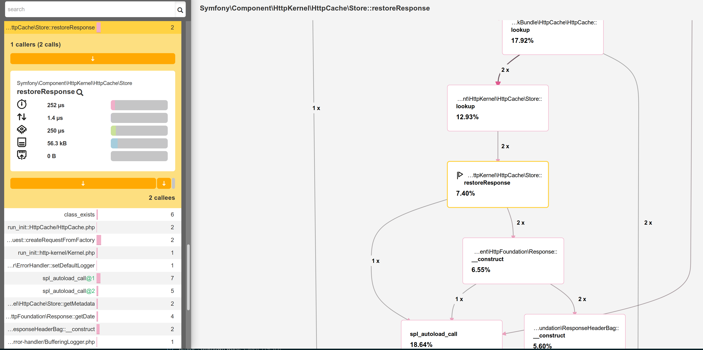

探索 Symfony 内部机制
===========================

.. index::
    single: Blackfire
    single: Debugging
    single: Internals

好长时间以来，我们一直在用 Symfony 开发一个功能强大的应用程序，但它执行的大多数代码来自 Symfony 本身。自己写的几百行代码对比 Symfony 本身的成千上万行代码。

我喜欢去理解事物在幕后的工作原理。那些帮助我明白事物工作原理的工具总是吸引着我。我第一次使用步进式调试器，或是我第一次发现 ``ptrace`` 程序，这些都是记忆中的神奇时刻。

你想要更好理解 Symfony 如何工作吗？是时候来挖掘下 Symfony 如何运行你的应用了。我们不会从理论角度去描述 Symfony 如何处理一个 HTTP 请求，这样会很枯燥；而是会用 Blackfire 来获得一些图表，并用它来探索一些更高级的主题。

借助 Blackfire 来理解 Symfony 的内部机制
--------------------------------------------------

你已经知道所有的 HTTP 请求会发送到一个单一入口：``public/index.php`` 文件。但接下去会发生什么？控制器是怎么被调用的？

让我们用 Blackfire 的浏览器扩展来分析下生产环境里的英文首页：

.. code-block:: bash
    :class: ignore

    $ symfony remote:open

或者直接通过命令行：

.. code-block:: bash
    :class: ignore

    $ blackfire curl `symfony env:urls --first`en/

进入分析结果的“ Timeline（时间线）”视图，你会看到类似如下的内容：

.. figure:: images/blackfire-homepage-prod.png
    :alt: /
    :align: center
    :figclass: with-browser

把鼠标悬浮在时间线的颜色条上会得到每次调用的更多信息；你会学到关于 Symfony 工作原理的很多知识：

* 主入口是 ``public/index.php``；

* ``Kernel::handle()`` 方法处理请求；

* 它会调用 ``HttpKernel``，而 ``HttpKernel`` 会分发一些事件；

* 第一个事件是 ``RequestEvent``；

* ``ControllerResolver::getController()`` 方法被调用，它会根据访问的 URL 来决定应该调用哪个控制器；

* ``ControllerResolver::getArguments()`` 方法被调用，它会决定要传递哪些参数给控制器（参数转换器会被调用）；

* ``ConferenceController::index()`` 方法被调用，我们的大部分代码都是这个方法执行的；

* ``ConferenceRepository::findAll()`` 从数据库获取所有的会议（注意是通过 ``PDO::__construct()`` 来连接到数据库的）；

* ``Twig\Environment::render()`` 方法渲染模板；

* ``ResponseEvent`` 和 ``FinishRequestEvent`` 事件会分发出去，但由于它们执行得非常快，所以看上去代码里并没有注册对应的事件监听器。

对于理解某些代码的工作原理，时间线是一个很好的方式；当你接手一个别人开发的项目时，它也很有帮助。

现在，在本地电脑的开发环境中分析同一个页面：

.. code-block:: bash
    :class: ignore

    $ blackfire curl `symfony var:export SYMFONY_PROJECT_DEFAULT_ROUTE_URL`en/

打开分析结果。由于请求处理得很快，而且时间线里内容很空，你应该会被重定向到调用图表的视图：

你明白发生了什么吗？HTTP 缓存处于启用状态，所以我们是分析了 Symfony 的 HTTP 缓存层。由于页面被缓存了，``HttpCache\Store::restoreResponse()`` 是从缓存取得了 HTTP 应答，而控制器从没有被调用过。

和上一步一样，我们来禁用 ``public/index.php`` 里的缓存层，再做一次分析。你会立刻发现分析结果看上去非常不同：

.. figure:: images/blackfire-homepage-dev.png
    :alt: /
    :align: center
    :figclass: with-browser

以下是主要的不同点：

* 在生产环境中不可见的 ``TerminateEvent`` 事件占用了执行时间的很大比例；再仔细看下，你会看到这个事件负责存储请求过程中 Symfony 分析器收集到的数据；

* 注意 ``ConferenceController::index()`` 调用里的 ``SubRequestHandler::handle()`` 方法会渲染 ESI（这也是为什么我们要调用两次 ``Profiler::saveProfile()``，一次是为主请求，另一次是为 ESI）。

在时间线里探索来学到更多知识；切换到调用图表的视图，它用另一种方式展示了同样的数据。

正如我们刚才看到的那样，开发环境下执行的代码和生产环境下很不一样。因为开发环境下 Symfony 会去尝试收集很多数据来帮助调试问题，所以执行会更慢。这也是为什么即便是在本地你也总是应该对生产环境进行性能分析。

一些有趣的实验：分析一个错误页面、分析 ``/`` 路径对应的页（会重定向）或者分析一个 API 资源。每次的分析结果会让你更多了解 Symfony 的工作方式，比如哪些类和方法被调用、哪些操作代价很高、哪些则没什么代价。

使用 Blackfire 调试插件
-----------------------------

.. index::
    single: Blackfire;Debug Addon

默认情况下，Blackfire 会删除所有影响轻微的方法调用，这样可以避免很大的负载，也避免生成很大的图表。当把 Blackfire 用作调试工具时，最好可以保留所有调用。这时就需要调试插件。

在命令行里使用 ``--debug`` 选项：

.. code-block:: bash
    :class: ignore

    $ blackfire --debug curl `symfony var:export SYMFONY_PROJECT_DEFAULT_ROUTE_URL`en/
    $ blackfire --debug curl `symfony env:urls --first`en/

.. index::
    single: .env.local.prod

比如在生产环境中，你会看到加载了一个名为 ``.env.local.php`` 的文件：

.. figure:: images/blackfire-env-local-prod.png
    :alt: /
    :align: center
    :figclass: with-browser

.. index::
    single: Composer;Optimizations
    single: Composer;Autoloader
    single: Autoloader

它是哪来的呢？当部署一个 Symfony 应用程序时，SymfonyCloud 会做一些优化，比如优化 Composer 加载器（``--optimize-autoloader --apcu-autoloader --classmap-authoritative``）。它也对定义在 ``.env`` 文件中的环境变量进行优化（来避免每次请求都解析这个文件），优化的方式就是生成 ``.env.local.php`` 文件。

.. code-block:: bash
    :class: ignore

    $ symfony run composer dump-env prod

Blackfire 是一个很强大的工具，它帮助你理解 PHP 是如何执行代码的。用于提升性能只是使用分析器的方式之一。
