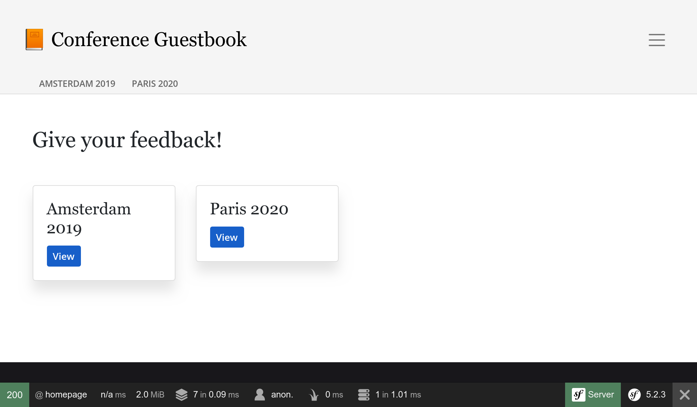

تصميم واجهة المستخدم بواسطة Webpack
===========================================================

.. index::
    single: Encore
    single: Webpack
    single: Components;Encore
    single: Stylesheet

لم نقضي وقتًا في تصميم واجهة المستخدم. لنمط مثل الموالية ، سوف نستخدم كومة حديثة  على أساس  `Webpack <https://webpack.js.org/>`_. ولإضافة لمسة Symfony وتيسير تكاملها مع التطبيق ، دعنا نثبت *Webpack Encore*:

.. code-block:: bash

    $ symfony composer req encore

تم إنشاء بيئة Webpack كاملة من أجلك: تم إنشاء ``package.json`` و`` webpack.config.js`` وتحتويان على تكوين افتراضي جيد. افتح `` webpack.config.js`` ، ويستخدم التجريد Encore لتكوين Webpack.

يحدد الملف ``package.json`` بعض الأوامر التي سنستخدمها طوال الوقت.

يحتوي دليل ``assets`` على نقاط الدخول الرئيسية لأصول المشروع: ``       styles/app.css`` و ``app.js``.

استخدام Sass
-------------------

.. index::
    single: Sass

بدلاً من استخدام CSS العادي ، دعنا ننتقل إلى `Saas <https://sass-lang.com/>`_:

.. code-block:: bash

    $ mv assets/styles/app.css assets/styles/app.scss

.. code-block:: diff
    :caption: patch_file

    --- a/assets/app.js
    +++ b/assets/app.js
    @@ -6,7 +6,7 @@
      */

     // any CSS you import will output into a single css file (app.css in this case)
    -import './styles/app.css';
    +import './styles/app.scss';

     // start the Stimulus application
     import './bootstrap';

تثبيت محمل Saas :

.. code-block:: bash

    $ yarn add node-sass sass-loader --dev

تمكين محمل Sass في Webpack:

.. code-block:: diff
    :caption: patch_file

    --- a/webpack.config.js
    +++ b/webpack.config.js
    @@ -56,7 +56,7 @@ Encore
         })

         // enables Sass/SCSS support
    -    //.enableSassLoader()
    +    .enableSassLoader()

         // uncomment if you use TypeScript
         //.enableTypeScriptLoader()

كيف عرفت الحزم التي سيتم تثبيتها؟ إذا حاولنا بناء أصولنا بدونها ، لكان Encore قد أعطانا رسالة خطأ لطيفة تقترح الأمر ``yarn add`` اللازم لتثبيت التبعيات لتحميل ملفات ``scss.``.

الاستفادة من Bootstrap
---------------------------------

.. index::
    single: Bootstrap

للبدء بإعدادات افتراضية جيدة وإنشاء موقع ويب سريع الاستجابة ، يمكن لإطار عمل CSS مثل ``</Bootstrap <https://getbootstrap.com`` _ أن يقطع شوطًا طويلًا. تثبيته كحزمة:

.. code-block:: bash

    $ yarn add bootstrap@4 jquery popper.js bs-custom-file-input --dev

أضف Bootstrap في ملف CSS (قمنا أيضًا بتنظيف الملف):

.. code-block:: diff
    :caption: patch_file

    --- a/assets/styles/app.scss
    +++ b/assets/styles/app.scss
    @@ -1,3 +1 @@
    -body {
    -    background-color: lightgray;
    -}
    +@import '~bootstrap/scss/bootstrap';

افعل نفس الشيء مع ملف JS:

.. code-block:: diff
    :caption: patch_file

    --- a/assets/app.js
    +++ b/assets/app.js
    @@ -7,6 +7,10 @@

     // any CSS you import will output into a single css file (app.css in this case)
     import './styles/app.scss';
    +import 'bootstrap';
    +import bsCustomFileInput from 'bs-custom-file-input';

     // start the Stimulus application
     import './bootstrap';
    +
    +bsCustomFileInput.init();

يدعم نظام    Bootstrap , Symfony form  محليًا باستخدام سمة خاصة ، وتمكينه:

.. code-block:: yaml
    :caption: config/packages/twig.yaml

    twig:
        form_themes: ['bootstrap_4_layout.html.twig']

تصميم الHTML
-------------------

نحن الآن على استعداد لنمط التطبيق. قم بتنزيل وتوسيع الأرشيف في جذر المشروع:

.. code-block:: bash

    $ php -r "copy('https://symfony.com/uploads/assets/guestbook-5.2.zip', 'guestbook-5.2.zip');"
    $ unzip -o guestbook-5.2.zip
    $ rm guestbook-5.2.zip

إلقاء نظرة على القوالب ، قد تتعلم خدعة أو اثنتين حول Twig.

بناء الأصول
---------------------

.. index::
    single: Symfony CLI;run

أحد التغييرات الرئيسية عند استخدام Webpack هو أن ملفات CSS و JS لا يمكن استخدامها مباشرة من قبل التطبيق. يجب أن يتم "تجميعها" أولاً.

في عملية التطوير ، يمكن إجراء تجميع الأصول عن طريق أمر ``encore dev``:

.. code-block:: bash

    $ symfony run yarn encore dev

بدلاً من تنفيذ الأمر في كل مرة يحدث فيها تغيير ، أرسله إلى الخلفية واتركه يشاهد تغييرات JS و CSS:

.. code-block:: bash
    :class: ignore

    $ symfony run -d yarn encore dev --watch

خذ الوقت الكافي لاكتشاف التغييرات المرئية. إلقاء نظرة على التصميم الجديد في المتصفح.

.. figure:: screenshots/design-conference.png
    :alt: /conference/amsterdam-2019
    :align: center
    :figclass: with-browser

يتم الآن تصميم نموذج تسجيل الدخول الذي تم إنشاؤه وكذلك تستخدم حزمة Maker فئات Bootstrap CSS افتراضيًا:

.. figure:: screenshots/login-styled.png
    :alt: /login
    :align: center
    :figclass: with-browser

بالنسبة للإنتاج ، تكتشف SymfonyCloud تلقائيًا أنك تستخدم Encore وتجمع  لك الأصول خلال مرحلة الإنشاء.

.. sidebar:: الذهاب أبعد من ذلك

    * `Webpack docs <https://webpack.js.org/concepts/>`_؛

    * `Symfony Webpack Encore docs <https://symfony.com/doc/current/frontend.html>`_؛

    * `SymfonyCasts Webpack Encore tutorial <https://symfonycasts.com/screencast/webpack-encore>`_.
