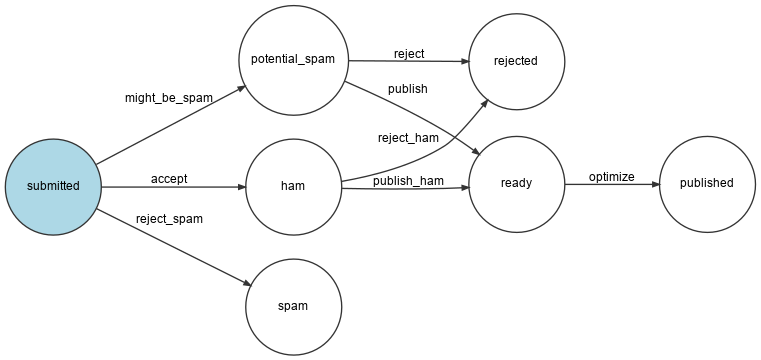

تغيير حجم الصور
============================

على تصميم صفحة المؤتمر ، الصور مقيدة بحد أقصى 200 في 150 بكسل. ماذا عن تحسين الصور وتقليل حجمها إذا كان الأصل الذي تم تحميله أكبر من الحدود؟

هذه وظيفة مثالية يمكن إضافتها إلى سير عمل التعليقات ، وربما بعد التحقق من صحة التعليق وقبل نشره مباشرة.

دعنا نضيف الحالة ``ready`` و الانتقال``optimize``:

.. code-block:: diff
    :caption: patch_file

    --- a/config/packages/workflow.yaml
    +++ b/config/packages/workflow.yaml
    @@ -16,6 +16,7 @@ framework:
                     - potential_spam
                     - spam
                     - rejected
    +                - ready
                     - published
                 transitions:
                     accept:
    @@ -29,13 +30,16 @@ framework:
                         to:   spam
                     publish:
                         from: potential_spam
    -                    to:   published
    +                    to:   ready
                     reject:
                         from: potential_spam
                         to:   rejected
                     publish_ham:
                         from: ham
    -                    to:   published
    +                    to:   ready
                     reject_ham:
                         from: ham
                         to:   rejected
    +                optimize:
    +                    from: ready
    +                    to:   published

.. index::
    single: Command;workflow:dump

قم بإنشاء تمثيل مرئي لتكوين سير العمل الجديد للتحقق من أنه يصف ما نريد:

.. code-block:: bash
    :class: ignore

    $ symfony console workflow:dump comment | dot -Tpng -o workflow.png

تحسين الصور بواسطة  Imagine
-------------------------------------------

.. index::
    single: Imagine

سيتم إجراء تحسينات للصور بفضل `GD`_  (تحقق من أن تثبيت PHP المحلي الخاص بك به تمكين GD) و `Imagine`_ :

.. code-block:: bash

    $ symfony composer req "imagine/imagine:^1.2"

يمكن تغيير حجم الصورة عبر فئة الخدمة التالية:

.. code-block:: php
    :caption: src/ImageOptimizer.php

    namespace App;

    use Imagine\Gd\Imagine;
    use Imagine\Image\Box;

    class ImageOptimizer
    {
        private const MAX_WIDTH = 200;
        private const MAX_HEIGHT = 150;

        private $imagine;

        public function __construct()
        {
            $this->imagine = new Imagine();
        }

        public function resize(string $filename): void
        {
            list($iwidth, $iheight) = getimagesize($filename);
            $ratio = $iwidth / $iheight;
            $width = self::MAX_WIDTH;
            $height = self::MAX_HEIGHT;
            if ($width / $height > $ratio) {
                $width = $height * $ratio;
            } else {
                $height = $width / $ratio;
            }

            $photo = $this->imagine->open($filename);
            $photo->resize(new Box($width, $height))->save($filename);
        }
    }

بعد تحسين الصورة ، نقوم بتخزين الملف الجديد بدلاً من الملف الأصلي. قد ترغب في الاحتفاظ بالصورة الأصلية حولها.

إضافة خطوة جديدة إلى سير العمل
-------------------------------------------------------

عدل سير العمل لمعالجة الحالة الجديدة:

.. code-block:: diff
    :caption: patch_file

    --- a/src/MessageHandler/CommentMessageHandler.php
    +++ b/src/MessageHandler/CommentMessageHandler.php
    @@ -2,6 +2,7 @@

     namespace App\MessageHandler;

    +use App\ImageOptimizer;
     use App\Message\CommentMessage;
     use App\Repository\CommentRepository;
     use App\SpamChecker;
    @@ -21,10 +22,12 @@ class CommentMessageHandler implements MessageHandlerInterface
         private $bus;
         private $workflow;
         private $mailer;
    +    private $imageOptimizer;
         private $adminEmail;
    +    private $photoDir;
         private $logger;

    -    public function __construct(EntityManagerInterface $entityManager, SpamChecker $spamChecker, CommentRepository $commentRepository, MessageBusInterface $bus, WorkflowInterface $commentStateMachine, MailerInterface $mailer, string $adminEmail, LoggerInterface $logger = null)
    +    public function __construct(EntityManagerInterface $entityManager, SpamChecker $spamChecker, CommentRepository $commentRepository, MessageBusInterface $bus, WorkflowInterface $commentStateMachine, MailerInterface $mailer, ImageOptimizer $imageOptimizer, string $adminEmail, string $photoDir, LoggerInterface $logger = null)
         {
             $this->entityManager = $entityManager;
             $this->spamChecker = $spamChecker;
    @@ -32,7 +35,9 @@ class CommentMessageHandler implements MessageHandlerInterface
             $this->bus = $bus;
             $this->workflow = $commentStateMachine;
             $this->mailer = $mailer;
    +        $this->imageOptimizer = $imageOptimizer;
             $this->adminEmail = $adminEmail;
    +        $this->photoDir = $photoDir;
             $this->logger = $logger;
         }

    @@ -64,6 +69,12 @@ class CommentMessageHandler implements MessageHandlerInterface
                     ->to($this->adminEmail)
                     ->context(['comment' => $comment])
                 );
    +        } elseif ($this->workflow->can($comment, 'optimize')) {
    +            if ($comment->getPhotoFilename()) {
    +                $this->imageOptimizer->resize($this->photoDir.'/'.$comment->getPhotoFilename());
    +            }
    +            $this->workflow->apply($comment, 'optimize');
    +            $this->entityManager->flush();
             } elseif ($this->logger) {
                 $this->logger->debug('Dropping comment message', ['comment' => $comment->getId(), 'state' => $comment->getState()]);
             }

لاحظ أن `` $ photoDir`` يتم حقنه تلقائيًا كما حددنا حاوية * bind* بهذا الاسم المتغير في خطوة سابقة:

.. code-block:: yaml
    :caption: config/packages/services.yaml
    :class: ignore

    services:
        _defaults:
            bind:
                $photoDir: "%kernel.project_dir%/public/uploads/photos"

تخزين البيانات المحملة في الإنتاج (Production)
---------------------------------------------------------------------------

.. index::
    single: SymfonyCloud;File Service

لقد حددنا بالفعل دليلًا خاصًا للقراءة والكتابة للملفات التي تم تحميلها في `` .symfony.cloud.yaml``. لكن الجبل محلي. إذا كنا نرغب في تمكين حاوية الويب وموظف خدمة الرسائل من الوصول إلى نفس التثبيت ، فسنحتاج إلى إنشاء  *file service*:

.. code-block:: diff
    :caption: patch_file

    --- a/.symfony/services.yaml
    +++ b/.symfony/services.yaml
    @@ -11,3 +11,7 @@ varnish:
             vcl: !include
                 type: string
                 path: config.vcl
    +
    +files:
    +    type: network-storage:1.0
    +    disk: 256

استخدمه في مجلد تحميل الصور:

.. code-block:: diff
    :caption: patch_file

    --- a/.symfony.cloud.yaml
    +++ b/.symfony.cloud.yaml
    @@ -37,7 +37,7 @@ web:

     mounts:
         "/var": { source: local, source_path: var }
    -    "/public/uploads": { source: local, source_path: uploads }
    +    "/public/uploads": { source: service, service: files, source_path: uploads }

     hooks:
         build: |

يجب أن يكون هذا كافيا لجعل الميزة تعمل في الإنتاج (production).

.. _`GD`: https://libgd.github.io/
.. _`Imagine`: https://github.com/avalanche123/Imagine
