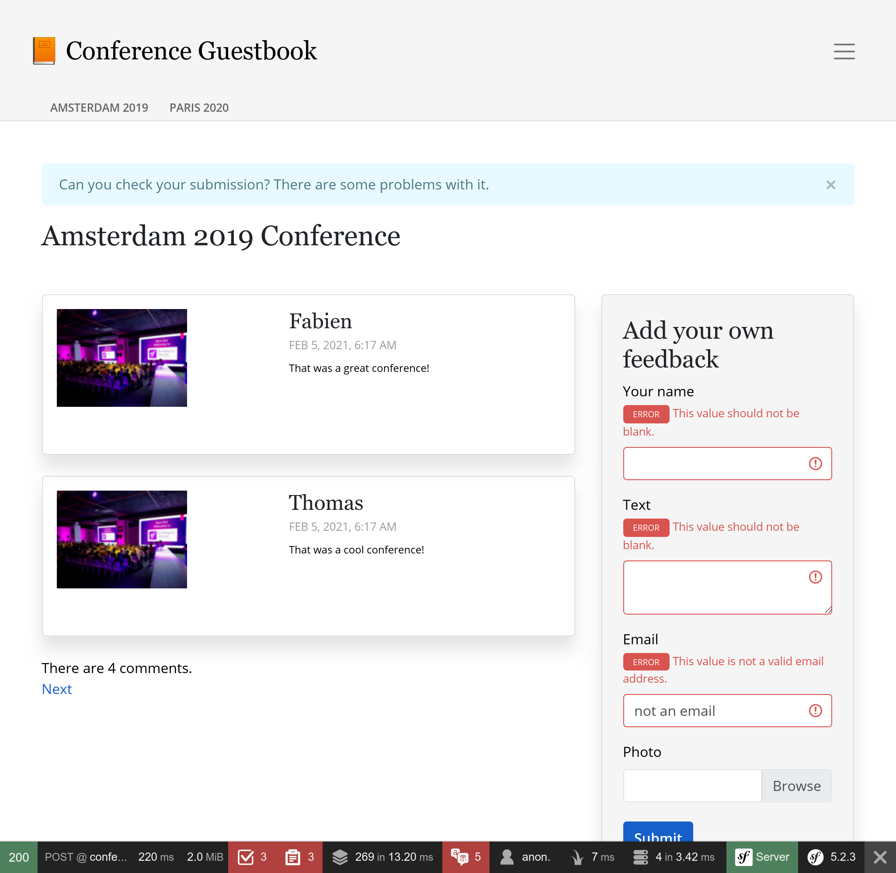

إشعار من قبل جميع وسائل
==========================================

تطبيق سجل الزوار يجمع ردود الفعل حول المؤتمرات. لكننا لسنا رائعين في تقديم تعليقات لمستخدمينا.

نظرًا لأن التعليقات خاضعة للإشراف ، فربما لا يفهمون سبب عدم نشر تعليقاتهم على الفور. حتى أنهم قد يعيدون تقديمهم معتقدًا أن هناك بعض المشكلات الفنية. سيكون إعطاءهم تعليقًا بعد نشر تعليق أمرًا رائعًا.

وأيضًا ، ربما يجب علينا اختبار الأمر عند نشر تعليقهم. نطلب بريدهم الإلكتروني ، لذلك من الأفضل استخدامه.

هناك العديد من الطرق لإعلام المستخدمين. البريد الإلكتروني هو الوسيلة الأولى التي قد تفكر فيها ، ولكن الإخطارات في تطبيق الويب هي وسيلة أخرى.يمكننا التفكير في إرسال رسائل نصية أو نشر رسالة على Slack أو Telegram. هناك العديد من الخيارات.

.. index::
    single: Components;Notifier
    single: Notifier

يطبق مكون Symfony Notifier Component استراتيجيات إعلام عديدة:

.. code-block:: bash

    $ symfony composer req notifier

إرسال إشعارات تطبيق الويب في المستعرض
---------------------------------------------------------------------

.. index::
    single: Flash Messages

كخطوة أولى ، دعنا نخطر المستخدمين بأن التعليقات يتم الإشراف عليها مباشرة في المتصفح بعد إرسالها:

.. code-block:: diff
    :caption: patch_file

    --- a/src/Controller/ConferenceController.php
    +++ b/src/Controller/ConferenceController.php
    @@ -14,6 +14,8 @@ use Symfony\Component\HttpFoundation\File\Exception\FileException;
     use Symfony\Component\HttpFoundation\Request;
     use Symfony\Component\HttpFoundation\Response;
     use Symfony\Component\Messenger\MessageBusInterface;
    +use Symfony\Component\Notifier\Notification\Notification;
    +use Symfony\Component\Notifier\NotifierInterface;
     use Symfony\Component\Routing\Annotation\Route;
     use Twig\Environment;

    @@ -53,7 +55,7 @@ class ConferenceController extends AbstractController
         }

         #[Route('/conference/{slug}', name: 'conference')]
    -    public function show(Request $request, Conference $conference, CommentRepository $commentRepository, string $photoDir): Response
    +    public function show(Request $request, Conference $conference, CommentRepository $commentRepository, NotifierInterface $notifier, string $photoDir): Response
         {
             $comment = new Comment();
             $form = $this->createForm(CommentFormType::class, $comment);
    @@ -82,9 +84,15 @@ class ConferenceController extends AbstractController

                 $this->bus->dispatch(new CommentMessage($comment->getId(), $context));

    +            $notifier->send(new Notification('Thank you for the feedback; your comment will be posted after moderation.', ['browser']));
    +
                 return $this->redirectToRoute('conference', ['slug' => $conference->getSlug()]);
             }

    +        if ($form->isSubmitted()) {
    +            $notifier->send(new Notification('Can you check your submission? There are some problems with it.', ['browser']));
    +        }
    +
             $offset = max(0, $request->query->getInt('offset', 0));
             $paginator = $commentRepository->getCommentPaginator($conference, $offset);

المشعر *يرسل* *إشعارا* الى *المُستقبل* بواسطة *قناة*

يحتوي الإشعار على موضوع ومحتوى اختياري وأهمية.

يتم إرسال إشعار على قناة واحدة أو العديد من القنوات حسب أهميتها. يمكنك إرسال إشعارات عاجلة عن طريق الرسائل القصيرة وتلك العادية عبر البريد الإلكتروني على سبيل المثال.

لإشعارات المتصفح ، ليس لدينا مستلمون.

.. index::
    single: Twig;for

يستخدم إشعار المستعرض *رسائل فلاش* عبر القسم *إعلام*. نحتاج إلى عرضها من خلال تحديث قالب المؤتمر:

.. code-block:: diff
    :caption: patch_file

    --- a/templates/conference/show.html.twig
    +++ b/templates/conference/show.html.twig
    @@ -3,6 +3,13 @@
     Conference Guestbook - {{ conference }}

     
    +    
    +        

    +            {{ message }}
    +            <button type="button" class="close" data-dismiss="alert" aria-label="Close">&times;</button>
    +        

    +    
    +
         <h2 class="mb-5">
             {{ conference }} Conference
         </h2>

سيتم إعلام المستخدمين الآن بأن عملية إرسالهم خاضعة للإشراف:

.. figure:: screenshots/form-success-notification.png
    :alt: /conference/amsterdam-2019
    :align: center
    :figclass: with-browser

كمكافأة إضافية ، لدينا إخطار جيد في الجزء العلوي من الموقع إذا كان هناك خطأ في النموذج:

.. tip::

    تستخدم رسائل الفلاش نظام * جلسة HTTP * كوسيط تخزين. النتيجة الرئيسية هي أن ذاكرة التخزين المؤقت HTTP معطلة حيث يجب بدء تشغيل نظام الجلسة للتحقق من الرسائل.

    هذا هو السبب في أننا أضفنا مقتطفات رسائل الفلاش في قالب `` show.html.twig`` وليس في الأساس ؛ لأننا فقدنا ذاكرة التخزين المؤقت HTTP للصفحة الرئيسية.

إخطار المسؤولين عن طريق البريد الإلكتروني
-----------------------------------------------------------------------------

بدلاً من إرسال بريد إلكتروني عبر `` MailerInterface`` لإخطار المسؤول بأنه قد تم نشر تعليق للتو ، بدّل لاستخدام مكون Notifier في معالج الرسائل:

.. code-block:: diff
    :caption: patch_file

    --- a/src/MessageHandler/CommentMessageHandler.php
    +++ b/src/MessageHandler/CommentMessageHandler.php
    @@ -4,14 +4,14 @@ namespace App\MessageHandler;

     use App\ImageOptimizer;
     use App\Message\CommentMessage;
    +use App\Notification\CommentReviewNotification;
     use App\Repository\CommentRepository;
     use App\SpamChecker;
     use Doctrine\ORM\EntityManagerInterface;
     use Psr\Log\LoggerInterface;
    -use Symfony\Bridge\Twig\Mime\NotificationEmail;
    -use Symfony\Component\Mailer\MailerInterface;
     use Symfony\Component\Messenger\Handler\MessageHandlerInterface;
     use Symfony\Component\Messenger\MessageBusInterface;
    +use Symfony\Component\Notifier\NotifierInterface;
     use Symfony\Component\Workflow\WorkflowInterface;

     class CommentMessageHandler implements MessageHandlerInterface
    @@ -21,22 +21,20 @@ class CommentMessageHandler implements MessageHandlerInterface
         private $commentRepository;
         private $bus;
         private $workflow;
    -    private $mailer;
    +    private $notifier;
         private $imageOptimizer;
    -    private $adminEmail;
         private $photoDir;
         private $logger;

    -    public function __construct(EntityManagerInterface $entityManager, SpamChecker $spamChecker, CommentRepository $commentRepository, MessageBusInterface $bus, WorkflowInterface $commentStateMachine, MailerInterface $mailer, ImageOptimizer $imageOptimizer, string $adminEmail, string $photoDir, LoggerInterface $logger = null)
    +    public function __construct(EntityManagerInterface $entityManager, SpamChecker $spamChecker, CommentRepository $commentRepository, MessageBusInterface $bus, WorkflowInterface $commentStateMachine, NotifierInterface $notifier, ImageOptimizer $imageOptimizer, string $photoDir, LoggerInterface $logger = null)
         {
             $this->entityManager = $entityManager;
             $this->spamChecker = $spamChecker;
             $this->commentRepository = $commentRepository;
             $this->bus = $bus;
             $this->workflow = $commentStateMachine;
    -        $this->mailer = $mailer;
    +        $this->notifier = $notifier;
             $this->imageOptimizer = $imageOptimizer;
    -        $this->adminEmail = $adminEmail;
             $this->photoDir = $photoDir;
             $this->logger = $logger;
         }
    @@ -62,13 +60,7 @@ class CommentMessageHandler implements MessageHandlerInterface

                 $this->bus->dispatch($message);
             } elseif ($this->workflow->can($comment, 'publish') || $this->workflow->can($comment, 'publish_ham')) {
    -            $this->mailer->send((new NotificationEmail())
    -                ->subject('New comment posted')
    -                ->htmlTemplate('emails/comment_notification.html.twig')
    -                ->from($this->adminEmail)
    -                ->to($this->adminEmail)
    -                ->context(['comment' => $comment])
    -            );
    +            $this->notifier->send(new CommentReviewNotification($comment), ...$this->notifier->getAdminRecipients());
             } elseif ($this->workflow->can($comment, 'optimize')) {
                 if ($comment->getPhotoFilename()) {
                     $this->imageOptimizer->resize($this->photoDir.'/'.$comment->getPhotoFilename());

تقوم الطريقة ``getAdminRecipients ()`` بإرجاع مستلمي المشرف كما تم تكوينهم في تكوين المخطر ؛ قم بتحديثه الآن لإضافة عنوان بريدك الإلكتروني:

.. code-block:: diff
    :caption: patch_file

    --- a/config/packages/notifier.yaml
    +++ b/config/packages/notifier.yaml
    @@ -13,4 +13,4 @@ framework:
                 medium: ['email']
                 low: ['email']
             admin_recipients:
    -            - { email: admin@example.com }
    +            - { email: "%env(string:default:default_admin_email:ADMIN_EMAIL)%" }

الآن ، قم بإنشاء فئة `` CommentReviewNotification``:

.. code-block:: php
    :caption: src/Notification/CommentReviewNotification.php

    namespace App\Notification;

    use App\Entity\Comment;
    use Symfony\Component\Notifier\Message\EmailMessage;
    use Symfony\Component\Notifier\Notification\EmailNotificationInterface;
    use Symfony\Component\Notifier\Notification\Notification;
    use Symfony\Component\Notifier\Recipient\EmailRecipientInterface;

    class CommentReviewNotification extends Notification implements EmailNotificationInterface
    {
        private $comment;

        public function __construct(Comment $comment)
        {
            $this->comment = $comment;

            parent::__construct('New comment posted');
        }

        public function asEmailMessage(EmailRecipientInterface $recipient, string $transport = null): ?EmailMessage
        {
            $message = EmailMessage::fromNotification($this, $recipient, $transport);
            $message->getMessage()
                ->htmlTemplate('emails/comment_notification.html.twig')
                ->context(['comment' => $this->comment])
            ;

            return $message;
        }
    }

طريقة ``asEmailMessage ()`` من `` EmailNotificationInterface`` اختيارية ، لكنها تسمح بتخصيص البريد الإلكتروني.

تتمثل إحدى فوائد استخدام Notifier بدلاً من مرسل البريد مباشرة في إرسال رسائل البريد الإلكتروني في إلغاء فصل الإشعار من "القناة" المستخدمة في ذلك. كما ترى ، لا شيء يقول صراحة أنه يجب إرسال الإشعار عبر البريد الإلكتروني.

بدلاً من ذلك ، يتم تكوين القناة في ``config/packages/notifier.yaml`` اعتمادًا على * أهمية * الإشعار (``low`` بشكل افتراضي):

.. code-block:: yaml
    :caption: config/packages/notifier.yaml
    :class: ignore

    framework:
    notifier:
        channel_policy:
            # use chat/slack, chat/telegram, sms/twilio or sms/nexmo
            urgent: ['email']
            high: ['email']
            medium: ['email']
            low: ['email']

لقد تحدثنا عن ``browser`` وقنوات ``email``. دعونا نرى بعض مربو الحيوانات.

الدردشة مع المسؤولين
--------------------------------------

.. index::
    single: Slack

دعونا نكون صادقين ، ونحن جميعا ننتظر ردود فعل إيجابية. أو على الأقل ردود الفعل البناءة. إذا نشر شخص ما تعليقًا بكلمات مثل "رائع" أو "رائع" ، فقد نرغب في قبولها بشكل أسرع من الآخرين.

لمثل هذه الرسائل ، نريد أن يتم تنبيهك على نظام المراسلة الفورية مثل Slack أو Telegram بالإضافة إلى البريد الإلكتروني العادي.

.. index::
    single: Components;Notifier
    single: Notifier

تثبيت دعم Slack لـ Symfony Notifier:

.. code-block:: bash

    $ symfony composer req slack-notifier

للبدء ، قم بإنشاء Slack DSN مع رمز وصول Slack ومعرف قناة Slack حيث تريد إرسال رسائل:``slack://ACCESS_TOKEN@default?channel=CHANNEL``.

.. index::
    single: Command;secrets:set

نظرًا لأن رمز الوصول حساس ، قم بتخزين Slack DSN في المتجر السري:

.. code-block:: bash
    :class: answers(slack://ACCESS_TOKEN@default?channel=CHANNEL)

    $ symfony console secrets:set SLACK_DSN

تفعل الشيء نفسه بالنسبة للإنتاج:

.. code-block:: bash
    :class: answers(slack://ACCESS_TOKEN@default?channel=CHANNEL)

    $ APP_ENV=prod symfony console secrets:set SLACK_DSN

تمكين المدردشين من دعم Slack

.. code-block:: diff
    :caption: patch_file

    --- a/config/packages/notifier.yaml
    +++ b/config/packages/notifier.yaml
    @@ -1,7 +1,7 @@
     framework:
         notifier:
    -        #chatter_transports:
    -        #    slack: '%env(SLACK_DSN)%'
    +        chatter_transports:
    +            slack: '%env(SLACK_DSN)%'
             #    telegram: '%env(TELEGRAM_DSN)%'
             #texter_transports:
             #    twilio: '%env(TWILIO_DSN)%'

قم بتحديث فئة الإشعارات لتوجيه الرسائل اعتمادًا على محتوى نص التعليق (ستقوم ريجكس البسيطة بالمهمة):

.. code-block:: diff
    :caption: patch_file

    --- a/src/Notification/CommentReviewNotification.php
    +++ b/src/Notification/CommentReviewNotification.php
    @@ -7,6 +7,7 @@ use Symfony\Component\Notifier\Message\EmailMessage;
     use Symfony\Component\Notifier\Notification\EmailNotificationInterface;
     use Symfony\Component\Notifier\Notification\Notification;
     use Symfony\Component\Notifier\Recipient\EmailRecipientInterface;
    +use Symfony\Component\Notifier\Recipient\RecipientInterface;

     class CommentReviewNotification extends Notification implements EmailNotificationInterface
     {
    @@ -29,4 +30,15 @@ class CommentReviewNotification extends Notification implements EmailNotificatio

             return $message;
         }
    +
    +    public function getChannels(RecipientInterface $recipient): array
    +    {
    +        if (preg_match('{\b(great|awesome)\b}i', $this->comment->getText())) {
    +            return ['email', 'chat/slack'];
    +        }
    +
    +        $this->importance(Notification::IMPORTANCE_LOW);
    +
    +        return ['email'];
    +    }
     }

لقد غيرنا أيضًا أهمية التعليقات "regular" نظرًا لأنه يغير قليلاً من تصميم البريد الإلكتروني.

وانتهى إرسال تعليق مع "awesome" في النص ، يجب أن تتلقى رسالة على Slack

بالنسبة للبريد الإلكتروني ، يمكنك تطبيق ``ChatNotificationInterface`` لتجاوز العرض الافتراضي لرسالة Slack:

.. code-block:: diff
    :caption: patch_file

    --- a/src/Notification/CommentReviewNotification.php
    +++ b/src/Notification/CommentReviewNotification.php
    @@ -3,13 +3,18 @@
     namespace App\Notification;

     use App\Entity\Comment;
    +use Symfony\Component\Notifier\Bridge\Slack\Block\SlackDividerBlock;
    +use Symfony\Component\Notifier\Bridge\Slack\Block\SlackSectionBlock;
    +use Symfony\Component\Notifier\Bridge\Slack\SlackOptions;
    +use Symfony\Component\Notifier\Message\ChatMessage;
     use Symfony\Component\Notifier\Message\EmailMessage;
    +use Symfony\Component\Notifier\Notification\ChatNotificationInterface;
     use Symfony\Component\Notifier\Notification\EmailNotificationInterface;
     use Symfony\Component\Notifier\Notification\Notification;
     use Symfony\Component\Notifier\Recipient\EmailRecipientInterface;
     use Symfony\Component\Notifier\Recipient\RecipientInterface;

    -class CommentReviewNotification extends Notification implements EmailNotificationInterface
    +class CommentReviewNotification extends Notification implements EmailNotificationInterface, ChatNotificationInterface
     {
         private $comment;

    @@ -31,6 +36,28 @@ class CommentReviewNotification extends Notification implements EmailNotificatio
             return $message;
         }

    +    public function asChatMessage(RecipientInterface $recipient, string $transport = null): ?ChatMessage
    +    {
    +        if ('slack' !== $transport) {
    +            return null;
    +        }
    +
    +        $message = ChatMessage::fromNotification($this, $recipient, $transport);
    +        $message->subject($this->getSubject());
    +        $message->options((new SlackOptions())
    +            ->iconEmoji('tada')
    +            ->iconUrl('https://guestbook.example.com')
    +            ->username('Guestbook')
    +            ->block((new SlackSectionBlock())->text($this->getSubject()))
    +            ->block(new SlackDividerBlock())
    +            ->block((new SlackSectionBlock())
    +                ->text(sprintf('%s (%s) says: %s', $this->comment->getAuthor(), $this->comment->getEmail(), $this->comment->getText()))
    +            )
    +        );
    +
    +        return $message;
    +    }
    +
         public function getChannels(RecipientInterface $recipient): array
         {
             if (preg_match('{\b(great|awesome)\b}i', $this->comment->getText())) {

إنه أفضل ، ولكن دعنا نذهب خطوة أخرى إلى الأمام. ألن يكون رائعًا أن تكون قادرًا على قبول أو رفض تعليق مباشرةً من سلاك؟

غيّر الإشعار لقبول عنوان URL الخاص بالمراجعة وأضف زرين في رسالة Slack:

.. code-block:: diff
    :caption: patch_file

    --- a/src/Notification/CommentReviewNotification.php
    +++ b/src/Notification/CommentReviewNotification.php
    @@ -3,6 +3,7 @@
     namespace App\Notification;

     use App\Entity\Comment;
    +use Symfony\Component\Notifier\Bridge\Slack\Block\SlackActionsBlock;
     use Symfony\Component\Notifier\Bridge\Slack\Block\SlackDividerBlock;
     use Symfony\Component\Notifier\Bridge\Slack\Block\SlackSectionBlock;
     use Symfony\Component\Notifier\Bridge\Slack\SlackOptions;
    @@ -17,10 +18,12 @@ use Symfony\Component\Notifier\Recipient\RecipientInterface;
     class CommentReviewNotification extends Notification implements EmailNotificationInterface, ChatNotificationInterface
     {
         private $comment;
    +    private $reviewUrl;

    -    public function __construct(Comment $comment)
    +    public function __construct(Comment $comment, string $reviewUrl)
         {
             $this->comment = $comment;
    +        $this->reviewUrl = $reviewUrl;

             parent::__construct('New comment posted');
         }
    @@ -53,6 +56,10 @@ class CommentReviewNotification extends Notification implements EmailNotificatio
                 ->block((new SlackSectionBlock())
                     ->text(sprintf('%s (%s) says: %s', $this->comment->getAuthor(), $this->comment->getEmail(), $this->comment->getText()))
                 )
    +            ->block((new SlackActionsBlock())
    +                ->button('Accept', $this->reviewUrl, 'primary')
    +                ->button('Reject', $this->reviewUrl.'?reject=1', 'danger')
    +            )
             );

             return $message;

إنها الآن مسألة تتبع التغييرات إلى الوراء. أولاً ، قم بتحديث معالج الرسالة لتمرير عنوان URL للمراجعة:

.. code-block:: diff
    :caption: patch_file

    --- a/src/MessageHandler/CommentMessageHandler.php
    +++ b/src/MessageHandler/CommentMessageHandler.php
    @@ -60,7 +60,8 @@ class CommentMessageHandler implements MessageHandlerInterface

                 $this->bus->dispatch($message);
             } elseif ($this->workflow->can($comment, 'publish') || $this->workflow->can($comment, 'publish_ham')) {
    -            $this->notifier->send(new CommentReviewNotification($comment), ...$this->notifier->getAdminRecipients());
    +            $notification = new CommentReviewNotification($comment, $message->getReviewUrl());
    +            $this->notifier->send($notification, ...$this->notifier->getAdminRecipients());
             } elseif ($this->workflow->can($comment, 'optimize')) {
                 if ($comment->getPhotoFilename()) {
                     $this->imageOptimizer->resize($this->photoDir.'/'.$comment->getPhotoFilename());

كما ترى ، يجب أن يكون عنوان URL للمراجعة جزءًا من رسالة التعليق ، دعنا نضيفه الآن:

.. code-block:: diff
    :caption: patch_file

    --- a/src/Message/CommentMessage.php
    +++ b/src/Message/CommentMessage.php
    @@ -5,14 +5,21 @@ namespace App\Message;
     class CommentMessage
     {
         private $id;
    +    private $reviewUrl;
         private $context;

    -    public function __construct(int $id, array $context = [])
    +    public function __construct(int $id, string $reviewUrl, array $context = [])
         {
             $this->id = $id;
    +        $this->reviewUrl = $reviewUrl;
             $this->context = $context;
         }

    +    public function getReviewUrl(): string
    +    {
    +        return $this->reviewUrl;
    +    }
    +
         public function getId(): int
         {
             return $this->id;

أخيرًا ، قم بتحديث وحدات التحكم لإنشاء عنوان URL للمراجعة وتمريره في مُنشئ رسالة التعليقات:

.. code-block:: diff
    :caption: patch_file

    --- a/src/Controller/AdminController.php
    +++ b/src/Controller/AdminController.php
    @@ -12,6 +12,7 @@ use Symfony\Component\HttpFoundation\Response;
     use Symfony\Component\HttpKernel\KernelInterface;
     use Symfony\Component\Messenger\MessageBusInterface;
     use Symfony\Component\Routing\Annotation\Route;
    +use Symfony\Component\Routing\Generator\UrlGeneratorInterface;
     use Symfony\Component\Workflow\Registry;
     use Twig\Environment;

    @@ -47,7 +48,8 @@ class AdminController extends AbstractController
             $this->entityManager->flush();

             if ($accepted) {
    -            $this->bus->dispatch(new CommentMessage($comment->getId()));
    +            $reviewUrl = $this->generateUrl('review_comment', ['id' => $comment->getId()], UrlGeneratorInterface::ABSOLUTE_URL);
    +            $this->bus->dispatch(new CommentMessage($comment->getId(), $reviewUrl));
             }

             return $this->render('admin/review.html.twig', [
    --- a/src/Controller/ConferenceController.php
    +++ b/src/Controller/ConferenceController.php
    @@ -17,6 +17,7 @@ use Symfony\Component\Messenger\MessageBusInterface;
     use Symfony\Component\Notifier\Notification\Notification;
     use Symfony\Component\Notifier\NotifierInterface;
     use Symfony\Component\Routing\Annotation\Route;
    +use Symfony\Component\Routing\Generator\UrlGeneratorInterface;
     use Twig\Environment;

     class ConferenceController extends AbstractController
    @@ -82,7 +83,8 @@ class ConferenceController extends AbstractController
                     'permalink' => $request->getUri(),
                 ];

    -            $this->bus->dispatch(new CommentMessage($comment->getId(), $context));
    +            $reviewUrl = $this->generateUrl('review_comment', ['id' => $comment->getId()], UrlGeneratorInterface::ABSOLUTE_URL);
    +            $this->bus->dispatch(new CommentMessage($comment->getId(), $reviewUrl, $context));

                 $notifier->send(new Notification('Thank you for the feedback; your comment will be posted after moderation.', ['browser']));

يعني فك الشفرة التغييرات في المزيد من الأماكن ، ولكنه يجعل من السهل الاختبار والسبب وإعادة الاستخدام.

حاول مرة أخرى ، يجب أن تكون الرسالة في حالة جيدة الآن:

.. image:: images/slack-message.png
    :align: center

الذهاب غير متزامن في جميع المجالات
---------------------------------------------------------------

اسمحوا لي أن أشرح مشكلة بسيطة يجب إصلاحها. لكل تعليق ، نتلقى رسالة بريد إلكتروني ورسالة سلاك. إذا كانت أخطاء رسالة Slack (معرف قناة خاطئ ، رمز خاطئ ، ...) ، فسيتم إعادة محاولة رسالة المرسِل ثلاث مرات قبل تجاهلها .ولكن مع إرسال البريد الإلكتروني أولاً ، سوف نتلقى 3 رسائل بريد إلكتروني ولا توجد رسائل سلاك. تتمثل إحدى طرق إصلاح ذلك في إرسال رسائل Slack بشكل غير متزامن مثل رسائل البريد الإلكتروني:

.. code-block:: diff
    :caption: patch_file

    --- a/config/packages/messenger.yaml
    +++ b/config/packages/messenger.yaml
    @@ -21,3 +21,5 @@ framework:
                 # Route your messages to the transports
                 App\Message\CommentMessage: async
                 Symfony\Component\Mailer\Messenger\SendEmailMessage: async
    +            Symfony\Component\Notifier\Message\ChatMessage: async
    +            Symfony\Component\Notifier\Message\SmsMessage: async

بمجرد أن كل شيء غير متزامن ، تصبح الرسائل مستقلة. لقد مكّنا أيضًا رسائل SMS غير متزامنة في حالة رغبتك أيضًا في أن يتم إعلامك على هاتفك.

إخطار المستخدمين عن طريق البريد الإلكتروني
-------------------------------------------------------------------------------

المهمة الأخيرة هي إخطار المستخدمين عند الموافقة على إرسالهم. ماذا عن السماح لك بتنفيذ ذلك بنفسك؟

.. sidebar:: الذهاب أبعد من ذلك

    * `Symfony flash messages <https://symfony.com/doc/current/controller.html#flash-messages>`_.
