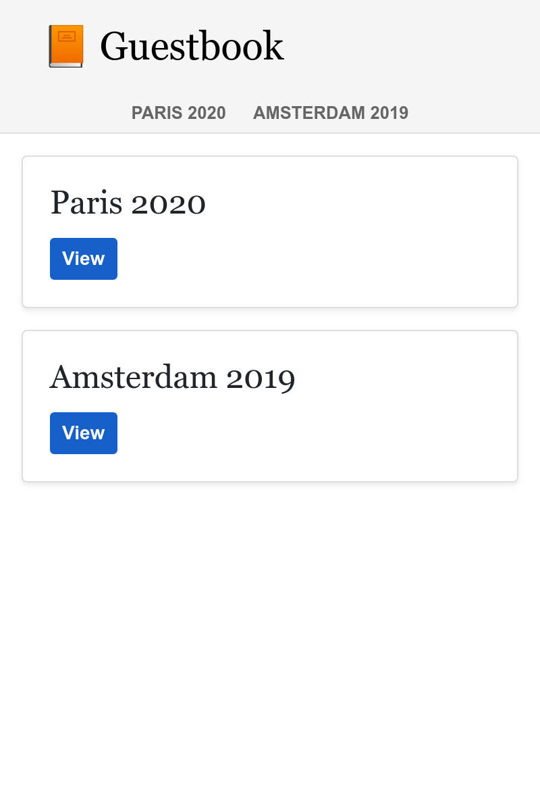

بناء SPA
============

.. index::
    single: SPA
    single: Mobile

سيتم تقديم معظم التعليقات أثناء المؤتمر حيث لا يحضر بعض الأشخاص جهاز كمبيوتر محمول. لكن ربما لديهم هاتف ذكي. ماذا عن إنشاء تطبيق جوال للتحقق بسرعة من تعليقات المؤتمر؟

إحدى الطرق لإنشاء مثل هذا التطبيق المحمول هي إنشاء تطبيق جافا سكريبت للصفحة الواحدة (SPA). يعمل SPA محليًا ، ويمكنه استخدام التخزين المحلي ، ويمكنه الاتصال بواجهة برمجة تطبيقات HTTP عن بُعد ، ويمكنه الاستفادة من عمال الخدمة لخلق تجربة محلية تقريبًا.

إنشاء التطبيق
-------------------------

لإنشاء تطبيق الهاتف سوف نقوم بإستخدام `Preact`_ و **Symfony Encore**. يعتبر **Preact** أساس صغير وفعال مناسب جدا لسجل الزوار الخاص ب (the Guestbook SPA).

لجعل كل من موقع الويب و SPA متناسقين ، سنقوم بإعادة استخدام أوراق أنماط Sass لموقع الويب لتطبيق الهاتف المحمول.

قم بإنشاء تطبيق SPA ضمن دليل ``spa`` ونسخ صفحات أنماط الموقع:

.. code-block:: bash

    $ mkdir -p spa/src spa/public spa/assets/styles
    $ cp assets/styles/*.scss spa/assets/styles/
    $ cd spa

.. note::

    لقد أنشأنا دليلًا `` public  `` حيث سنتفاعل بشكل أساسي مع SPA عبر متصفح. يمكن أن نسميها `` build `` إذا أردنا فقط إنشاء تطبيق محمول.

كممارسة جيدة. اضف ملف ``gitignore.``

.. code-block:: text
    :caption: .gitignore

    /node_modules/
    /public/
    /npm-debug.log
    /yarn-error.log
    # used later by Cordova
    /app/

Initialize the ``package.json`` file (equivalent of the ``composer.json``
file for JavaScript):

.. code-block:: bash

    $ yarn init -y

الان اضف بعض التبعيات المطلوبة

.. code-block:: bash

    $ yarn add @symfony/webpack-encore @babel/core @babel/preset-env babel-preset-preact preact html-webpack-plugin bootstrap

خطوة التكوين الأخيرة هي إنشاء تكوين Webpack Encore:

.. code-block:: javascript
    :caption: webpack.config.js
    :emphasize-lines: 8,11

    const Encore = require('@symfony/webpack-encore');
    const HtmlWebpackPlugin = require('html-webpack-plugin');

    Encore
        .setOutputPath('public/')
        .setPublicPath('/')
        .cleanupOutputBeforeBuild()
        .addEntry('app', './src/app.js')
        .enablePreactPreset()
        .enableSingleRuntimeChunk()
        .addPlugin(new HtmlWebpackPlugin({ template: 'src/index.ejs', alwaysWriteToDisk: true }))
    ;

    module.exports = Encore.getWebpackConfig();

إنشاء القالب الرئيسي SPA
------------------------------------------

حان الوقت لإنشاء القالب الأولي الذي سيعرض فيه Preact التطبيق:

.. code-block:: html
    :caption: src/index.ejs
    :emphasize-lines: 12

    <!DOCTYPE html>
    <html>
    <head>
        <meta http-equiv="Content-Type" content="text/html; charset=utf-8" />
        <meta http-equiv="X-UA-Compatible" content="IE=edge" />
        <meta name="msapplication-tap-highlight" content="no" />
        <meta name="viewport" content="user-scalable=no, initial-scale=1, maximum-scale=1, minimum-scale=1, width=device-width" />

        <title>Conference Guestbook application</title>
    </head>
    <body>
        

    </body>
    </html>

علامة `` 
 `` هي المكان الذي سيتم فيه تقديم التطبيق بواسطة JavaScript. فيما يلي الإصدار الأول من الكود الذي تعرض منظر "Hello World":

.. code-block:: text
    :caption: src/app.js
    :emphasize-lines: 3,11

    import {h, render} from 'preact';

    function App() {
        return (
            

                Hello world!
            

        )
    }

    render(<App />, document.getElementById('app'));

يسجل السطر الأخير وظيفة `` ()App `` في عنصر `` app# `` في صفحة HTML.

كل شيء جاهز الآن!

تشغيل SPA في المتصفح
----------------------------------

.. index::
    single: Symfony CLI;server:start
    single: Symfony CLI;server:stop

نظرًا لأن هذا التطبيق مستقل عن الموقع الرئيسي ، فنحن بحاجة إلى تشغيل خادم ويب آخر:

.. code-block:: bash
    :class: hide

    $ symfony server:stop

.. code-block:: bash

    $ symfony server:start -d --passthru=index.html

تخبر علامة `` passthru--  `` خادم الويب بتمرير جميع طلبات HTTP إلى ملف `` public/index.html '' (`` public/ '' هو دليل جذر الويب الافتراضي لخادم الويب). تتم إدارة هذه الصفحة بواسطة تطبيق Preact وتحصل على الصفحة ليتم عرضها عبر سجل "المتصفح".

لتجميع ملفات CSS **و JavaScript** ، قم بتشغيل ``yarn``:

.. code-block:: bash

    $ yarn encore dev

افتح SPA في متصفح:

.. code-block:: bash
    :class: ignore

    $ symfony open:local

وإلقاء نظرة على  Hello World SPA:

.. figure:: screenshots/spa.png
    :alt: /
    :align: center
    :figclass: with-browser spa

إضافة جهاز توجيه للتعامل مع الحالات
-----------------------------------------------------------------

يتعذر على SPA حاليًا التعامل مع صفحات مختلفة. لبناء عدة صفحات ، نحتاج إلى جهاز توجيه، في Symfony مثلا. سنستخدم **preact-router**. يأخذ عنوان URL كمدخل ويتطابق مع مكون Preact لعرضه.

تثبيت جهاز التوجيه المسبق preact-router:

.. code-block:: bash

    $ yarn add preact-router

قم بإنشاء صفحة للصفحة الرئيسية (*Preact component*):

.. code-block:: text
    :caption: src/pages/home.js

    import {h} from 'preact';

    export default function Home() {
        return (
            
Home

        );
    };

وآخر لصفحة المؤتمر:

.. code-block:: text
    :caption: src/pages/conference.js

    import {h} from 'preact';

    export default function Conference() {
        return (
            
Conference

        );
    };

استبدل ``Hello World" ``div" بمكون ``Router``:

.. code-block:: diff
    :caption: patch_file
    :emphasize-lines: 15,17,20-23

    --- a/src/app.js
    +++ b/src/app.js
    @@ -1,9 +1,22 @@
     import {h, render} from 'preact';
    +import {Router, Link} from 'preact-router';
    +
    +import Home from './pages/home';
    +import Conference from './pages/conference';

     function App() {
         return (
             

    -            Hello world!
    +            <header>
    +                <Link href="/">Home</Link>
    +                 
    +                <Link href="/conference/amsterdam2019">Amsterdam 2019</Link>
    +            </header>
    +
    +            <Router>
    +                <Home path="/" />
    +                <Conference path="/conference/:slug" />
    +            </Router>
             

         )
     }

إعادة بناء التطبيق:

.. code-block:: bash

    $ yarn encore dev

إذا قمت بتحديث التطبيق في المتصفح ، يمكنك الآن النقر على "الصفحة الرئيسية" وروابط المؤتمر. لاحظ أن عنوان URL الخاص بالمتصفح وأزرار الرجوع إلى الأمام في متصفحك تعمل كما تتوقع.

تصميم SPA
--------------

أما بالنسبة للموقع الإلكتروني ، فلنقم بإضافة لودر Sass:

.. code-block:: bash

    $ yarn add node-sass sass-loader

قم بتمكين محمّل Sass في Webpack وإضافة مرجع إلى ورقة الأنماط:

.. code-block:: diff
    :caption: patch_file

    --- a/src/app.js
    +++ b/src/app.js
    @@ -1,3 +1,5 @@
    +import '../assets/styles/app.scss';
    +
     import {h, render} from 'preact';
     import {Router, Link} from 'preact-router';

    --- a/webpack.config.js
    +++ b/webpack.config.js
    @@ -7,6 +7,7 @@ Encore
         .cleanupOutputBeforeBuild()
         .addEntry('app', './src/app.js')
         .enablePreactPreset()
    +    .enableSassLoader()
         .enableSingleRuntimeChunk()
         .addPlugin(new HtmlWebpackPlugin({ template: 'src/index.ejs', alwaysWriteToDisk: true }))
     ;

يمكننا الآن تحديث التطبيق لاستخدام أوراق الأنماط:

.. code-block:: diff
    :caption: patch_file

    --- a/src/app.js
    +++ b/src/app.js
    @@ -9,10 +9,20 @@ import Conference from './pages/conference';
     function App() {
         return (
             

    -            <header>
    -                <Link href="/">Home</Link>
    -                 
    -                <Link href="/conference/amsterdam2019">Amsterdam 2019</Link>
    +            <header className="header">
    +                <nav className="navbar navbar-light bg-light">
    +                    

    +                        <Link className="navbar-brand mr-4 pr-2" href="/">
    +                            &#128217; Guestbook
    +                        </Link>
    +                    

    +                </nav>
    +
    +                <nav className="bg-light border-bottom text-center">
    +                    <Link className="nav-conference" href="/conference/amsterdam2019">
    +                        Amsterdam 2019
    +                    </Link>
    +                </nav>
                 </header>

                 <Router>

إعادة إنشاء التطبيق مرة أخرى:

.. code-block:: bash

    $ yarn encore dev

يمكنك الآن الاستمتاع بمنتجع SPA  كامل الطراز:

.. figure:: screenshots/spa-home.png
    :alt: /
    :align: center
    :figclass: with-browser spa

جلب البيانات من API
--------------------------------

تم الانتهاء من بنية تطبيق Preact الآن: يعالج Preact Router حالات الصفحة - بما في ذلك العنصر النائب placeholder  لخلع slug المؤتمر - وتستخدم ورقة أنماط التطبيق الرئيسية لتصميم نمط SPA.

لجعل SPA ديناميكيًا ، نحتاج إلى جلب البيانات من واجهة برمجة التطبيقات API عبر مكالمات HTTP.

قم بإعداد Webpack لعرض طريقة واجهة برمجة تطبيقات API:

.. code-block:: diff
    :caption: patch_file

    --- a/webpack.config.js
    +++ b/webpack.config.js
    @@ -1,3 +1,4 @@
    +const webpack = require('webpack');
     const Encore = require('@symfony/webpack-encore');
     const HtmlWebpackPlugin = require('html-webpack-plugin');

    @@ -10,6 +11,9 @@ Encore
         .enableSassLoader()
         .enableSingleRuntimeChunk()
         .addPlugin(new HtmlWebpackPlugin({ template: 'src/index.ejs', alwaysWriteToDisk: true }))
    +    .addPlugin(new webpack.DefinePlugin({
    +        'ENV_API_ENDPOINT': JSON.stringify(process.env.API_ENDPOINT),
    +    }))
     ;

     module.exports = Encore.getWebpackConfig();

يجب أن يشير متغير البيئة ``API_ENDPOINT`` إلى خادم الويب الخاص بالموقع الإلكتروني حيث لدينا نقطة نهاية API ضمن ``api/``. سنقوم بتكوينه بشكل صحيح عندما سنقوم بتشغيل ``yarn encore``.

قم بإنشاء ملف `` api.js `` يلخص استرجاع البيانات من API:

.. code-block:: text
    :caption: src/api/api.js

    function fetchCollection(path) {
        return fetch(ENV_API_ENDPOINT + path).then(resp => resp.json()).then(json => json['hydra:member']);
    }

    export function findConferences() {
        return fetchCollection('api/conferences');
    }

    export function findComments(conference) {
        return fetchCollection('api/comments?conference='+conference.id);
    }

يمكنك الآن تكييف رأس الصفحة header  والمكونات الرئسية home :

.. code-block:: diff
    :caption: patch_file

    --- a/src/app.js
    +++ b/src/app.js
    @@ -2,11 +2,23 @@ import '../assets/styles/app.scss';

     import {h, render} from 'preact';
     import {Router, Link} from 'preact-router';
    +import {useState, useEffect} from 'preact/hooks';

    +import {findConferences} from './api/api';
     import Home from './pages/home';
     import Conference from './pages/conference';

     function App() {
    +    const [conferences, setConferences] = useState(null);
    +
    +    useEffect(() => {
    +        findConferences().then((conferences) => setConferences(conferences));
    +    }, []);
    +
    +    if (conferences === null) {
    +        return 
Loading...
;
    +    }
    +
         return (
             

                 <header className="header">
    @@ -19,15 +31,17 @@ function App() {
                     </nav>

                     <nav className="bg-light border-bottom text-center">
    -                    <Link className="nav-conference" href="/conference/amsterdam2019">
    -                        Amsterdam 2019
    -                    </Link>
    +                    {conferences.map((conference) => (
    +                        <Link className="nav-conference" href={'/conference/'+conference.slug}>
    +                            {conference.city} {conference.year}
    +                        </Link>
    +                    ))}
                     </nav>
                 </header>

                 <Router>
    -                <Home path="/" />
    -                <Conference path="/conference/:slug" />
    +                <Home path="/" conferences={conferences} />
    +                <Conference path="/conference/:slug" conferences={conferences} />
                 </Router>
             

         )
    --- a/src/pages/home.js
    +++ b/src/pages/home.js
    @@ -1,7 +1,28 @@
     import {h} from 'preact';
    +import {Link} from 'preact-router';
    +
    +export default function Home({conferences}) {
    +    if (!conferences) {
    +        return 
No conferences yet
;
    +    }

    -export default function Home() {
         return (
    -        
Home

    +        

    +            {conferences.map((conference)=> (
    +                

    +                    

    +                        

    +                            <h4 className="font-weight-light">
    +                                {conference.city} {conference.year}
    +                            </h4>
    +                        

    +
    +                        <Link className="btn btn-sm btn-blue stretched-link" href={'/conference/'+conference.slug}>
    +                            View
    +                        </Link>
    +                    

    +                

    +            ))}
    +        

         );
    -};
    +}

وأخيرًا ، يقوم Preact Router بتمرير العنصر النائب "slug" إلى مكون المؤتمر Conference component  كخاصية. استخدمه لعرض المؤتمر المناسب وتعليقاته ، مرة أخرى باستخدام واجهة برمجة التطبيقات ؛ وتكييف العرض لاستخدام بيانات API:

.. code-block:: diff
    :caption: patch_file

    --- a/src/pages/conference.js
    +++ b/src/pages/conference.js
    @@ -1,7 +1,48 @@
     import {h} from 'preact';
    +import {findComments} from '../api/api';
    +import {useState, useEffect} from 'preact/hooks';
    +
    +function Comment({comments}) {
    +    if (comments !== null && comments.length === 0) {
    +        return 
No comments yet
;
    +    }
    +
    +    if (!comments) {
    +        return 
Loading...
;
    +    }
    +
    +    return (
    +        

    +            {comments.map(comment => (
    +                

    +                    

    +                        {!comment.photoFilename ? '' : (
    +                            <a href={ENV_API_ENDPOINT+'uploads/photos/'+comment.photoFilename} target="_blank">
    +                                
    +                            </a>
    +                        )}
    +                    

    +
    +                    <h5 className="font-weight-light mt-3 mb-0">{comment.author}</h5>
    +                    
{comment.text}

    +                

    +            ))}
    +        

    +    );
    +}
    +
    +export default function Conference({conferences, slug}) {
    +    const conference = conferences.find(conference => conference.slug === slug);
    +    const [comments, setComments] = useState(null);
    +
    +    useEffect(() => {
    +        findComments(conference).then(comments => setComments(comments));
    +    }, [slug]);

    -export default function Conference() {
         return (
    -        
Conference

    +        

    +            <h4>{conference.city} {conference.year}</h4>
    +            <Comment comments={comments} />
    +        

         );
    -};
    +}

يحتاج SPA الآن إلى معرفة عنوان URL لواجهة برمجة التطبيقات، عبر متغير البيئة ``API_ENDPOINT``. قم بتعيينه إلى عنوان URL لخادم الويب API (يشغل في الدليل ``..``):

.. code-block:: bash

    $ API_ENDPOINT=`symfony var:export SYMFONY_PROJECT_DEFAULT_ROUTE_URL --dir=..` yarn encore dev

يمكنك أيضًا التشغيل في الخلفية الآن:

.. code-block:: bash

    $ API_ENDPOINT=`symfony var:export SYMFONY_PROJECT_DEFAULT_ROUTE_URL --dir=..` symfony run -d --watch=webpack.config.js yarn encore dev --watch

ويجب أن يعمل التطبيق في المتصفح الآن بشكل صحيح:

.. figure:: screenshots/spa-conference-final.png
    :alt: /conference/amsterdam-2019
    :align: center
    :figclass: with-browser spa

رائع! لدينا الآن SPA  يعمل بكامل طاقته مع جهاز توجيه وبيانات حقيقية. يمكننا تنظيم تطبيق Preact بشكل أكبر إذا أردنا ذلك ، إنه يعمل بالفعل بشكل رائع.

نشر SPA في الإنتاج
------------------------------

.. index::
    single: SymfonyCloud;Multi-Applications

يسمح SymfonyCloud بنشر تطبيقات متعددة لكل مشروع. يمكن إضافة تطبيق آخر عن طريق إنشاء ملف ``symfony.cloud.yaml.`` في أي دليل فرعي. قم بإنشاء واحد تحت عنوان ``spa/`` يسمى ``spa``:

.. code-block:: yaml
    :caption: .symfony.cloud.yaml
    :emphasize-lines: 1

    name: spa

    type: php:8.0
    size: S

    build:
        flavor: none

    web:
        commands:
            start: sleep
        locations:
            "/":
                root: "public"
                index:
                    - "index.html"
                scripts: false
                expires: 10m

    hooks:
        build: |
            set -x -e

            curl -s https://get.symfony.com/cloud/configurator | (>&2 bash)
            (>&2
                unset NPM_CONFIG_PREFIX
                export NVM_DIR=${SYMFONY_APP_DIR}/.nvm

                yarn-install

                set +x && . "${SYMFONY_APP_DIR}/.nvm/nvm.sh" && set -x

                yarn encore prod
            )

.. index::
    single: SymfonyCloud;Routes

قم بتعديل ملف `` .symfony/routes.yaml `` لتوجيه نطاق فرعي `` spa `` إلى تطبيق `` spa `` المخزن في دليل جذر المشروع:

.. code-block:: bash

    $ cd ../

.. code-block:: diff
    :caption: patch_file
    :emphasize-lines: 4,5

    --- a/.symfony/routes.yaml
    +++ b/.symfony/routes.yaml
    @@ -1,2 +1,5 @@
    +"https://spa.{all}/": { type: upstream, upstream: "spa:http" }
    +"http://spa.{all}/": { type: redirect, to: "https://spa.{all}/" }
    +
     "https://{all}/": { type: upstream, upstream: "varnish:http", cache: { enabled: false } }
     "http://{all}/": { type: redirect, to: "https://{all}/" }

إعداد CORS لل SPA
------------------------

.. index::
    single: CORS
    single: Cross-Origin Resource Sharing

إذا قمت بنشر الكود الآن ، فلن يعمل لأن المتصفح سيمنع طلب واجهة برمجة التطبيقات. نحتاج إلى السماح لـ SPA بالوصول إلى API بشكل صريح. احصل على اسم المجال الحالي المرفق بطلبك:

.. code-block:: bash

    $ symfony env:urls --first

حدد متغير البيئة `` CORS_ALLOW_ORIGIN `` وفقًا لذلك:

.. code-block:: bash

    $ symfony var:set "CORS_ALLOW_ORIGIN=^`symfony env:urls --first | sed 's#/$##' | sed 's#https://#https://spa.#'`$"

إذا كان المجال الخاص بك هو ``/https://master-5szvwec-hzhac461b3a6o.eu.s5y.io``، فإن مكالمات``sed`` ستحوله إلى ``https://spa.master-5szvwec-hzhac461b3a6o.eu.s5y.io``.

نحتاج أيضاً ان نضبط متغيربيئة العمل ``API_ENDPOINT``:

.. code-block:: bash

    $ symfony var:set API_ENDPOINT=`symfony env:urls --first`

تعهد وأُنشر (Commit and deploy):

.. code-block:: bash
    :class: ignore

    $ git add .
    $ git commit -a -m'Add the SPA application'
    $ symfony deploy

قم بالوصول الي الـ SPA في المتصفح عن طريق تحديد التطبيق كعلامة:

.. code-block:: bash
    :class: ignore

    $ symfony open:remote --app=spa

إستخدام Cordova لإنشاء تطبيق هاتف ذكي
--------------------------------------------------------------

.. index::
    single: SPA;Cordova
    single: Apache Cordova
    single: Cordova

تُعتبر **Apache Cordova** إداة لبناء تطبيقات الهاتف الذكي متعددة المنصات. ويمكنها ان تستخدم الـ SPA التي آنشأناها.

لنقوم بتثبيته:

.. code-block:: bash

    $ cd spa
    $ yarn global add cordova

.. note::

    تحتاج أيضاً ان تقوم بتنصيب اندرويد SDK. يذكر هذا القسم أندرويد فقط، ولكن Cordova تعمل مع جميع منصات الهواتف، بما فيها iOS.

إنشاء مُجلد بنية التطبيق:

.. code-block:: bash
    :class: answers(n)

    $ ~/.yarn/bin/cordova create app

وقم بإنتاج تطبيق الاندرويد:

.. code-block:: bash
    :class: ignore

    $ cd app
    $ ~/.yarn/bin/cordova platform add android
    $ cd ..

هذا كل ما تحتاجه. يمكنك الأن إنشاء ملفات الإنتاجية ونقلها الي Cordova:

.. code-block:: bash

    $ API_ENDPOINT=`symfony var:export SYMFONY_PROJECT_DEFAULT_ROUTE_URL --dir=..` yarn encore production
    $ rm -rf app/www
    $ mkdir -p app/www
    $ cp -R public/ app/www

تشغيل التطبيق علي هاتف ذكي او مُحاكي:

.. code-block:: bash
    :class: ignore

    $ ~/.yarn/bin/cordova run android

.. sidebar:: الذهاب أبعد من ذلك

    * `الموقع الرسمي الخاص بـ Preact <https://preactjs.com/>`_؛

    * `الموقع الرسمي الخاص بـ Cordova <https://cordova.apache.org/>`_.

.. _`preact`: https://preactjs.com/
