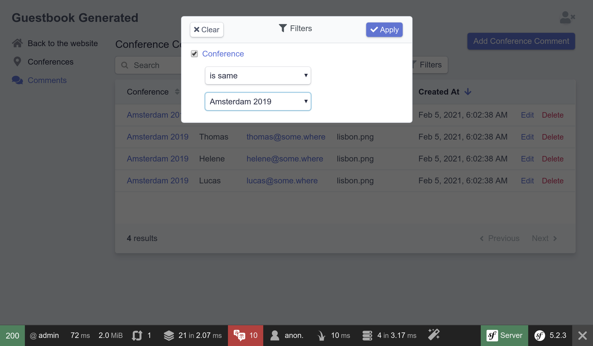

إعداد  النظام الخلفي
=====================================

.. index::
    single: EasyAdmin
    single: Admin
    single: Backend

تعتبر إضافة المؤتمرات القادمة إلى قاعدة البيانات مهمة خاصة بالمشرفين. *قاعدة الإشراف الخلفية* تعتبر جناح محمي فالموقع, حيث يمكن *للمشرفين* إدارة بيانات موقع الويب وتنسيق عمليات إرسال التعليقات وغير ذلك.

كيف يمكننا بداية العمل بسرعة ؟ باستعمال أدوات لإنشاء قاعدة الإشراف الخلفية، EasyAdmin يمكننا من القيام بهذه العملية بطريقة جيدة جدا.

تهيئة EasyAdmin
--------------------

أولاً، أضف EasyAdmin للمشروع:

.. code-block:: bash

    $ symfony composer req "admin:^3"

يقوم EasyAdmin تلقائيًا بإنشاء منطقة إدارة لتطبيقك بناءً على وحدات تحكم محددة. إنشاء ملف ``src/Controller/Admin/`` الدليل حيث سنخزن وحدات التحكم هذه:

.. code-block:: bash

    $ mkdir src/Controller/Admin/

تحتوي جميع الحزم المثبتة على تهيئة مثل هذه الموجودة ضمن دليل ``config/package/``. في معظم الأوقات ، تم اختيار الإعدادات الافتراضية بعناية للعمل مع معظم التطبيقات.

.. code-block:: bash
    :class: answers(DashboardController||src/Controller/Admin/)

    $ symfony console make:admin:dashboard

قم بإزالة التعليق من الأسطر الأولى، و أضف  فئات نموذج المشروع (classes)

.. code-block:: php
    :caption: src/Controller/Admin/DashboardController.php
    :class: ignore

    namespace App\Controller\Admin;

    use EasyCorp\Bundle\EasyAdminBundle\Config\Dashboard;
    use EasyCorp\Bundle\EasyAdminBundle\Config\MenuItem;
    use EasyCorp\Bundle\EasyAdminBundle\Controller\AbstractDashboardController;
    use Symfony\Component\HttpFoundation\Response;
    use Symfony\Component\Routing\Annotation\Route;

    class DashboardController extends AbstractDashboardController
    {
        /**
         * @Route("/admin", name="admin")
         */
        public function index(): Response
        {
            return parent::index();
        }

        public function configureDashboard(): Dashboard
        {
            return Dashboard::new()
                ->setTitle('Guestbook');
        }

        public function configureMenuItems(): iterable
        {
            yield MenuItem::linktoDashboard('Dashboard', 'fa fa-home');
            // yield MenuItem::linkToCrud('The Label', 'icon class', EntityClass::class);
        }
    }

حسب الاصطلاح ، يتم تخزين جميع وحدات التحكم الإدارية ضمن مساحة الاسم الخاصة بها  ``App\Controller\Admin``

قم بالوصول الي خلفية المسؤول التي تم إنشائها في `` /admin``. بووم! واجهة إدارة لطيفة وغنية بالميزات للمؤتمرات والتعليقات:

.. figure:: screenshots/easy-admin-empty.png
    :alt: /admin
    :align: center
    :figclass: with-browser

فقاعة! لدينا واجهة مشرف لطيفة المظهر ، جاهزة للتخصيص حسب احتياجاتنا.

.. index::
    single: CRUD

الخطوة التالية هي إنشاء وحدات تحكم لإدارة المؤتمرات والتعليقات.

في وحدة التحكم في لوحة القيادة ، ربما تكون قد لاحظت طريقة ``configMenuItems ()`` التي تحتوي على تعليق حول إضافة روابط إلى"CRUD** ."CRUDs** هي اختصار لعبارة "إنشاء وقراءة وتحديث وحذف" ، العمليات الأساسية الأربع التي تريد القيام بها على أي كيان. هذا هو بالضبط ما نريد أن يقوم به المسؤول لنا ؛ حتى أن EasyAdmin ينتقل إلى المستوى التالي من خلال الاهتمام أيضًا بالبحث والتصفية.

دعونا ننشئ CRUD للمؤتمرات:

.. code-block:: bash
    :class: answers(1||src/Controller/Admin/||App\\Controller\\Admin)

    $ symfony console make:admin:crud

حدد ``1`` لإنشاء واجهة إدارة للمؤتمرات واستخدام الإعدادات الافتراضية للأسئلة الأخرى. يجب إنشاء الملف التالي:

.. code-block:: php
    :caption: src/Controller/Admin/ConferenceCrudController.php
    :class: ignore

    namespace App\Controller\Admin;

    use App\Entity\Conference;
    use EasyCorp\Bundle\EasyAdminBundle\Controller\AbstractCrudController;

    class ConferenceCrudController extends AbstractCrudController
    {
        public static function getEntityFqcn(): string
        {
            return Conference::class;
        }

        /*
        public function configureFields(string $pageName): iterable
        {
            return [
                IdField::new('id'),
                TextField::new('title'),
                TextEditorField::new('description'),
            ];
        }
        */
    }

افعل الشيء نفسه للتعليقات:

.. code-block:: bash
    :class: answers(0||src/Controller/Admin/||App\\Controller\\Admin)

    $ symfony console make:admin:crud

الخطوة الأخيرة هي ربط المؤتمر وتعليقات مشرف CRUDs بلوحة القيادة:

.. code-block:: diff
    :caption: patch_file

    --- a/src/Controller/Admin/DashboardController.php
    +++ b/src/Controller/Admin/DashboardController.php
    @@ -2,6 +2,8 @@

     namespace App\Controller\Admin;

    +use App\Entity\Comment;
    +use App\Entity\Conference;
     use EasyCorp\Bundle\EasyAdminBundle\Config\Dashboard;
     use EasyCorp\Bundle\EasyAdminBundle\Config\MenuItem;
     use EasyCorp\Bundle\EasyAdminBundle\Controller\AbstractDashboardController;
    @@ -26,7 +28,8 @@ class DashboardController extends AbstractDashboardController

         public function configureMenuItems(): iterable
         {
    -        yield MenuItem::linktoDashboard('Dashboard', 'fa fa-home');
    -        // yield MenuItem::linkToCrud('The Label', 'fas fa-list', EntityClass::class);
    +        yield MenuItem::linktoRoute('Back to the website', 'fas fa-home', 'homepage');
    +        yield MenuItem::linkToCrud('Conferences', 'fas fa-map-marker-alt', Conference::class);
    +        yield MenuItem::linkToCrud('Comments', 'fas fa-comments', Comment::class);
         }
     }

لقد تجاوزنا طريقة ``configMenuItems ()`` لإضافة عناصر القائمة مع الرموز ذات الصلة بالمؤتمرات وأيقونات التعليقات ولإضافة ارتباط إلى الصفحة الرئيسية للموقع.

يعرض EasyAdmin واجهة برمجة تطبيقات لتسهيل الارتباط بالكيان CRUDS عبر طريقة ``MenuItem::linkToRoute ()``.

الصفحة الرئيسية للوحة القيادة فارغة في الوقت الحالي. هذا هو المكان الذي يمكنك فيه عرض بعض الإحصائيات أو أي معلومات ذات صلة. نظرًا لأنه ليس لدينا أي شيء مهم لعرضه ، فلنقم بإعادة التوجيه إلى قائمة المؤتمرات:

.. code-block:: diff
    :caption: patch_file

    --- a/src/Controller/Admin/DashboardController.php
    +++ b/src/Controller/Admin/DashboardController.php
    @@ -7,6 +7,7 @@ use App\Entity\Conference;
     use EasyCorp\Bundle\EasyAdminBundle\Config\Dashboard;
     use EasyCorp\Bundle\EasyAdminBundle\Config\MenuItem;
     use EasyCorp\Bundle\EasyAdminBundle\Controller\AbstractDashboardController;
    +use EasyCorp\Bundle\EasyAdminBundle\Router\AdminUrlGenerator;
     use Symfony\Component\HttpFoundation\Response;
     use Symfony\Component\Routing\Annotation\Route;

    @@ -17,7 +18,10 @@ class DashboardController extends AbstractDashboardController
          */
         public function index(): Response
         {
    -        return parent::index();
    +        $routeBuilder = $this->get(AdminUrlGenerator::class);
    +        $url = $routeBuilder->setController(ConferenceCrudController::class)->generateUrl();
    +
    +        return $this->redirect($url);
         }

         public function configureDashboard(): Dashboard

عند عرض علاقات الكيانات (المؤتمر المرتبط بتعليق) ، يحاول EasyAdmin استخدام تمثيل سلسلة للمؤتمر. بشكل افتراضي ، يستخدم اصطلاحًا يستخدم اسم الكيان والمفتاح الأساسي ( مثل ``Conference #1``) إذا لم يحدد الكيان "magic" طريقة ``__toString()`` . لجعل العرض أكثر وضوحًا ، أضف هذه الطريقة إلى فئة ``Conference``:

.. code-block:: diff
    :caption: patch_file

    --- a/src/Entity/Conference.php
    +++ b/src/Entity/Conference.php
    @@ -44,6 +44,11 @@ class Conference
             $this->comments = new ArrayCollection();
         }

    +    public function __toString(): string
    +    {
    +        return $this->city.' '.$this->year;
    +    }
    +
         public function getId(): ?int
         {
             return $this->id;

قم بنفس الشيء للنموذج ``Comment``:

.. code-block:: diff
    :caption: patch_file

    --- a/src/Entity/Comment.php
    +++ b/src/Entity/Comment.php
    @@ -48,6 +48,11 @@ class Comment
          */
         private $photoFilename;

    +    public function __toString(): string
    +    {
    +        return (string) $this->getEmail();
    +    }
    +
         public function getId(): ?int
         {
             return $this->id;

يمكنك الآن إضافة / تعديل / حذف المؤتمرات مباشرة من الواجهة الخلفية للمشرف. العب بها وأضف مؤتمرًا واحدًا على الأقل.

.. figure:: screenshots/easy-admin.png
    :alt: /admin
    :align: center
    :figclass: with-browser

أضف بعض التعليقات بدون صور. قم بوضع التاريخ يدوياً في الوقت الحالي؛ سوف نقوم بملئ خلية الـ ``createdAt`` تلقائياً في خطوة مُتقدمة.

.. figure:: screenshots/easy-admin-comments.png
    :alt: /admin?crudAction=index&crudId=2bfa220&menuIndex=2&submenuIndex=-1
    :align: center
    :figclass: with-browser

تخصيص EasyAdmin
--------------------

تعمل الواجهة الخلفية الافتراضية للمشرف بشكل جيد ، ولكن يمكن تخصيصها بعدة طرق لتحسين التجربة. دعونا نقوم ببعض التغييرات البسيطة لتوضيح بعض الاحتمالات:

.. code-block:: diff
    :caption: patch_file

    --- a/src/Controller/Admin/CommentCrudController.php
    +++ b/src/Controller/Admin/CommentCrudController.php
    @@ -3,7 +3,15 @@
     namespace App\Controller\Admin;

     use App\Entity\Comment;
    +use EasyCorp\Bundle\EasyAdminBundle\Config\Crud;
    +use EasyCorp\Bundle\EasyAdminBundle\Config\Filters;
     use EasyCorp\Bundle\EasyAdminBundle\Controller\AbstractCrudController;
    +use EasyCorp\Bundle\EasyAdminBundle\Field\AssociationField;
    +use EasyCorp\Bundle\EasyAdminBundle\Field\DateTimeField;
    +use EasyCorp\Bundle\EasyAdminBundle\Field\EmailField;
    +use EasyCorp\Bundle\EasyAdminBundle\Field\TextareaField;
    +use EasyCorp\Bundle\EasyAdminBundle\Field\TextField;
    +use EasyCorp\Bundle\EasyAdminBundle\Filter\EntityFilter;

     class CommentCrudController extends AbstractCrudController
     {
    @@ -12,14 +20,44 @@ class CommentCrudController extends AbstractCrudController
             return Comment::class;
         }

    -    /*
    +    public function configureCrud(Crud $crud): Crud
    +    {
    +        return $crud
    +            ->setEntityLabelInSingular('Conference Comment')
    +            ->setEntityLabelInPlural('Conference Comments')
    +            ->setSearchFields(['author', 'text', 'email'])
    +            ->setDefaultSort(['createdAt' => 'DESC']);
    +        ;
    +    }
    +
    +    public function configureFilters(Filters $filters): Filters
    +    {
    +        return $filters
    +            ->add(EntityFilter::new('conference'))
    +        ;
    +    }
    +
         public function configureFields(string $pageName): iterable
         {
    -        return [
    -            IdField::new('id'),
    -            TextField::new('title'),
    -            TextEditorField::new('description'),
    -        ];
    +        yield AssociationField::new('conference');
    +        yield TextField::new('author');
    +        yield EmailField::new('email');
    +        yield TextareaField::new('text')
    +            ->hideOnIndex()
    +        ;
    +        yield TextField::new('photoFilename')
    +            ->onlyOnIndex()
    +        ;
    +
    +        $createdAt = DateTimeField::new('createdAt')->setFormTypeOptions([
    +            'html5' => true,
    +            'years' => range(date('Y'), date('Y') + 5),
    +            'widget' => 'single_text',
    +        ]);
    +        if (Crud::PAGE_EDIT === $pageName) {
    +            yield $createdAt->setFormTypeOption('disabled', true);
    +        } else {
    +            yield $createdAt;
    +        }
         }
    -    */
     }

لتخصيص قسم ``Comment`` ، يتيح لنا إدراج الحقول بشكل صريح في طريقة ```configureFields()`` ترتيبها بالطريقة التي نريدها. يتم تكوين بعض الحقول بشكل أكبر ، مثل إخفاء حقل النص في صفحة الفهرس.

تحدد طرق ``configFilters ()`` المرشحات التي يجب عرضها أعلى حقل البحث.



هذه التخصيصات هي مجرد مقدمة صغيرة للإمكانيات التي يوفرها EasyAdmin.

العب مع المسؤول ، وقم بتصفية التعليقات حسب المؤتمر ، أو ابحث عن التعليقات عبر البريد الإلكتروني على سبيل المثال. المشكلة الوحيدة هي أنه يمكن لأي شخص الوصول إلى الواجهة الخلفية. لا تقلق ، سنقوم بتأمينه في خطوة مستقبلية.

.. code-block:: bash
    :class: hide

    $ symfony run psql -c "TRUNCATE conference RESTART IDENTITY CASCADE"

.. sidebar:: الذهاب أبعد من ذلك

    * `EasyAdmin توثيق <https://symfony.com/doc/3.x/bundles/EasyAdminBundle/index.html>`_؛

    * `Symfony framework مرجع الإعدادات <https://symfony.com/doc/current/reference/configuration/framework.html>`_;

    * `طرق PHP السحرية <https://www.php.net/manual/en/language.oop5.magic.php>`_.
