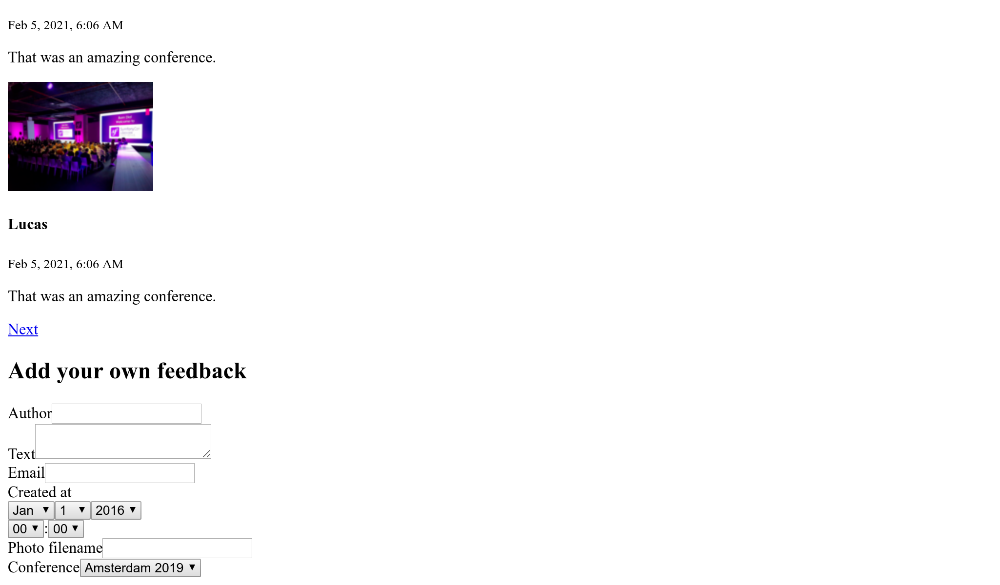
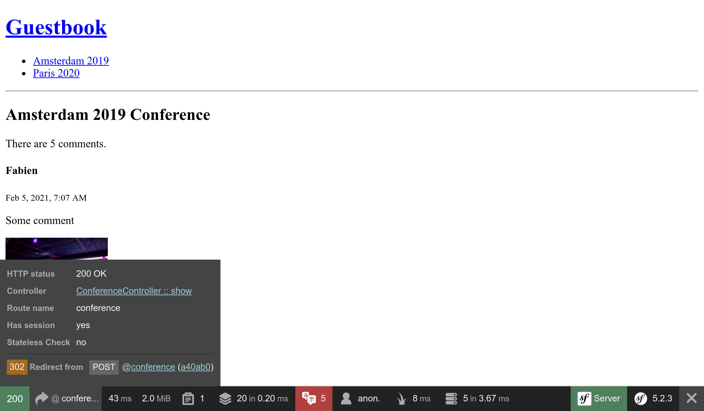

Feedback mit Formularen annehmen
================================

.. index::
    single: Components;Form
    single: Form

Es ist an der Zeit, dass unsere Teilnehmer*innen Feedback zu Konferenzen geben. Sie werden ihre Kommentare über ein *HTML-Formular* einbringen.

Einen Form-Type generieren
--------------------------

.. index::
    single: Command;make:form

Verwende das Maker-Bundle, um eine Formularklasse zu generieren:

.. code-block:: bash

    $ symfony console make:form CommentFormType Comment

.. code-block:: text
    :class: ignore
    :emphasize-lines: 1

     created: src/Form/CommentFormType.php

      Success!

     Next: Add fields to your form and start using it.
     Find the documentation at https://symfony.com/doc/current/forms.html

Die ``App\Form\CommentFormType``-Klasse definiert ein Formular für die ``App\Entity\Comment``-Entity:

.. code-block:: php
    :caption: src/App/Form/CommentFormType.php
    :class: ignore

    namespace App\Form;

    use App\Entity\Comment;
    use Symfony\Component\Form\AbstractType;
    use Symfony\Component\Form\FormBuilderInterface;
    use Symfony\Component\OptionsResolver\OptionsResolver;

    class CommentFormType extends AbstractType
    {
        public function buildForm(FormBuilderInterface $builder, array $options)
        {
            $builder
                ->add('author')
                ->add('text')
                ->add('email')
                ->add('createdAt')
                ->add('photoFilename')
                ->add('conference')
            ;
        }

        public function configureOptions(OptionsResolver $resolver)
        {
            $resolver->setDefaults([
                'data_class' => Comment::class,
            ]);
        }
    }

Ein `Form-Type`_ beschreibt die mit einem Modell verknüpften *Formularfelder*. Er übernimmt die Datenkonvertierung zwischen den übermittelten Daten und den Properties/Eigenschaften der Modellklasse. Standardmäßig verwendet Symfony Metadaten aus der ``Comment``-Entity – wie z. B. die Doctrine Metadaten – um die Konfiguration für jedes Feld zu erraten. Beispielsweise wird das ``text``-Feld als ``textarea`` dargestellt, weil es eine größere Spalte in der Datenbank verwendet.

Formulare anzeigen
------------------

Um den Benutzer*innen das Formular anzuzeigen, erstellst Du das Formular im Controller und übergibst es an das Template:

.. code-block:: diff
    :caption: patch_file
    :emphasize-lines: 18,24

    --- a/src/Controller/ConferenceController.php
    +++ b/src/Controller/ConferenceController.php
    @@ -2,7 +2,9 @@

     namespace App\Controller;

    +use App\Entity\Comment;
     use App\Entity\Conference;
    +use App\Form\CommentFormType;
     use App\Repository\CommentRepository;
     use App\Repository\ConferenceRepository;
     use Symfony\Bundle\FrameworkBundle\Controller\AbstractController;
    @@ -31,6 +33,9 @@ class ConferenceController extends AbstractController
         #[Route('/conference/{slug}', name: 'conference')]
         public function show(Request $request, Conference $conference, CommentRepository $commentRepository): Response
         {
    +        $comment = new Comment();
    +        $form = $this->createForm(CommentFormType::class, $comment);
    +
             $offset = max(0, $request->query->getInt('offset', 0));
             $paginator = $commentRepository->getCommentPaginator($conference, $offset);

    @@ -39,6 +44,7 @@ class ConferenceController extends AbstractController
                 'comments' => $paginator,
                 'previous' => $offset - CommentRepository::PAGINATOR_PER_PAGE,
                 'next' => min(count($paginator), $offset + CommentRepository::PAGINATOR_PER_PAGE),
    +            'comment_form' => $form->createView(),
             ]));
         }
     }

Du solltest den Form-Type niemals direkt instanziieren. Verwende stattdessen die ``createForm()``-Methode. Diese Methode ist Teil vom ``AbstractController`` und erleichtert die Erstellung von Formularen.

.. index::
    single: Twig;form

Wenn Du ein Formular an ein Template übergibst,  konvertierst Du mit``createView()`` die Daten in ein für Templates geeignetes Format.

Die Darstellung des Formulars im Template kann über die Twig-Funktion ``form`` erfolgen:

.. code-block:: diff
    :caption: patch_file
    :emphasize-lines: 10

    --- a/templates/conference/show.html.twig
    +++ b/templates/conference/show.html.twig
    @@ -30,4 +30,8 @@
         
             
No comments have been posted yet for this conference.

         
    +
    +    <h2>Add your own feedback</h2>
    +
    +    {{ form(comment_form) }}
     

Nach dem Aktualisieren einer Konferenzseite im Browser siehst Du, dass jedes Formularfeld das richtige HTML-Widget anzeigt (der Datentyp wird aus dem Modell abgeleitet):

Die ``form()``-Funktion generiert das HTML-Formular auf der Grundlage aller im Form-Type definierten Informationen. Es ergänzt auch den ``<form>``-Tag um ``enctype=multipart/form-data``, weil das Eingabefeld für den Datei-Upload dies erfordert. Außerdem kümmert es sich um die Anzeige von Fehlermeldungen, falls die Eingabe fehlerhaft ist. Alles kann durch Überschreiben der Standard-Templates angepasst werden, aber wir werden das für dieses Projekt nicht tun müssen.

Einen Form-Type anpassen
------------------------

Auch wenn Formularfelder basierend auf ihrem Modellgegenstück konfiguriert werden, kannst Du die Standardkonfiguration in der Form-Type-Klasse direkt anpassen:

.. code-block:: diff
    :caption: patch_file

    --- a/src/Form/CommentFormType.php
    +++ b/src/Form/CommentFormType.php
    @@ -4,20 +4,31 @@ namespace App\Form;

     use App\Entity\Comment;
     use Symfony\Component\Form\AbstractType;
    +use Symfony\Component\Form\Extension\Core\Type\EmailType;
    +use Symfony\Component\Form\Extension\Core\Type\FileType;
    +use Symfony\Component\Form\Extension\Core\Type\SubmitType;
     use Symfony\Component\Form\FormBuilderInterface;
     use Symfony\Component\OptionsResolver\OptionsResolver;
    +use Symfony\Component\Validator\Constraints\Image;

     class CommentFormType extends AbstractType
     {
         public function buildForm(FormBuilderInterface $builder, array $options)
         {
             $builder
    -            ->add('author')
    +            ->add('author', null, [
    +                'label' => 'Your name',
    +            ])
                 ->add('text')
    -            ->add('email')
    -            ->add('createdAt')
    -            ->add('photoFilename')
    -            ->add('conference')
    +            ->add('email', EmailType::class)
    +            ->add('photo', FileType::class, [
    +                'required' => false,
    +                'mapped' => false,
    +                'constraints' => [
    +                    new Image(['maxSize' => '1024k'])
    +                ],
    +            ])
    +            ->add('submit', SubmitType::class)
             ;
         }

Beachte, dass wir einen Submit-Button hinzugefügt haben (der es uns ermöglicht, den einfachen ``{{ form(comment_form) }}`` Ausdruck in der Vorlage weiterhin zu verwenden).

Einige Felder können nicht automatisch konfiguriert werden, etwa ``photoFilename``. Die ``Comment``-Entity muss nur den Dateinamen des Fotos speichern, aber das Formular muss sich mit dem Hochladen der Datei selbst befassen. Um diesen Fall zu behandeln, haben wir ein Property namens ``photo`` als un-``mapped`` Feld hinzugefügt: es gehört zu keinem Datenbank-Feld der ``Comment``-Entity. Wir werden es manuell verwalten, um eine bestimmte Logik zu implementieren (wie das Speichern des hochgeladenen Fotos auf der Festplatte).

Als Beispiel für eine Anpassung haben wir auch die Standardbezeichnung für einige Felder geändert.

Die Bild-Validierungsregel kontrolliert den Mime-Typen, füge die Mime-Komponente hinzu damit es funktioniert:

.. code-block:: bash

    $ symfony composer req mime

Modelle validieren
------------------

Der Form-Type konfiguriert das Frontend-Rendering des Formulars (mit etwas HTML5-Validierung). Hier ist das generierte HTML-Formular:

.. code-block:: html
    :class: ignore

    <form name="comment_form" method="post" enctype="multipart/form-data">
        

            

                <label for="comment_form_author" class="required">Your name</label>
                <input type="text" id="comment_form_author" name="comment_form[author]" required="required" maxlength="255" />
            

            

                <label for="comment_form_text" class="required">Text</label>
                <textarea id="comment_form_text" name="comment_form[text]" required="required"></textarea>
            

            

                <label for="comment_form_email" class="required">Email</label>
                <input type="email" id="comment_form_email" name="comment_form[email]" required="required" />
            

            

                <label for="comment_form_photo">Photo</label>
                <input type="file" id="comment_form_photo" name="comment_form[photo]" />
            

            

                <button type="submit" id="comment_form_submit" name="comment_form[submit]">Submit</button>
            

            <input type="hidden" id="comment_form__token" name="comment_form[_token]" value="DwqsEanxc48jofxsqbGBVLQBqlVJ_Tg4u9-BL1Hjgac" />
        

    </form>

Das Formular verwendet das ``email``-Element für die E-Mail-Adresse des Autors und markiert die meisten der Felder mit ``required``. Beachte, dass das Formular auch ein verstecktes ``_token``-Feld enthält, um das Formular vor `CSRF-Angriffen <https://owasp.org/www-community/attacks/csrf>`_ zu schützen.

Wenn die Formularübermittlung jedoch die HTML-Validierung umgeht (mit einem HTTP-Client, der diese Validierungsregeln nicht durchsetzt, wie cURL), können ungültige Daten auf den Server gelangen.

Wir müssen auch einige Validierungsregeln für das ``Comment``-Datenmodell hinzufügen:

.. code-block:: diff
    :caption: patch_file

    --- a/src/Entity/Comment.php
    +++ b/src/Entity/Comment.php
    @@ -4,6 +4,7 @@ namespace App\Entity;

     use App\Repository\CommentRepository;
     use Doctrine\ORM\Mapping as ORM;
    +use Symfony\Component\Validator\Constraints as Assert;

     /**
      * @ORM\Entity(repositoryClass=CommentRepository::class)
    @@ -21,16 +22,20 @@ class Comment
         /**
          * @ORM\Column(type="string", length=255)
          */
    +    #[Assert\NotBlank]
         private $author;

         /**
          * @ORM\Column(type="text")
          */
    +    #[Assert\NotBlank]
         private $text;

         /**
          * @ORM\Column(type="string", length=255)
          */
    +    #[Assert\NotBlank]
    +    #[Assert\Email]
         private $email;

         /**

Ein Formular verarbeiten
------------------------

Der Code, den wir bisher geschrieben haben, reicht aus, um das Formular anzuzeigen.

Wir sollten nun im Controller die Übermittlung des Formulars verarbeiten und die Informationen in der Datenbank speichern:

.. code-block:: diff
    :caption: patch_file

    --- a/src/Controller/ConferenceController.php
    +++ b/src/Controller/ConferenceController.php
    @@ -7,6 +7,7 @@ use App\Entity\Conference;
     use App\Form\CommentFormType;
     use App\Repository\CommentRepository;
     use App\Repository\ConferenceRepository;
    +use Doctrine\ORM\EntityManagerInterface;
     use Symfony\Bundle\FrameworkBundle\Controller\AbstractController;
     use Symfony\Component\HttpFoundation\Request;
     use Symfony\Component\HttpFoundation\Response;
    @@ -16,10 +17,12 @@ use Twig\Environment;
     class ConferenceController extends AbstractController
     {
         private $twig;
    +    private $entityManager;

    -    public function __construct(Environment $twig)
    +    public function __construct(Environment $twig, EntityManagerInterface $entityManager)
         {
             $this->twig = $twig;
    +        $this->entityManager = $entityManager;
         }

         #[Route('/', name: 'homepage')]
    @@ -35,6 +38,15 @@ class ConferenceController extends AbstractController
         {
             $comment = new Comment();
             $form = $this->createForm(CommentFormType::class, $comment);
    +        $form->handleRequest($request);
    +        if ($form->isSubmitted() && $form->isValid()) {
    +            $comment->setConference($conference);
    +
    +            $this->entityManager->persist($comment);
    +            $this->entityManager->flush();
    +
    +            return $this->redirectToRoute('conference', ['slug' => $conference->getSlug()]);
    +        }

             $offset = max(0, $request->query->getInt('offset', 0));
             $paginator = $commentRepository->getCommentPaginator($conference, $offset);

Beim Absenden des Formulars wird das ``Comment``-Objekt entsprechend der übermittelten Daten aktualisiert.

Wir erzwingen, dass die Konferenz die gleiche ist, wie die aus der URL (wir haben sie aus dem Formular entfernt).

Wenn die Formulareingabe nicht gültig ist, zeigen wir die Seite an, aber das Formular enthält nun die übermittelten Werte sowie Fehlermeldungen, so dass sie dem*r Benutzer*in wieder angezeigt werden können.

Probiere das Formular aus. Es sollte gut funktionieren und die Daten sollten in der Datenbank gespeichert sein (überprüfe dies im Admin-Backend). Es gibt jedoch ein Problem: Fotos. Sie funktionieren nicht, da wir sie noch nicht im Controller behandelt haben.

Dateien hochladen
-----------------

Hochgeladene Fotos sollten auf der lokalen Festplatte gespeichert werden, an einem Ort, der über das Frontend zugänglich ist, damit wir sie auf der Konferenzseite anzeigen können. Wir werden sie unter dem ``public/uploads/photos``-Verzeichnis speichern:

.. code-block:: diff
    :caption: patch_file

    --- a/src/Controller/ConferenceController.php
    +++ b/src/Controller/ConferenceController.php
    @@ -9,6 +9,7 @@ use App\Repository\CommentRepository;
     use App\Repository\ConferenceRepository;
     use Doctrine\ORM\EntityManagerInterface;
     use Symfony\Bundle\FrameworkBundle\Controller\AbstractController;
    +use Symfony\Component\HttpFoundation\File\Exception\FileException;
     use Symfony\Component\HttpFoundation\Request;
     use Symfony\Component\HttpFoundation\Response;
     use Symfony\Component\Routing\Annotation\Route;
    @@ -34,13 +35,22 @@ class ConferenceController extends AbstractController
         }

         #[Route('/conference/{slug}', name: 'conference')]
    -    public function show(Request $request, Conference $conference, CommentRepository $commentRepository): Response
    +    public function show(Request $request, Conference $conference, CommentRepository $commentRepository, string $photoDir): Response
         {
             $comment = new Comment();
             $form = $this->createForm(CommentFormType::class, $comment);
             $form->handleRequest($request);
             if ($form->isSubmitted() && $form->isValid()) {
                 $comment->setConference($conference);
    +            if ($photo = $form['photo']->getData()) {
    +                $filename = bin2hex(random_bytes(6)).'.'.$photo->guessExtension();
    +                try {
    +                    $photo->move($photoDir, $filename);
    +                } catch (FileException $e) {
    +                    // unable to upload the photo, give up
    +                }
    +                $comment->setPhotoFilename($filename);
    +            }

                 $this->entityManager->persist($comment);
                 $this->entityManager->flush();

Um Foto-Uploads zu verwalten, erstellen wir einen zufälligen Namen für die Datei. Dann verschieben wir die hochgeladene Datei an ihren endgültigen Speicherort (das Fotoverzeichnis). Schließlich speichern wir den Dateinamen im Comment-Objekt.

.. index::
    single: Container;Bind
    single: Bind

Siehst Du, dass das neue Argument für die ``show()``-Methode ``$photoDir`` ein String und kein Service ist? Wie kann Symfony wissen, was hier injiziert werden soll? Der Symfony Container ist in der Lage, neben den Services auch *Parameter* zu speichern. Parameter sind skalare Werte, die bei der Konfiguration von Services helfen. Diese Parameter können explizit in Services eingefügt oder *durch Namen gebunden* werden:

.. code-block:: diff
    :caption: patch_file

    --- a/config/services.yaml
    +++ b/config/services.yaml
    @@ -10,6 +10,8 @@ services:
         _defaults:
             autowire: true      # Automatically injects dependencies in your services.
             autoconfigure: true # Automatically registers your services as commands, event subscribers, etc.
    +        bind:
    +            $photoDir: "%kernel.project_dir%/public/uploads/photos"

         # makes classes in src/ available to be used as services
         # this creates a service per class whose id is the fully-qualified class name

Die ``bind``-Einstellung ermöglicht es Symfony, den Wert zu injizieren, wenn ein Service das ``$photoDir``-Argument erwartet.

Versuche, eine PDF-Datei anstelle eines Fotos hochzuladen. Du solltest die Fehlermeldungen in Aktion sehen. Das Design ist im Moment ziemlich hässlich, aber keine Sorge, in ein paar Schritten wird alles schön, wenn wir am Design der Website arbeiten. Für die Formulare werden wir eine Zeile der Konfiguration ändern, um alle Formularelemente zu verschönern.

Formulare debuggen
------------------

Wenn ein Formular abgeschickt wird und etwas nicht klappt, verwende das "Formular"-Panel des Symfony Profilers. Es gibt Dir Informationen über das Formular, seine Optionen, die übermittelten Daten und wie sie intern konvertiert werden. Falls das Formular Fehler enthält, werden diese ebenfalls angezeigt.

Der typische Formular-Workflow sieht so aus:

* Das Formular wird auf einer Seite angezeigt;

* Der*ie Benutzer*in sendet das Formular über eine POST-Anfrage;

* Der Server leitet den*ie Benutzer*in auf eine andere oder die gleiche Seite weiter.

Aber wie kannst Du auf den Profiler für eine erfolgreiche Anfrage zugreifen? Da die Seite sofort umgeleitet wird, sehen wir nie die Web-Debug-Toolbar für die POST-Anfrage. Kein Problem: Fahre auf der umgeleiteten Seite mit der Maus über den linken grünen Teil mit der "200". Du solltest die "302" Umleitung mit einem Link zum Profil sehen (in Klammern).

Klicke darauf, um auf das POST-Request-Profil zuzugreifen, und gehe zum "Forms"-Panel:

.. code-block:: bash
    :class: hide

    $ rm -rf var/cache

.. figure:: screenshots/form-profiler.png
    :alt: /_profiler/450aa5
    :align: center
    :figclass: with-browser

Hochgeladene Fotos im Admin-Backend anzeigen
--------------------------------------------

Das Admin-Backend zeigt derzeit den Dateinamen des Fotos an, aber wir wollen das aktuelle Foto sehen:

.. code-block:: diff
    :caption: patch_file

    --- a/src/Controller/Admin/CommentCrudController.php
    +++ b/src/Controller/Admin/CommentCrudController.php
    @@ -9,6 +9,7 @@ use EasyCorp\Bundle\EasyAdminBundle\Controller\AbstractCrudController;
     use EasyCorp\Bundle\EasyAdminBundle\Field\AssociationField;
     use EasyCorp\Bundle\EasyAdminBundle\Field\DateTimeField;
     use EasyCorp\Bundle\EasyAdminBundle\Field\EmailField;
    +use EasyCorp\Bundle\EasyAdminBundle\Field\ImageField;
     use EasyCorp\Bundle\EasyAdminBundle\Field\TextareaField;
     use EasyCorp\Bundle\EasyAdminBundle\Field\TextField;
     use EasyCorp\Bundle\EasyAdminBundle\Filter\EntityFilter;
    @@ -45,7 +46,9 @@ class CommentCrudController extends AbstractCrudController
             yield TextareaField::new('text')
                 ->hideOnIndex()
             ;
    -        yield TextField::new('photoFilename')
    +        yield ImageField::new('photoFilename')
    +            ->setBasePath('/uploads/photos')
    +            ->setLabel('Photo')
                 ->onlyOnIndex()
             ;

Hochgeladene Fotos von Git ausschließen
---------------------------------------

Noch nicht committen! Wir wollen keine hochgeladenen Bilder im Git-Repository speichern. Füge das Verzeichnis ``/public/uploads`` zur ``.gitignore``-Datei hinzu:

.. code-block:: diff
    :caption: patch_file

    --- a/.gitignore
    +++ b/.gitignore
    @@ -1,3 +1,4 @@
    +/public/uploads

     ###> symfony/framework-bundle ###
     /.env.local

Hochgeladene Dateien auf Produktivservern speichern
---------------------------------------------------

Der letzte Schritt besteht darin, die hochgeladenen Dateien auf Produktionsservern zu speichern. Warum sollten wir etwas Besonderes tun müssen? Weil die meisten modernen Cloud-Plattformen, aus verschiedenen Gründen, schreibgeschützte Container verwenden. Die SymfonyCloud bildet dabei keine Ausnahme.

In einem Symfony-Projekt ist nicht alles schreibgeschützt. Wir versuchen, beim Erstellen des Containers (während der Aufwärmphase des Caches) so viel Cache wie möglich zu erzeugen, aber Symfony muss immer noch in der Lage sein, irgendwo schreiben zu können – etwa den Cache für den*ie Benutzer*in, Logs, die Sessions (wenn sie im Dateisystem gespeichert werden) uvm.

Wirf einen Blick auf ``.symfony.cloud.yaml``, es hat bereits ein beschreibbares *mount* für das Verzeichnis ``var/``. Es ist das einzige Verzeichnis, in das Symfony schreibt (Caches, Logs, ...).

Lass uns einen neuen Mount für hochgeladene Fotos erstellen:

.. code-block:: diff
    :caption: patch_file

    --- a/.symfony.cloud.yaml
    +++ b/.symfony.cloud.yaml
    @@ -36,6 +36,7 @@ web:

     mounts:
         "/var": { source: local, source_path: var }
    +    "/public/uploads": { source: local, source_path: uploads }

     hooks:
         build: |

Du kannst den Code jetzt deployen und Fotos werden wie unsere lokale Version im ``public/uploads/``-Verzeichnis gespeichert.

.. sidebar:: Weiterführendes

    * `SymfonyCasts Tutorial für Formulare <https://symfonycasts.com/screencast/symfony-forms>`_;

    * Wie man die `Darstellung von Symfony-Formularen in HTML anpasst 
<https://symfony.com/doc/current/form/form_customization.html>`_;

    * `Validierung von Symfony-Formularen <https://symfony.com/doc/current/forms.html#validating-forms>`_;

    * Die `Referenz der Symfony-Form-Types <https://symfony.com/doc/current/reference/forms/types.html>`_;

    * Die `FlysystemBundle Dokumentation <https://github.com/thephpleague/flysystem-bundle/blob/master/docs/1-getting-started.md>`_, welche die Integration mit mehreren Cloud-Speicheranbietern wie AWS S3, Azure und Google Cloud Storage ermöglicht;

    * Die `Symfony-Konfigurationsparameter <https://symfony.com/doc/current/configuration.html#configuration-parameters>`_.

    * Die `Symfony Validierungsregeln <https://symfony.com/doc/current/validation.html#basic-constraints>`_;

    * Das `Symfony Form Cheat Sheet <https://github.com/andreia/symfony-cheat-sheets/blob/master/Symfony2/how_symfony2_forms_works_en.pdf>`_.

.. _`Form-Type`: https://symfony.com/doc/current/forms.html#form-types
