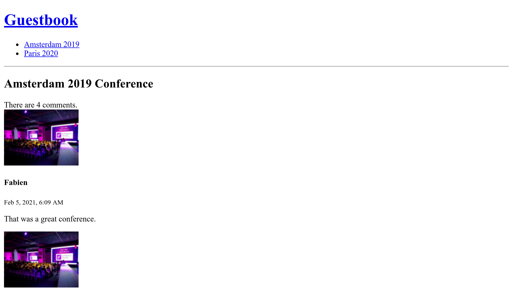

Testen
======

.. index::
    single: PHPUnit

Da wir nun mehr und mehr Funktionalität in die Anwendung einbauen, ist jetzt wahrscheinlich der richtige Zeitpunkt um über das Testen zu sprechen.

*Fun Fact*: Ich habe beim Schreiben der Tests in diesem Kapitel einen Fehler gefunden.

Symfony setzt bei Unit-Tests auf PHPUnit. Lass es uns installieren:

.. code-block:: bash

    $ symfony composer req phpunit --dev

Unit-Tests schreiben
--------------------

.. index::
    single: Test;Unit Tests
    single: Unit Tests
    single: Command;make:test

``SpamChecker`` ist die erste Klasse, für die wir Tests schreiben werden. Generiere einen Unit-Test:

.. code-block:: bash

    $ symfony console make:test TestCase SpamCheckerTest

Das Testen des SpamCheckers ist eine Herausforderung, da wir die Akismet-API sicherlich nicht ständig aufrufen wollen. Wir werden die API *mocken* (simulieren).

.. index::
    single: Mock

Lasse uns einen ersten Test für den Fall schreiben, dass die API einen Fehler zurückgibt:

.. code-block:: diff
    :caption: patch_file

    --- a/tests/SpamCheckerTest.php
    +++ b/tests/SpamCheckerTest.php
    @@ -2,12 +2,26 @@

     namespace App\Tests;

    +use App\Entity\Comment;
    +use App\SpamChecker;
     use PHPUnit\Framework\TestCase;
    +use Symfony\Component\HttpClient\MockHttpClient;
    +use Symfony\Component\HttpClient\Response\MockResponse;
    +use Symfony\Contracts\HttpClient\ResponseInterface;

     class SpamCheckerTest extends TestCase
     {
    -    public function testSomething(): void
    +    public function testSpamScoreWithInvalidRequest()
         {
    -        $this->assertTrue(true);
    +        $comment = new Comment();
    +        $comment->setCreatedAtValue();
    +        $context = [];
    +
    +        $client = new MockHttpClient([new MockResponse('invalid', ['response_headers' => ['x-akismet-debug-help: Invalid key']])]);
    +        $checker = new SpamChecker($client, 'abcde');
    +
    +        $this->expectException(\RuntimeException::class);
    +        $this->expectExceptionMessage('Unable to check for spam: invalid (Invalid key).');
    +        $checker->getSpamScore($comment, $context);
         }
     }

Die ``MockHttpClient``-Klasse ermöglicht es, jeden beliebigen HTTP-Server zu simulieren. Es wird eine Reihe von ``MockResponse``-Instanzen benötigen, die den erwarteten Body und die Response-Header enthalten.

Anschließend rufen wir die ``getSpamScore()``-Methode auf und überprüfen, mit Hilfe der ``expectException()``-Methode von PHPUnit, ob eine Ausnahme ausgelöst wird.

Führe die Tests aus, um sicherzustellen, dass sie erfolgreich sind:

.. code-block:: bash

    $ symfony php bin/phpunit

.. index::
    single: PHPUnit;Data Provider
    single: Data Provider
    single: Annotations;@dataProvider

Lasst uns Tests für den happy path hinzufügen:

.. code-block:: diff
    :caption: patch_file

    --- a/tests/SpamCheckerTest.php
    +++ b/tests/SpamCheckerTest.php
    @@ -24,4 +24,32 @@ class SpamCheckerTest extends TestCase
             $this->expectExceptionMessage('Unable to check for spam: invalid (Invalid key).');
             $checker->getSpamScore($comment, $context);
         }
    +
    +    /**
    +     * @dataProvider getComments
    +     */
    +    public function testSpamScore(int $expectedScore, ResponseInterface $response, Comment $comment, array $context)
    +    {
    +        $client = new MockHttpClient([$response]);
    +        $checker = new SpamChecker($client, 'abcde');
    +
    +        $score = $checker->getSpamScore($comment, $context);
    +        $this->assertSame($expectedScore, $score);
    +    }
    +
    +    public function getComments(): iterable
    +    {
    +        $comment = new Comment();
    +        $comment->setCreatedAtValue();
    +        $context = [];
    +
    +        $response = new MockResponse('', ['response_headers' => ['x-akismet-pro-tip: discard']]);
    +        yield 'blatant_spam' => [2, $response, $comment, $context];
    +
    +        $response = new MockResponse('true');
    +        yield 'spam' => [1, $response, $comment, $context];
    +
    +        $response = new MockResponse('false');
    +        yield 'ham' => [0, $response, $comment, $context];
    +    }
     }

Der PHPUnit Data Provider ermöglicht es uns, die gleiche Testlogik für mehrere Testfälle wiederzuverwenden.

Funktionale Tests für Controller schreiben
-------------------------------------------

.. index::
    single: Test;Functional Tests
    single: Functional Tests
    single: Components;Browser Kit
    single: Browser Kit
    single: Command;make:functional-test

Das Testen von Controllern ist etwas anders als das Testen einer "normalen" PHP-Klasse, da wir sie im Rahmen einer HTTP-Anfrage ausführen wollen.

Erstelle einen funktionalen Test für den Conference-Controller:

.. code-block:: php
    :caption: tests/Controller/ConferenceControllerTest.php

    namespace App\Tests\Controller;

    use Symfony\Bundle\FrameworkBundle\Test\WebTestCase;

    class ConferenceControllerTest extends WebTestCase
    {
        public function testIndex()
        {
            $client = static::createClient();
            $client->request('GET', '/');

            $this->assertResponseIsSuccessful();
            $this->assertSelectorTextContains('h2', 'Give your feedback');
        }
    }

Wenn wir ``Symfony\Bundle\FrameworkBundle\Test\WebTestCase`` anstelle von ``PHPUnit\Framework\TestCase`` als Basis-Klasse für unsere Tests nutzen, haben wir eine gute Abstraktion für unsere Funktionalen Tests.

Die ``$client``-Variable simuliert einen Browser. Anstatt jedoch HTTP-Anfragen an den Server zu senden, ruft dieser die Symfony-Anwendung direkt auf. Dieses Vorgehen hat mehrere Vorteile: Es ist viel schneller als eine tatsächliche Kommunikation zwischen Client und Server, und sie ermöglicht es auch, in den Tests den Zustand der Services nach jedem HTTP-Request zu überprüfen.

Dieser erste Test prüft, ob die Homepage eine HTTP-Response mit Status 200 zurückgibt.

Assertions wie ``assertResponseIsSuccessful`` werden zusätzlich zu PHPUnit hinzugefügt, um Dir die Arbeit zu erleichtern. Symfony stellt viele solcher Assertions zur Verfügung.

.. tip::

    Wir haben ``/`` fix als URL verwendet, anstatt sie über den Router zu generieren. Dies geschieht absichtlich, da das Testen von Produktiv-URLs Teil dessen ist, was wir testen wollen. Sobald Du den Routenpfad änderst, werden die Tests fehlschlagen und dich dadurch freundlich daran erinnern, dass Du die alte URL wahrscheinlich auf die neue umleiten solltest, um gegenüber Suchmaschinen und Websites, die auf Deine Website verweisen, nett zu sein.

.. note::

    Wir hätten den Test über das Maker-Bundle generieren können:

    .. code-block:: bash

        $ symfony console make:test WebTestCase Controller\\ConferenceController

Konfiguration der Test-Umgebung
-------------------------------

.. index::
    single: Symfony Environments

Standardmäßig werden PHPUnit-Tests in der ``test`` Symfony-Umgebung ausgeführt. Das ist in der PHPUnit-Konfigurations-Datei festgelegt:

.. code-block:: xml
    :caption: phpunit.xml.dist
    :emphasize-lines: 4
    :class: ignore

    <phpunit>
        <php>
            <ini name="error_reporting" value="-1" />
            <server name="APP_ENV" value="test" force="true" />
            <server name="SHELL_VERBOSITY" value="-1" />
            <server name="SYMFONY_PHPUNIT_REMOVE" value="" />
            <server name="SYMFONY_PHPUNIT_VERSION" value="8.5" />
        </php>
    </phpunit>

.. index:: Command;secrets:set

Damit Tests funktionieren, müssen wir das ``AKISMET_KEY``-Secret für diese Umgebung festlegen:

.. code-block:: bash
    :class: answers(AKISMET_KEY_VALUE)

    $ APP_ENV=test symfony console secrets:set AKISMET_KEY

.. note::

    Wie wir in einem früheren Kapitel gesehen haben, bedeutet ``APP_ENV=test``, dass die Environment-Variable (Umgebungsvariable) ``APP_ENV`` für den Befehlskontext gesetzt ist. Unter Windows verwende ``--env=test`` anstelle von ``symfony console secrets:set AKISMET_KEY --env=test``.

Mit einer Testdatenbank arbeiten
--------------------------------

.. index::
    single: Test;Database
    single: Functional Tests,Database

Wie wir schon eher gesehen haben, stellt die Symfony CLI automatisch die ``DATABASE_URL``-Environment-Variable (Umgebungsvariable) bereit. Genauso als wenn PHPUnit ausgeführt wurde und verändert damit den Datenbank-Namen von ``main`` zu ``main_test``, so dass die Tests ihre eigene Datenbank haben. Das ist sehr wichtig, weil wir auch stabile Daten brauchen um unsere Tests auszuführen, und wir sicherlich nicht die Daten in unserer Development-Datenbank überschreiben wollen.

Bevor wir unsere Tests ausführen können, müssen wir die ``test``-Datenbank "initialisieren" (Datenbank erstellen und migrieren):

.. code-block:: bash

    $ APP_ENV=test symfony console doctrine:database:create
    $ APP_ENV=test symfony console doctrine:migrations:migrate -n

Wenn Du nun die Tests ausführst, wird PHPUnit nicht mehr mit Deiner Development-Datenbank kommunizieren. Um nur die neuen Tests auszuführen, füge den Pfad zu deren Klassenpfad hinzu:

.. code-block:: bash

    $ APP_ENV=test symfony php bin/phpunit tests/Controller/ConferenceControllerTest.php

Beachte, dass wir ``APP_ENV`` mit Absicht setzen, auch wenn PHPUnit ausgeführt wird, so dass die Symfony CLI den Datenbank-Namen zu ``main_test`` ändert.

.. tip::

    Wenn ein Test fehlschlägt, kann es sinnvoll sein, sich das Response-Objekt anzusehen. Greife über ``$client->getResponse()`` und ``echo`` darauf zu, um zu sehen, wie es aussieht.

Fixtures erstellen
------------------

.. index::
    single: Doctrine;Fixtures
    single: Fixtures

Um die Kommentarliste, Pagination und die Formularübermittlung testen zu können, müssen wir die Datenbank mit Daten befüllen. Außerdem wollen wir, dass die Daten bei allen Testläufen identisch sind, damit die Tests erfolgreich durchlaufen. Fixtures sind genau das, was wir brauchen.

Installiere das Doctrine Fixtures Bundle:

.. code-block:: bash

    $ symfony composer req orm-fixtures --dev

Während der Installation wurde ein neues ``src/DataFixtures/``-Verzeichnis mit einer Beispielklasse erstellt, die angepasst werden kann. Füge vorerst zwei Konferenzen und einen Kommentar hinzu:

.. code-block:: diff
    :caption: patch_file

    --- a/src/DataFixtures/AppFixtures.php
    +++ b/src/DataFixtures/AppFixtures.php
    @@ -2,6 +2,8 @@

     namespace App\DataFixtures;

    +use App\Entity\Comment;
    +use App\Entity\Conference;
     use Doctrine\Bundle\FixturesBundle\Fixture;
     use Doctrine\Persistence\ObjectManager;

    @@ -9,8 +11,24 @@ class AppFixtures extends Fixture
     {
         public function load(ObjectManager $manager)
         {
    -        // $product = new Product();
    -        // $manager->persist($product);
    +        $amsterdam = new Conference();
    +        $amsterdam->setCity('Amsterdam');
    +        $amsterdam->setYear('2019');
    +        $amsterdam->setIsInternational(true);
    +        $manager->persist($amsterdam);
    +
    +        $paris = new Conference();
    +        $paris->setCity('Paris');
    +        $paris->setYear('2020');
    +        $paris->setIsInternational(false);
    +        $manager->persist($paris);
    +
    +        $comment1 = new Comment();
    +        $comment1->setConference($amsterdam);
    +        $comment1->setAuthor('Fabien');
    +        $comment1->setEmail('fabien@example.com');
    +        $comment1->setText('This was a great conference.');
    +        $manager->persist($comment1);

             $manager->flush();
         }

Wenn wir die Fixtures laden, werden alle Daten entfernt, einschließlich der Admin-User. Um das zu vermeiden, fügen wir den Admin-User den Fixtures hinzu:

.. code-block:: diff

    --- a/src/DataFixtures/AppFixtures.php
    +++ b/src/DataFixtures/AppFixtures.php
    @@ -2,13 +2,22 @@

     namespace App\DataFixtures;

    +use App\Entity\Admin;
     use App\Entity\Comment;
     use App\Entity\Conference;
     use Doctrine\Bundle\FixturesBundle\Fixture;
     use Doctrine\Persistence\ObjectManager;
    +use Symfony\Component\Security\Core\Encoder\EncoderFactoryInterface;

     class AppFixtures extends Fixture
     {
    +    private $encoderFactory;
    +
    +    public function __construct(EncoderFactoryInterface $encoderFactory)
    +    {
    +        $this->encoderFactory = $encoderFactory;
    +    }
    +
         public function load(ObjectManager $manager)
         {
             $amsterdam = new Conference();
    @@ -30,6 +39,12 @@ class AppFixtures extends Fixture
             $comment1->setText('This was a great conference.');
             $manager->persist($comment1);

    +        $admin = new Admin();
    +        $admin->setRoles(['ROLE_ADMIN']);
    +        $admin->setUsername('admin');
    +        $admin->setPassword($this->encoderFactory->getEncoder(Admin::class)->encodePassword('admin', null));
    +        $manager->persist($admin);
    +
             $manager->flush();
         }
     }

.. index::
    single: Command;debug:autowiring
    single: Debug;Container
    single: Container;Debug

.. tip::

    Falls Du Dich nicht mehr daran erinnerst, welchen Service Du für eine bestimmte Aufgabe verwenden musst, verwende ``debug:autowiring`` mit einem Keyword:

    .. code-block:: bash

        $ symfony console debug:autowiring encoder

Fixtures laden
--------------

.. index:: ! Command;doctrine:fixtures:load

Lade die Fixtures für die ``test``-Environment/Datenbank:

.. code-block:: bash
    :class: answers(y)

    $ APP_ENV=test symfony console doctrine:fixtures:load

Eine Website in Funktionalen Tests crawlen
------------------------------------------

.. index::
    single: Components;CssSelector
    single: Components;DomCrawler
    single: Test;Crawling
    single: Crawling

Wie wir gesehen haben, simuliert der in den Tests verwendete HTTP-Client einen Browser, sodass wir durch die Website navigieren können, als würden wir einen Headless-Browser verwenden.

Füge einen neuen Test hinzu, der von der Homepage aus auf eine Konferenzseite klickt:

.. code-block:: diff
    :caption: patch_file

    --- a/tests/Controller/ConferenceControllerTest.php
    +++ b/tests/Controller/ConferenceControllerTest.php
    @@ -14,4 +14,19 @@ class ConferenceControllerTest extends WebTestCase
             $this->assertResponseIsSuccessful();
             $this->assertSelectorTextContains('h2', 'Give your feedback');
         }
    +
    +    public function testConferencePage()
    +    {
    +        $client = static::createClient();
    +        $crawler = $client->request('GET', '/');
    +
    +        $this->assertCount(2, $crawler->filter('h4'));
    +
    +        $client->clickLink('View');
    +
    +        $this->assertPageTitleContains('Amsterdam');
    +        $this->assertResponseIsSuccessful();
    +        $this->assertSelectorTextContains('h2', 'Amsterdam 2019');
    +        $this->assertSelectorExists('div:contains("There are 1 comments")');
    +    }
     }

Lasse uns in einfachen Worten beschreiben, was in diesem Test passiert:

* Wie beim ersten Test gehen wir auf die Homepage;

* Die ``request()``-Methode gibt eine ``Crawler``-Instanz zurück, die hilft, Elemente auf der Seite zu finden (wie Links, Formulare oder alles, was Du mit CSS-Selektoren oder XPath erreichen kannst);

* Mit Hilfe eines CSS-Selektors prüfen wir, dass zwei Konferenzen auf der Homepage aufgelistet sind;

* Dann klicken wir auf den Link "View" (Symfony kann nicht mehr als einen Link gleichzeitig anklicken, darum wählt es automatisch den ersten, den es findet);

* Wir testen den Seitentitel, die Response und die Seitenüberschrift ``<h2>``, um sicher zu gehen, dass wir auf der richtigen Seite sind (wir hätten auch die zugehörige Route überprüfen können);

* Schließlich prüfen wir, dass es einen Kommentar auf der Seite gibt. ``div:contains()`` ist zwar kein gültiger CSS-Selektor, Symfony hat sich jedoch einige nützliche Ergänzungen von jQuery abgeschaut.

Anstatt auf den Text zu klicken (z.B. ``View``), hätten wir den Link auch über einen CSS-Selektor auswählen können:

.. code-block:: php
    :class: ignore

    $client->click($crawler->filter('h4 + p a')->link());

Überprüfe, ob der neue Test grün ist:

.. code-block:: bash

    $ APP_ENV=test symfony php bin/phpunit tests/Controller/ConferenceControllerTest.php

Ein Formular in einem Funktionalen Test abschicken
--------------------------------------------------

Möchtest Du das nächste Level erreichen? Versuche, einen neuen Kommentar mit einem Foto auf einer Konferenz aus einem Test heraus hinzuzufügen, indem Du das Abschicken eines Formulares simulierst. Das scheint ehrgeizig zu sein, nicht wahr? Schaue Dir den benötigten Code an: nicht komplexer als das, was wir bereits geschrieben haben:

.. code-block:: diff
    :caption: patch_file

    --- a/tests/Controller/ConferenceControllerTest.php
    +++ b/tests/Controller/ConferenceControllerTest.php
    @@ -29,4 +29,19 @@ class ConferenceControllerTest extends WebTestCase
             $this->assertSelectorTextContains('h2', 'Amsterdam 2019');
             $this->assertSelectorExists('div:contains("There are 1 comments")');
         }
    +
    +    public function testCommentSubmission()
    +    {
    +        $client = static::createClient();
    +        $client->request('GET', '/conference/amsterdam-2019');
    +        $client->submitForm('Submit', [
    +            'comment_form[author]' => 'Fabien',
    +            'comment_form[text]' => 'Some feedback from an automated functional test',
    +            'comment_form[email]' => 'me@automat.ed',
    +            'comment_form[photo]' => dirname(__DIR__, 2).'/public/images/under-construction.gif',
    +        ]);
    +        $this->assertResponseRedirects();
    +        $client->followRedirect();
    +        $this->assertSelectorExists('div:contains("There are 2 comments")');
    +    }
     }

Um ein Formular über ``submitForm()`` abzuschicken, kannst Du die Namen der Felder über die Browser-DevTools oder über den Formular-Tab des Symfony Profilers finden. Beachte die clevere Wiederverwendung des "under construction"-Bildes!

Führe die Tests erneut durch, um sicherzustellen, dass alles grün ist:

.. code-block:: bash

    $ APP_ENV=test symfony php bin/phpunit tests/Controller/ConferenceControllerTest.php

Wenn Du das Ergebnis in einem Browser überprüfen willst, stoppe den Webserver und starte ihn noch einmal in der ``test``-Umgebung:

.. code-block:: bash
    :class: ignore

    $ symfony server:stop
    $ APP_ENV=test symfony server:start -d

Fixtures erneut laden
---------------------

.. index::
    single: Command;doctrine:fixtures:load

Wenn Du die Tests ein zweites Mal ausführst, sollten sie fehlschlagen. Da es nun mehr Kommentare in der Datenbank gibt, ist die Assertion, welche die Anzahl der Kommentare überprüft, nicht mehr korrekt. Wir müssen den Zustand der Datenbank zwischen jedem Durchlauf zurücksetzen, indem wir die Fixtures vor jedem Durchlauf neu laden:

.. code-block:: bash
    :class: answers(y)

    $ APP_ENV=test symfony console doctrine:fixtures:load
    $ APP_ENV=test symfony php bin/phpunit tests/Controller/ConferenceControllerTest.php

Deinen Workflow mit einem Makefile automatisieren
-------------------------------------------------

.. index::
    single: Makefile

Es ist ärgerlich, sich eine Reihe von Befehlen merken zu müssen, um die Tests auszuführen. Dies sollte zumindest dokumentiert werden. Eine Dokumentation sollte jedoch nur der letzte Ausweg sein. Wie sieht es stattdessen mit der Automatisierung der täglichen Aktivitäten aus? Das würde als Dokumentation dienen, anderen Entwickler*innen helfen, sie zu entdecken und ihre Arbeit erleichtern und beschleunigen.

.. index::
    single: Command;doctrine:fixtures:load

Die Verwendung von einem ``Makefile`` ist eine Möglichkeit, Befehle zu automatisieren:

.. code-block:: makefile
    :caption: Makefile

    SHELL := /bin/bash

    tests: export APP_ENV=test
    tests:
    	symfony console doctrine:database:drop --force || true
    	symfony console doctrine:database:create
    	symfony console doctrine:migrations:migrate -n
    	symfony console doctrine:fixtures:load -n
    	symfony php bin/phpunit $@
    .PHONY: tests

.. warning::

    Nach einer Regel für Make-Dateien (Makefiles) **muss** die Einrückung aus einem einzelnen Tabulator-Zeichen anstelle von Leerzeichen bestehen.

Beachte das ``-n``-Flag des Doctrine Befehls; es ist ein globales Flag für Symfony Befehle, das sie nicht interaktiv macht.

Wann immer Du die Tests ausführen möchtest, verwende ``make tests``:

.. code-block:: bash

    $ make tests

Die Datenbank nach jedem Test zurücksetzen
-------------------------------------------

.. index::
    single: PHPUnit;Performance

Das Zurücksetzen der Datenbank nach jedem Testlauf ist schön, aber wirklich unabhängige Tests sind noch besser. Wir wollen nicht, dass sich ein Test auf die Ergebnisse der vorherigen stützt. Eine Änderung der Reihenfolge der Tests sollte das Ergebnis nicht verändern. Wie wir jetzt herausfinden werden, ist dies im Moment nicht der Fall.

Verschiebe den ``testConferencePage``-Test hinter den ``testCommentSubmission``-Test:

.. code-block:: diff
    :caption: patch_file

    --- a/tests/Controller/ConferenceControllerTest.php
    +++ b/tests/Controller/ConferenceControllerTest.php
    @@ -15,21 +15,6 @@ class ConferenceControllerTest extends WebTestCase
             $this->assertSelectorTextContains('h2', 'Give your feedback');
         }

    -    public function testConferencePage()
    -    {
    -        $client = static::createClient();
    -        $crawler = $client->request('GET', '/');
    -
    -        $this->assertCount(2, $crawler->filter('h4'));
    -
    -        $client->clickLink('View');
    -
    -        $this->assertPageTitleContains('Amsterdam');
    -        $this->assertResponseIsSuccessful();
    -        $this->assertSelectorTextContains('h2', 'Amsterdam 2019');
    -        $this->assertSelectorExists('div:contains("There are 1 comments")');
    -    }
    -
         public function testCommentSubmission()
         {
             $client = static::createClient();
    @@ -44,4 +29,19 @@ class ConferenceControllerTest extends WebTestCase
             $client->followRedirect();
             $this->assertSelectorExists('div:contains("There are 2 comments")');
         }
    +
    +    public function testConferencePage()
    +    {
    +        $client = static::createClient();
    +        $crawler = $client->request('GET', '/');
    +
    +        $this->assertCount(2, $crawler->filter('h4'));
    +
    +        $client->clickLink('View');
    +
    +        $this->assertPageTitleContains('Amsterdam');
    +        $this->assertResponseIsSuccessful();
    +        $this->assertSelectorTextContains('h2', 'Amsterdam 2019');
    +        $this->assertSelectorExists('div:contains("There are 1 comments")');
    +    }
     }

Jetzt schlagen die Tests fehl.

.. index::
    single: Doctrine;TestBundle

Installiere das DoctrineTestBundle, um die Datenbank zwischen den Tests zurückzusetzen:

.. code-block:: bash
    :class: hide

    $ symfony composer config extra.symfony.allow-contrib true

.. code-block:: bash

    $ symfony composer req "dama/doctrine-test-bundle:^6" --dev

Du musst die Ausführung des Recipes bestätigen (da es sich nicht um ein "offiziell" unterstütztes Bundle handelt):

.. code-block:: text
    :class: ignore

    Symfony operations: 1 recipe (a5c79a9ff21bc3ae26d9bb25f1262ed7)
      -  WARNING  dama/doctrine-test-bundle (>=4.0): From github.com/symfony/recipes-contrib:master
        The recipe for this package comes from the "contrib" repository, which is open to community contributions.
        Review the recipe at https://github.com/symfony/recipes-contrib/tree/master/dama/doctrine-test-bundle/4.0

        Do you want to execute this recipe?
        [y] Yes
        [n] No
        [a] Yes for all packages, only for the current installation session
        [p] Yes permanently, never ask again for this project
        (defaults to n): p

Aktiviere den PHPUnit-Listener:

.. code-block:: diff
    :caption: patch_file

    --- a/phpunit.xml.dist
    +++ b/phpunit.xml.dist
    @@ -29,6 +29,10 @@
             </include>
         </coverage>

    +    <extensions>
    +        <extension class="DAMA\DoctrineTestBundle\PHPUnit\PHPUnitExtension" />
    +    </extensions>
    +
         <listeners>
             <listener class="Symfony\Bridge\PhpUnit\SymfonyTestsListener" />
         </listeners>

Und fertig. Alle Änderungen, die in Tests vorgenommen werden, werden nun am Ende jedes Tests automatisch zurückgesetzt.

Die Tests sollten wieder grün sein:

.. code-block:: bash

    $ make tests

Einen echten Browser für Funktionale Tests verwenden
-----------------------------------------------------

.. index::
    single: Test;Panther
    single: Panther

Funktionale Tests verwenden einen speziellen Browser, der den Symfony-Layer direkt aufruft. Aber Du kannst auch einen echten Browser und den echten HTTP-Layer dank Symfony Panther verwenden:

.. code-block:: bash

    $ symfony composer req panther --dev

Du kannst dann Tests schreiben, die einen echten Google Chrome-Browser verwenden. Dazu benötigst Du die folgenden Änderungen:

.. code-block:: diff
    :class: ignore

    --- a/tests/Controller/ConferenceControllerTest.php
    +++ b/tests/Controller/ConferenceControllerTest.php
    @@ -2,13 +2,13 @@

     namespace App\Tests\Controller;

    -use Symfony\Bundle\FrameworkBundle\Test\WebTestCase;
    +use Symfony\Component\Panther\PantherTestCase;

    -class ConferenceControllerTest extends WebTestCase
    +class ConferenceControllerTest extends PantherTestCase
     {
         public function testIndex()
         {
    -        $client = static::createClient();
    +        $client = static::createPantherClient(['external_base_uri' => $_SERVER['SYMFONY_PROJECT_DEFAULT_ROUTE_URL']]);
             $client->request('GET', '/');

             $this->assertResponseIsSuccessful();

Die Environment-Variable ``SYMFONY_PROJECT_DEFAULT_ROUTE_URL`` enthält die URL des lokalen Webservers.

Funktionale "Black Box"-Tests mit Blackfire durchführen
--------------------------------------------------------

Eine weitere Möglichkeit, Funktionale Tests durchzuführen, ist die Verwendung des `Blackfire-Players <https://blackfire.io/player>`_. Zusätzlich zu dem, was Du mit Funktionalen Tests machen kannst, kann der Blackfire-Player auch Performance Tests durchführen.

Schau Dir den Schritt über "Performance" an, um mehr zu erfahren.

.. sidebar:: Weiterführendes

    * `Liste der von Symfony definierten Assertions <https://symfony.com/doc/current/testing/functional_tests_assertions.html>`_ für Funktionale Tests;

    * `PHPUnit Dokumentation <https://phpunit.de/documentation.html>`_;

    * Die `Faker Bibliothek <https://github.com/FakerPHP/Faker>`_ zur Erstellung realistischer Fixtures;

    * Die `CssSelector Component Dokumentation <https://symfony.com/doc/current/components/css_selector.html>`_;

    * Die `Symfony Panther <https://github.com/symfony/panther>`_ Bibliothek für Browsertests und Webcrawling in Symfony-Anwendungen;

    * Die `Make/Makefile Dokumentation <https://www.gnu.org/software/make/manual/make.html>`_.
