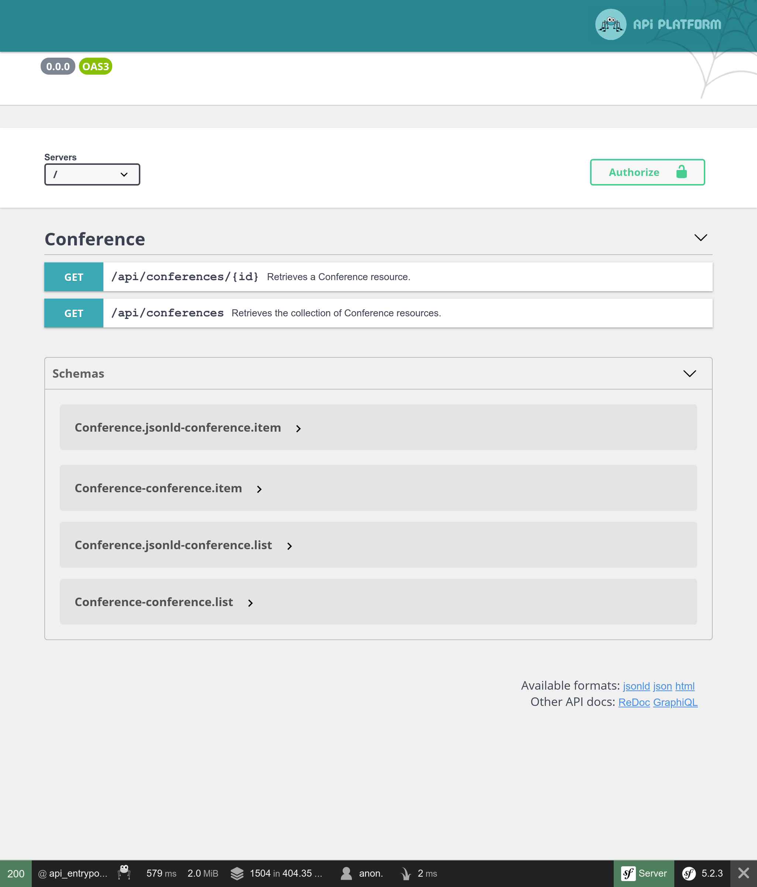

Exposing an API with API Platform 
================================= 
 
.. index:: 
    single: API 
    single: HTTP API 
    single: API Platform 
 
We have finished the implementation of the Guestbook website. To allow more usage of the data, what about exposing an API now? An API could be used by a mobile application to display all conferences, their comments, and maybe let attendees submit comments. 
 
In this step, we are going to implement a read-only API. 
 
Installing API Platform 
----------------------- 
 
Exposing an API by writing some code is possible, but if we want to use standards, we'd better use a solution that already takes care of the heavy lifting. A solution like API Platform: 
 
.. code-block:: bash 
 
    $ symfony composer req api 
 
Exposing an API for Conferences 
------------------------------- 
 
.. index:: 
    single: Annotations;@ApiResource 
    single: Annotations;Groups 
 
A few annotations on the Conference class is all we need to configure the API: 
 
.. code-block:: diff 
    :caption: patch_file 
 
    --- a/src/Entity/Conference.php 
    +++ b/src/Entity/Conference.php 
    @@ -2,16 +2,25 @@ 
 
     namespace App\Entity; 
 
    +use ApiPlatform\Core\Annotation\ApiResource; 
     use App\Repository\ConferenceRepository; 
     use Doctrine\Common\Collections\ArrayCollection; 
     use Doctrine\Common\Collections\Collection; 
     use Doctrine\ORM\Mapping as ORM; 
     use Symfony\Bridge\Doctrine\Validator\Constraints\UniqueEntity; 
    +use Symfony\Component\Serializer\Annotation\Groups; 
     use Symfony\Component\String\Slugger\SluggerInterface; 
 
     /** 
      * @ORM\Entity(repositoryClass=ConferenceRepository::class) 
      * @UniqueEntity("slug") 
    + * 
    + * @ApiResource( 
    + *     collectionOperations={"get"={"normalization_context"={"groups"="conference:list"}}}, 
    + *     itemOperations={"get"={"normalization_context"={"groups"="conference:item"}}}, 
    + *     order={"year"="DESC", "city"="ASC"}, 
    + *     paginationEnabled=false 
    + * ) 
      */ 
     class Conference 
     { 
    @@ -20,21 +29,25 @@ class Conference 
          * @ORM\GeneratedValue 
          * @ORM\Column(type="integer") 
          */ 
    +    #[Groups(['conference:list', 'conference:item'])] 
         private $id; 
 
         /** 
          * @ORM\Column(type="string", length=255) 
          */ 
    +    #[Groups(['conference:list', 'conference:item'])] 
         private $city; 
 
         /** 
          * @ORM\Column(type="string", length=4) 
          */ 
    +    #[Groups(['conference:list', 'conference:item'])] 
         private $year; 
 
         /** 
          * @ORM\Column(type="boolean") 
          */ 
    +    #[Groups(['conference:list', 'conference:item'])] 
         private $isInternational; 
 
         /** 
    @@ -45,6 +58,7 @@ class Conference 
         /** 
          * @ORM\Column(type="string", length=255, unique=true) 
          */ 
    +    #[Groups(['conference:list', 'conference:item'])] 
         private $slug; 
 
         public function __construct() 
 
The main ``@ApiResource`` annotation configures the API for conferences. It restricts possible operations to ``get`` and configures various things: like which fields to display and how to order the conferences. 
 
By default, the main entry point for the API is ``/api`` thanks to configuration from ``config/routes/api_platform.yaml`` that was added by the package's recipe. 
 
A web interface allows you to interact with the API: 
 

 
Use it to test the various possibilities: 
 
.. figure:: screenshots/api-conferences.png 
    :alt: /api 
    :align: center 
    :figclass: with-browser 
 
Imagine the time it would take to implement all of this from scratch! 
 
Exposing an API for Comments 
---------------------------- 
 
.. index:: 
    single: Annotations;@ApiResource 
    single: Annotations;@ApiFilter 
    single: Annotations;Groups 
 
Do the same for comments: 
 
.. code-block:: diff 
    :caption: patch_file 
 
    --- a/src/Entity/Comment.php 
    +++ b/src/Entity/Comment.php 
    @@ -2,13 +2,26 @@ 
 
     namespace App\Entity; 
 
    +use ApiPlatform\Core\Annotation\ApiFilter; 
    +use ApiPlatform\Core\Annotation\ApiResource; 
    +use ApiPlatform\Core\Bridge\Doctrine\Orm\Filter\SearchFilter; 
     use App\Repository\CommentRepository; 
     use Doctrine\ORM\Mapping as ORM; 
    +use Symfony\Component\Serializer\Annotation\Groups; 
     use Symfony\Component\Validator\Constraints as Assert; 
 
     /** 
      * @ORM\Entity(repositoryClass=CommentRepository::class) 
      * @ORM\HasLifecycleCallbacks() 
    + * 
    + * @ApiResource( 
    + *     collectionOperations={"get"={"normalization_context"={"groups"="comment:list"}}}, 
    + *     itemOperations={"get"={"normalization_context"={"groups"="comment:item"}}}, 
    + *     order={"createdAt"="DESC"}, 
    + *     paginationEnabled=false 
    + * ) 
    + * 
    + * @ApiFilter(SearchFilter::class, properties={"conference": "exact"}) 
      */ 
     class Comment 
     { 
    @@ -17,18 +30,21 @@ class Comment 
          * @ORM\GeneratedValue 
          * @ORM\Column(type="integer") 
          */ 
    +    #[Groups(['comment:list', 'comment:item'])] 
         private $id; 
 
         /** 
          * @ORM\Column(type="string", length=255) 
          */ 
         #[Assert\NotBlank] 
    +    #[Groups(['comment:list', 'comment:item'])] 
         private $author; 
 
         /** 
          * @ORM\Column(type="text") 
          */ 
         #[Assert\NotBlank] 
    +    #[Groups(['comment:list', 'comment:item'])] 
         private $text; 
 
         /** 
    @@ -36,22 +52,26 @@ class Comment 
          */ 
         #[Assert\NotBlank] 
         #[Assert\Email] 
    +    #[Groups(['comment:list', 'comment:item'])] 
         private $email; 
 
         /** 
          * @ORM\Column(type="datetime") 
          */ 
    +    #[Groups(['comment:list', 'comment:item'])] 
         private $createdAt; 
 
         /** 
          * @ORM\ManyToOne(targetEntity=Conference::class, inversedBy="comments") 
          * @ORM\JoinColumn(nullable=false) 
          */ 
    +    #[Groups(['comment:list', 'comment:item'])] 
         private $conference; 
 
         /** 
          * @ORM\Column(type="string", length=255, nullable=true) 
          */ 
    +    #[Groups(['comment:list', 'comment:item'])] 
         private $photoFilename; 
 
         /** 
 
The same kind of annotations are used to configure the class. 
 
Restricting Comments exposed by the API 
--------------------------------------- 
 
By default, API Platform exposes all entries from the database. But for comments, only the published ones should be part of the API. 
 
When you need to restrict the items returned by the API, create a service that implements ``QueryCollectionExtensionInterface`` to control the Doctrine query used for collections and/or ``QueryItemExtensionInterface`` to control items: 
 
.. code-block:: php 
    :caption: src/Api/FilterPublishedCommentQueryExtension.php 
    :emphasize-lines: 13-15,20-22 
 
    namespace App\Api; 
 
    use ApiPlatform\Core\Bridge\Doctrine\Orm\Extension\QueryCollectionExtensionInterface; 
    use ApiPlatform\Core\Bridge\Doctrine\Orm\Extension\QueryItemExtensionInterface; 
    use ApiPlatform\Core\Bridge\Doctrine\Orm\Util\QueryNameGeneratorInterface; 
    use App\Entity\Comment; 
    use Doctrine\ORM\QueryBuilder; 
 
    class FilterPublishedCommentQueryExtension implements QueryCollectionExtensionInterface, QueryItemExtensionInterface 
    { 
        public function applyToCollection(QueryBuilder $qb, QueryNameGeneratorInterface $queryNameGenerator, string $resourceClass, string $operationName = null) 
        { 
            if (Comment::class === $resourceClass) { 
                $qb->andWhere(sprintf("%s.state = 'published'", $qb->getRootAliases()[0])); 
            } 
        } 
 
        public function applyToItem(QueryBuilder $qb, QueryNameGeneratorInterface $queryNameGenerator, string $resourceClass, array $identifiers, string $operationName = null, array $context = []) 
        { 
            if (Comment::class === $resourceClass) { 
                $qb->andWhere(sprintf("%s.state = 'published'", $qb->getRootAliases()[0])); 
            } 
        } 
    } 
 
The query extension class applies its logic only for the ``Comment`` resource and modify the Doctrine query builder to only consider comments in the ``published`` state. 
 
Configuring CORS 
---------------- 
 
.. index:: 
    single: CORS 
    single: Cross-Origin Resource Sharing 
 
By default, the same-origin security policy of modern HTTP clients make calling the API from another domain forbidden. The CORS bundle, installed as part of ``composer req api``, sends Cross-Origin Resource Sharing headers based on the ``CORS_ALLOW_ORIGIN`` environment variable. 
 
By default, its value, defined in ``.env``, allows HTTP requests from ``localhost`` and ``127.0.0.1`` on any port. That's exactly what we need as for the next step as we will create an SPA that will have its own web server that will call the API. 
 
.. sidebar:: Going Further 
 
    * `SymfonyCasts API Platform tutorial <https://symfonycasts.com/screencast/api-platform>`_; 
 
    * To enable the GraphQL support, run ``composer require webonyx/graphql-php``, then browse to ``/api/graphql``. 
