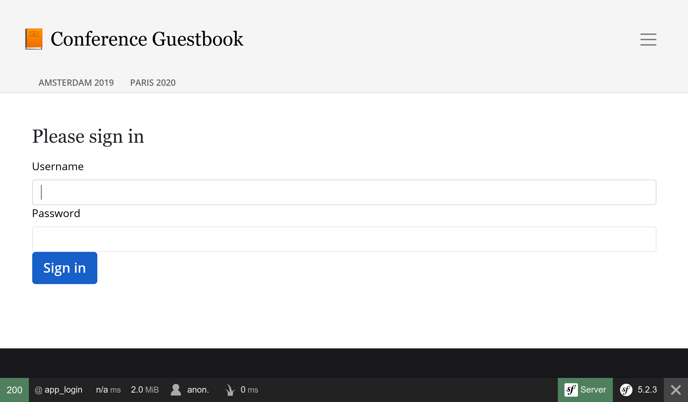

Dando estilos a la interfaz de usuario con Webpack
==================================================

.. index::
    single: Encore
    single: Webpack
    single: Components;Encore
    single: Stylesheet

No hemos dedicado tiempo al diseño de la interfaz de usuario. Para dar estilos como un profesional, usaremos un stack moderno, basado en `Webpack <https://webpack.js.org/>`_. Y para añadir un toque Symfony y facilitar su integración con la aplicación, instalaremos *Webpack Encore*:

.. code-block:: bash

    $ symfony composer req encore

Se ha creado un entorno Webpack completo: se han generado los ficheros ``package.json`` y ``webpack.config.js`` que contienen una configuración por defecto adecuada. Si abres ``webpack.config.js``, verás que hace uso de la abstracción *Encore* para configurar Webpack.

El  archivo``package.json`` define algunos comandos que usaremos continuamente.

El directorio``assets`` contiene los puntos de entrada principales para los recursos del proyecto: ``styles/app.css`` y ``app.js``.

Usando Sass
-----------

.. index::
    single: Sass

En lugar de usar CSS plano, vamos a cambiar a `Sass <https://sass-lang.com/>`_:

.. code-block:: bash

    $ mv assets/styles/app.css assets/styles/app.scss

.. code-block:: diff
    :caption: patch_file

    --- a/assets/app.js
    +++ b/assets/app.js
    @@ -6,7 +6,7 @@
      */

     // any CSS you import will output into a single css file (app.css in this case)
    -import './styles/app.css';
    +import './styles/app.scss';

     // start the Stimulus application
     import './bootstrap';

Instala el cargador de Sass:

.. code-block:: bash

    $ yarn add node-sass sass-loader --dev

Y habilita el cargador Sass (*Sass loader*) en webpack:

.. code-block:: diff
    :caption: patch_file

    --- a/webpack.config.js
    +++ b/webpack.config.js
    @@ -56,7 +56,7 @@ Encore
         })

         // enables Sass/SCSS support
    -    //.enableSassLoader()
    +    .enableSassLoader()

         // uncomment if you use TypeScript
         //.enableTypeScriptLoader()

¿Cómo sabía qué paquetes hay que instalar? Si hubiésemos intentado procesar nuestros recursos sin instalar esos paquetes, Encore nos habría dado un precioso mensaje de error sugiriéndonos la ejecución del comando ``yarn add`` necesario para instalar las dependencias que permiten cargar los tipos de archivos``.scss``.

Añadiendo Bootstrap
--------------------

.. index::
    single: Bootstrap

Si queremos partir de unos buenos cimientos a la hora de construir un sitio web adaptativo, puede ser muy útil la utilización de un *framework* CSS tal como `Bootstrap <https://getbootstrap.com/>`_. Instálalo como un paquete:

.. code-block:: bash

    $ yarn add bootstrap@4 jquery popper.js bs-custom-file-input --dev

Incluye Bootstrap en el archivo CSS (también hemos limpiado el contenido del archivo):

.. code-block:: diff
    :caption: patch_file

    --- a/assets/styles/app.scss
    +++ b/assets/styles/app.scss
    @@ -1,3 +1 @@
    -body {
    -    background-color: lightgray;
    -}
    +@import '~bootstrap/scss/bootstrap';

Haz lo mismo con el archivo JS:

.. code-block:: diff
    :caption: patch_file

    --- a/assets/app.js
    +++ b/assets/app.js
    @@ -7,6 +7,10 @@

     // any CSS you import will output into a single css file (app.css in this case)
     import './styles/app.scss';
    +import 'bootstrap';
    +import bsCustomFileInput from 'bs-custom-file-input';

     // start the Stimulus application
     import './bootstrap';
    +
    +bsCustomFileInput.init();

El sistema de formularios de Symfony dispone de soporte para Bootstrap de forma nativa a través de un tema especial, habilítalo:

.. code-block:: yaml
    :caption: config/packages/twig.yaml

    twig:
        form_themes: ['bootstrap_4_layout.html.twig']

Dando estilo al HTML
--------------------

Ahora estamos listos para dar estilo a la aplicación. Descarga y descomprime el archivo en la raíz del proyecto:

.. code-block:: bash

    $ php -r "copy('https://symfony.com/uploads/assets/guestbook-5.2.zip', 'guestbook-5.2.zip');"
    $ unzip -o guestbook-5.2.zip
    $ rm guestbook-5.2.zip

Echa un ojo a las plantillas, puedes aprender un par de trucos sobre Twig.

Construyendo los *assets*
-------------------------

.. index::
    single: Symfony CLI;run

Un cambio importante al usar Webpack es que los archivos CSS y JS no se utilizan directamente por la aplicación. Primero necesitan ser "compilados".

Durante el desarrollo, la compilación de los *assets* se puede hacer a través del comando ``encore dev``:

.. code-block:: bash

    $ symfony run yarn encore dev

En lugar de ejecutar el comando cada vez que haya un cambio, déjalo corriendo en segundo plano para que reaccione a los cambios en JS y CSS:

.. code-block:: bash
    :class: ignore

    $ symfony run -d yarn encore dev --watch

Tómate tu tiempo para observar los cambios visuales. Echa un vistazo al nuevo diseño en un navegador.

.. figure:: screenshots/design-homepage.png
    :alt: /
    :align: center
    :figclass: with-browser

.. figure:: screenshots/design-conference.png
    :alt: /conference/amsterdam-2019
    :align: center
    :figclass: with-browser

El formulario de inicio de sesión generado tiene ahora estilo ya que el bundle Maker utiliza clases CSS Bootstrap de forma predeterminada:

Para producción, SymfonyCloud detecta automáticamente si se está utilizando Encore y compila los *assets* durante la fase de compilación.

.. sidebar:: Yendo más allá

    * `Documentación de Webpack <https://webpack.js.org/concepts/>`_;

    * `Documentación de Symfony Webpack Encore <https://symfony.com/doc/current/frontend.html>`_;

    * `Tutorial de Webpack Encore en SymfonyCasts <https://symfonycasts.com/screencast/webpack-encore>`_.
