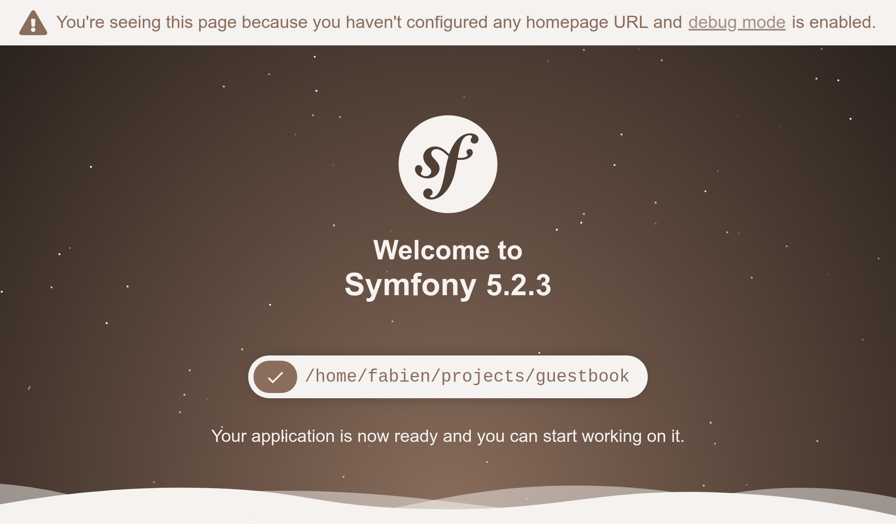

Desde cero hasta producción
===========================

Me gusta ir rápido. Quiero que nuestro pequeño proyecto vea la luz lo más rápido posible. Así como... ¡ahora mismo! En producción. Como aún no hemos desarrollado nada, empezaremos por desplegar una página "En construcción" agradable y sencilla. ¡Te encantará!

Pasé algo de tiempo tratando de encontrar en Internet un GIF animado chapado a la antigua y que fuera ideal para informar que estamos "En Construcción". Aquí está `el que <http://clipartmag.com/images/website-under-construction-image-6.gif>`_ voy a usar:

.. image:: images/under-construction.gif
    :align: center

Te lo dije, va a ser muy divertido.

Inicializando el Proyecto
-------------------------

Crea un nuevo proyecto Symfony con el comando ``symfony`` que instalamos previamente juntos:

.. code-block:: bash

    $ symfony new guestbook --version=5.2
    $ cd guestbook

Este comando es una pequeña abstracción sobre ``Composer`` que hace más sencilla la creación de proyectos Symfony. Utiliza un `esqueleto de proyecto <https://github.com/symfony/skeleton>`_ que incluye las dependencias mínimas; los componentes de Symfony que se necesitan para casi cualquier proyecto: una herramienta de consola y la abstracción HTTP necesaria para crear aplicaciones Web.

Si echas un vistazo al repositorio GitHub para el esqueleto, notarás que está casi vacío. Sólo hay un archivo llamado ``composer.json``. Pero nuestro directorio ``guestbook`` está lleno de archivos. ¿Cómo es eso posible? La respuesta está en el paquete ``symfony/flex``. Symfony Flex es un *plugin* de Composer que se engancha al proceso de instalación. Cuando detecta un paquete para el que tiene una *receta*, la ejecuta.

El punto de entrada principal de una Receta Symfony es un archivo de manifiesto que describe las operaciones que se deben realizar para registrar automáticamente el paquete en una aplicación Symfony. Nunca tienes que leer un archivo README para instalar un paquete con Symfony. La automatización es una de las características principales de Symfony.

Como Git está instalado en nuestra máquina, ``symfony new`` también creó un repositorio Git por nosotros y añadió el primer *commit*.

Echa un vistazo a la estructura de directorio:

.. code-block:: text
    :class: ignore

    ├── bin/
    ├── composer.json
    ├── composer.lock
    ├── config/
    ├── public/
    ├── src/
    ├── symfony.lock
    ├── var/
    └── vendor/

El directorio ``bin/`` contiene el punto de entrada principal a los comandos que se introducen desde la línea de comandos: ``console``. Lo vas a usar todo el tiempo.

El directorio ``config/`` está formado por un conjunto de archivos 
de configuración con valores predeterminados cuidadosamente elegidos. Un archivo por cada paquete. Apenas tendrás que cambiarlos, ya que confiar en los valores predeterminados es, casi siempre, una buena idea.

El directorio ``public/`` es el directorio raíz de la web, y el script ``index.php`` es el principal punto de entrada para todos los recursos HTTP dinámicos.

El directorio ``src/`` aloja todo el código que escribirás; ahí es donde pasarás la mayor parte de tu tiempo. Por defecto, todas las clases bajo este directorio usan el espacio de nombres de PHP ``App``. Esa es tu casa. Tu código. Tu lógica de dominio. Symfony tiene muy poco que decir al respecto.

El directorio ``var/`` contiene cachés, logs y archivos generados en tiempo de ejecución por la aplicación. Puedes dejarlo así sin más. Este es el único directorio que necesita permisos de escritura en producción.

El directorio ``vendor/`` contiene todos los paquetes instalados por Composer, incluyendo el propio Symfony. Esta es nuestra arma secreta para ser más productivos. No reinventemos la rueda. Tendrás que depender de librerías existentes para hacer el trabajo pesado. El directorio es administrado por Composer. Nunca lo toques.

Esto es todo lo que necesitas saber por ahora.

Creando algunos Recursos Públicos
---------------------------------

Todo lo que está bajo ``public/`` es accesible a través de un navegador. Por ejemplo, si mueves tu archivo GIF animado (nómbralo ``under-construction.gif``) a un nuevo directorio ``public/images/``, éste estará disponible en la URL ``https://localhost/images/under-construction.gif``.

Descarga mi imagen GIF aquí:

.. code-block:: bash

    $ mkdir public/images/
    $ php -r "copy('http://clipartmag.com/images/website-under-construction-image-6.gif', 'public/images/under-construction.gif');"

Arrancando un servidor web local
--------------------------------

.. index::
    single: Symfony CLI;server:start

El comando ``symfony`` viene con un servidor web que está optimizado para el trabajo de desarrollo. No te sorprenderás si te digo que funciona bien con Symfony. Sin embargo, nunca lo uses en producción.

Desde el directorio del proyecto, arranca el servidor web en segundo plano (opción ``-d``):

.. code-block:: bash

    $ symfony server:start -d

El servidor se inició en el primer puerto disponible, empezando por el 8000. Como atajo, abre el sitio web en un navegador desde la interfaz de línea de comandos:

.. code-block:: bash
    :class: ignore

    $ symfony open:local

Debería abrirse tu navegador favorito con una nueva pestaña que muestre algo similar a lo siguiente:

.. tip::

    Para diagnosticar problemas, ejecuta ``symfony server:log``; este analiza los registros del servidor web, PHP y tu aplicación.

Navega hacia ``/images/under-construction.gif``.  ¿Se parece a esto?

.. figure:: screenshots/under-construction-web.png
    :alt: /images/under-construction.gif
    :align: center
    :figclass: with-browser

.. index::
    single: Git;add
    single: Git;commit

¿Satisfecho? Vamos a hacer un *commit* con nuestro trabajo:

.. code-block:: bash
    :class: ignore

    $ git add public/images
    $ git commit -m'Add the under construction image'

Añadiendo un favicon
--------------------

Para evitar ser "spameados" con errores HTTP 404 en los logs debido a la falta de un favicon solicitado por los navegadores, agreguemos uno ahora:

.. code-block:: bash

    $ php -r "copy('https://symfony.com/favicon.ico', 'public/favicon.ico');"
    $ git add public/
    $ git commit -m'Add a favicon'

Preparando para producción
--------------------------

.. index::
    single: SymfonyCloud;Initialization

¿Y qué ocurre con el paso de nuestro trabajo a producción? Lo sé, ni siquiera tenemos una página HTML adecuada para dar la bienvenida a nuestros usuarios. Pero poder ver la pequeña imagen "en construcción" en un servidor de producción sería un muy buen paso. Y ya conoces el lema: *despliega temprano y a menudo*.

Puedes alojar esta aplicación en cualquier proveedor que soporte PHP... lo que significa que podrás hacerlo en casi todos los proveedores de alojamiento existentes. Aún así, ten en cuenta lo siguiente: queremos la última versión de PHP y la posibilidad de alojar servicios como una base de datos, una cola de mensajes y otros más.

He hecho mi elección, va a ser `SymfonyCloud <https://symfony.com/cloud>`_. Proporciona todo lo que necesitamos y ayuda a financiar el desarrollo de Symfony.

.. index::
    single: Symfony CLI;project:init

El comando ``symfony`` trae soporte integrado para SymfonyCloud. Vamos a inicializar un proyecto en SymfonyCloud:

.. code-block:: bash

    $ symfony project:init

Este comando crea algunos archivos necesarios para SymfonyCloud, tales como ``.symfony/services.yaml``, ``.symfony/routes.yaml`` y ``.symfony.cloud.yaml``.

Añádelos a Git e inclúyelos en un *commit*:

.. code-block:: bash

    $ git add .
    $ git commit -m"Add SymfonyCloud configuration"

.. note::

    Usar el genérico y peligroso ``git add .`` funciona correctamente ya que se ha generado un archivo ``.gitignore`` que excluye automáticamente todos los archivos a los que no queremos hacer *commit*.

Pasando a producción
--------------------

.. index::
    single: Symfony CLI;project:create
    single: Symfony CLI;deploy

¿Hora de desplegar?

Crear un nuevo proyecto SymfonyCloud:

.. code-block:: bash

    $ symfony project:create --title="Guestbook" --plan=development

Este comando hace muchas cosas:

* La primera vez que ejecutes este comando, autentifícate con tus credenciales de SymfonyConnect si no lo has hecho previamente.

* Proporciona un nuevo proyecto en SymfonyCloud (tienes 7 días *gratis* en cualquier nuevo proyecto de desarrollo).

Luego, despliega:

.. code-block:: bash

    $ symfony deploy

El código se despliega al hacer un *push* del repositorio Git. Al finalizar el comando, el proyecto tendrá un nombre de dominio específico que puedes utilizar para acceder a él.

.. index::
    single: Symfony CLI;open:remote

Comprueba que todo ha funcionado bien:

.. code-block:: bash
    :class: ignore

    $ symfony open:remote

Deberías obtener un error 404, pero yendo a ``/images/under-construction.gif`` por fin encontraremos nuestra imagen.

Ten en cuenta que no obtendrás la hermosa página predeterminada de Symfony en SymfonyCloud. ¿Por qué? Pronto aprenderás que Symfony soporta varios entornos y que SymfonyCloud desplegó automáticamente el código en el entorno de producción.

.. index::
    single: Symfony CLI;project:delete

.. tip::

    Si deseas eliminar el proyecto en SymfonyCloud, utiliza el comando ``project:delete``.

.. sidebar:: Yendo más allá

    * El `Symfony Recipes Server <https://flex.symfony.com/>`_ , donde puedes encontrar todas las recetas disponibles para tus aplicaciones Symfony;

    * Los repositorios de las `recetas oficiales de Symfony <https://github.com/symfony/recipes>`_ y de las `recetas aportadas por la comunidad <https://github.com/symfony/recipes-contrib>`_ , donde puedes enviar tus propias recetas;

    * El `Servidor Web Local de Symfony <https://symfony.com/doc/current/setup/symfony_server.html>`_;

    * La `documentación de SymfonyCloud <https://symfony.com/doc/cloud>`_.
