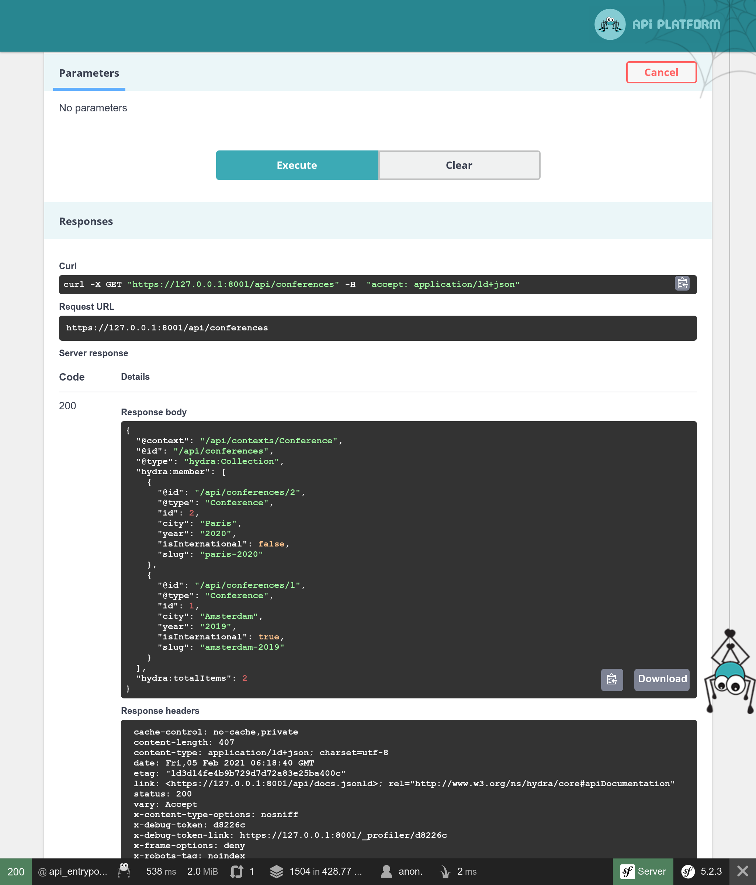

Exposer une API avec API Platform
=================================

.. index::
    single: API
    single: HTTP API
    single: API Platform

Nous avons terminé la réalisation du site web du livre d'or. Maintenant, pour faciliter l'accès aux données, que diriez-vous d'exposer une API ? Une API pourrait être utilisée par une application mobile pour afficher toutes les conférences, leurs commentaires, et peut-être permettre la soumission de commentaires.

Dans cette étape, nous allons implémenter une API en lecture seule.

Installer API Platform
----------------------

Exposer une API en écrivant du code est possible, mais si nous voulons utiliser des standards, nous ferions mieux d'utiliser une solution qui prend déjà en charge le gros du travail. Une solution comme API Platform :

.. code-block:: bash

    $ symfony composer req api

Exposer une API pour les conférences
-------------------------------------

.. index::
    single: Annotations;@ApiResource
    single: Annotations;Groups

Quelques annotations sur la classe Conference suffisent pour configurer l'API :

.. code-block:: diff
    :caption: patch_file

    --- a/src/Entity/Conference.php
    +++ b/src/Entity/Conference.php
    @@ -2,16 +2,25 @@

     namespace App\Entity;

    +use ApiPlatform\Core\Annotation\ApiResource;
     use App\Repository\ConferenceRepository;
     use Doctrine\Common\Collections\ArrayCollection;
     use Doctrine\Common\Collections\Collection;
     use Doctrine\ORM\Mapping as ORM;
     use Symfony\Bridge\Doctrine\Validator\Constraints\UniqueEntity;
    +use Symfony\Component\Serializer\Annotation\Groups;
     use Symfony\Component\String\Slugger\SluggerInterface;

     /**
      * @ORM\Entity(repositoryClass=ConferenceRepository::class)
      * @UniqueEntity("slug")
    + *
    + * @ApiResource(
    + *     collectionOperations={"get"={"normalization_context"={"groups"="conference:list"}}},
    + *     itemOperations={"get"={"normalization_context"={"groups"="conference:item"}}},
    + *     order={"year"="DESC", "city"="ASC"},
    + *     paginationEnabled=false
    + * )
      */
     class Conference
     {
    @@ -20,21 +29,25 @@ class Conference
          * @ORM\GeneratedValue
          * @ORM\Column(type="integer")
          */
    +    #[Groups(['conference:list', 'conference:item'])]
         private $id;

         /**
          * @ORM\Column(type="string", length=255)
          */
    +    #[Groups(['conference:list', 'conference:item'])]
         private $city;

         /**
          * @ORM\Column(type="string", length=4)
          */
    +    #[Groups(['conference:list', 'conference:item'])]
         private $year;

         /**
          * @ORM\Column(type="boolean")
          */
    +    #[Groups(['conference:list', 'conference:item'])]
         private $isInternational;

         /**
    @@ -45,6 +58,7 @@ class Conference
         /**
          * @ORM\Column(type="string", length=255, unique=true)
          */
    +    #[Groups(['conference:list', 'conference:item'])]
         private $slug;

         public function __construct()

L'annotation principale ``@ApiResource`` configure l'API pour les conférences. Elle restreint les opérations possibles à ``get`` et configure différentes choses, comme par exemple, quels champs afficher et comment trier les conférences.

Par défaut, le point d'entrée principal de l'API est ``/api``. Cette configuration a été ajoutée dans ``config/routes/api_platform.yaml`` par la recette du paquet.

Une interface web vous permet d'interagir avec l'API :

.. figure:: screenshots/api.png
    :alt: /api
    :align: center
    :figclass: with-browser

Utilisez-la pour tester les différentes possibilités :

Imaginez le temps qu'il faudrait pour développer tout cela à partir de zéro !

Exposer une API pour les commentaires
-------------------------------------

.. index::
    single: Annotations;@ApiResource
    single: Annotations;@ApiFilter
    single: Annotations;Groups

Faites de même pour les commentaires :

.. code-block:: diff
    :caption: patch_file

    --- a/src/Entity/Comment.php
    +++ b/src/Entity/Comment.php
    @@ -2,13 +2,26 @@

     namespace App\Entity;

    +use ApiPlatform\Core\Annotation\ApiFilter;
    +use ApiPlatform\Core\Annotation\ApiResource;
    +use ApiPlatform\Core\Bridge\Doctrine\Orm\Filter\SearchFilter;
     use App\Repository\CommentRepository;
     use Doctrine\ORM\Mapping as ORM;
    +use Symfony\Component\Serializer\Annotation\Groups;
     use Symfony\Component\Validator\Constraints as Assert;

     /**
      * @ORM\Entity(repositoryClass=CommentRepository::class)
      * @ORM\HasLifecycleCallbacks()
    + *
    + * @ApiResource(
    + *     collectionOperations={"get"={"normalization_context"={"groups"="comment:list"}}},
    + *     itemOperations={"get"={"normalization_context"={"groups"="comment:item"}}},
    + *     order={"createdAt"="DESC"},
    + *     paginationEnabled=false
    + * )
    + *
    + * @ApiFilter(SearchFilter::class, properties={"conference": "exact"})
      */
     class Comment
     {
    @@ -17,18 +30,21 @@ class Comment
          * @ORM\GeneratedValue
          * @ORM\Column(type="integer")
          */
    +    #[Groups(['comment:list', 'comment:item'])]
         private $id;

         /**
          * @ORM\Column(type="string", length=255)
          */
         #[Assert\NotBlank]
    +    #[Groups(['comment:list', 'comment:item'])]
         private $author;

         /**
          * @ORM\Column(type="text")
          */
         #[Assert\NotBlank]
    +    #[Groups(['comment:list', 'comment:item'])]
         private $text;

         /**
    @@ -36,22 +52,26 @@ class Comment
          */
         #[Assert\NotBlank]
         #[Assert\Email]
    +    #[Groups(['comment:list', 'comment:item'])]
         private $email;

         /**
          * @ORM\Column(type="datetime")
          */
    +    #[Groups(['comment:list', 'comment:item'])]
         private $createdAt;

         /**
          * @ORM\ManyToOne(targetEntity=Conference::class, inversedBy="comments")
          * @ORM\JoinColumn(nullable=false)
          */
    +    #[Groups(['comment:list', 'comment:item'])]
         private $conference;

         /**
          * @ORM\Column(type="string", length=255, nullable=true)
          */
    +    #[Groups(['comment:list', 'comment:item'])]
         private $photoFilename;

         /**

Le même type d'annotations est utilisé pour configurer la classe.

Filtrer les commentaires exposés par l'API
-------------------------------------------

Par défaut, API Platform expose toutes les entrées de la base de données. Mais pour les commentaires, seuls ceux qui ont été publiés devraient apparaître dans l'API.

Lorsque vous avez besoin de filtrer les éléments retournés par l'API, créez un service qui implémente ``QueryCollectionExtensionInterface`` pour gérer la requête Doctrine utilisée pour les collections, et/ou ``QueryItemExtensionInterface`` pour gérer les éléments :

.. code-block:: php
    :caption: src/Api/FilterPublishedCommentQueryExtension.php
    :emphasize-lines: 13-15,20-22

    namespace App\Api;

    use ApiPlatform\Core\Bridge\Doctrine\Orm\Extension\QueryCollectionExtensionInterface;
    use ApiPlatform\Core\Bridge\Doctrine\Orm\Extension\QueryItemExtensionInterface;
    use ApiPlatform\Core\Bridge\Doctrine\Orm\Util\QueryNameGeneratorInterface;
    use App\Entity\Comment;
    use Doctrine\ORM\QueryBuilder;

    class FilterPublishedCommentQueryExtension implements QueryCollectionExtensionInterface, QueryItemExtensionInterface
    {
        public function applyToCollection(QueryBuilder $qb, QueryNameGeneratorInterface $queryNameGenerator, string $resourceClass, string $operationName = null)
        {
            if (Comment::class === $resourceClass) {
                $qb->andWhere(sprintf("%s.state = 'published'", $qb->getRootAliases()[0]));
            }
        }

        public function applyToItem(QueryBuilder $qb, QueryNameGeneratorInterface $queryNameGenerator, string $resourceClass, array $identifiers, string $operationName = null, array $context = [])
        {
            if (Comment::class === $resourceClass) {
                $qb->andWhere(sprintf("%s.state = 'published'", $qb->getRootAliases()[0]));
            }
        }
    }

La classe d'extension de requête n'applique sa logique que pour la ressource ``Comment`` et modifie le query builder Doctrine pour ne considérer que les commentaires dans l'état ``published``.

Configurer le CORS
------------------

.. index::
    single: CORS
    single: Cross-Origin Resource Sharing

Par défaut, la politique de sécurité de même origine des clients HTTP modernes interdit d'appeler l'API depuis un autre domaine. Le paquet CORS, installé par défaut avec ``composer req api``, envoie des en-têtes de *Cross-Origin Resource Sharing* en fonction de la variable d'environnement ``CORS_ALLOW_ORIGIN``.

Par défaut, sa valeur, définie par le fichier ``.env``, autorise les requêtes HTTP depuis ``localhost`` et ``127.0.0.1`` sur n'importe quel port. C'est exactement ce dont nous avons besoin pour la prochaine étape, car nous allons créer une SPA qui aura son propre serveur web et qui appellera l'API.

.. sidebar:: Aller plus loin

    * `Tutoriel SymfonyCasts sur API Platform  <https://symfonycasts.com/screencast/api-platform>`_ ;

    * Pour activer la prise en charge de GraphQL, exécutez ``composer require webonyx/graphql-php``, puis accédez à ``/api/graphql``.
