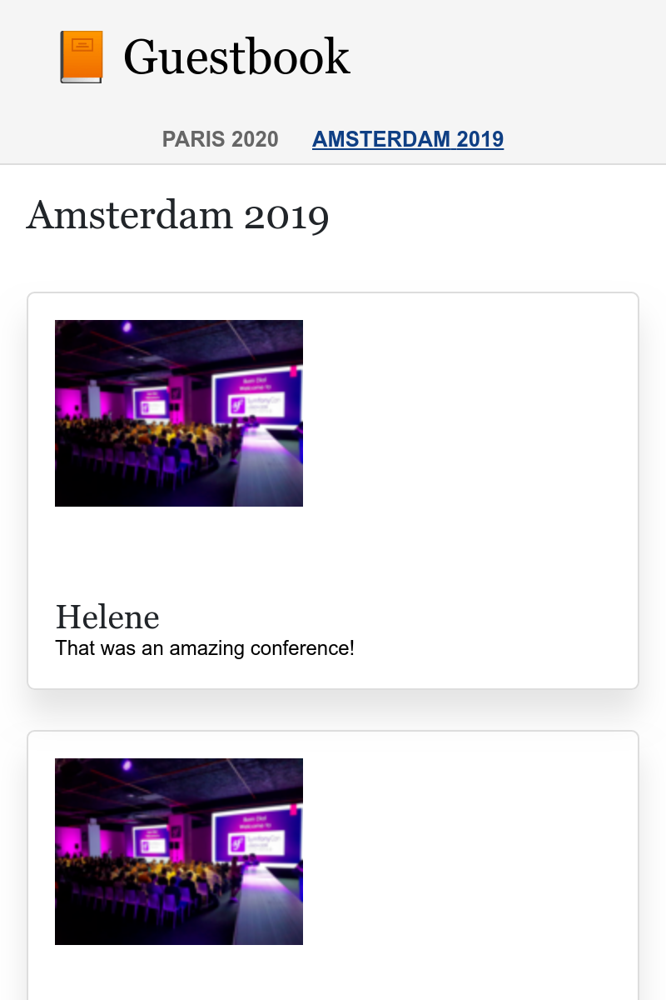

Créer une SPA (Single Page Application)
========================================

.. index::
    single: SPA
    single: Mobile

Most of the comments will be submitted during the conference where some people
do not bring a laptop. But they probably have a smartphone. What about creating
a mobile app to quickly check the conference comments?

One way to create such a mobile application is to build a Javascript Single
Page Application (SPA). An SPA runs locally, can use local storage, can call a
remote HTTP API, and can leverage service workers to create an almost native
experience.

Créer l'application
--------------------

To create the mobile application, we are going to use `Preact`_ and **Symfony
Encore**. **Preact** is a small and efficient foundation well-suited for the
Guestbook SPA.

To make both the website and the SPA consistent, we are going to reuse the Sass
stylesheets of the website for the mobile application.

Create the SPA application under the ``spa`` directory and copy the
website stylesheets:

.. code-block:: bash

    $ mkdir -p spa/src spa/public spa/assets/styles
    $ cp assets/styles/*.scss spa/assets/styles/
    $ cd spa

.. note::

    We have created a ``public`` directory as we will mainly interact with the
    SPA via a browser. We could have named it ``build`` if we only wanted to
    build a mobile application.

Pour bien faire les choses, créez un fichier ``.gitignore`` :

.. code-block:: text
    :caption: .gitignore

    /node_modules/
    /public/
    /npm-debug.log
    /yarn-error.log
    # used later by Cordova
    /app/

Initialize the ``package.json`` file (equivalent of the ``composer.json``
file for JavaScript):

.. code-block:: bash

    $ yarn init -y

Maintenant, ajoutez quelques dépendances requises :

.. code-block:: bash

    $ yarn add @symfony/webpack-encore @babel/core @babel/preset-env babel-preset-preact preact html-webpack-plugin bootstrap

La dernière étape de configuration consiste à créer la configuration Webpack Encore :

.. code-block:: javascript
    :caption: webpack.config.js
    :emphasize-lines: 8,11

    const Encore = require('@symfony/webpack-encore');
    const HtmlWebpackPlugin = require('html-webpack-plugin');

    Encore
        .setOutputPath('public/')
        .setPublicPath('/')
        .cleanupOutputBeforeBuild()
        .addEntry('app', './src/app.js')
        .enablePreactPreset()
        .enableSingleRuntimeChunk()
        .addPlugin(new HtmlWebpackPlugin({ template: 'src/index.ejs', alwaysWriteToDisk: true }))
    ;

    module.exports = Encore.getWebpackConfig();

Créer le template principal de la SPA
--------------------------------------

Time to create the initial template in which Preact will render the
application:

.. code-block:: html
    :caption: src/index.ejs
    :emphasize-lines: 12

    <!DOCTYPE html>
    <html>
    <head>
        <meta http-equiv="Content-Type" content="text/html; charset=utf-8" />
        <meta http-equiv="X-UA-Compatible" content="IE=edge" />
        <meta name="msapplication-tap-highlight" content="no" />
        <meta name="viewport" content="user-scalable=no, initial-scale=1, maximum-scale=1, minimum-scale=1, width=device-width" />

        <title>Conference Guestbook application</title>
    </head>
    <body>
        

    </body>
    </html>

The ``
`` tag is where the application will be rendered by JavaScript. Here
is the first version of the code that renders the "Hello World" view:

.. code-block:: text
    :caption: src/app.js
    :emphasize-lines: 3,11

    import {h, render} from 'preact';

    function App() {
        return (
            

                Hello world!
            

        )
    }

    render(<App />, document.getElementById('app'));

The last line registers the ``App()`` function on the ``#app`` element of the
HTML page.

Maintenant, tout est prêt !

Exécuter la SPA dans le navigateur web
---------------------------------------

.. index::
    single: Symfony CLI;server:start
    single: Symfony CLI;server:stop

As this application is independent of the main website, we need to run another
web server:

.. code-block:: bash
    :class: hide

    $ symfony server:stop

.. code-block:: bash

    $ symfony server:start -d --passthru=index.html

The ``--passthru`` flag tells the web server to pass all HTTP requests to the
``public/index.html`` file (``public/`` is the web server default web root
directory). This page is managed by the Preact application and it gets the page
to render via the "browser" history.

Pour compiler les fichiers CSS **et JavaScript**, exécutez ``yarn`` :

.. code-block:: bash

    $ yarn encore dev

Ouvrez la SPA dans un navigateur :

.. code-block:: bash
    :class: ignore

    $ symfony open:local

Et contemplez notre SPA hello world :

.. figure:: screenshots/spa.png
    :alt: /
    :align: center
    :figclass: with-browser spa

Ajouter un routeur pour gérer les états
-----------------------------------------

The SPA is currently not able to handle different pages. To implement several
pages, we need a router, like for Symfony. We are going to use
**preact-router**. It takes a URL as an input and matches a Preact component to
display.

Installez preact-router :

.. code-block:: bash

    $ yarn add preact-router

Créez une page pour l'accueil (un *composant Preact*) :

.. code-block:: text
    :caption: src/pages/home.js

    import {h} from 'preact';

    export default function Home() {
        return (
            
Home

        );
    };

Et une autre pour la page d'une conférence :

.. code-block:: text
    :caption: src/pages/conference.js

    import {h} from 'preact';

    export default function Conference() {
        return (
            
Conference

        );
    };

Remplacez le ``div`` "Hello World" par le composant ``Router`` :

.. code-block:: diff
    :caption: patch_file
    :emphasize-lines: 15,17,20-23

    --- a/src/app.js
    +++ b/src/app.js
    @@ -1,9 +1,22 @@
     import {h, render} from 'preact';
    +import {Router, Link} from 'preact-router';
    +
    +import Home from './pages/home';
    +import Conference from './pages/conference';

     function App() {
         return (
             

    -            Hello world!
    +            <header>
    +                <Link href="/">Home</Link>
    +                 
    +                <Link href="/conference/amsterdam2019">Amsterdam 2019</Link>
    +            </header>
    +
    +            <Router>
    +                <Home path="/" />
    +                <Conference path="/conference/:slug" />
    +            </Router>
             

         )
     }

Rebuildez l'application :

.. code-block:: bash

    $ yarn encore dev

If you refresh the application in the browser, you can now click on the "Home"
and conference links. Note that the browser URL and the back/forward buttons of
your browser work as you would expect it.

Styliser la SPA
---------------

Comme pour le site web, ajoutons le loader Sass :

.. code-block:: bash

    $ yarn add node-sass sass-loader

Activez le loader Sass dans Webpack et ajoutez une référence à la feuille de style :

.. code-block:: diff
    :caption: patch_file

    --- a/src/app.js
    +++ b/src/app.js
    @@ -1,3 +1,5 @@
    +import '../assets/styles/app.scss';
    +
     import {h, render} from 'preact';
     import {Router, Link} from 'preact-router';

    --- a/webpack.config.js
    +++ b/webpack.config.js
    @@ -7,6 +7,7 @@ Encore
         .cleanupOutputBeforeBuild()
         .addEntry('app', './src/app.js')
         .enablePreactPreset()
    +    .enableSassLoader()
         .enableSingleRuntimeChunk()
         .addPlugin(new HtmlWebpackPlugin({ template: 'src/index.ejs', alwaysWriteToDisk: true }))
     ;

Nous pouvons désormais mettre à jour l'application pour utiliser les feuilles de style :

.. code-block:: diff
    :caption: patch_file

    --- a/src/app.js
    +++ b/src/app.js
    @@ -9,10 +9,20 @@ import Conference from './pages/conference';
     function App() {
         return (
             

    -            <header>
    -                <Link href="/">Home</Link>
    -                 
    -                <Link href="/conference/amsterdam2019">Amsterdam 2019</Link>
    +            <header className="header">
    +                <nav className="navbar navbar-light bg-light">
    +                    

    +                        <Link className="navbar-brand mr-4 pr-2" href="/">
    +                            &#128217; Guestbook
    +                        </Link>
    +                    

    +                </nav>
    +
    +                <nav className="bg-light border-bottom text-center">
    +                    <Link className="nav-conference" href="/conference/amsterdam2019">
    +                        Amsterdam 2019
    +                    </Link>
    +                </nav>
                 </header>

                 <Router>

Rebuildez encore l'application :

.. code-block:: bash

    $ yarn encore dev

Vous pouvez à présent profiter d'une SPA entièrement stylisée :

.. figure:: screenshots/spa-home.png
    :alt: /
    :align: center
    :figclass: with-browser spa

Récupérer les données depuis l'API
-------------------------------------

The Preact application structure is now finished: Preact Router handles the
page states - including the conference slug placeholder - and the main
application stylesheet is used to style the SPA.

Pour rendre la SPA dynamique, nous avons besoin de récupérer les données de l'API via des appels HTTP.

Configurez Webpack pour exposer la variable d'environnement contenant le point d'entrée de l'API :

.. code-block:: diff
    :caption: patch_file

    --- a/webpack.config.js
    +++ b/webpack.config.js
    @@ -1,3 +1,4 @@
    +const webpack = require('webpack');
     const Encore = require('@symfony/webpack-encore');
     const HtmlWebpackPlugin = require('html-webpack-plugin');

    @@ -10,6 +11,9 @@ Encore
         .enableSassLoader()
         .enableSingleRuntimeChunk()
         .addPlugin(new HtmlWebpackPlugin({ template: 'src/index.ejs', alwaysWriteToDisk: true }))
    +    .addPlugin(new webpack.DefinePlugin({
    +        'ENV_API_ENDPOINT': JSON.stringify(process.env.API_ENDPOINT),
    +    }))
     ;

     module.exports = Encore.getWebpackConfig();

The ``API_ENDPOINT`` environment variable should point to the web server of the
website where we have the API endpoint under ``/api``. We will configure it
properly when we will run ``yarn encore`` soon.

Créez un fichier ``api.js`` qui abstrait la récupération des données de l'API :

.. code-block:: text
    :caption: src/api/api.js

    function fetchCollection(path) {
        return fetch(ENV_API_ENDPOINT + path).then(resp => resp.json()).then(json => json['hydra:member']);
    }

    export function findConferences() {
        return fetchCollection('api/conferences');
    }

    export function findComments(conference) {
        return fetchCollection('api/comments?conference='+conference.id);
    }

Vous pouvez maintenant adapter l'en-tête et les composants de l'accueil :

.. code-block:: diff
    :caption: patch_file

    --- a/src/app.js
    +++ b/src/app.js
    @@ -2,11 +2,23 @@ import '../assets/styles/app.scss';

     import {h, render} from 'preact';
     import {Router, Link} from 'preact-router';
    +import {useState, useEffect} from 'preact/hooks';

    +import {findConferences} from './api/api';
     import Home from './pages/home';
     import Conference from './pages/conference';

     function App() {
    +    const [conferences, setConferences] = useState(null);
    +
    +    useEffect(() => {
    +        findConferences().then((conferences) => setConferences(conferences));
    +    }, []);
    +
    +    if (conferences === null) {
    +        return 
Loading...
;
    +    }
    +
         return (
             

                 <header className="header">
    @@ -19,15 +31,17 @@ function App() {
                     </nav>

                     <nav className="bg-light border-bottom text-center">
    -                    <Link className="nav-conference" href="/conference/amsterdam2019">
    -                        Amsterdam 2019
    -                    </Link>
    +                    {conferences.map((conference) => (
    +                        <Link className="nav-conference" href={'/conference/'+conference.slug}>
    +                            {conference.city} {conference.year}
    +                        </Link>
    +                    ))}
                     </nav>
                 </header>

                 <Router>
    -                <Home path="/" />
    -                <Conference path="/conference/:slug" />
    +                <Home path="/" conferences={conferences} />
    +                <Conference path="/conference/:slug" conferences={conferences} />
                 </Router>
             

         )
    --- a/src/pages/home.js
    +++ b/src/pages/home.js
    @@ -1,7 +1,28 @@
     import {h} from 'preact';
    +import {Link} from 'preact-router';
    +
    +export default function Home({conferences}) {
    +    if (!conferences) {
    +        return 
No conferences yet
;
    +    }

    -export default function Home() {
         return (
    -        
Home

    +        

    +            {conferences.map((conference)=> (
    +                

    +                    

    +                        

    +                            <h4 className="font-weight-light">
    +                                {conference.city} {conference.year}
    +                            </h4>
    +                        

    +
    +                        <Link className="btn btn-sm btn-blue stretched-link" href={'/conference/'+conference.slug}>
    +                            View
    +                        </Link>
    +                    

    +                

    +            ))}
    +        

         );
    -};
    +}

Finally, Preact Router is passing the "slug" placeholder to the Conference
component as a property. Use it to display the proper conference and its
comments, again using the API; and adapt the rendering to use the API data:

.. code-block:: diff
    :caption: patch_file

    --- a/src/pages/conference.js
    +++ b/src/pages/conference.js
    @@ -1,7 +1,48 @@
     import {h} from 'preact';
    +import {findComments} from '../api/api';
    +import {useState, useEffect} from 'preact/hooks';
    +
    +function Comment({comments}) {
    +    if (comments !== null && comments.length === 0) {
    +        return 
No comments yet
;
    +    }
    +
    +    if (!comments) {
    +        return 
Loading...
;
    +    }
    +
    +    return (
    +        

    +            {comments.map(comment => (
    +                

    +                    

    +                        {!comment.photoFilename ? '' : (
    +                            <a href={ENV_API_ENDPOINT+'uploads/photos/'+comment.photoFilename} target="_blank">
    +                                
    +                            </a>
    +                        )}
    +                    

    +
    +                    <h5 className="font-weight-light mt-3 mb-0">{comment.author}</h5>
    +                    
{comment.text}

    +                

    +            ))}
    +        

    +    );
    +}
    +
    +export default function Conference({conferences, slug}) {
    +    const conference = conferences.find(conference => conference.slug === slug);
    +    const [comments, setComments] = useState(null);
    +
    +    useEffect(() => {
    +        findComments(conference).then(comments => setComments(comments));
    +    }, [slug]);

    -export default function Conference() {
         return (
    -        
Conference

    +        

    +            <h4>{conference.city} {conference.year}</h4>
    +            <Comment comments={comments} />
    +        

         );
    -};
    +}

The SPA now needs to know the URL to our API, via the ``API_ENDPOINT``
environment variable. Set it to the API web server URL (running in the ``..``
directory):

.. code-block:: bash

    $ API_ENDPOINT=`symfony var:export SYMFONY_PROJECT_DEFAULT_ROUTE_URL --dir=..` yarn encore dev

Vous pourriez aussi exécuter maintenant en arrière-plan :

.. code-block:: bash

    $ API_ENDPOINT=`symfony var:export SYMFONY_PROJECT_DEFAULT_ROUTE_URL --dir=..` symfony run -d --watch=webpack.config.js yarn encore dev --watch

Et l'application devrait maintenant fonctionner correctement dans le navigateur :

.. figure:: screenshots/spa-home-final.png
    :alt: /
    :align: center
    :figclass: with-browser spa

Wow! We now have a fully-functional, SPA with router and real data. We could
organize the Preact app further if we want, but it is already working great.

Déployer la SPA en production
------------------------------

.. index::
    single: SymfonyCloud;Multi-Applications

SymfonyCloud allows to deploy multiple applications per project. Adding another
application can be done by creating a ``.symfony.cloud.yaml`` file in any
sub-directory. Create one under ``spa/`` named ``spa``:

.. code-block:: yaml
    :caption: .symfony.cloud.yaml
    :emphasize-lines: 1

    name: spa

    type: php:8.0
    size: S

    build:
        flavor: none

    web:
        commands:
            start: sleep
        locations:
            "/":
                root: "public"
                index:
                    - "index.html"
                scripts: false
                expires: 10m

    hooks:
        build: |
            set -x -e

            curl -s https://get.symfony.com/cloud/configurator | (>&2 bash)
            (>&2
                unset NPM_CONFIG_PREFIX
                export NVM_DIR=${SYMFONY_APP_DIR}/.nvm

                yarn-install

                set +x && . "${SYMFONY_APP_DIR}/.nvm/nvm.sh" && set -x

                yarn encore prod
            )

.. index::
    single: SymfonyCloud;Routes

Edit the ``.symfony/routes.yaml`` file to route the ``spa.`` subdomain to the
``spa`` application stored in the project root directory:

.. code-block:: bash

    $ cd ../

.. code-block:: diff
    :caption: patch_file
    :emphasize-lines: 4,5

    --- a/.symfony/routes.yaml
    +++ b/.symfony/routes.yaml
    @@ -1,2 +1,5 @@
    +"https://spa.{all}/": { type: upstream, upstream: "spa:http" }
    +"http://spa.{all}/": { type: redirect, to: "https://spa.{all}/" }
    +
     "https://{all}/": { type: upstream, upstream: "varnish:http", cache: { enabled: false } }
     "http://{all}/": { type: redirect, to: "https://{all}/" }

Configurer CORS pour la SPA
---------------------------

.. index::
    single: CORS
    single: Cross-Origin Resource Sharing

If you deploy the code now, it won't work as a browser would block the API
request. We need to explicitly allow the SPA to access the API. Get the current
domain name attached to your application:

.. code-block:: bash

    $ symfony env:urls --first

Définissez la variable d'environnement ``CORS_ALLOW_ORIGIN`` en conséquence :

.. code-block:: bash

    $ symfony var:set "CORS_ALLOW_ORIGIN=^`symfony env:urls --first | sed 's#/$##' | sed 's#https://#https://spa.#'`$"

If your domain is ``https://master-5szvwec-hzhac461b3a6o.eu.s5y.io/``, the
``sed`` calls will convert it to
``https://spa.master-5szvwec-hzhac461b3a6o.eu.s5y.io``.

Nous devons également définir la variable d'environnement ``API_ENDPOINT`` :

.. code-block:: bash

    $ symfony var:set API_ENDPOINT=`symfony env:urls --first`

Commitez et déployez :

.. code-block:: bash
    :class: ignore

    $ git add .
    $ git commit -a -m'Add the SPA application'
    $ symfony deploy

Accédez à la SPA dans un navigateur en spécifiant l'application comme option :

.. code-block:: bash
    :class: ignore

    $ symfony open:remote --app=spa

Utiliser Cordova pour construire une application mobile
-------------------------------------------------------

.. index::
    single: SPA;Cordova
    single: Apache Cordova
    single: Cordova

**Apache Cordova** is a tool that builds cross-platform smartphone
applications. And good news, it can use the SPA that we have just created.

Installons-le :

.. code-block:: bash

    $ cd spa
    $ yarn global add cordova

.. note::

    You also need to install the Android SDK. This section only mentions
    Android, but Cordova works with all mobile platforms, including iOS.

Créez la structure des répertoires de l'application :

.. code-block:: bash
    :class: answers(n)

    $ ~/.yarn/bin/cordova create app

Et générez l'application Android :

.. code-block:: bash
    :class: ignore

    $ cd app
    $ ~/.yarn/bin/cordova platform add android
    $ cd ..

That's all you need. You can now build the production files and move them to
Cordova:

.. code-block:: bash

    $ API_ENDPOINT=`symfony var:export SYMFONY_PROJECT_DEFAULT_ROUTE_URL --dir=..` yarn encore production
    $ rm -rf app/www
    $ mkdir -p app/www
    $ cp -R public/ app/www

Exécutez l'application sur un smartphone ou un émulateur :

.. code-block:: bash
    :class: ignore

    $ ~/.yarn/bin/cordova run android

.. sidebar:: Going Further

    * `The official Preact website <https://preactjs.com/>`_;

    * `The official Cordova website <https://cordova.apache.org/>`_.

.. _`preact`: https://preactjs.com/
