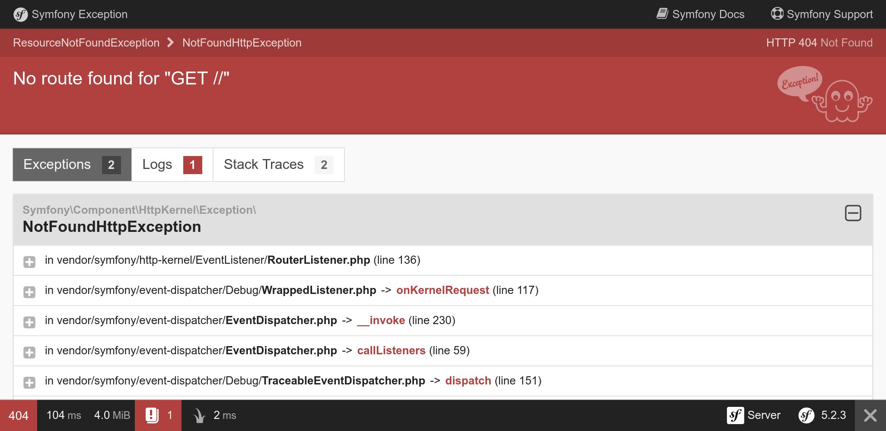
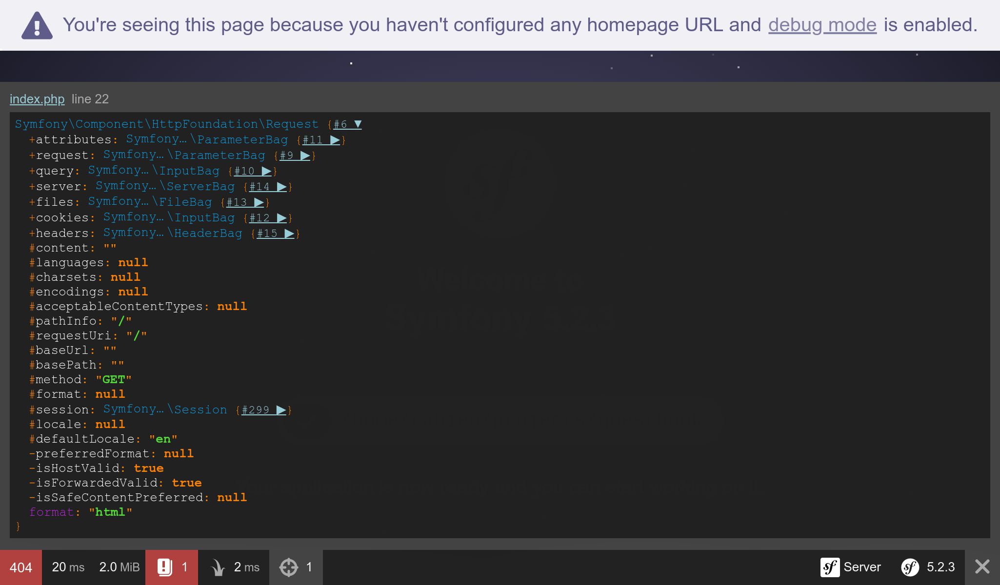

Diagnostiquer les problèmes
============================

Mettre en place un projet, c'est aussi avoir les bons outils pour déboguer les problèmes.

Installer des dépendances supplémentaires
-------------------------------------------

Remember that the project was created with very few dependencies. No template
engine. No debug tools. No logging system. The idea is that you can add more
dependencies whenever you need them. Why would you depend on a template engine
if you develop an HTTP API or a CLI tool?

How can we add more dependencies? Via Composer. Besides "regular" Composer
packages, we will work with two "special" kinds of packages:

* *Symfony Components*: Packages that implement core features and low level
  abstractions that most applications need (routing, console, HTTP client,
  mailer, cache, ...);

* *Symfony Bundles*: Packages that add high-level features or provide
  integrations with third-party libraries (bundles are mostly contributed by
  the community).

.. index::
    single: Components;Profiler
    single: Profiler
    single: Web Profiler
    single: Web Debug Toolbar

To begin with, let's add the Symfony Profiler, a time saver when you need to
find the root cause of a problem:

.. code-block:: bash

    $ symfony composer req profiler --dev

``profiler`` est un alias pour le paquet ``symfony/profiler-pack``.

*Aliases* are not a Composer feature, but a concept provided by Symfony to make
your life easier. Aliases are shortcuts for popular Composer packages. Want an
ORM for your application? Require ``orm``. Want to develop an API? Require
``api``. These aliases are automatically resolved to one or more regular
Composer packages. They are opinionated choices made by the Symfony core team.

Another neat feature is that you can always omit the ``symfony`` vendor.
Require ``cache`` instead of ``symfony/cache``.

.. tip::

    Do you remember that we mentioned a Composer plugin named ``symfony/flex``
    before? Aliases are one of its features.

Comprendre les environnements Symfony
-------------------------------------

.. index::
    single: Symfony Environments

Did you notice the ``--dev`` flag on the ``composer req`` command? As the
Symfony Profiler is only useful during development, we want to avoid it being
installed in production.

Symfony supports the notion of *environments*. By default, it has built-in
support for three, but you can add as many as you like: ``dev``, ``prod``, and
``test``. All environments share the same code, but they represent different
*configurations*.

For instance, all debugging tools are enabled in the ``dev`` environment. In
the ``prod`` one, the application is optimized for performance.

Switching from one environment to another can be done by changing the
``APP_ENV`` environment variable.

When you deployed to SymfonyCloud, the environment (stored in ``APP_ENV``) was
automatically switched to ``prod``.

Gérer la configuration des environnements
------------------------------------------

.. index::
    single: Environment Variables
    single: .env
    single: .env.local

``APP_ENV`` peut être défini en utilisant des variables d'environnement "réelles" depuis votre terminal :

.. code-block:: bash
    :class: ignore

    $ export APP_ENV=dev

Using real environment variables is the preferred way to set values like
``APP_ENV`` on production servers. But on development machines, having to
define many environment variables can be cumbersome. Instead, define them in a
``.env`` file.

A sensible ``.env`` file was generated automatically for you when the
project was created:

.. code-block:: text
    :caption: .env
    :class: ignore

    ###> symfony/framework-bundle ###
    APP_ENV=dev
    APP_SECRET=c2927f273163f7225a358e3a1bbbed8a
    #TRUSTED_PROXIES=127.0.0.1,127.0.0.2
    #TRUSTED_HOSTS='^localhost|example\.com$'
    ###< symfony/framework-bundle ###

.. tip::

    Any package can add more environment variables to this file thanks to their
    recipe used by Symfony Flex.

The ``.env`` file is committed to the repository and describes the *default*
values from production. You can override these values by creating a
``.env.local`` file. This file should not be committed and that's why the
``.gitignore`` file is already ignoring it.

Never store secret or sensitive values in these files. We will see how to
manage secrets in another step.

Enregistrer tout dans les logs
------------------------------

.. index::
    single: Logger

Out of the box, logging and debugging capabilities are limited on new projects.
Let's add more tools to help us investigate issues in development, but also in
production:

.. code-block:: bash

    $ symfony composer req logger -W

.. index::
    single: Components;Debug
    single: Debug

Pour les outils de débogage, ne les installons que pour le développement :

.. code-block:: bash

    $ symfony composer req debug --dev

Découvrir les outils de débogage de Symfony
---------------------------------------------

If you refresh the homepage, you should now see a toolbar at the bottom of the
screen:

.. figure:: screenshots/wdt.png
    :alt: /
    :align: center
    :figclass: with-browser

The first thing you might notice is the **404** in red. Remember that this page
is a placeholder as we have not defined a homepage yet. Even if the default
page that welcomes you is beautiful, it is still an error page. So the correct
HTTP status code is 404, not 200. Thanks to the web debug toolbar, you have the
information right away.

If you click on the small exclamation point, you get the "real" exception
message as part of the logs in the Symfony profiler. If you want to see the
stack trace, click on the "Exception" link on the left menu.

Whenever there is an issue with your code, you will see an exception page like
the following that gives you everything you need to understand the issue and
where it comes from:

Take some time to explore the information inside the Symfony profiler by
clicking around.

.. index::
    single: Symfony CLI;server:log

Logs are also quite useful in debugging sessions. Symfony has a convenient
command to tail all the logs (from the web server, PHP, and your application):

.. code-block:: bash
    :class: ignore

    $ symfony server:log

Let's do a small experiment. Open ``public/index.php`` and break the PHP code
there (add foobar in the middle of the code for instance). Refresh the page in
the browser and observe the log stream:

.. code-block:: text
    :class: ignore

    Dec 21 10:04:59 |DEBUG| PHP    PHP Parse error:  syntax error, unexpected 'use' (T_USE) in public/index.php on line 5 path="/usr/bin/php7.42" php="7.42.0"
    Dec 21 10:04:59 |ERROR| SERVER GET  (500) / ip="127.0.0.1"

Le résultat est joliment coloré pour attirer votre attention sur les erreurs.

.. index::
    single: Components;VarDumper
    single: VarDumper
    single: dump

Another great debug helper is the Symfony ``dump()`` function. It is always
available and allows you to dump complex variables in a nice and interactive
format.

Modifiez temporairement ``public/index.php`` pour afficher l'objet Request :

.. code-block:: diff
    :caption: patch_file

    --- a/public/index.php
    +++ b/public/index.php
    @@ -18,5 +18,8 @@ if ($_SERVER['APP_DEBUG']) {
     $kernel = new Kernel($_SERVER['APP_ENV'], (bool) $_SERVER['APP_DEBUG']);
     $request = Request::createFromGlobals();
     $response = $kernel->handle($request);
    +
    +dump($request);
    +
     $response->send();
     $kernel->terminate($request, $response);

When refreshing the page, notice the new "target" icon in the toolbar; it lets
you inspect the dump. Click on it to access a full page where navigating is
made simpler:

.. index::
    single: Git;checkout

Annulez les modifications avant de commiter les autres modifications effectuées dans cette étape :

.. code-block:: bash

    $ git checkout public/index.php

Configurer votre IDE
--------------------

In the development environment, when an exception is thrown, Symfony displays a
page with the exception message and its stack trace. When displaying a file
path, it adds a link that opens the file at the right line in your favorite
IDE. To benefit from this feature, you need to configure your IDE. Symfony
supports many IDEs out of the box; I'm using Visual Studio Code for this
project:

.. code-block:: diff
    :caption: patch_file

    --- a/php.ini
    +++ b/php.ini
    @@ -6,3 +6,4 @@ max_execution_time=30
     session.use_strict_mode=On
     realpath_cache_ttl=3600
     zend.detect_unicode=Off
    +xdebug.file_link_format=vscode://file/%f:%l

Linked files are not limited to exceptions. For instance, the controller in the
web debug toolbar becomes clickable after configuring the IDE.

Déboguer en production
-----------------------

.. index::
    single: SymfonyCloud;Remote Logs
    single: SymfonyCloud;SSH
    single: Symfony CLI;logs
    single: Symfony CLI;ssh

Debugging production servers is always trickier. You don't have access to the
Symfony profiler for instance. Logs are less verbose. But tailing the logs is
possible:

.. code-block:: bash
    :class: ignore

    $ symfony logs

Vous pouvez même vous connecter en SSH sur le conteneur web :

.. code-block:: bash
    :class: ignore

    $ symfony ssh

Don't worry, you cannot break anything easily. Most of the filesystem is
read-only. You won't be able to do a hot fix in production. But you will learn
a much better way later in the book.

.. sidebar:: Going Further

    * `SymfonyCasts Environments and Config Files tutorial
      <https://symfonycasts.com/screencast/symfony-fundamentals/environment-config-files>`_;

    * `SymfonyCasts Environment Variables tutorial
      <https://symfonycasts.com/screencast/symfony-fundamentals/environment-variables>`_;

    * `SymfonyCasts Web Debug Toolbar and Profiler tutorial
      <https://symfonycasts.com/screencast/symfony/debug-toolbar-profiler>`_;

    * `Managing multiple .env files
      <https://symfony.com/doc/current/configuration.html#managing-multiple-env-files>`_
      in Symfony applications.
