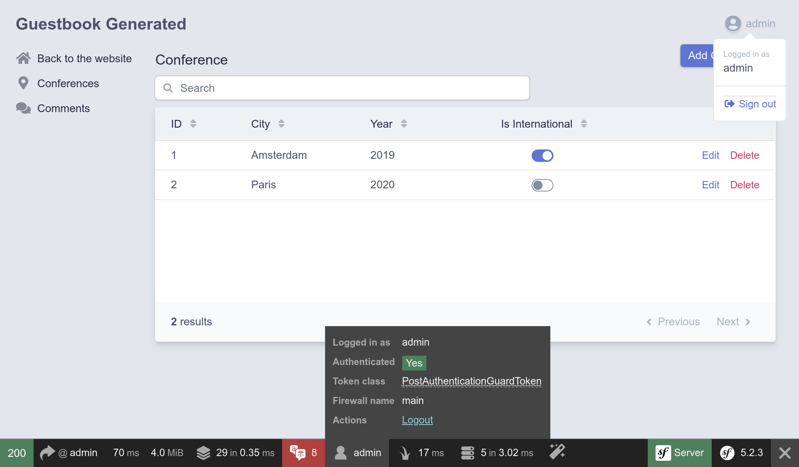

Mettere in sicurezza il pannello amministrativo
===============================================

L'interfaccia del pannello amministrativo dovrebbe essere accessibile solo da persone autorizzate. La sicurezza di quest'area del sito può essere garantita usando il componente Security di Symfony.

Come per Twig, il componente Security è già installato tramite dipendenze indirette. Aggiungiamolo esplicitamente al file ``composer.json`` del progetto:

.. index::
    single: Components;Security
    single: Security

.. code-block:: bash

    $ symfony composer req security

Definire un'entity "User"
-------------------------

Anche se i partecipanti non saranno in grado di creare i propri account sul sito, creeremo un sistema di autenticazione completamente funzionante per l'amministratore del sito e avremo, quindi, un solo utente.

Il primo passo è quello di definire un'entity ``User``. Per evitare confusione, chiamiamola ``Admin``.

Per integrarsi con il sistema di autenticazione,  l'entity ``Admin`` deve seguire alcuni requisiti specifici. Per esempio, ha bisogno di una proprietà ``password``.

.. index::
    single: Command;make:user

Utilizzare il comando dedicato ``make:user`` per creare l'entity ``Admin`` al posto del tradizionale ``make:entity``:

.. code-block:: bash
    :class: answers(yes||username||yes)

    $ symfony console make:user Admin

Rispondere alle domande interattive: "we want to use Doctrine to store the admins" (``yes``), "use ``username`` for the unique display name of admins", e "each user will have a password" (``yes``).

La classe generata contiene metodi come ``getRoles()``, ``eraseCredentials()`` e alcuni altri metodi che sono necessari al sistema di autenticazione di Symfony.

Se si desidera aggiungere altre proprietà all'utente ``Admin``, utilizzare il comando ``make:entity``.

Aggiungiamo un metodo ``__toString()`` affinché EasyAdmin lo possa utilizzare per la visualizzazione:

.. code-block:: diff

    --- a/src/Entity/Admin.php
    +++ b/src/Entity/Admin.php
    @@ -75,6 +75,11 @@ class Admin implements UserInterface
             return $this;
         }

    +    public function __toString(): string
    +    {
    +        return $this->username;
    +    }
    +
         /**
          * @see UserInterface
          */

Oltre a generare l'entity ``Admin``, il comando ha anche aggiornato la configurazione di sicurezza per collegare l'entity con il sistema di autenticazione:

.. code-block:: diff
    :class: ignore
    :emphasize-lines: 6,7,15,16

    --- a/config/packages/security.yaml
    +++ b/config/packages/security.yaml
    @@ -1,7 +1,15 @@
     security:
    +    encoders:
    +        App\Entity\Admin:
    +            algorithm: auto
    +
         # https://symfony.com/doc/current/security.html#where-do-users-come-from-user-providers
         providers:
    -        in_memory: { memory: null }
    +        # used to reload user from session & other features (e.g. switch_user)
    +        app_user_provider:
    +            entity:
    +                class: App\Entity\Admin
    +                property: username
         firewalls:
             dev:
                 pattern: ^/(_(profiler|wdt)|css|images|js)/

Lasciamo a Symfony la scelta del miglior algoritmo possibile per la codifica delle password (che si evolverà nel tempo).

È giunto il momento di generare gli script di migrazione e migrare il database:

.. code-block:: bash

    $ symfony console make:migration
    $ symfony console doctrine:migrations:migrate -n

Generare una password per l'utente amministratore
-------------------------------------------------

.. index::
    single: Security;Encoding Passwords

Non svilupperemo un sistema dedicato per la creazione di account amministrativi. Come detto precedentemente, avremo sempre un solo amministratore. Il nome utente sarà ``admin`` e dobbiamo codificare la password.

.. index::
    single: Command;security:encode-password

Scegliere la password desiderata ed eseguire il seguente comando per generare la password codificata:

.. code-block:: bash
    :class: answers(admin)

    $ symfony console security:encode-password

.. code-block:: text
    :class: ignore
    :emphasize-lines: 11

    Symfony Password Encoder Utility
    ================================

     Type in your password to be encoded:
     >

     ------------------ ---------------------------------------------------------------------------------------------------
      Key                Value
     ------------------ ---------------------------------------------------------------------------------------------------
      Encoder used       Symfony\Component\Security\Core\Encoder\MigratingPasswordEncoder
      Encoded password   $argon2id$v=19$m=65536,t=4,p=1$BQG+jovPcunctc30xG5PxQ$TiGbx451NKdo+g9vLtfkMy4KjASKSOcnNxjij4gTX1s
     ------------------ ---------------------------------------------------------------------------------------------------

     ! [NOTE] Self-salting encoder used: the encoder generated its own built-in salt.

     [OK] Password encoding succeeded

Creare un amministratore
------------------------

.. index::
    single: Symfony CLI;run psql

Inserire l'utente amministratore tramite un'istruzione SQL:

.. code-block:: bash

    $ symfony run psql -c "INSERT INTO admin (id, username, roles, password) \
      VALUES (nextval('admin_id_seq'), 'admin', '[\"ROLE_ADMIN\"]', \
      '\$argon2id\$v=19\$m=65536,t=4,p=1\$BQG+jovPcunctc30xG5PxQ\$TiGbx451NKdo+g9vLtfkMy4KjASKSOcnNxjij4gTX1s')"

Si noti l'escape del simbolo ``$`` nel valore della colonna della password;

Configurare l'autenticazione
----------------------------

.. index::
    single: Command;make:auth
    single: Security;Authenticator
    single: Security;Form Login
    single: Login
    single: Logout

Ora che abbiamo un utente amministratore, possiamo proteggere il pannello amministrativo. Symfony supporta diverse strategie di autenticazione. Usiamo il classico e popolare *sistema di autenticazione con form*.

Eseguire il comando ``make:auth`` per aggiornare la configurazione, generare un template per il login e creare un *authenticator*:

.. code-block:: bash
    :class: answers(1||AppAuthenticator||SecurityController||yes)

    $ symfony console make:auth

Selezionare ``1`` per generare un'autenticazione con form, chiamare la classe authenticator ``AppAuthenticator``, il controller ``SecurityController``, e generare un URL ``/logout`` (``yes``).

Il comando ha aggiornato la configurazione di sicurezza per collegare le classi generate:

.. code-block:: diff
    :class: ignore
    :emphasize-lines: 9

    --- a/config/packages/security.yaml
    +++ b/config/packages/security.yaml
    @@ -16,6 +16,13 @@ security:
                 security: false
             main:
                 anonymous: lazy
    +            guard:
    +                authenticators:
    +                    - App\Security\AppAuthenticator
    +            logout:
    +                path: app_logout
    +                # where to redirect after logout
    +                # target: app_any_route

                 # activate different ways to authenticate
                 # https://symfony.com/doc/current/security.html#firewalls-authentication

Come suggerito dall'output del comando, abbiamo bisogno di personalizzare la rotta nel metodo ``onAuthenticationSuccess()`` per reindirizzare l'utente quando accede:

.. code-block:: diff

    --- a/src/Security/AppAuthenticator.php
    +++ b/src/Security/AppAuthenticator.php
    @@ -95,8 +95,7 @@ class AppAuthenticator extends AbstractFormLoginAuthenticator implements Passwor
                 return new RedirectResponse($targetPath);
             }

    -        // For example : return new RedirectResponse($this->urlGenerator->generate('some_route'));
    -        throw new \Exception('TODO: provide a valid redirect inside '.__FILE__);
    +        return new RedirectResponse($this->urlGenerator->generate('admin'));
         }

         protected function getLoginUrl()

.. index::
    single: Command;debug:router
    single: Routing;Debug
    single: Debug;Routing

.. tip::

    Come faccio a ricordare che il percorso per EasyAdmin è ``admin`` (in base alla configurazione in ``App\Controller\Admin\DashboardController``)? Non occorre ricordarselo. Possiamo dare un'occhiata al file, ma possiamo anche eseguire il seguente comando,  che mostra l'associazione tra i nomi delle rotte e i percorsi:

    .. code-block:: bash

        $ symfony console debug:router

Aggiungere regole di accesso e autorizzazione
---------------------------------------------

.. index::
    single: Security;Authorization
    single: Security;Access Control

Un sistema di sicurezza è composto da due parti: *autenticazione* e *autorizzazione*. Quando abbiamo creato l'utente amministratore, gli abbiamo assegnato il ruolo ``ROLE_ADMIN``. Limitiamo la sezione ``/admin`` solo agli utenti che hanno questo ruolo aggiungendo una regola a ``access_control``:

.. code-block:: diff
    :emphasize-lines: 8

    --- a/config/packages/security.yaml
    +++ b/config/packages/security.yaml
    @@ -35,5 +35,5 @@ security:
         # Easy way to control access for large sections of your site
         # Note: Only the *first* access control that matches will be used
         access_control:
    -        # - { path: ^/admin, roles: ROLE_ADMIN }
    +        - { path: ^/admin, roles: ROLE_ADMIN }
             # - { path: ^/profile, roles: ROLE_USER }

Le regole in ``access_control`` limitano l'accesso usando delle espressioni regolari. Quando si tenta di accedere a un URL che inizia con ``/admin``, il sistema di sicurezza verificherà se l'utente connesso abbia il ruolo ``ROLE_ADMIN``.

Autenticazione tramite form di login
------------------------------------

Se si tenta di accedere al pannello amministrativo, si dovrebbe ora essere reindirizzati alla pagina di login, dove sono richiesti nome utente e password:

.. figure:: screenshots/easy-admin-login.png
    :alt: /login/
    :align: center
    :figclass: with-browser

Effettuare il login utilizzando ``admin`` e come password quella in chiaro che è stata precedentemente codificata. Se avete copiato esattamente il precedente comando SQL, la password è ``admin``.

Notare che EasyAdmin riconosce automaticamente il sistema di autenticazione di Symfony:

Provare a cliccare sul link "Sign out". Ecco fatto! Un pannello amministrativo completamente al sicuro.

.. index::
    single: Command;make:registration-form

.. note::

    Se si vuole creare un sistema completo di autenticazione con form, dare uno sguardo al comando ``make:registration-form``.

.. sidebar:: Andare oltre

    * `Documentazione di Symfony Security <https://symfony.com/doc/current/security.html>`_;

    * `Guida alla sicurezza su SymfonyCasts <https://symfonycasts.com/screencast/symfony-security>`_;

    * `Come costruire un form di login <https://symfony.com/doc/current/security/form_login_setup.html>`_ nelle applicazioni Symfony;

    * `Cheat Sheet di Symfony Security <https://github.com/andreia/symfony-cheat-sheets/blob/master/Symfony4/security_en_44.pdf>`_.
