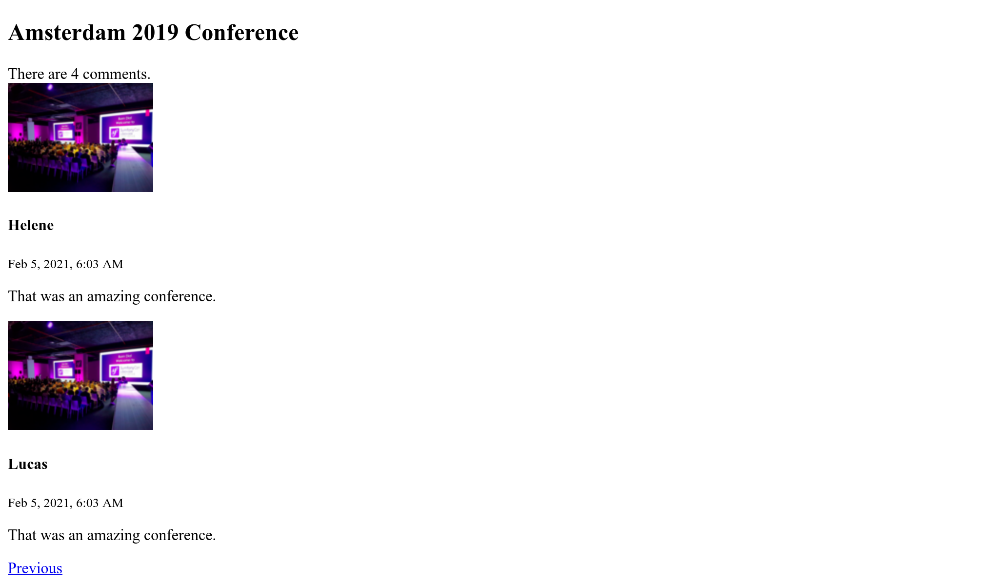

ユーザーインターフェースを構築する
===================================================

.. index::
    single: Twig
    single: Templates

Webサイトのインターフェースについて、最初のバージョンを作成する準備が整いました。ここではまず動作することを優先し、見た目は重視しません。

セキュリティのため、前の章でコントローラーでエスケーピング処理を施したことを思い出してください。このため、私たちはテンプレートエンジンとしてPHPを使うことはありません。代わりに、Twigを使います。出力のエスケーピング処理の他に、 `Twig`_  は、例えばテンプレートの継承といった、多くの便利な機能を備えています。

Twig をインストールする
--------------------------------

Twig は EasyAdmin の *推移的な依存関係* として既にインストールされているため、依存関係として Twig を明示的に追加する必要はありませんが、後で別の管理バンドルに変更することにした場合はどうでしょうか？たとえば、API と React フロントエンドによる構成にした場合、EasyAdmin を削除すると Twig には依存しなくなるため、Twig は自動的に削除されるでしょう。

適切な対策として、EasyAdmin とは別に、プロジェクトが Twig に依存していることを Composer で明示しましょう。他の依存関係と同様に追加すれば良いのです:

.. code-block:: bash

    $ symfony composer req twig

Twig はプロジェクトの依存ライブラリとして、 ``composer.json`` に登録されました:

.. code-block:: diff
    :class: ignore

    --- a/composer.json
    +++ b/composer.json
    @@ -14,6 +14,7 @@
             "symfony/framework-bundle": "4.4.*",
             "symfony/maker-bundle": "^1.0@dev",
             "symfony/orm-pack": "dev-master",
    +        "symfony/twig-pack": "^1.0",
             "symfony/yaml": "4.4.*"
         },
         "require-dev": {

Twigをテンプレートとして使う
----------------------------------------

.. index::
    single: Twig;Layout
    single: Twig;block

Webサイト上のすべてのページは同じ *レイアウト* を共有します。Twigをインストールすると、 ``templates/`` ディレクトリが自動的に作成され、サンプルレイアウトとして、``base.html.twig`` も同様に作成されます。

.. code-block:: twig
    :caption: templates/base.html.twig
    :class: ignore

    <!DOCTYPE html>
    <html>
        <head>
            <meta charset="UTF-8">
            <title>Welcome!</title>
            
        </head>
        <body>
            
            
        </body>
    </html>

レイアウトには ``block`` 要素を定義できます。 block 要素には、レイアウトを *拡張* した各 *子テンプレート* が個々の内容でコンテンツを追加できます。

.. index::
    single: Twig;extends
    single: Twig;for

プロジェクトのホームページ用に、 ``templates/conference/index.html.twig`` としてテンプレートを作ってみましょう:

.. code-block:: twig
    :caption: templates/conference/index.html.twig

    

    Conference Guestbook

    
        <h2>Give your feedback!</h2>

        
            <h4>{{ conference }}</h4>
        
    

``base.html.twig`` を *拡張* したこのテンプレートは、 ``title`` ブロックと ``body`` ブロックの再定義を行っています。

.. index::
    single: Twig;Syntax

テンプレートの記法 ```` は  *アクション* と  *構造* を表します。

記法 ``{{ }}`` は、何かを *表示* する際に使われます。 ``{{ conference }}`` はカンファレンスの表現（ ``Conference`` オブジェクトで ``__toString`` を呼び出した結果）を表示します。

コントローラーで Twig を使う
---------------------------------------

コントローラーを変更して Twig テンプレートをレンダリングしてください:

.. code-block:: diff
    :caption: patch_file

    --- a/src/Controller/ConferenceController.php
    +++ b/src/Controller/ConferenceController.php
    @@ -2,22 +2,19 @@

     namespace App\Controller;

    +use App\Repository\ConferenceRepository;
     use Symfony\Bundle\FrameworkBundle\Controller\AbstractController;
     use Symfony\Component\HttpFoundation\Response;
     use Symfony\Component\Routing\Annotation\Route;
    +use Twig\Environment;

     class ConferenceController extends AbstractController
     {
         #[Route('/', name: 'homepage')]
    -    public function index(): Response
    +    public function index(Environment $twig, ConferenceRepository $conferenceRepository): Response
         {
    -        return new Response(<<<EOF
    -<html>
    -    <body>
    -        
    -    </body>
    -</html>
    -EOF
    -        );
    +        return new Response($twig->render('conference/index.html.twig', [
    +            'conferences' => $conferenceRepository->findAll(),
    +        ]));
         }
     }

ここでは多くのことが行われています。

テンプレートをレンダリングするには、Twig  ``Environment`` オブジェクト (Twig のメインエントリーポイント) が必要です。コントローラーのメソッドに型宣言を付ければ Twig のインスタンスと連携することができます。それだけで Symfony は適切なオブジェクトを注入できるのです。

カンファレンスのリポジトリを使ってデータベースからすべてのカンファレンスを取得してくる必要もあります。

コントローラーのコードでは、 ``render()`` メソッドがテンプレートをレンダリングし、変数の配列をテンプレートに渡します。 ``Conference`` オブジェクトのリストを ``conferences`` 変数として渡します。

コントローラーは普通のPHPクラスです。依存していないことを明示したければ  ``AbstractController`` クラスを継承する必要さえありません。``AbstractController`` クラスは削除することができます（ただし、その便利な機能をこの後のステップで使う予定ですから、残しておいてください）。

カンファレンスページを作成する
---------------------------------------------

各カンファレンスには、コメントを一覧表示する専用のページが必要です。新しいページを作成するには、コントローラーを追加してルート定義を行い、関連付けたテンプレートを置きます。

``src/Controller/ConferenceController.php`` に  ``show()`` メソッドを追加してください:

.. code-block:: diff
    :caption: patch_file

    --- a/src/Controller/ConferenceController.php
    +++ b/src/Controller/ConferenceController.php
    @@ -2,6 +2,8 @@

     namespace App\Controller;

    +use App\Entity\Conference;
    +use App\Repository\CommentRepository;
     use App\Repository\ConferenceRepository;
     use Symfony\Bundle\FrameworkBundle\Controller\AbstractController;
     use Symfony\Component\HttpFoundation\Response;
    @@ -17,4 +19,13 @@ class ConferenceController extends AbstractController
                 'conferences' => $conferenceRepository->findAll(),
             ]));
         }
    +
    +    #[Route('/conference/{id}', name: 'conference')]
    +    public function show(Environment $twig, Conference $conference, CommentRepository $commentRepository): Response
    +    {
    +        return new Response($twig->render('conference/show.html.twig', [
    +            'conference' => $conference,
    +            'comments' => $commentRepository->findBy(['conference' => $conference], ['createdAt' => 'DESC']),
    +        ]));
    +    }
     }

このメソッドには、これまでにはなかった特別な振る舞いがあります。メソッドに ``Conference`` インスタンスの注入が必要です。データベースに複数あるかもしれません。Symfony ではリクエストのパスで受け取る ``{id}`` によってどのレコードを取得するのかを決めることができます（ `` id`` はデータベースの ``conference`` テーブルのプライマリーキーです）。

カンファレンスに関連付けられたコメントを取得するには、検索条件を第一引数に取る ``findBy()`` メソッドを使います。

.. index::
    single: Twig;extends
    single: Twig;block
    single: Twig;for
    single: Twig;if
    single: Twig;else
    single: Twig;asset
    single: Twig;format_datetime
    single: Twig;length

最後のステップとしてファイル ``templates/conference/show.html.twig`` を作成します:

.. code-block:: twig
    :caption: templates/conference/show.html.twig

    

    Conference Guestbook - {{ conference }}

    
        <h2>{{ conference }} Conference</h2>

        
            
                
                    
                

                <h4>{{ comment.author }}</h4>
                <small>
                    {{ comment.createdAt|format_datetime('medium', 'short') }}
                </small>

                
{{ comment.text }}

            
        
            
No comments have been posted yet for this conference.

        
    

このテンプレートでは、Twig *フィルター* を呼び出すために ``|`` 記法を使っています。フィルターは値の変換をします。 ``comments|length`` はコメントの数を返し、 ``comment.createdAt|format_datetime('medium', 'short')`` はヒューマンリーダブルな表現で日付をフォーマットします。

``/conference/ 1`` で "最初の" カンファレンスにアクセスして次のエラーを確認してください:

.. figure:: screenshots/intl-twig-error.png
    :alt: /conference/1
    :align: center
    :figclass: with-browser

このエラーは、 ``format_datetime`` フィルターが Twig コアには同梱されていないために発生するものです。エラーメッセージは、問題を解決するにはどのパッケージをインストールする必要があるのかについてヒントを提供してくれます:

.. code-block:: bash

    $ symfony composer req "twig/intl-extra:^3"

これで、ページが正しく動作するようになりました。

ページをリンクする
---------------------------

.. index::
    single: Twig;Link
    single: Link

ユーザーインターフェースの初期バージョンを作る最後のステップとして、ホームページからカンファレンスページにリンクをつけます:

.. code-block:: diff
    :caption: patch_file

    --- a/templates/conference/index.html.twig
    +++ b/templates/conference/index.html.twig
    @@ -7,5 +7,8 @@

         
             <h4>{{ conference }}</h4>
    +        

    +            <a href="/conference/{{ conference.id }}">View</a>
    +        

         
     

しかし、パスをハードコードしてしまうのは複数の理由から悪手と言えます。もっとも大きな理由として、パスを変更する場合 (たとえば、 ``/conference/{id}`` から ``/conferences/{id}`` にする場合) 、すべてのリンクを手動で更新しなければならないことが挙げられます。

.. index::
    single: Twig;path

ハードコードを使わない代わりに、Twig *関数* ``path()`` で *ルート名* を使ってください:

.. code-block:: diff
    :caption: patch_file

    --- a/templates/conference/index.html.twig
    +++ b/templates/conference/index.html.twig
    @@ -8,7 +8,7 @@
         
             <h4>{{ conference }}</h4>
             

    -            <a href="/conference/{{ conference.id }}">View</a>
    +            <a href="{{ path('conference', { id: conference.id }) }}">View</a>
             

         
     

``path()`` 関数は、ルート名からページパスを生成します。ルートパラメーターの値は Twig マップとして渡されます。

コメントのページネーション
---------------------------------------

.. index::
    single: Doctrine;Paginator
    single: Paginator

何千人も参加者がいるので、かなりの数のコメントがつくはずです。すべてのコメントを1つのページに表示してしまうと、ものすごい勢いで伸びていってしまいます。

コメントリポジトリで  ``getCommentPaginator()`` メソッドを作成します。このメソッドはカンファレンスとオフセット（開始点）からコメントの *Paginator* を返します:

.. code-block:: diff
    :caption: patch_file

    --- a/src/Repository/CommentRepository.php
    +++ b/src/Repository/CommentRepository.php
    @@ -3,8 +3,10 @@
     namespace App\Repository;

     use App\Entity\Comment;
    +use App\Entity\Conference;
     use Doctrine\Bundle\DoctrineBundle\Repository\ServiceEntityRepository;
     use Doctrine\Persistence\ManagerRegistry;
    +use Doctrine\ORM\Tools\Pagination\Paginator;

     /**
      * @method Comment|null find($id, $lockMode = null, $lockVersion = null)
    @@ -14,11 +16,27 @@ use Doctrine\Persistence\ManagerRegistry;
      */
     class CommentRepository extends ServiceEntityRepository
     {
    +    public const PAGINATOR_PER_PAGE = 2;
    +
         public function __construct(ManagerRegistry $registry)
         {
             parent::__construct($registry, Comment::class);
         }

    +    public function getCommentPaginator(Conference $conference, int $offset): Paginator
    +    {
    +        $query = $this->createQueryBuilder('c')
    +            ->andWhere('c.conference = :conference')
    +            ->setParameter('conference', $conference)
    +            ->orderBy('c.createdAt', 'DESC')
    +            ->setMaxResults(self::PAGINATOR_PER_PAGE)
    +            ->setFirstResult($offset)
    +            ->getQuery()
    +        ;
    +
    +        return new Paginator($query);
    +    }
    +
         // /**
         //  * @return Comment[] Returns an array of Comment objects
         //  */

テストを簡単にするため、ページあたりのコメント最大数を2に設定しました。

テンプレートのページネーションを管理するには、Doctrine コレクションの代わりに Doctrine Paginator を Twig に渡します：

.. code-block:: diff
    :caption: patch_file

    --- a/src/Controller/ConferenceController.php
    +++ b/src/Controller/ConferenceController.php
    @@ -6,6 +6,7 @@ use App\Entity\Conference;
     use App\Repository\CommentRepository;
     use App\Repository\ConferenceRepository;
     use Symfony\Bundle\FrameworkBundle\Controller\AbstractController;
    +use Symfony\Component\HttpFoundation\Request;
     use Symfony\Component\HttpFoundation\Response;
     use Symfony\Component\Routing\Annotation\Route;
     use Twig\Environment;
    @@ -21,11 +22,16 @@ class ConferenceController extends AbstractController
         }

         #[Route('/conference/{id}', name: 'conference')]
    -    public function show(Environment $twig, Conference $conference, CommentRepository $commentRepository): Response
    +    public function show(Request $request, Environment $twig, Conference $conference, CommentRepository $commentRepository): Response
         {
    +        $offset = max(0, $request->query->getInt('offset', 0));
    +        $paginator = $commentRepository->getCommentPaginator($conference, $offset);
    +
             return new Response($twig->render('conference/show.html.twig', [
                 'conference' => $conference,
    -            'comments' => $commentRepository->findBy(['conference' => $conference], ['createdAt' => 'DESC']),
    +            'comments' => $paginator,
    +            'previous' => $offset - CommentRepository::PAGINATOR_PER_PAGE,
    +            'next' => min(count($paginator), $offset + CommentRepository::PAGINATOR_PER_PAGE),
             ]));
         }
     }

コントローラーはリクエストのクエリー文字列 (``$request->query``) から ``offset`` を整数として (``getInt()``)  取得します。デフォルトは0です。

``previous`` と ``next`` のオフセットは Doctrine Paginator から得られる全情報から算出されます。

.. index::
    single: Twig;if

最後に、テンプレートを更新して次ページ、前ページへのリンクを追加しましょう:

.. code-block:: diff
    :caption: patch_file

    --- a/templates/conference/show.html.twig
    +++ b/templates/conference/show.html.twig
    @@ -6,6 +6,8 @@
         <h2>{{ conference }} Conference</h2>

         
    +        
There are {{ comments|length }} comments.

    +
             
                 
                     
    @@ -18,6 +20,13 @@

                 
{{ comment.text }}

             
    +
    +        
    +            <a href="{{ path('conference', { id: conference.id, offset: previous }) }}">Previous</a>
    +        
    +        
    +            <a href="{{ path('conference', { id: conference.id, offset: next }) }}">Next</a>
    +        
         
             
No comments have been posted yet for this conference.

         

これで、"前" と "次" のリンクからコメントのナビゲーションができるようになりました:

.. figure:: screenshots/pagination-next.png
    :alt: /conference/1
    :align: center
    :figclass: with-browser

コントローラーをリファクタリングする
------------------------------------------------------

``ConferenceController`` の両方のメソッドが Twig 環境を引数として取っていることに気がつくでしょうか。各メソッドでインジェクトするのではなく、コンストラクターインジェクションを使うようにしましょう（引数のリストが短くなり冗長性がなくなります）:

.. code-block:: diff
    :caption: patch_file

    --- a/src/Controller/ConferenceController.php
    +++ b/src/Controller/ConferenceController.php
    @@ -13,21 +13,28 @@ use Twig\Environment;

     class ConferenceController extends AbstractController
     {
    +    private $twig;
    +
    +    public function __construct(Environment $twig)
    +    {
    +        $this->twig = $twig;
    +    }
    +
         #[Route('/', name: 'homepage')]
    -    public function index(Environment $twig, ConferenceRepository $conferenceRepository): Response
    +    public function index(ConferenceRepository $conferenceRepository): Response
         {
    -        return new Response($twig->render('conference/index.html.twig', [
    +        return new Response($this->twig->render('conference/index.html.twig', [
                 'conferences' => $conferenceRepository->findAll(),
             ]));
         }

         #[Route('/conference/{id}', name: 'conference')]
    -    public function show(Request $request, Environment $twig, Conference $conference, CommentRepository $commentRepository): Response
    +    public function show(Request $request, Conference $conference, CommentRepository $commentRepository): Response
         {
             $offset = max(0, $request->query->getInt('offset', 0));
             $paginator = $commentRepository->getCommentPaginator($conference, $offset);

    -        return new Response($twig->render('conference/show.html.twig', [
    +        return new Response($this->twig->render('conference/show.html.twig', [
                 'conference' => $conference,
                 'comments' => $paginator,
                 'previous' => $offset - CommentRepository::PAGINATOR_PER_PAGE,

.. sidebar:: より深く学ぶために

    * `Twig ドキュメント <https://twig.symfony.com/doc/2.x/>`_;

    * `Symfonyアプリケーションにおけるテンプレートの作成と使用 <https://symfony.com/doc/current/templates.html>`_;

    * `SymfonyCasts Twig チュートリアル <https://symfonycasts.com/screencast/symfony/twig-recipe>`_;

    * `Symfonyのみで利用できる Twig の関数とフィルター <https://symfony.com/doc/current/reference/twig_reference.html>`_;

    * `AbstractController ベースコントローラー <https://symfony.com/doc/current/controller.html#the-base-controller-classes-services>`_.

.. _`Twig`: https://twig.symfony.com/
