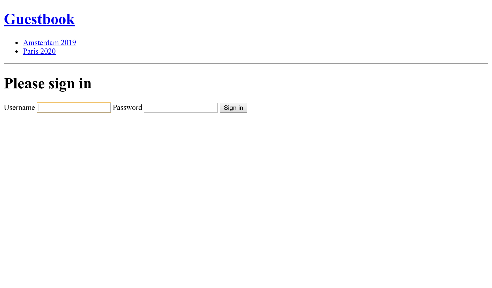

管理者のバックエンドをセキュアにする
======================================================

管理者のバックエンドのインターフェースは、信頼された人からのみアクセス可能であるべきです。Symfony のセキュリティコンポーネントを使用して、Web サイトをセキュアにします。

Twig と同様に、セキュリティコンポーネントは既に他の依存パッケージが使用しておりインストールされていますが、明示的に ``composer.json`` ファイルに追加しましょう:

.. index::
    single: Components;Security
    single: Security

.. code-block:: bash

    $ symfony composer req security

User エンティティを定義する
--------------------------------------

参加者が Web サイトに自分のアカウントを作成することはできないですが、ここでは管理者のために正しく機能する認証システムを作成しましょう。そのために、Webサイトの管理者のユーザーを一つだけ用意します。

最初のステップは、 ``User`` エンティティを定義することです。混乱を避けるためにここでは ``Admin`` を使います。

Symfony のセキュリティ認証システムで ``Admin`` エンティティを使用するためには、``password`` プロパティなどの要件が必要になります。

.. index::
    single: Command;make:user

``make:entity`` ではなく、専用の ``make:user`` コマンドを使用して ``Admin`` エンティティを作成してください:

.. code-block:: bash
    :class: answers(yes||username||yes)

    $ symfony console make:user Admin

インタラクティブな質問に次のように答えてください: 管理者を Doctrine に格納したいので (``yes``)、 管理者のユニークな表示名を ``username`` 、そして各ユーザーがパスワードを1つ持つことに(``yes``)と。

生成されたクラスには、``getRole()``, ``eraseCredentials()`` メソッドの他にも Symfony の認証システムで必要なものが入っています。

``Admin`` ユーザーにさらにプロパティを追加したければ、 ``make:entity`` を使用してください。

EasyAdmin のように ``__toString()`` メソッドを追加しましょう:

.. code-block:: diff

    --- a/src/Entity/Admin.php
    +++ b/src/Entity/Admin.php
    @@ -75,6 +75,11 @@ class Admin implements UserInterface
             return $this;
         }

    +    public function __toString(): string
    +    {
    +        return $this->username;
    +    }
    +
         /**
          * @see UserInterface
          */

``Admin`` エンティティを生成するだけでなく、このコマンドは、認証システムとエンティティのワイヤリングのためのセキュリティ設定を更新します:

.. code-block:: diff
    :class: ignore
    :emphasize-lines: 6,7,15,16

    --- a/config/packages/security.yaml
    +++ b/config/packages/security.yaml
    @@ -1,7 +1,15 @@
     security:
    +    encoders:
    +        App\Entity\Admin:
    +            algorithm: auto
    +
         # https://symfony.com/doc/current/security.html#where-do-users-come-from-user-providers
         providers:
    -        in_memory: { memory: null }
    +        # used to reload user from session & other features (e.g. switch_user)
    +        app_user_provider:
    +            entity:
    +                class: App\Entity\Admin
    +                property: username
         firewalls:
             dev:
                 pattern: ^/(_(profiler|wdt)|css|images|js)/

Symfony にパスワードをエンコードするのに一番有効なアルゴリズムを選択させましょう（これは時が経つと変更されていくものです）。

マイグレーションを生成して、データベースをmigrateします:

.. code-block:: bash

    $ symfony console make:migration
    $ symfony console doctrine:migrations:migrate -n

管理者ユーザーのパスワードを生成する
------------------------------------------------------

.. index::
    single: Security;Encoding Passwords

管理者のアカウントを作成するのに専用のシステムを開発することはないです。ここでは1つの管理者しか用意しませんから。ログインするには ``admin`` とエンコードされたパスワードが必要になります。

.. index::
    single: Command;security:encode-password

好きなパスワードを選択して、次のコマンドを実行しパスワードをエンコードしてください:

.. code-block:: bash
    :class: answers(admin)

    $ symfony console security:encode-password

.. code-block:: text
    :class: ignore
    :emphasize-lines: 11

    Symfony Password Encoder Utility
    ================================

     Type in your password to be encoded:
     >

     ------------------ ---------------------------------------------------------------------------------------------------
      Key                Value
     ------------------ ---------------------------------------------------------------------------------------------------
      Encoder used       Symfony\Component\Security\Core\Encoder\MigratingPasswordEncoder
      Encoded password   $argon2id$v=19$m=65536,t=4,p=1$BQG+jovPcunctc30xG5PxQ$TiGbx451NKdo+g9vLtfkMy4KjASKSOcnNxjij4gTX1s
     ------------------ ---------------------------------------------------------------------------------------------------

     ! [NOTE] Self-salting encoder used: the encoder generated its own built-in salt.

     [OK] Password encoding succeeded

管理者を作成する
------------------------

.. index::
    single: Symfony CLI;run psql

次の SQL で管理者ユーザーを追加してください:

.. code-block:: bash

    $ symfony run psql -c "INSERT INTO admin (id, username, roles, password) \
      VALUES (nextval('admin_id_seq'), 'admin', '[\"ROLE_ADMIN\"]', \
      '\$argon2id\$v=19\$m=65536,t=4,p=1\$BQG+jovPcunctc30xG5PxQ\$TiGbx451NKdo+g9vLtfkMy4KjASKSOcnNxjij4gTX1s')"

パスワードの値の ``$`` 符号は全てエスケープしましょう。

セキュリティ認証を設定する
---------------------------------------

.. index::
    single: Command;make:auth
    single: Security;Authenticator
    single: Security;Form Login
    single: Login
    single: Logout

管理者ユーザーができましたので、管理者のバックエンドをセキュアにすることができます。 Symfony は複数の認証の方法をサポートしていますが、ここでは、昔から人気のある *フォーム認証システム* を使いましょう。

``make:auth`` コマンドを実行しセキュリティ設定を更新し、ログインテンプレートを作成し、 *認証システム* を作成しましょう:

.. code-block:: bash
    :class: answers(1||AppAuthenticator||SecurityController||yes)

    $ symfony console make:auth

``1`` を選択し、ログインフォーム認証システムを生成し、 ``AppAuthenticator`` とし、コントローラーを ``SecurityController``  と命名し、 ``logout`` URLを生成しましょう(``yes``)。

このコマンドはセキュリティ設定を更新し生成されるクラスとワイヤリングします:

.. code-block:: diff
    :class: ignore
    :emphasize-lines: 9

    --- a/config/packages/security.yaml
    +++ b/config/packages/security.yaml
    @@ -16,6 +16,13 @@ security:
                 security: false
             main:
                 anonymous: lazy
    +            guard:
    +                authenticators:
    +                    - App\Security\AppAuthenticator
    +            logout:
    +                path: app_logout
    +                # where to redirect after logout
    +                # target: app_any_route

                 # activate different ways to authenticate
                 # https://symfony.com/doc/current/security.html#firewalls-authentication

コマンド出力のヒントにあるように、ログインが成功した際にユーザーをリダイレクトするように ``onAuthenticationSuccess()`` メソッドにあるルートをカスタマイズする必要があります。

.. code-block:: diff

    --- a/src/Security/AppAuthenticator.php
    +++ b/src/Security/AppAuthenticator.php
    @@ -95,8 +95,7 @@ class AppAuthenticator extends AbstractFormLoginAuthenticator implements Passwor
                 return new RedirectResponse($targetPath);
             }

    -        // For example : return new RedirectResponse($this->urlGenerator->generate('some_route'));
    -        throw new \Exception('TODO: provide a valid redirect inside '.__FILE__);
    +        return new RedirectResponse($this->urlGenerator->generate('admin'));
         }

         protected function getLoginUrl()

.. index::
    single: Command;debug:router
    single: Routing;Debug
    single: Debug;Routing

.. tip::

    EasyAdminのルートが ``admin`` であることをどうやって覚えていられるでしょうか？( ``App\Controller\Admin\DashboardController`` で設定しました) 覚えていられませんよね。そんなときはコントローラファイルを見ることもできますが、次のコマンドでルート名とパスの関連を表示することもできます:

    .. code-block:: bash

        $ symfony console debug:router

認可アクセスコントロールのルールを追加する
---------------------------------------------------------------

.. index::
    single: Security;Authorization
    single: Security;Access Control

セキュリティシステムは2つのパートによって構成されています。 *認証* と *認可* です。管理者ユーザーを作成した際に ``ROLE_ADMIN`` ロールを与えています。 ``access_control`` にルールを追加して、 ``ROLE_ADMIN`` ロールを持ったユーザーのみが ``/admin`` セクションにアクセスできるようにしましょう:

.. code-block:: diff
    :emphasize-lines: 8

    --- a/config/packages/security.yaml
    +++ b/config/packages/security.yaml
    @@ -35,5 +35,5 @@ security:
         # Easy way to control access for large sections of your site
         # Note: Only the *first* access control that matches will be used
         access_control:
    -        # - { path: ^/admin, roles: ROLE_ADMIN }
    +        - { path: ^/admin, roles: ROLE_ADMIN }
             # - { path: ^/profile, roles: ROLE_USER }

``access_control`` のルールは正規表現でアクセスを制限します。 ``/admin`` から始まる URL にアクセスされると、セキュリティシステムは、ログインしているユーザーが ``ROLE_ADMIN`` ロールがあるかチェックします。

ログインフォームで認証する
---------------------------------------

これで、管理者のバックエンドへのアクセスを試みると、ログインページにリダイレクトされ、ログインとパスワードの入力を促されるはずです:

``admin`` と先ほどエンコードしたパスワードを使ってログインしてください。 そのまま SQL をコピーしていたなら、そのパスワードの値は ``admin`` です。

EasyAdmin は自動的に Symfony の認証システムを検知します:

.. figure:: screenshots/easy-admin-secured.png
    :alt: /admin/
    :align: center
    :figclass: with-browser

"ログアウト" リンクをクリックしてください。これで、管理者のバックエンドはセキュアな状態になります。

.. index::
    single: Command;make:registration-form

.. note::

    ``make:registration:form`` コマンドを使えば、より高機能な認証システムを作成することができます。

.. sidebar:: より深く学ぶために

    * `Symfony セキュリティのドキュメント <https://symfony.com/doc/current/security.html>`_;

    * `SymfonyCasts セキュリティチュートリアル <https://symfonycasts.com/screencast/symfony-security>`_;

    * Symfony アプリケーションでの `ログインフォームの作り方 <https://symfony.com/doc/current/security/form_login_setup.html>`_;

    * `Symfony セキュリティのチートシート <https://github.com/andreia/symfony-cheat-sheets/blob/master/Symfony4/security_en_44.pdf>`_.
