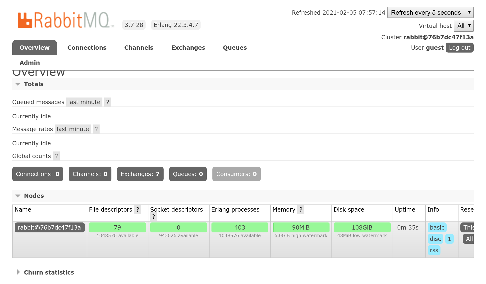

RabbitMQ gebruiken als een message-broker
=========================================

.. index::
    single: RabbitMQ

RabbitMQ is een zeer populaire message broker die je kunt gebruiken als alternatief voor PostgreSQL.

Overschakelen van PostgreSQL naar RabbitMQ
------------------------------------------

Om RabbitMQ te gebruiken in plaats van PostgreSQL als message-broker:

.. code-block:: diff
    :caption: patch_file

    --- a/config/packages/messenger.yaml
    +++ b/config/packages/messenger.yaml
    @@ -6,7 +6,7 @@ framework:
             transports:
                 # https://symfony.com/doc/current/messenger.html#transport-configuration
                 async:
    -                dsn: '%env(MESSENGER_TRANSPORT_DSN)%'
    +                dsn: '%env(RABBITMQ_URL)%'
                     options:
                         auto_setup: false
                         use_notify: true

RabbitMQ toevoegen aan de Docker Stack
--------------------------------------

.. index::
    single: Docker;RabbitMQ

Zoals je misschien al geraden hebt, moeten we ook RabbitMQ toevoegen aan de Docker Compose stack:

.. code-block:: diff
    :caption: patch_file

    --- a/docker-compose.yaml
    +++ b/docker-compose.yaml
    @@ -21,3 +21,7 @@ services:
         redis:
             image: redis:5-alpine
             ports: [6379]
    +
    +    rabbitmq:
    +        image: rabbitmq:3.7-management
    +        ports: [5672, 15672]

Docker services herstarten
--------------------------

Om Docker Compose te dwingen rekening te houden met de RabbitMQ-container, stop je de containers en start je ze opnieuw:

.. code-block:: bash

    $ docker-compose stop
    $ docker-compose up -d

.. code-block:: bash
    :class: hide

    $ sleep 10

Het verkennen van de RabbitMQ web-beheerinterface
-------------------------------------------------

.. index::
    single: Symfony CLI;open:local:rabbitmq

Als je wachtrijen wil zien en berichten door RabbitMQ wil zien vloeien, open dan de web-beheerinterface:

.. code-block:: bash
    :class: ignore

    $ symfony open:local:rabbitmq

Of via de online debug toolbar:

.. figure:: screenshots/rabbitmq-wdt.png
    :alt: /
    :align: center
    :figclass: with-browser

Gebruik ``guest``/``guest`` om in te loggen op de RabbitMQ-beheerinterface:

RabbitMQ deployen
-----------------

.. index::
    single: SymfonyCloud;RabbitMQ
    single: RabbitMQ

RabbitMQ toevoegen aan de productieservers kan, door deze toe te voegen aan de lijst met services:

.. code-block:: diff
    :caption: patch_file

    --- a/.symfony/services.yaml
    +++ b/.symfony/services.yaml
    @@ -18,3 +18,8 @@ files:

     rediscache:
         type: redis:5.0
    +
    +queue:
    +    type: rabbitmq:3.7
    +    disk: 1024
    +    size: S

Verwijs ernaar in de web container configuratie en schakel de ``amqp`` PHP-extensie in:

.. code-block:: diff
    :caption: patch_file

    --- a/.symfony.cloud.yaml
    +++ b/.symfony.cloud.yaml
    @@ -4,6 +4,7 @@ type: php:8.0

     runtime:
         extensions:
    +        - amqp
             - redis
             - blackfire
             - xsl
    @@ -28,6 +29,7 @@ disk: 512
     relationships:
         database: "db:postgresql"
         redis: "rediscache:redis"
    +    rabbitmq: "queue:rabbitmq"

     web:
         locations:

.. index::
    single: SymfonyCloud;Tunnel
    single: Symfony CLI;tunnel:open
    single: Symfony CLI;tunnel:close
    single: Symfony CLI;open:remote:rabbitmq

Wanneer de RabbitMQ-service in een project is geïnstalleerd, kan je de web beheerinterface openen door eerst de tunnel te openen:

.. code-block:: bash
    :class: ignore

    $ symfony tunnel:open
    $ symfony open:remote:rabbitmq

    # when done
    $ symfony tunnel:close

.. sidebar:: Verder gaan

    * RabbitMQ documentatie <https://www.rabbitmq.com/documentation.html>`_.
