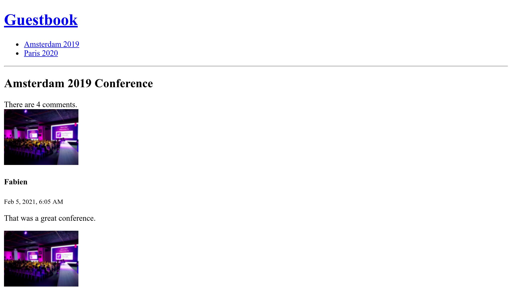

Gestionarea ciclului de viață al obiectelor Doctrine
======================================================

La crearea unui nou comentariu, ar fi minunat dacă data ``createdAt`` ar fi setată automat la data și ora curentă.

Doctrine are diferite modalități de a manipula obiectele și proprietățile lor în timpul ciclului de viață (înainte de a fi creat rândul în baza de date, după ce rândul este actualizat, ...).

Definirea ciclului de viață a apelurilor
------------------------------------------

.. index::
    single: Doctrine;Lifecycle
    single: Annotations;@ORM\\Entity
    single: Annotations;@ORM\\HasLifecycleCallbacks
    single: Annotations;@ORM\\PrePersist

Când comportamentul nu are nevoie de niciun serviciu și ar trebui să fie aplicat doar unui singur tip de entitate, definește un callback în clasa de entitate:

.. code-block:: diff
    :caption: patch_file

    --- a/src/Entity/Comment.php
    +++ b/src/Entity/Comment.php
    @@ -7,6 +7,7 @@ use Doctrine\ORM\Mapping as ORM;

     /**
      * @ORM\Entity(repositoryClass=CommentRepository::class)
    + * @ORM\HasLifecycleCallbacks()
      */
     class Comment
     {
    @@ -106,6 +107,14 @@ class Comment
             return $this;
         }

    +    /**
    +     * @ORM\PrePersist
    +     */
    +    public function setCreatedAtValue()
    +    {
    +        $this->createdAt = new \DateTime();
    +    }
    +
         public function getConference(): ?Conference
         {
             return $this->conference;

*Evenimentul* ``@ORM\PrePersist`` este declanșat atunci când obiectul este stocat în baza de date pentru prima dată. Când se întâmplă asta, se apelează metoda ``setCreatedAtValue()`` și se folosește data și ora curentă pentru valoarea proprietății ``createdAt``.

Adăugarea slug-urilor la conferințe
-------------------------------------

URL-urile pentru conferințe nu au semnificație: ``/conference/1``. Mai important, acestea depind de un detaliu de implementare (cheia principală din baza de date este afișată).

Cum rămâne cu folosirea URL-urilor precum ``/conference/paris-2020``? Ar arăta mult mai bine. ``paris-2020`` este ceea ce numim *slug* pentru conferință.

.. index::
    single: Command;make:entity

Adaugă o nouă proprietate ``slug`` pentru conferințe (un șir care nu este nul de 255 de caractere):

.. code-block:: bash
    :class: answers(slug||string||255||no)

    $ symfony console make:entity Conference

.. index::
    single: Command;make:migration

Creează un fișier de migrare pentru a adăuga noua coloană:

.. code-block:: bash

    $ symfony console make:migration

.. index::
    single: Command;doctrine:migrations:migrate

Și execută noua migrare:

.. code-block:: bash
    :class: ignore

    $ symfony console doctrine:migrations:migrate

Ai o eroare? Acest lucru este de așteptat. De ce? Pentru că am solicitat ca slug-ul să nu fie ``null``, dar intrările existente în baza de date a conferinței vor primi o valoare ``null`` atunci când migrarea este executată. Să rezolvăm asta prin modificarea migrării:

.. code-block:: diff
    :caption: patch_file

    --- a/migrations/Version00000000000000.php
    +++ b/migrations/Version00000000000000.php
    @@ -20,7 +20,9 @@ final class Version00000000000000 extends AbstractMigration
         public function up(Schema $schema): void
         {
             // this up() migration is auto-generated, please modify it to your needs
    -        $this->addSql('ALTER TABLE conference ADD slug VARCHAR(255) NOT NULL');
    +        $this->addSql('ALTER TABLE conference ADD slug VARCHAR(255)');
    +        $this->addSql("UPDATE conference SET slug=CONCAT(LOWER(city), '-', year)");
    +        $this->addSql('ALTER TABLE conference ALTER COLUMN slug SET NOT NULL');
         }

         public function down(Schema $schema): void

Trucul de aici este să adaugi coloana și să-i permiți să fie ``nulă``, apoi să setezi slug-ul la o valoare non ``nulă`` și, în final, să schimbi coloana slug pentru a nu permite ``null``.

.. note::

    Pentru un proiect real, folosind ``CONCAT(LOWER (city), '-', year)`` s-ar putea să nu fie suficient. În acest caz, va trebui să folosim Slugger-ul „real”.

.. index::
    single: Command;doctrine:migrations:migrate

Migrarea ar trebui să funcționeze bine acum:

.. code-block:: bash
    :class: answers(y)

    $ symfony console doctrine:migrations:migrate

.. index::
    single: Annotations;@ORM\\UniqueEntity
    single: Annotations;@ORM\\Column

Deoarece aplicația va folosi curând identificatori unici de cale pentru a găsi fiecare conferință, să modificăm entitatea Conference pentru a ne asigura că valorile respective sunt unice în baza de date:

.. code-block:: diff
    :caption: patch_file

    --- a/src/Entity/Conference.php
    +++ b/src/Entity/Conference.php
    @@ -6,9 +6,11 @@ use App\Repository\ConferenceRepository;
     use Doctrine\Common\Collections\ArrayCollection;
     use Doctrine\Common\Collections\Collection;
     use Doctrine\ORM\Mapping as ORM;
    +use Symfony\Bridge\Doctrine\Validator\Constraints\UniqueEntity;

     /**
      * @ORM\Entity(repositoryClass=ConferenceRepository::class)
    + * @UniqueEntity("slug")
      */
     class Conference
     {
    @@ -40,7 +42,7 @@ class Conference
         private $comments;

         /**
    -     * @ORM\Column(type="string", length=255)
    +     * @ORM\Column(type="string", length=255, unique=true)
          */
         private $slug;

.. index::
    single: Components;Validator

Întrucât folosim un validator pentru a asigura caracterul unic al slug-urilor, trebuie să adăugăm componenta Symfony Validator:

.. code-block:: bash

    $ symfony composer req validator

.. index::
    single: Command;make:migration

După cum ai putut ghici, trebuie să executăm dansul migrării:

.. code-block:: bash

    $ symfony console make:migration

.. index::
    single: Command;doctrine:migrations:migrate

.. code-block:: bash
    :class: answers(y)

    $ symfony console doctrine:migrations:migrate

Generarea identificatorilor Slug
--------------------------------

.. index::
    single: Components;String
    single: Slug

Generarea unui slug de cale citibil într-o adresă URL (unde orice în afară de caracterele ASCII ar trebui codificate) este o sarcină dificilă, în special pentru alte limbi decât engleza. Cum poți converti ``é`` în ``e`` de exemplu?

În loc să reinventăm roata, hai să folosim componenta Symfony ``String``, care ușurează manipularea șirurilor de caractere și oferă un *slugger*:

.. code-block:: bash

    $ symfony composer req string

Adăugă o metodă ``computeSlug()`` la clasa ``Conference`` care calculează slug-ul în baza datelor conferinței:

.. code-block:: diff
    :caption: patch_file

    --- a/src/Entity/Conference.php
    +++ b/src/Entity/Conference.php
    @@ -7,6 +7,7 @@ use Doctrine\Common\Collections\ArrayCollection;
     use Doctrine\Common\Collections\Collection;
     use Doctrine\ORM\Mapping as ORM;
     use Symfony\Bridge\Doctrine\Validator\Constraints\UniqueEntity;
    +use Symfony\Component\String\Slugger\SluggerInterface;

     /**
      * @ORM\Entity(repositoryClass=ConferenceRepository::class)
    @@ -61,6 +62,13 @@ class Conference
             return $this->id;
         }

    +    public function computeSlug(SluggerInterface $slugger)
    +    {
    +        if (!$this->slug || '-' === $this->slug) {
    +            $this->slug = (string) $slugger->slug((string) $this)->lower();
    +        }
    +    }
    +
         public function getCity(): ?string
         {
             return $this->city;

Metoda ``computeSlug()`` calculează doar un slug atunci când identificatorul curent este gol sau setat la valoarea specială ``-``. De ce avem nevoie de valoarea specială ``-``? Deoarece atunci când adaugi o conferință în backend, slug-ul este necesar. Așadar, avem nevoie de o valoare care nu este nulă, care să spună aplicației că dorim ca slug-ul să fie generat automat.

Definirea unui callback complex al ciclului de viață
------------------------------------------------------

.. index::
    single: Doctrine;Entity Listener

În ceea ce privește proprietatea ``createdAt``, ``identificatorul de cale`` trebuie setat automat de fiecare dată când conferința este actualizată prin apelarea metodei ``calculateSlug()``.

Dar, deoarece această metodă depinde de o implementare ``SluggerInterface``, nu putem adăuga un eveniment ``prePersist`` ca mai înainte (nu avem o modalitate de a injecta slugger-ul).

În schimb, creează un receptor (listener) Doctrine pe entitate:

.. code-block:: php
    :caption: src/EntityListener/ConferenceEntityListener.php

    namespace App\EntityListener;

    use App\Entity\Conference;
    use Doctrine\ORM\Event\LifecycleEventArgs;
    use Symfony\Component\String\Slugger\SluggerInterface;

    class ConferenceEntityListener
    {
        private $slugger;

        public function __construct(SluggerInterface $slugger)
        {
            $this->slugger = $slugger;
        }

        public function prePersist(Conference $conference, LifecycleEventArgs $event)
        {
            $conference->computeSlug($this->slugger);
        }

        public function preUpdate(Conference $conference, LifecycleEventArgs $event)
        {
            $conference->computeSlug($this->slugger);
        }
    }

Rețineți că slug-ul este actualizat atunci când este creată o nouă conferință (``prePersist()``) și de fiecare dată când este actualizată (``preUpdate()``).

Configurarea unui serviciu în container
----------------------------------------

.. index::
    single: Components;Dependency Injection
    single: Dependency Injection

Până acum, nu am vorbit despre o componentă cheie a Symfony, container-ul de injecție a *dependențelor*. Containerul este responsabil de gestionarea *serviciilor*: crearea și injectarea lor ori de câte ori este nevoie.

Un *serviciu* este un obiect „global” care furnizează caracteristici (ex. un mailer, un logger, un slugger, etc.) spre deosebire de *obiectele de date* (ex. instanțe ale entității Doctrine).

Rareori interacționezi cu containerul direct deoarece acesta injectează automat obiecte de serviciu ori de câte ori ai nevoie de ele: de exemplu, containerul injectează obiectele argumentului controlerului atunci când le introduci.

Dacă te-ai întrebat cum a fost înregistrat ascultătorul evenimentului în pasul anterior, acum ai răspunsul: containerul. Când o clasă implementează anumite interfețe specifice, containerul știe că acea clasă trebuie să fie înregistrată într-un anumit mod.

Din păcate, automatizarea nu este prevăzută pentru tot, în special pentru pachete terțe. Ascultătorul entității pe care tocmai l-am scris este un astfel de exemplu; nu poate fi gestionat automat de containerul de servicii Symfony, deoarece nu implementează nicio interfață și nu extinde o „clasă bine cunoscută”.

Trebuie să declaram parțial ascultătorul în container. Legarea dependențelor poate fi omisă, deoarece poate fi ghicită în continuare de container, dar trebuie să adăugăm manual câteva *etichete* pentru a înregistra ascultătorul la dispecerul evenimentelor Doctrine:

.. code-block:: diff
    :caption: patch_file

    --- a/config/services.yaml
    +++ b/config/services.yaml
    @@ -29,3 +29,7 @@ services:

         # add more service definitions when explicit configuration is needed
         # please note that last definitions always *replace* previous ones
    +    App\EntityListener\ConferenceEntityListener:
    +        tags:
    +            - { name: 'doctrine.orm.entity_listener', event: 'prePersist', entity: 'App\Entity\Conference'}
    +            - { name: 'doctrine.orm.entity_listener', event: 'preUpdate', entity: 'App\Entity\Conference'}

.. note::

    Nu confunda ascultătorii de evenimente Doctrine și cei Symfony. Chiar dacă arată asemănător nu folosesc aceeași infrastructură sub capotă.

Utilizarea slug-urilor în aplicație
-------------------------------------

Încercă să adaugi mai multe conferințe în backend și să schimbi orașul sau anul oricărei înregistrări existente; slug-ul nu va fi actualizat decât dacă utilizezi valoarea specială ``-``.

.. index::
    single: Twig;for
    single: Twig;if
    single: Twig;path
    single: Annotations;Route

Ultima modificare constă în actualizarea controlerelor și a șabloanelor pentru a utiliza conferința ``slug`` în loc de conferința ``id`` pentru rute:

.. code-block:: diff
    :caption: patch_file

    --- a/src/Controller/ConferenceController.php
    +++ b/src/Controller/ConferenceController.php
    @@ -28,7 +28,7 @@ class ConferenceController extends AbstractController
             ]));
         }

    -    #[Route('/conference/{id}', name: 'conference')]
    +    #[Route('/conference/{slug}', name: 'conference')]
         public function show(Request $request, Conference $conference, CommentRepository $commentRepository): Response
         {
             $offset = max(0, $request->query->getInt('offset', 0));
    --- a/templates/base.html.twig
    +++ b/templates/base.html.twig
    @@ -18,7 +18,7 @@
                 <h1><a href="{{ path('homepage') }}">Guestbook</a></h1>
                 <ul>
                 
    -                <li><a href="{{ path('conference', { id: conference.id }) }}">{{ conference }}</a></li>
    +                <li><a href="{{ path('conference', { slug: conference.slug }) }}">{{ conference }}</a></li>
                 
                 </ul>
                 

    --- a/templates/conference/index.html.twig
    +++ b/templates/conference/index.html.twig
    @@ -8,7 +8,7 @@
         
             <h4>{{ conference }}</h4>
             

    -            <a href="{{ path('conference', { id: conference.id }) }}">View</a>
    +            <a href="{{ path('conference', { slug: conference.slug }) }}">View</a>
             

         
     
    --- a/templates/conference/show.html.twig
    +++ b/templates/conference/show.html.twig
    @@ -22,10 +22,10 @@
             

             
    -            <a href="{{ path('conference', { id: conference.id, offset: previous }) }}">Previous</a>
    +            <a href="{{ path('conference', { slug: conference.slug, offset: previous }) }}">Previous</a>
             
             
    -            <a href="{{ path('conference', { id: conference.id, offset: next }) }}">Next</a>
    +            <a href="{{ path('conference', { slug: conference.slug, offset: next }) }}">Next</a>
             
         
             
No comments have been posted yet for this conference.

Accesarea paginilor de conferințe ar trebui să se facă acum prin slug-ul atribuit:

.. sidebar:: Mergând mai departe

    * `Sistemul de evenimente Doctrine <https://symfony.com/doc/current/doctrine/events.html>`_ (callback-uri și ascultători pentru ciclul de viață, ascultători de entități și abonați ai ciclului de viață);

    * `Documentarea componentelor String <https://symfony.com/doc/current/components/string.html>`_;

    * `Containerul de servicii <https://symfony.com/doc/current/service_container.html>`_;

    * Referințe privitoare la `serviciile Symfony <https://github.com/andreia/symfony-cheat-sheets/blob/master/Symfony4/services_en_42.pdf>`_.
