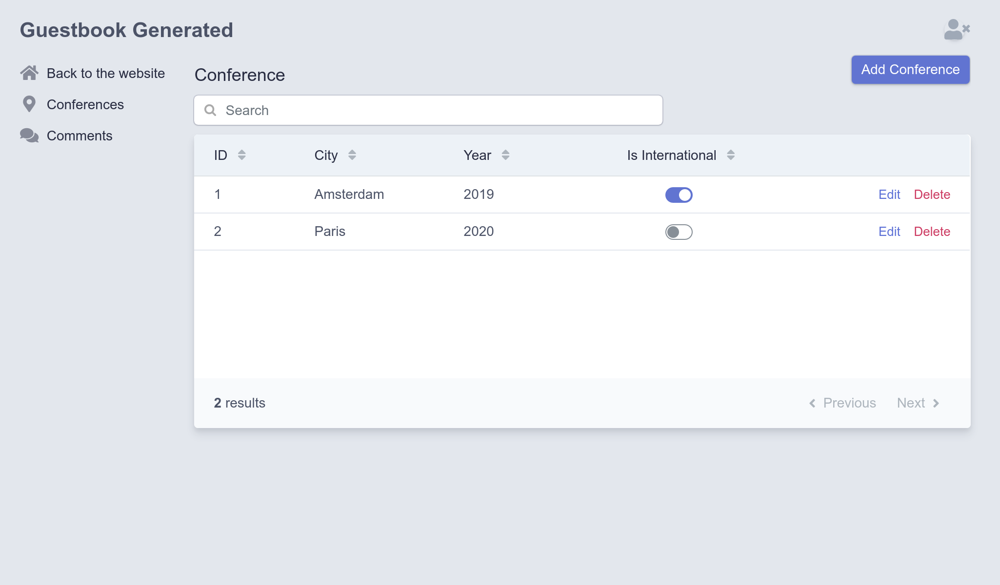

Configurarea unei interfețe de administrare
============================================

.. index::
    single: EasyAdmin
    single: Admin
    single: Backend

Adăugarea conferințelor viitoare în baza de date va fi sarcina administratorilor de proiect. O *interfață de administrare* este o secțiune protejată a site-ului web în care *administratorii* pot gestiona datele site-ului, pot modera recenziile și multe altele.

Cum o putem crea rapid? Folosind un pachet care este capabil să genereze partea de administrare după modelul proiectului. EasyAdmin se potrivește perfect.

Configurarea EasyAdmin
----------------------

Mai întâi, adaugă EasyAdmin ca dependență de proiect:

.. code-block:: bash

    $ symfony composer req "admin:^3"

EasyAdmin generază automat o zonă de administrare în funcție de anumiți controleri. Creează un director nou ``src/Controller/Admin/`` unde vei salva acești controleri:

.. code-block:: bash

    $ mkdir src/Controller/Admin/

Pentru a începe cu EasyAdmin, haide să generăm un „panou de administrare web” care va fi punctul principal de intrare pentru gestionarea datelor site-ului:

.. code-block:: bash
    :class: answers(DashboardController||src/Controller/Admin/)

    $ symfony console make:admin:dashboard

Acceptând răspunsurile implicite creează următorul controler:

.. code-block:: php
    :caption: src/Controller/Admin/DashboardController.php
    :class: ignore

    namespace App\Controller\Admin;

    use EasyCorp\Bundle\EasyAdminBundle\Config\Dashboard;
    use EasyCorp\Bundle\EasyAdminBundle\Config\MenuItem;
    use EasyCorp\Bundle\EasyAdminBundle\Controller\AbstractDashboardController;
    use Symfony\Component\HttpFoundation\Response;
    use Symfony\Component\Routing\Annotation\Route;

    class DashboardController extends AbstractDashboardController
    {
        /**
         * @Route("/admin", name="admin")
         */
        public function index(): Response
        {
            return parent::index();
        }

        public function configureDashboard(): Dashboard
        {
            return Dashboard::new()
                ->setTitle('Guestbook');
        }

        public function configureMenuItems(): iterable
        {
            yield MenuItem::linktoDashboard('Dashboard', 'fa fa-home');
            // yield MenuItem::linkToCrud('The Label', 'icon class', EntityClass::class);
        }
    }

Prin convenție, toate controlerele de administratre sunt stocate sub propriul spațiu de nume ``App\Controller\Admin``.

Accesează backend-ul de administrator generat la ``/admin`` după cum este configurat prin metoda `index()``; poți schimba adresa URL cu orice dorești:

.. figure:: screenshots/easy-admin-empty.png
    :alt: /admin
    :align: center
    :figclass: with-browser

Boom! Avem un schelet de interfață de administrare frumos, gata să fie personalizat în funcție de nevoile noastre.

.. index::
    single: CRUD

Următorul pas este să creăm controlere pentru a gestiona conferințe și comentarii.

În controlerul tabloului de bord poate ai observat metoda ``configureMenuItems()`` care are un comentariu despre adăugarea link-urilor la "CRUD-uri". **CRUD** este un acronim pentru „Creare, Citire, Actualizare și Ștergere”, cele patru operațiuni de bază pe care vrei să le faci pentru orice entitate. Asta este exact ceea ce vrem să facă un administrator pentru noi; EasyAdmin duce chiar la nivelul următor, având grijă și de căutare și filtrare.

Să generăm un CRUD pentru conferințe:

.. code-block:: bash
    :class: answers(1||src/Controller/Admin/||App\\Controller\\Admin)

    $ symfony console make:admin:crud

Selectează ``1`` pentru a crea o interfață de administrare pentru conferințe și folosește valorile implicite pentru celelalte întrebări. Ar trebui să se fi generat următorul fișier:

.. code-block:: php
    :caption: src/Controller/Admin/ConferenceCrudController.php
    :class: ignore

    namespace App\Controller\Admin;

    use App\Entity\Conference;
    use EasyCorp\Bundle\EasyAdminBundle\Controller\AbstractCrudController;

    class ConferenceCrudController extends AbstractCrudController
    {
        public static function getEntityFqcn(): string
        {
            return Conference::class;
        }

        /*
        public function configureFields(string $pageName): iterable
        {
            return [
                IdField::new('id'),
                TextField::new('title'),
                TextEditorField::new('description'),
            ];
        }
        */
    }

Fă același lucru pentru comentarii:

.. code-block:: bash
    :class: answers(0||src/Controller/Admin/||App\\Controller\\Admin)

    $ symfony console make:admin:crud

Ultimul pas este să conectezi CRUD-urile de administrare a conferinței și a comentariului la panou:

.. code-block:: diff
    :caption: patch_file

    --- a/src/Controller/Admin/DashboardController.php
    +++ b/src/Controller/Admin/DashboardController.php
    @@ -2,6 +2,8 @@

     namespace App\Controller\Admin;

    +use App\Entity\Comment;
    +use App\Entity\Conference;
     use EasyCorp\Bundle\EasyAdminBundle\Config\Dashboard;
     use EasyCorp\Bundle\EasyAdminBundle\Config\MenuItem;
     use EasyCorp\Bundle\EasyAdminBundle\Controller\AbstractDashboardController;
    @@ -26,7 +28,8 @@ class DashboardController extends AbstractDashboardController

         public function configureMenuItems(): iterable
         {
    -        yield MenuItem::linktoDashboard('Dashboard', 'fa fa-home');
    -        // yield MenuItem::linkToCrud('The Label', 'fas fa-list', EntityClass::class);
    +        yield MenuItem::linktoRoute('Back to the website', 'fas fa-home', 'homepage');
    +        yield MenuItem::linkToCrud('Conferences', 'fas fa-map-marker-alt', Conference::class);
    +        yield MenuItem::linkToCrud('Comments', 'fas fa-comments', Comment::class);
         }
     }

Am suprascris metoda ``configureMenuItems()`` pentru a adăuga elemente de meniu cu pictograme relevante pentru conferințe și pictograme de comentarii și pentru a adăuga un link înapoi la pagina principală a site-ului web.

EasyAdmin expune un API pentru a facilita conectarea la CRUD-urile entităților prin metoda ``MenuItem::linkToRoute()``.

Pagina principală a tabloului de bord este goală de moment. Aici poți afișa câteva statistici sau orice informații relevante. Deoarece nu avem nimic important de afișat, să redirecționăm la lista de conferințe:

.. code-block:: diff
    :caption: patch_file

    --- a/src/Controller/Admin/DashboardController.php
    +++ b/src/Controller/Admin/DashboardController.php
    @@ -7,6 +7,7 @@ use App\Entity\Conference;
     use EasyCorp\Bundle\EasyAdminBundle\Config\Dashboard;
     use EasyCorp\Bundle\EasyAdminBundle\Config\MenuItem;
     use EasyCorp\Bundle\EasyAdminBundle\Controller\AbstractDashboardController;
    +use EasyCorp\Bundle\EasyAdminBundle\Router\AdminUrlGenerator;
     use Symfony\Component\HttpFoundation\Response;
     use Symfony\Component\Routing\Annotation\Route;

    @@ -17,7 +18,10 @@ class DashboardController extends AbstractDashboardController
          */
         public function index(): Response
         {
    -        return parent::index();
    +        $routeBuilder = $this->get(AdminUrlGenerator::class);
    +        $url = $routeBuilder->setController(ConferenceCrudController::class)->generateUrl();
    +
    +        return $this->redirect($url);
         }

         public function configureDashboard(): Dashboard

Când afișezi relațiile entităților (conferința legată de un comentariu), EasyAdmin încearcă să utilizeze o reprezentare șir a conferinței. În mod implicit, folosește o convenție care folosește numele entității și cheia principală (cum ar fi ``Conference #1``) dacă entitatea nu definește metoda „magică“ ``__toString()``. Pentru a face afișajul mai semnificativ, adăugă o astfel de metodă în clasa ``Conference``:

.. code-block:: diff
    :caption: patch_file

    --- a/src/Entity/Conference.php
    +++ b/src/Entity/Conference.php
    @@ -44,6 +44,11 @@ class Conference
             $this->comments = new ArrayCollection();
         }

    +    public function __toString(): string
    +    {
    +        return $this->city.' '.$this->year;
    +    }
    +
         public function getId(): ?int
         {
             return $this->id;

La fel și pentru clasa ``Comment``:

.. code-block:: diff
    :caption: patch_file

    --- a/src/Entity/Comment.php
    +++ b/src/Entity/Comment.php
    @@ -48,6 +48,11 @@ class Comment
          */
         private $photoFilename;

    +    public function __toString(): string
    +    {
    +        return (string) $this->getEmail();
    +    }
    +
         public function getId(): ?int
         {
             return $this->id;

Acum poți adăuga, modifica sau șterge conferințe direct din interfața de administrare. Testează-l adăugând cel puțin o conferință.

Adaugă și câteva comentarii fără fotografii. Setează manual data creării, pentru moment; vom completa automat coloana ``createdAt`` într-o etapă ulterioară.

.. figure:: screenshots/easy-admin-comments.png
    :alt: /admin?crudAction=index&crudId=2bfa220&menuIndex=2&submenuIndex=-1
    :align: center
    :figclass: with-browser

Personalizarea EasyAdmin
------------------------

Interfața de administrare funcționează bine, dar poate fi personalizată pentru a îmbunătăți experiența utilizatorului. Să facem câteva modificări simple la entitatea Comment pentru a demonstra câteva posibilități.

.. code-block:: diff
    :caption: patch_file

    --- a/src/Controller/Admin/CommentCrudController.php
    +++ b/src/Controller/Admin/CommentCrudController.php
    @@ -3,7 +3,15 @@
     namespace App\Controller\Admin;

     use App\Entity\Comment;
    +use EasyCorp\Bundle\EasyAdminBundle\Config\Crud;
    +use EasyCorp\Bundle\EasyAdminBundle\Config\Filters;
     use EasyCorp\Bundle\EasyAdminBundle\Controller\AbstractCrudController;
    +use EasyCorp\Bundle\EasyAdminBundle\Field\AssociationField;
    +use EasyCorp\Bundle\EasyAdminBundle\Field\DateTimeField;
    +use EasyCorp\Bundle\EasyAdminBundle\Field\EmailField;
    +use EasyCorp\Bundle\EasyAdminBundle\Field\TextareaField;
    +use EasyCorp\Bundle\EasyAdminBundle\Field\TextField;
    +use EasyCorp\Bundle\EasyAdminBundle\Filter\EntityFilter;

     class CommentCrudController extends AbstractCrudController
     {
    @@ -12,14 +20,44 @@ class CommentCrudController extends AbstractCrudController
             return Comment::class;
         }

    -    /*
    +    public function configureCrud(Crud $crud): Crud
    +    {
    +        return $crud
    +            ->setEntityLabelInSingular('Conference Comment')
    +            ->setEntityLabelInPlural('Conference Comments')
    +            ->setSearchFields(['author', 'text', 'email'])
    +            ->setDefaultSort(['createdAt' => 'DESC']);
    +        ;
    +    }
    +
    +    public function configureFilters(Filters $filters): Filters
    +    {
    +        return $filters
    +            ->add(EntityFilter::new('conference'))
    +        ;
    +    }
    +
         public function configureFields(string $pageName): iterable
         {
    -        return [
    -            IdField::new('id'),
    -            TextField::new('title'),
    -            TextEditorField::new('description'),
    -        ];
    +        yield AssociationField::new('conference');
    +        yield TextField::new('author');
    +        yield EmailField::new('email');
    +        yield TextareaField::new('text')
    +            ->hideOnIndex()
    +        ;
    +        yield TextField::new('photoFilename')
    +            ->onlyOnIndex()
    +        ;
    +
    +        $createdAt = DateTimeField::new('createdAt')->setFormTypeOptions([
    +            'html5' => true,
    +            'years' => range(date('Y'), date('Y') + 5),
    +            'widget' => 'single_text',
    +        ]);
    +        if (Crud::PAGE_EDIT === $pageName) {
    +            yield $createdAt->setFormTypeOption('disabled', true);
    +        } else {
    +            yield $createdAt;
    +        }
         }
    -    */
     }

Pentru a personaliza secțiunea ``Comment``, listarea câmpurilor în mod explicit în metoda ``configureFields()`` ne permite să le ordonăm așa cum dorim. Unele câmpuri sunt configurate în plus, cum ar fi ascunderea câmpului text pe pagina index.

Metodele ``configureFilters()`` definesc ce filtre să fie expuse deasupra câmpului de căutare.

.. figure:: screenshots/easy-admin-filter.png
    :alt: /admin?crudAction=index&crudId=2bfa220&menuIndex=2&submenuIndex=-1
    :align: center
    :figclass: with-browser

Aceste personalizări sunt doar o mică introducere a posibilităților oferite de EasyAdmin.

Joacă-te cu interfața. De exemplu, filtrează comentariile după conferință sau caută comentarii semnate cu o anumită adresă de email. Singura problemă este că oricine poate avea acces la backend. Nu-ți face griji, îl vom restricționa imediat.

.. code-block:: bash
    :class: hide

    $ symfony run psql -c "TRUNCATE conference RESTART IDENTITY CASCADE"

.. sidebar:: Mergând mai departe

    * `Documentația EasyAdmin <https://symfony.com/doc/3.x/bundles/EasyAdminBundle/index.html>`_;

    * `Referință de configurare a framework-ului Symfony <https://symfony.com/doc/current/reference/configuration/framework.html>`_;

    * `Metodele magice în PHP <https://www.php.net/manual/en/language.oop5.magic.php>`_.
