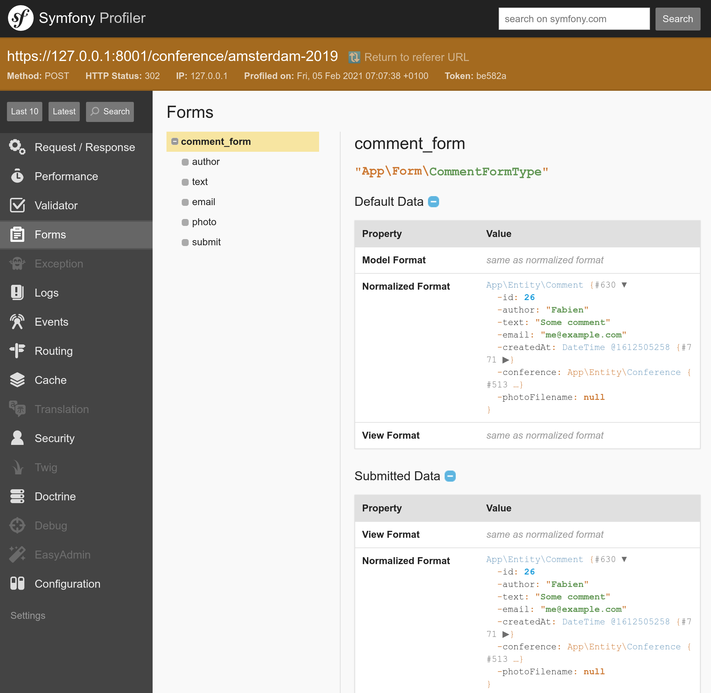

Получение обратной связи с помощью форм
=========================================================================

.. index::
    single: Components;Form
    single: Form

Пришло время добавить возможность получения обратной связи от наших посетителей. Они смогут оставлять комментарии с помощью *HTML-формы*.

Создание типа формы
------------------------------------

.. index::
    single: Command;make:form

Используйте бандл Maker для создания класса формы:

.. code-block:: bash

    $ symfony console make:form CommentFormType Comment

.. code-block:: text
    :class: ignore
    :emphasize-lines: 1

     created: src/Form/CommentFormType.php

      Success!

     Next: Add fields to your form and start using it.
     Find the documentation at https://symfony.com/doc/current/forms.html

Класс ``App\Form\CommentFormType`` определяет форму для сущности ``App\Entity\Comment``:

.. code-block:: php
    :caption: src/App/Form/CommentFormType.php
    :class: ignore

    namespace App\Form;

    use App\Entity\Comment;
    use Symfony\Component\Form\AbstractType;
    use Symfony\Component\Form\FormBuilderInterface;
    use Symfony\Component\OptionsResolver\OptionsResolver;

    class CommentFormType extends AbstractType
    {
        public function buildForm(FormBuilderInterface $builder, array $options)
        {
            $builder
                ->add('author')
                ->add('text')
                ->add('email')
                ->add('createdAt')
                ->add('photoFilename')
                ->add('conference')
            ;
        }

        public function configureOptions(OptionsResolver $resolver)
        {
            $resolver->setDefaults([
                'data_class' => Comment::class,
            ]);
        }
    }

`Тип формы`_ задаёт *поля формы*, связанные с моделью. Он выполняет преобразование между отправленными данными и свойствами класса модели. По умолчанию для определения конфигурации каждого поля, Symfony использует метаданные (например, метаданные Doctrine) сущности ``Comment``. К примеру, поле ``text`` будет отрисовано как ``textarea``, так как в базе данных используется столбец для хранения текста, а не строки.

Отображение формы
---------------------------------

Для отображения формы, создайте её в контроллере и передайте в шаблон:

.. code-block:: diff
    :caption: patch_file
    :emphasize-lines: 18,24

    --- a/src/Controller/ConferenceController.php
    +++ b/src/Controller/ConferenceController.php
    @@ -2,7 +2,9 @@

     namespace App\Controller;

    +use App\Entity\Comment;
     use App\Entity\Conference;
    +use App\Form\CommentFormType;
     use App\Repository\CommentRepository;
     use App\Repository\ConferenceRepository;
     use Symfony\Bundle\FrameworkBundle\Controller\AbstractController;
    @@ -31,6 +33,9 @@ class ConferenceController extends AbstractController
         #[Route('/conference/{slug}', name: 'conference')]
         public function show(Request $request, Conference $conference, CommentRepository $commentRepository): Response
         {
    +        $comment = new Comment();
    +        $form = $this->createForm(CommentFormType::class, $comment);
    +
             $offset = max(0, $request->query->getInt('offset', 0));
             $paginator = $commentRepository->getCommentPaginator($conference, $offset);

    @@ -39,6 +44,7 @@ class ConferenceController extends AbstractController
                 'comments' => $paginator,
                 'previous' => $offset - CommentRepository::PAGINATOR_PER_PAGE,
                 'next' => min(count($paginator), $offset + CommentRepository::PAGINATOR_PER_PAGE),
    +            'comment_form' => $form->createView(),
             ]));
         }
     }

Никогда не следует инициализировать класс формы напрямую. Для упрощения создания форм, используйте метод ``createForm()`` класса ``AbstractController``.

.. index::
    single: Twig;form

Чтобы передать форму в шаблон, используйте метод ``createView()``, который преобразует данные в подходящий для использования в шаблонах формат.

Отобразить форму в шаблоне можно с помощь Twig-функции ``form``:

.. code-block:: diff
    :caption: patch_file
    :emphasize-lines: 10

    --- a/templates/conference/show.html.twig
    +++ b/templates/conference/show.html.twig
    @@ -30,4 +30,8 @@
         
             
No comments have been posted yet for this conference.

         
    +
    +    <h2>Add your own feedback</h2>
    +
    +    {{ form(comment_form) }}
     

После обновления страницы конференции в браузере, обратите внимание, что каждое поле формы использует HTML-элемент, соответствующий типу модели:

.. figure:: screenshots/form.png
    :alt: /conference/amsterdam-2019
    :align: center
    :figclass: with-browser

Функция ``form()`` создаёт HTML-форму, используя всю информацию, определённую в типе формы. В том числе эта функция добавляет обязательный для поля загрузки файла атрибут ``enctype=multipart/form-data`` к тегу ``<form>``. Более того, эта функция также берёт на себя отображение сообщений об ошибках после отправки формы. Переписав шаблоны по умолчанию можно изменить абсолютно всё, однако для нашего проекта это не понадобится.

Настройка типа формы
--------------------------------------

Несмотря на то, что поля формы конфигурируются по их типу в модели, вы можете изменить стандартную конфигурацию непосредственно в классе типа формы:

.. code-block:: diff
    :caption: patch_file

    --- a/src/Form/CommentFormType.php
    +++ b/src/Form/CommentFormType.php
    @@ -4,20 +4,31 @@ namespace App\Form;

     use App\Entity\Comment;
     use Symfony\Component\Form\AbstractType;
    +use Symfony\Component\Form\Extension\Core\Type\EmailType;
    +use Symfony\Component\Form\Extension\Core\Type\FileType;
    +use Symfony\Component\Form\Extension\Core\Type\SubmitType;
     use Symfony\Component\Form\FormBuilderInterface;
     use Symfony\Component\OptionsResolver\OptionsResolver;
    +use Symfony\Component\Validator\Constraints\Image;

     class CommentFormType extends AbstractType
     {
         public function buildForm(FormBuilderInterface $builder, array $options)
         {
             $builder
    -            ->add('author')
    +            ->add('author', null, [
    +                'label' => 'Your name',
    +            ])
                 ->add('text')
    -            ->add('email')
    -            ->add('createdAt')
    -            ->add('photoFilename')
    -            ->add('conference')
    +            ->add('email', EmailType::class)
    +            ->add('photo', FileType::class, [
    +                'required' => false,
    +                'mapped' => false,
    +                'constraints' => [
    +                    new Image(['maxSize' => '1024k'])
    +                ],
    +            ])
    +            ->add('submit', SubmitType::class)
             ;
         }

Обратите внимание, что мы добавили кнопку отправки. Это позволит нам продолжить использовать простое выражение ``{{ form(comment_form) }}`` в шаблоне.

Некоторые поля не могут быть автоматически сконфигурированы, например, ``photoFilename`` —  одно из них. Сущность ``Comment`` должна только сохранять имя файла с фотографией, форма в свою очередь берёт на себя обработку загрузки файла. Для этого мы добавили поле ``photo`` с отключённой опцией ``mapped``, таким образом это поле не будет связано ни с одним свойством в сущности ``Comment``. Мы будем управлять этим полем вручную, чтобы реализовать определённую логику (например, сохранять загруженную фотографию на диск).

В качестве примера настройки, у некоторых полей мы также изменили метки по умолчанию.

Для проверки типа загруженного файла (и что это картинка) нужно проверить mime-тип файла. Компонент Mime служит именно для этого:

.. code-block:: bash

    $ symfony composer req mime

.. figure:: screenshots/form-customized.png
    :alt: /conference/amsterdam-2019
    :align: center
    :figclass: with-browser

Валидация моделей
---------------------------------

Тип формы определяет её внешний вид (используя валидацию HTML5). Пример сгенерированной HTML-формы:

.. code-block:: html
    :class: ignore

    <form name="comment_form" method="post" enctype="multipart/form-data">
        

            

                <label for="comment_form_author" class="required">Your name</label>
                <input type="text" id="comment_form_author" name="comment_form[author]" required="required" maxlength="255" />
            

            

                <label for="comment_form_text" class="required">Text</label>
                <textarea id="comment_form_text" name="comment_form[text]" required="required"></textarea>
            

            

                <label for="comment_form_email" class="required">Email</label>
                <input type="email" id="comment_form_email" name="comment_form[email]" required="required" />
            

            

                <label for="comment_form_photo">Photo</label>
                <input type="file" id="comment_form_photo" name="comment_form[photo]" />
            

            

                <button type="submit" id="comment_form_submit" name="comment_form[submit]">Submit</button>
            

            <input type="hidden" id="comment_form__token" name="comment_form[_token]" value="DwqsEanxc48jofxsqbGBVLQBqlVJ_Tg4u9-BL1Hjgac" />
        

    </form>

Наша форма содержит поле для электронного адреса (атрибут типа со значением ``email``). Кроме этого, большинство полей обязательны для заполнения (имеют атрибут ``required``). Обратите внимание, что форма также включает в себя скрытое поле ``_token``, используемое для защиты от `CSRF-атак <https://owasp.org/www-community/attacks/csrf>`_.

Если при отправке формы HTML-валидация не срабатывает, то на сервер могут попасть некорректные данные. Например, это может случиться при использовании HTTP-клиентов, таких как cURL, игнорирующих правила валидации.

Нам также необходимо добавить некоторые правила валидации для модели ``Comment``:

.. code-block:: diff
    :caption: patch_file

    --- a/src/Entity/Comment.php
    +++ b/src/Entity/Comment.php
    @@ -4,6 +4,7 @@ namespace App\Entity;

     use App\Repository\CommentRepository;
     use Doctrine\ORM\Mapping as ORM;
    +use Symfony\Component\Validator\Constraints as Assert;

     /**
      * @ORM\Entity(repositoryClass=CommentRepository::class)
    @@ -21,16 +22,20 @@ class Comment
         /**
          * @ORM\Column(type="string", length=255)
          */
    +    #[Assert\NotBlank]
         private $author;

         /**
          * @ORM\Column(type="text")
          */
    +    #[Assert\NotBlank]
         private $text;

         /**
          * @ORM\Column(type="string", length=255)
          */
    +    #[Assert\NotBlank]
    +    #[Assert\Email]
         private $email;

         /**

Обработка формы
-----------------------------

Мы написали достаточно кода, чтобы отобразить форму.

Теперь в контроллере нам необходимо обработать отправку формы и сохранить данные из неё в базе данных:

.. code-block:: diff
    :caption: patch_file

    --- a/src/Controller/ConferenceController.php
    +++ b/src/Controller/ConferenceController.php
    @@ -7,6 +7,7 @@ use App\Entity\Conference;
     use App\Form\CommentFormType;
     use App\Repository\CommentRepository;
     use App\Repository\ConferenceRepository;
    +use Doctrine\ORM\EntityManagerInterface;
     use Symfony\Bundle\FrameworkBundle\Controller\AbstractController;
     use Symfony\Component\HttpFoundation\Request;
     use Symfony\Component\HttpFoundation\Response;
    @@ -16,10 +17,12 @@ use Twig\Environment;
     class ConferenceController extends AbstractController
     {
         private $twig;
    +    private $entityManager;

    -    public function __construct(Environment $twig)
    +    public function __construct(Environment $twig, EntityManagerInterface $entityManager)
         {
             $this->twig = $twig;
    +        $this->entityManager = $entityManager;
         }

         #[Route('/', name: 'homepage')]
    @@ -35,6 +38,15 @@ class ConferenceController extends AbstractController
         {
             $comment = new Comment();
             $form = $this->createForm(CommentFormType::class, $comment);
    +        $form->handleRequest($request);
    +        if ($form->isSubmitted() && $form->isValid()) {
    +            $comment->setConference($conference);
    +
    +            $this->entityManager->persist($comment);
    +            $this->entityManager->flush();
    +
    +            return $this->redirectToRoute('conference', ['slug' => $conference->getSlug()]);
    +        }

             $offset = max(0, $request->query->getInt('offset', 0));
             $paginator = $commentRepository->getCommentPaginator($conference, $offset);

После отправки формы объект ``Comment`` будет обновлён в соответствии с полученными данными.

Конференция должна быть такой же, как указано в URL-адресе (мы удалили его из формы).

В случае, если данные заполненной формы некорректные, мы по-прежнему перенаправляем пользователя на страницу конференции, однако теперь форма будет заполнена введёнными ранее значениями, а также отобразит, какие ошибки были допущены при её заполнении.

Теперь попробуйте заполнить и отправить форму. Всё должно отработать правильно и данные сохраниться в базе данных (проверьте в административной панели). Тем не менее, есть одна проблема — фотографии. Они не сохраняются, так как мы ещё не реализовали обработку их в контроллере.

Загрузка файлов
-----------------------------

Чтобы мы могли отображать загруженные фотографии на странице конференции, нам нужно сохранять их в публичной директории. Поэтому мы будем хранить фотографии в директории ``public/uploads/photos``:

.. code-block:: diff
    :caption: patch_file

    --- a/src/Controller/ConferenceController.php
    +++ b/src/Controller/ConferenceController.php
    @@ -9,6 +9,7 @@ use App\Repository\CommentRepository;
     use App\Repository\ConferenceRepository;
     use Doctrine\ORM\EntityManagerInterface;
     use Symfony\Bundle\FrameworkBundle\Controller\AbstractController;
    +use Symfony\Component\HttpFoundation\File\Exception\FileException;
     use Symfony\Component\HttpFoundation\Request;
     use Symfony\Component\HttpFoundation\Response;
     use Symfony\Component\Routing\Annotation\Route;
    @@ -34,13 +35,22 @@ class ConferenceController extends AbstractController
         }

         #[Route('/conference/{slug}', name: 'conference')]
    -    public function show(Request $request, Conference $conference, CommentRepository $commentRepository): Response
    +    public function show(Request $request, Conference $conference, CommentRepository $commentRepository, string $photoDir): Response
         {
             $comment = new Comment();
             $form = $this->createForm(CommentFormType::class, $comment);
             $form->handleRequest($request);
             if ($form->isSubmitted() && $form->isValid()) {
                 $comment->setConference($conference);
    +            if ($photo = $form['photo']->getData()) {
    +                $filename = bin2hex(random_bytes(6)).'.'.$photo->guessExtension();
    +                try {
    +                    $photo->move($photoDir, $filename);
    +                } catch (FileException $e) {
    +                    // unable to upload the photo, give up
    +                }
    +                $comment->setPhotoFilename($filename);
    +            }

                 $this->entityManager->persist($comment);
                 $this->entityManager->flush();

Для загруженного файла фотографии мы сначала сгенерируем случайное имя. Затем переместим этот файл в выбранную ранее специальную директорию для хранения фотографий. И наконец, мы сохраним имя файла в объекте Comment.

.. index::
    single: Container;Bind
    single: Bind

Вы заметили новый аргумент в методе ``show()``? В данном случае аргумент ``$photoDir`` — это обычная строка, а не сервис. Но как тогда Symfony поймёт, что мы хотим получить в таком аргументе? Контейнер Symfony помимо сервисов может также хранить *параметры*. Параметры — это скалярные значения, которые помогают настраивать различные сервисы. Их можно явно внедрять в сервисы, либо они могут быть *привязаны по имени*:

.. code-block:: diff
    :caption: patch_file

    --- a/config/services.yaml
    +++ b/config/services.yaml
    @@ -10,6 +10,8 @@ services:
         _defaults:
             autowire: true      # Automatically injects dependencies in your services.
             autoconfigure: true # Automatically registers your services as commands, event subscribers, etc.
    +        bind:
    +            $photoDir: "%kernel.project_dir%/public/uploads/photos"

         # makes classes in src/ available to be used as services
         # this creates a service per class whose id is the fully-qualified class name

Свойство ``bind`` позволяет Symfony внедрять соответствующее значение каждый раз, когда в сервисе есть аргумент ``$photoDir``.

Попробуйте загрузить PDF-файл вместо фотографии. Вы увидите сообщения об ошибках в действии. Сейчас они выглядят ужасно, но пока не обращайте внимание на это — мы сделаем всё красиво в последующих шагах, когда будем работать над дизайном сайта. Для стилизации элементов форм нам достаточно поменять одну строчку в конфигурации.

Отладка форм
-----------------------

После отправки формы, если что-то не работает как нужно, используйте панель "Form" в профилировщике Symfony. На данной странице вы сможете увидеть информацию о форме, всех её параметрах, отправленные данные, включая то, как они были преобразованы. Если форма содержит ошибки, они так же будут показаны.

Порядок взаимодействия с формой, как правило, выглядит следующим образом:

* Форма отображается на странице;

* Пользователь отправляет форму через POST-запрос;

* Сервер перенаправляет пользователя на другую или ту же самую страницу, на которой находится форма.

Но как нам использовать профилировщик в случае успешной отправки формы? Из-за перенаправления мы никогда не увидим отладочную панель после отправки POST-запроса. Не беда — на перенаправленной странице в панели отладки наведите на зелёную область с надписью "200". Вы увидите, что запрос был перенаправлен (об этом указывает надпись "302"), а рядом есть ссылка на профилировщик (в скобках).

.. figure:: screenshots/form-wdt.png
    :alt: /conference/amsterdam-2019
    :align: center
    :figclass: with-browser

Перейдите по ссылке, чтобы открыть профилировщик этого POST-запроса, затем перейдите на панель "Form".

.. code-block:: bash
    :class: hide

    $ rm -rf var/cache

Отображение загруженных фотографий в административной панели
-------------------------------------------------------------------------------------------------------------------

На данный момент административная панель показывает всего лишь название файла фотографии, хотя мы ожидаем увидеть само изображение:

.. code-block:: diff
    :caption: patch_file

    --- a/src/Controller/Admin/CommentCrudController.php
    +++ b/src/Controller/Admin/CommentCrudController.php
    @@ -9,6 +9,7 @@ use EasyCorp\Bundle\EasyAdminBundle\Controller\AbstractCrudController;
     use EasyCorp\Bundle\EasyAdminBundle\Field\AssociationField;
     use EasyCorp\Bundle\EasyAdminBundle\Field\DateTimeField;
     use EasyCorp\Bundle\EasyAdminBundle\Field\EmailField;
    +use EasyCorp\Bundle\EasyAdminBundle\Field\ImageField;
     use EasyCorp\Bundle\EasyAdminBundle\Field\TextareaField;
     use EasyCorp\Bundle\EasyAdminBundle\Field\TextField;
     use EasyCorp\Bundle\EasyAdminBundle\Filter\EntityFilter;
    @@ -45,7 +46,9 @@ class CommentCrudController extends AbstractCrudController
             yield TextareaField::new('text')
                 ->hideOnIndex()
             ;
    -        yield TextField::new('photoFilename')
    +        yield ImageField::new('photoFilename')
    +            ->setBasePath('/uploads/photos')
    +            ->setLabel('Photo')
                 ->onlyOnIndex()
             ;

Игнорирование загруженных фотографий в Git
-----------------------------------------------------------------------------

Не торопитесь фиксировать изменения! Чтобы загруженные файлы фотографий не попали в Git-репозиторий, добавьте директорию ``/public/uploads`` в файл ``.gitignore``:

.. code-block:: diff
    :caption: patch_file

    --- a/.gitignore
    +++ b/.gitignore
    @@ -1,3 +1,4 @@
    +/public/uploads

     ###> symfony/framework-bundle ###
     /.env.local

Хранение загруженных файлов в продакшене
----------------------------------------------------------------------------

На последнем шаге мы рассмотрим возможность хранения загруженных файлов на продакшен-серверах. Зачем нам нужно что-то делать для этого? Всё из-за того, что большинство современных облачных платформ по ряду причин используют контейнеры только для чтения. SymfonyCloud — не исключение.

В Symfony-проекте далеко не всё может быть только для чтения. Мы усердно старались закешировать как можно больше данных при сборке контейнера (во время прогрева кеша), однако Symfony всё ещё нужно сохранять файлы пользовательского кеша, логов, сессий (если они хранятся в файловой системе) и т.д.

Откройте файл ``.symfony.cloud.yaml``. В нем уже есть точка *монтирования* с возможностью записи, указанная для директории ``var/``. Директория ``var/`` — единственное место в файловой системе, в которую Symfony может что-то записывать (кеш, логи и т.п.).

Создадим новую точку монтирования для загруженных фотографий:

.. code-block:: diff
    :caption: patch_file

    --- a/.symfony.cloud.yaml
    +++ b/.symfony.cloud.yaml
    @@ -36,6 +36,7 @@ web:

     mounts:
         "/var": { source: local, source_path: var }
    +    "/public/uploads": { source: local, source_path: uploads }

     hooks:
         build: |

Теперь вы можете развернуть код и убедиться в том, что файлы фотографий сохраняются в директории ``public/uploads/``, так же как и в локальной версии.

.. sidebar:: Двигаемся дальше

    * `Видеокурс по формам на SymfonyCast <https://symfonycasts.com/screencast/symfony-forms>`_;

    * `Как настроить отображение Symfony-форм в HTML <https://symfony.com/doc/current/form/form_customization.html>`_;

    * `Валидация Symfony-форм <https://symfony.com/doc/current/forms.html#validating-forms>`_;

    * `Справочник по типам Symfony-форм <https://symfony.com/doc/current/reference/forms/types.html>`_;

    * `Документация по FlysystemBundle <https://github.com/thephpleague/flysystem-bundle/blob/master/docs/1-getting-started.md>`_, с помощью которого можно организовать хранение файлов на специальных облачных хостингах, таких как AWS S3, Azure и Google Cloud Storage;

    * `Параметры конфигурации Symfony <https://symfony.com/doc/current/configuration.html#configuration-parameters>`_.

    * `Правила Symfony-валидации <https://symfony.com/doc/current/validation.html#basic-constraints>`_;

    * `Шпаргалка по Symfony-формам <https://github.com/andreia/symfony-cheat-sheets/blob/master/Symfony2/how_symfony2_forms_works_en.pdf>`_.

.. _`Тип формы`: https://symfony.com/doc/current/forms.html#form-types
